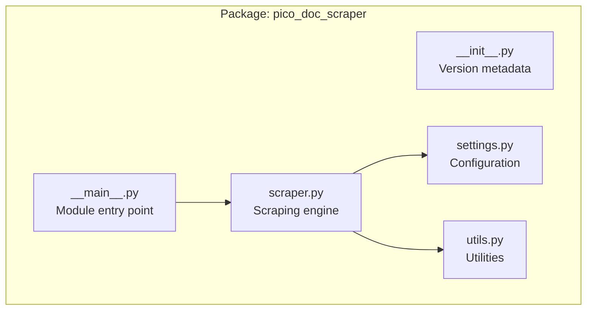
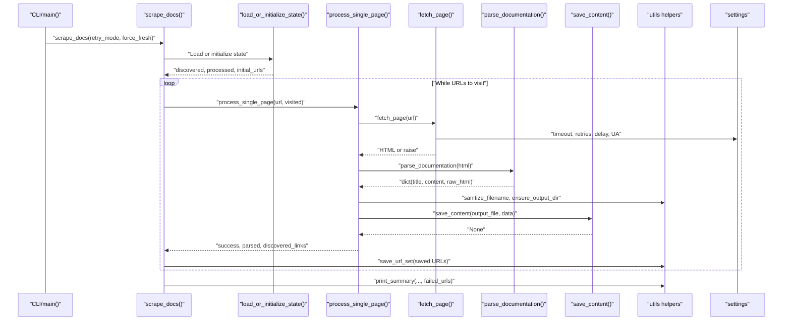
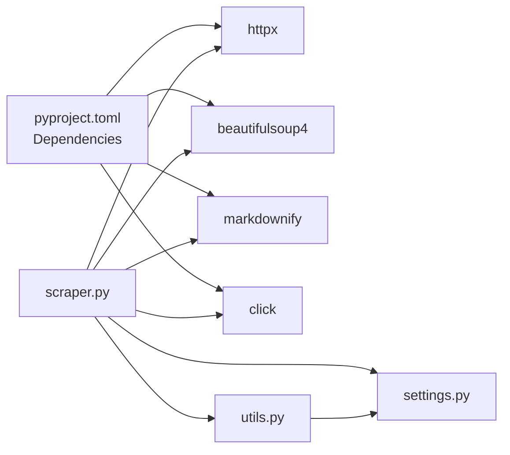

# API Reference

<cite>
**Referenced Files in This Document**
- [README.md](file://README.md)
- [pyproject.toml](file://pyproject.toml)
- [Makefile](file://Makefile)
- [src/pico_doc_scraper/__init__.py](file://src/pico_doc_scraper/__init__.py)
- [src/pico_doc_scraper/__main__.py](file://src/pico_doc_scraper/__main__.py)
- [src/pico_doc_scraper/scraper.py](file://src/pico_doc_scraper/scraper.py)
- [src/pico_doc_scraper/settings.py](file://src/pico_doc_scraper/settings.py)
- [src/pico_doc_scraper/utils.py](file://src/pico_doc_scraper/utils.py)
</cite>

## Table of Contents
1. [Introduction](#introduction)
2. [Project Structure](#project-structure)
3. [Core Components](#core-components)
4. [Architecture Overview](#architecture-overview)
5. [Detailed Component Analysis](#detailed-component-analysis)
6. [Dependency Analysis](#dependency-analysis)
7. [Performance Considerations](#performance-considerations)
8. [Troubleshooting Guide](#troubleshooting-guide)
9. [Conclusion](#conclusion)
10. [Appendices](#appendices)

## Introduction
This API reference documents the Pico CSS Documentation Scraper package. It covers the main scraping engine, configuration settings, and utility functions. The documentation includes function signatures, parameter descriptions, return values, exceptions, and usage examples. It also outlines module-level constants, internal function contracts for developers extending the scraper, and migration guidance for evolving the API.

## Project Structure
The scraper is organized as a Python package with a clear separation of concerns:
- Entry points: package module entry and CLI command
- Core scraping logic: main engine for fetching, parsing, and saving
- Configuration: centralized settings controlling behavior and output
- Utilities: file operations, state management, and content processing helpers

**Diagram sources**
- [src/pico_doc_scraper/__init__.py](file://src/pico_doc_scraper/__init__.py#L1-L4)
- [src/pico_doc_scraper/__main__.py](file://src/pico_doc_scraper/__main__.py#L1-L7)
- [src/pico_doc_scraper/scraper.py](file://src/pico_doc_scraper/scraper.py#L1-L391)
- [src/pico_doc_scraper/settings.py](file://src/pico_doc_scraper/settings.py#L1-L33)
- [src/pico_doc_scraper/utils.py](file://src/pico_doc_scraper/utils.py#L1-L175)

**Section sources**
- [README.md](file://README.md#L119-L134)
- [src/pico_doc_scraper/__init__.py](file://src/pico_doc_scraper/__init__.py#L1-L4)
- [src/pico_doc_scraper/__main__.py](file://src/pico_doc_scraper/__main__.py#L1-L7)
- [src/pico_doc_scraper/scraper.py](file://src/pico_doc_scraper/scraper.py#L1-L391)
- [src/pico_doc_scraper/settings.py](file://src/pico_doc_scraper/settings.py#L1-L33)
- [src/pico_doc_scraper/utils.py](file://src/pico_doc_scraper/utils.py#L1-L175)

## Core Components
This section documents the primary modules and their public APIs.

- Package metadata
  - Version constant exposed for introspection and packaging.
  - See [__version__](file://src/pico_doc_scraper/__init__.py#L3-L3).

- Module entry point
  - Provides a CLI entry point that delegates to the main scraping function.
  - See [__main__](file://src/pico_doc_scraper/__main__.py#L1-L7).

- Scraping engine
  - Core functions for fetching, parsing, discovery, and saving documentation pages.
  - See [fetch_page](file://src/pico_doc_scraper/scraper.py#L24-L52), [discover_doc_links](file://src/pico_doc_scraper/scraper.py#L55-L85), [parse_documentation](file://src/pico_doc_scraper/scraper.py#L88-L142), [process_single_page](file://src/pico_doc_scraper/scraper.py#L145-L194), [scrape_docs](file://src/pico_doc_scraper/scraper.py#L287-L359), [print_summary](file://src/pico_doc_scraper/scraper.py#L196-L229), [load_or_initialize_state](file://src/pico_doc_scraper/scraper.py#L231-L285), and [main](file://src/pico_doc_scraper/scraper.py#L361-L391).

- Settings
  - Centralized configuration for URLs, directories, timeouts, retries, delays, and output format.
  - See [settings.py](file://src/pico_doc_scraper/settings.py#L1-L33).

- Utilities
  - Helpers for output directories, content saving, filename sanitization, URL formatting, state persistence, and cleanup.
  - See [utils.py](file://src/pico_doc_scraper/utils.py#L1-L175).

**Section sources**
- [src/pico_doc_scraper/__init__.py](file://src/pico_doc_scraper/__init__.py#L1-L4)
- [src/pico_doc_scraper/__main__.py](file://src/pico_doc_scraper/__main__.py#L1-L7)
- [src/pico_doc_scraper/scraper.py](file://src/pico_doc_scraper/scraper.py#L1-L391)
- [src/pico_doc_scraper/settings.py](file://src/pico_doc_scraper/settings.py#L1-L33)
- [src/pico_doc_scraper/utils.py](file://src/pico_doc_scraper/utils.py#L1-L175)

## Architecture Overview
The scraper follows a stateful, incremental workflow:
- State initialization and resumption
- Request fetching with retry/backoff
- Content discovery and parsing
- Output generation and persistence
- Summary reporting and failure tracking

**Diagram sources**
- [src/pico_doc_scraper/scraper.py](file://src/pico_doc_scraper/scraper.py#L287-L359)
- [src/pico_doc_scraper/scraper.py](file://src/pico_doc_scraper/scraper.py#L145-L194)
- [src/pico_doc_scraper/scraper.py](file://src/pico_doc_scraper/scraper.py#L24-L52)
- [src/pico_doc_scraper/scraper.py](file://src/pico_doc_scraper/scraper.py#L88-L142)
- [src/pico_doc_scraper/utils.py](file://src/pico_doc_scraper/utils.py#L17-L48)
- [src/pico_doc_scraper/utils.py](file://src/pico_doc_scraper/utils.py#L130-L158)
- [src/pico_doc_scraper/settings.py](file://src/pico_doc_scraper/settings.py#L19-L32)

## Detailed Component Analysis

### Module: settings.py
Purpose: Centralize configuration for scraping behavior, output locations, and HTTP client settings.

Key constants and their effects:
- PICO_DOCS_BASE_URL: Starting URL for the crawl. Used to seed the initial URL set.
- ALLOWED_DOMAIN: Domain restriction to prevent scraping off-site links.
- OUTPUT_DIR: Directory where scraped Markdown/JSON/HTML outputs are written.
- DATA_DIR: Directory for state tracking files.
- DISCOVERED_URLS_FILE: Tracks all discovered URLs during crawling.
- PROCESSED_URLS_FILE: Tracks successfully processed URLs.
- FAILED_URLS_FILE: Tracks URLs that failed to scrape for later retry.
- REQUEST_TIMEOUT: HTTP request timeout in seconds.
- MAX_RETRIES: Number of retry attempts for failed requests.
- RETRY_DELAY: Delay between retry attempts in seconds.
- USER_AGENT: HTTP User-Agent header to identify the scraper.
- RESPECT_ROBOTS_TXT: Placeholder for robots.txt handling (currently unused in code).
- DELAY_BETWEEN_REQUESTS: Polite delay between requests in seconds.
- OUTPUT_FORMAT: Preferred output format (markdown, json, html).

Validation and constraints:
- Numeric values are positive integers/floats where applicable.
- Paths are pathlib.Path instances derived from the project root.
- Output format is a string with supported values documented in the module.

Backward compatibility:
- New keys can be added safely; existing consumers rely on the presence of core keys.
- Changing defaults may impact behavior; consumers should pin settings if stability is required.

**Section sources**
- [src/pico_doc_scraper/settings.py](file://src/pico_doc_scraper/settings.py#L1-L33)

### Module: utils.py
Purpose: Provide reusable helpers for file operations, state management, and content processing.

Public functions:
- ensure_output_dir(directory: Path) -> None
  - Ensures the output directory exists.
  - Parameters:
    - directory: Path to the directory to create.
  - Returns: None.
  - Exceptions: Propagates filesystem errors from directory creation.
  - Notes: Prints a readiness confirmation.

- save_content(output_file: Path, data: dict) -> None
  - Saves scraped content to a file based on extension.
  - Parameters:
    - output_file: Target path (extension determines format).
    - data: Dictionary with keys "title", "content", "raw_html".
  - Returns: None.
  - Exceptions: Filesystem errors on write.
  - Behavior:
    - .json: Writes JSON with pretty indentation.
    - .md: Writes Markdown frontmatter and content.
    - .html: Writes raw HTML.
    - Other: Writes string representation.

- sanitize_filename(filename: str) -> str
  - Sanitizes a string to be safe for use as a filename.
  - Parameters:
    - filename: Input string.
  - Returns: Sanitized filename string.
  - Validation rules:
    - Replaces unsafe characters with underscores.
    - Strips leading/trailing spaces and dots.
    - Limits length to 200 characters.
    - Returns a default if input becomes empty.

- format_url(base_url: str, path: str) -> str
  - Combines base URL and path, handling trailing/leading slashes.
  - Parameters:
    - base_url: Base URL string.
    - path: Path string to append.
  - Returns: Combined URL string.

- save_failed_urls(failed_urls: list[str], file_path: Path) -> None
  - Saves failed URLs to a file for retry.
  - Parameters:
    - failed_urls: List of URLs to persist.
    - file_path: Destination path.
  - Returns: None.
  - Behavior: Clears file if empty; otherwise writes deduplicated, sorted URLs.

- load_failed_urls(file_path: Path) -> list[str]
  - Loads failed URLs from a file.
  - Parameters:
    - file_path: Source path.
  - Returns: List of URLs.
  - Behavior: Returns empty list if file does not exist.

- save_url_set(urls: set[str], file_path: Path) -> None
  - Persists a set of URLs to a file.
  - Parameters:
    - urls: Set of URLs to save.
    - file_path: Destination path.
  - Returns: None.

- load_url_set(file_path: Path) -> set[str]
  - Loads a set of URLs from a file.
  - Parameters:
    - file_path: Source path.
  - Returns: Set of URLs.
  - Behavior: Returns empty set if file does not exist.

- clear_state_files() -> None
  - Removes state tracking files.
  - Parameters: None.
  - Returns: None.
  - Behavior: Iterates over discovered, processed, and failed URL files and deletes them if present.

Internal function contracts:
- All functions operate on immutable inputs and produce deterministic outputs for pure helpers.
- File operations are idempotent; repeated calls do not cause side effects beyond file writes.

Practical usage examples:
- Saving content as Markdown:
  - Call [save_content](file://src/pico_doc_scraper/utils.py#L17-L48) with an output path ending in .md and a dictionary containing "title" and "content".
- Persisting failed URLs:
  - Call [save_failed_urls](file://src/pico_doc_scraper/utils.py#L92-L109) with a list of failed URLs and the path from [FAILED_URLS_FILE](file://src/pico_doc_scraper/settings.py#L17-L17).
- Resuming a crawl:
  - Call [load_url_set](file://src/pico_doc_scraper/utils.py#L143-L158) with [DISCOVERED_URLS_FILE](file://src/pico_doc_scraper/settings.py#L15-L15) and [PROCESSED_URLS_FILE](file://src/pico_doc_scraper/settings.py#L16-L16) to reconstruct sets.

**Section sources**
- [src/pico_doc_scraper/utils.py](file://src/pico_doc_scraper/utils.py#L1-L175)
- [src/pico_doc_scraper/settings.py](file://src/pico_doc_scraper/settings.py#L14-L17)

### Module: scraper.py
Purpose: Implement the main scraping workflow, including fetching, parsing, discovery, and saving.

Public functions and contracts:
- fetch_page(url: str) -> str
  - Fetches a page with retry logic.
  - Parameters:
    - url: Target URL string.
  - Returns: HTML content as a string.
  - Exceptions:
    - httpx.HTTPError: Raised after all retry attempts fail.
  - Behavior:
    - Uses configured timeout and user-agent.
    - Retries up to [MAX_RETRIES](file://src/pico_doc_scraper/settings.py#L21-L21) with [RETRY_DELAY](file://src/pico_doc_scraper/settings.py#L22-L22) between attempts.
    - Follows redirects automatically.

- discover_doc_links(html: str, base_url: str) -> set[str]
  - Discovers documentation links from HTML.
  - Parameters:
    - html: Raw HTML string.
    - base_url: Base URL for resolving relative links.
  - Returns: Set of absolute URLs.
  - Filtering rules:
    - Must match [ALLOWED_DOMAIN](file://src/pico_doc_scraper/settings.py#L7-L7).
    - Must start with "/docs".
    - Excludes downloadable extensions (.pdf, .zip, .tar.gz).
    - Normalizes URLs by removing fragments and query strings.

- parse_documentation(html: str) -> dict
  - Parses documentation content and extracts title and content.
  - Parameters:
    - html: Raw HTML string.
  - Returns: Dictionary with keys "title", "content", "raw_html".
  - Parsing logic:
    - Extracts H1 as title or "Untitled" fallback.
    - Searches for main content using common selectors.
    - Removes navigation, footer, header, and common non-content classes.
    - Converts remaining HTML to Markdown using ATX-style headers.

- process_single_page(url: str, visited_urls: set[str]) -> tuple[bool, dict | None, list[str]]
  - Fetches, parses, saves, and discovers links for a single page.
  - Parameters:
    - url: URL to process.
    - visited_urls: Set of already processed URLs.
  - Returns: Tuple of (success: bool, parsed_data: dict | None, discovered_links: list[str]).
  - Side effects:
    - Saves content to [OUTPUT_DIR](file://src/pico_doc_scraper/settings.py#L11-L11).
    - Generates filename from URL path and sanitizes it.
  - Exceptions:
    - httpx.HTTPError: Returned as failure.
    - Other exceptions: Logged and returned as failure.

- scrape_docs(retry_mode: bool = False, force_fresh: bool = False) -> None
  - Main scraping workflow.
  - Parameters:
    - retry_mode: If True, only processes URLs from [FAILED_URLS_FILE](file://src/pico_doc_scraper/settings.py#L17-L17).
    - force_fresh: If True, clears state and starts over.
  - Returns: None.
  - Behavior:
    - Initializes state via [load_or_initialize_state](file://src/pico_doc_scraper/scraper.py#L231-L285).
    - Ensures output directories via [ensure_output_dir](file://src/pico_doc_scraper/utils.py#L7-L14).
    - Processes URLs with politeness delay [DELAY_BETWEEN_REQUESTS](file://src/pico_doc_scraper/settings.py#L29-L29).
    - Discovers new links unless in retry mode.
    - Saves discovered and processed URLs incrementally.
    - Prints summary via [print_summary](file://src/pico_doc_scraper/scraper.py#L196-L229).

- print_summary(page_count: int, error_count: int, errors: list[str], failed_urls: list[str]) -> None
  - Prints a formatted summary and persists failed URLs.
  - Parameters:
    - page_count: Number of successfully scraped pages.
    - error_count: Number of errors encountered.
    - errors: List of error messages.
    - failed_urls: List of URLs that failed.
  - Returns: None.
  - Behavior:
    - Prints counts and output directory.
    - Saves failed URLs to [FAILED_URLS_FILE](file://src/pico_doc_scraper/settings.py#L17-L17) if present.

- load_or_initialize_state(force_fresh: bool, retry_mode: bool) -> tuple[set[str], set[str], set[str]]
  - Loads existing state or initializes fresh state.
  - Parameters:
    - force_fresh: If True, clears state files.
    - retry_mode: If True, loads only failed URLs.
  - Returns: Tuple of (discovered_urls: set[str], processed_urls: set[str], initial_urls: set[str]).
  - Behavior:
    - Clears state files if forced.
    - Loads discovered and processed sets from files.
    - Loads failed URLs and returns them as initial set if retry mode.
    - Seeds initial URLs from [PICO_DOCS_BASE_URL](file://src/pico_doc_scraper/settings.py#L6-L6) otherwise.

- main(retry: bool = False, force_fresh: bool = False) -> None
  - CLI entry point for the scraper.
  - Parameters:
    - retry: Retry only failed URLs.
    - force_fresh: Start a fresh scrape.
  - Returns: None.
  - Behavior:
    - Prints banner.
    - Delegates to [scrape_docs](file://src/pico_doc_scraper/scraper.py#L287-L359).

Internal function contracts:
- All internal functions are private and intended for internal use by the module.
- They rely on shared state and settings; do not call them directly from external code.

Practical usage examples:
- Running the scraper:
  - Invoke [main](file://src/pico_doc_scraper/scraper.py#L374-L384) via CLI or module entry point.
- Resuming a crawl:
  - Use [load_or_initialize_state](file://src/pico_doc_scraper/scraper.py#L231-L285) to reconstruct sets from disk.
- Saving discovered URLs:
  - Use [save_url_set](file://src/pico_doc_scraper/utils.py#L130-L141) to persist discovered sets.

Error conditions and handling:
- HTTP errors during fetching are caught and surfaced as failures; the main loop continues.
- Exceptions in processing are logged and recorded as failures.
- Keyboard interrupts are handled gracefully with a summary.

**Section sources**
- [src/pico_doc_scraper/scraper.py](file://src/pico_doc_scraper/scraper.py#L24-L52)
- [src/pico_doc_scraper/scraper.py](file://src/pico_doc_scraper/scraper.py#L55-L85)
- [src/pico_doc_scraper/scraper.py](file://src/pico_doc_scraper/scraper.py#L88-L142)
- [src/pico_doc_scraper/scraper.py](file://src/pico_doc_scraper/scraper.py#L145-L194)
- [src/pico_doc_scraper/scraper.py](file://src/pico_doc_scraper/scraper.py#L196-L229)
- [src/pico_doc_scraper/scraper.py](file://src/pico_doc_scraper/scraper.py#L231-L285)
- [src/pico_doc_scraper/scraper.py](file://src/pico_doc_scraper/scraper.py#L287-L359)
- [src/pico_doc_scraper/scraper.py](file://src/pico_doc_scraper/scraper.py#L361-L391)
- [src/pico_doc_scraper/utils.py](file://src/pico_doc_scraper/utils.py#L130-L158)
- [src/pico_doc_scraper/settings.py](file://src/pico_doc_scraper/settings.py#L6-L7)
- [src/pico_doc_scraper/settings.py](file://src/pico_doc_scraper/settings.py#L11-L17)
- [src/pico_doc_scraper/settings.py](file://src/pico_doc_scraper/settings.py#L19-L29)

### Public Interface Contracts
- Module-level exports:
  - [main](file://src/pico_doc_scraper/scraper.py#L374-L384) is the primary public function for CLI usage.
  - [scrape_docs](file://src/pico_doc_scraper/scraper.py#L287-L359) is the core workflow function for programmatic use.
  - [__version__](file://src/pico_doc_scraper/__init__.py#L3-L3) is exposed for introspection.

- Backward compatibility considerations:
  - The CLI signature remains stable with flags for retry and force-fresh.
  - Settings constants can be extended; consumers should not assume exhaustive coverage of keys.
  - Utility functions are stable; new overloads should preserve existing signatures.

- Migration guidance:
  - If changing output formats, update [save_content](file://src/pico_doc_scraper/utils.py#L17-L48) and [OUTPUT_FORMAT](file://src/pico_doc_scraper/settings.py#L32-L32) accordingly.
  - If adding new state files, update [load_or_initialize_state](file://src/pico_doc_scraper/scraper.py#L231-L285) and [clear_state_files](file://src/pico_doc_scraper/utils.py#L161-L175).

**Section sources**
- [src/pico_doc_scraper/scraper.py](file://src/pico_doc_scraper/scraper.py#L361-L391)
- [src/pico_doc_scraper/scraper.py](file://src/pico_doc_scraper/scraper.py#L287-L359)
- [src/pico_doc_scraper/__init__.py](file://src/pico_doc_scraper/__init__.py#L3-L3)

## Dependency Analysis
External dependencies and their roles:
- httpx: HTTP client with timeouts and automatic retries.
- beautifulsoup4: HTML parsing and DOM manipulation.
- markdownify: HTML-to-Markdown conversion.
- click: CLI argument parsing and help generation.

Internal dependencies:
- scraper.py depends on settings.py for configuration and utils.py for file operations.
- utils.py is self-contained and used by scraper.py.

**Diagram sources**
- [pyproject.toml](file://pyproject.toml#L9-L14)
- [src/pico_doc_scraper/scraper.py](file://src/pico_doc_scraper/scraper.py#L1-L21)
- [src/pico_doc_scraper/utils.py](file://src/pico_doc_scraper/utils.py#L1-L5)
- [src/pico_doc_scraper/settings.py](file://src/pico_doc_scraper/settings.py#L1-L33)

**Section sources**
- [pyproject.toml](file://pyproject.toml#L9-L14)
- [src/pico_doc_scraper/scraper.py](file://src/pico_doc_scraper/scraper.py#L1-L21)
- [src/pico_doc_scraper/utils.py](file://src/pico_doc_scraper/utils.py#L1-L5)
- [src/pico_doc_scraper/settings.py](file://src/pico_doc_scraper/settings.py#L1-L33)

## Performance Considerations
- Politeness: A configurable delay between requests reduces server load and avoids rate limiting.
- Incremental state persistence: Saves discovered and processed URLs frequently to minimize work duplication.
- Retry strategy: Limits retries and backoff to balance reliability and speed.
- Output format selection: Markdown conversion adds overhead; consider output format choices for large crawls.

[No sources needed since this section provides general guidance]

## Troubleshooting Guide
Common issues and resolutions:
- HTTP errors during fetching:
  - Symptom: Failures reported in processing logs.
  - Resolution: Adjust [REQUEST_TIMEOUT](file://src/pico_doc_scraper/settings.py#L20-L20) and [MAX_RETRIES](file://src/pico_doc_scraper/settings.py#L21-L21); inspect network connectivity.
- Domain filtering prevents scraping:
  - Symptom: No links discovered beyond allowed domain.
  - Resolution: Verify [ALLOWED_DOMAIN](file://src/pico_doc_scraper/settings.py#L7-L7) matches the target site.
- State files missing or corrupted:
  - Symptom: Inconsistent resume behavior.
  - Resolution: Use [clear_state_files](file://src/pico_doc_scraper/utils.py#L161-L175) to reset state; re-run with [force_fresh](file://src/pico_doc_scraper/scraper.py#L292-L292).
- Output directory not writable:
  - Symptom: Save errors.
  - Resolution: Ensure [OUTPUT_DIR](file://src/pico_doc_scraper/settings.py#L11-L11) exists and is writable.

**Section sources**
- [src/pico_doc_scraper/scraper.py](file://src/pico_doc_scraper/scraper.py#L24-L52)
- [src/pico_doc_scraper/scraper.py](file://src/pico_doc_scraper/scraper.py#L145-L194)
- [src/pico_doc_scraper/utils.py](file://src/pico_doc_scraper/utils.py#L161-L175)
- [src/pico_doc_scraper/settings.py](file://src/pico_doc_scraper/settings.py#L7-L7)
- [src/pico_doc_scraper/settings.py](file://src/pico_doc_scraper/settings.py#L11-L11)

## Conclusion
The Pico CSS Documentation Scraper provides a robust, stateful, and extensible framework for converting documentation pages to Markdown. Its modular design separates concerns across configuration, utilities, and the core scraping engine, enabling easy maintenance and future enhancements. Developers can extend the scraper by adjusting settings, adding new output formats, or integrating additional parsing logic while preserving backward compatibility.

[No sources needed since this section summarizes without analyzing specific files]

## Appendices

### Practical Usage Examples
- Basic scraping:
  - Run via CLI or module entry point; see [main](file://src/pico_doc_scraper/scraper.py#L374-L384).
- Retry failed URLs:
  - Use the retry flag or corresponding Makefile target; see [scrape_docs](file://src/pico_doc_scraper/scraper.py#L287-L359).
- Fresh start:
  - Clear state and restart from scratch; see [force_fresh](file://src/pico_doc_scraper/scraper.py#L292-L292).

**Section sources**
- [README.md](file://README.md#L23-L53)
- [Makefile](file://Makefile#L115-L125)
- [src/pico_doc_scraper/scraper.py](file://src/pico_doc_scraper/scraper.py#L374-L384)
- [src/pico_doc_scraper/scraper.py](file://src/pico_doc_scraper/scraper.py#L287-L359)

### Internal Function Documentation for Extension
- Adding new output formats:
  - Extend [save_content](file://src/pico_doc_scraper/utils.py#L17-L48) to handle new extensions.
- Customizing parsing:
  - Modify [parse_documentation](file://src/pico_doc_scraper/scraper.py#L88-L142) selectors and content extraction logic.
- Extending state tracking:
  - Update [load_or_initialize_state](file://src/pico_doc_scraper/scraper.py#L231-L285) and [clear_state_files](file://src/pico_doc_scraper/utils.py#L161-L175) to manage additional state files.

**Section sources**
- [src/pico_doc_scraper/utils.py](file://src/pico_doc_scraper/utils.py#L17-L48)
- [src/pico_doc_scraper/scraper.py](file://src/pico_doc_scraper/scraper.py#L88-L142)
- [src/pico_doc_scraper/scraper.py](file://src/pico_doc_scraper/scraper.py#L231-L285)
- [src/pico_doc_scraper/utils.py](file://src/pico_doc_scraper/utils.py#L161-L175)