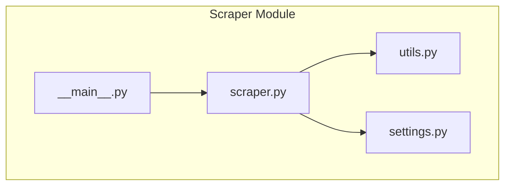
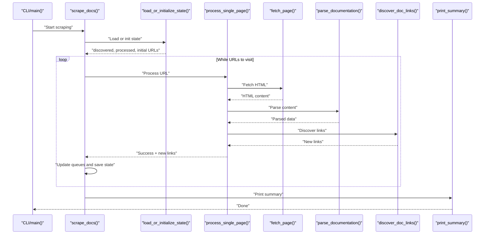
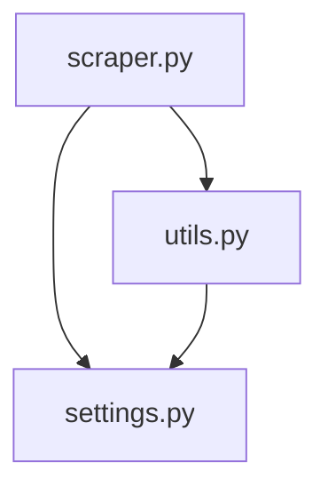

# Scraper Module Functions

<cite>
**Referenced Files in This Document**
- [scraper.py](file://src/pico_doc_scraper/scraper.py)
- [settings.py](file://src/pico_doc_scraper/settings.py)
- [utils.py](file://src/pico_doc_scraper/utils.py)
- [__main__.py](file://src/pico_doc_scraper/__main__.py)
- [README.md](file://README.md)
</cite>

## Table of Contents
1. [Introduction](#introduction)
2. [Project Structure](#project-structure)
3. [Core Components](#core-components)
4. [Architecture Overview](#architecture-overview)
5. [Detailed Component Analysis](#detailed-component-analysis)
6. [Dependency Analysis](#dependency-analysis)
7. [Performance Considerations](#performance-considerations)
8. [Troubleshooting Guide](#troubleshooting-guide)
9. [Conclusion](#conclusion)

## Introduction
This document provides comprehensive API documentation for the main scraping functions in the scraper.py module. It covers the fetch_page, discover_doc_links, parse_documentation, process_single_page, scrape_docs, load_or_initialize_state, and print_summary functions. For each function, we describe parameters, return values, exceptions, and practical usage patterns, along with configuration references from settings.py and utility helpers from utils.py.

## Project Structure
The scraper module is organized around a single primary module responsible for fetching, parsing, and saving documentation pages, with supporting configuration and utilities.

**Diagram sources**
- [scraper.py](file://src/pico_doc_scraper/scraper.py#L1-L391)
- [utils.py](file://src/pico_doc_scraper/utils.py#L1-L175)
- [settings.py](file://src/pico_doc_scraper/settings.py#L1-L33)
- [__main__.py](file://src/pico_doc_scraper/__main__.py#L1-L7)

**Section sources**
- [scraper.py](file://src/pico_doc_scraper/scraper.py#L1-L391)
- [settings.py](file://src/pico_doc_scraper/settings.py#L1-L33)
- [utils.py](file://src/pico_doc_scraper/utils.py#L1-L175)
- [README.md](file://README.md#L1-L134)

## Core Components
- fetch_page: Retrieves HTML content with retry logic and HTTP client configuration.
- discover_doc_links: Parses HTML to find documentation links under allowed domain and /docs paths.
- parse_documentation: Extracts title and main content, removes navigation, and converts to Markdown.
- process_single_page: Orchestrates fetching, parsing, filename generation, saving, and link discovery.
- scrape_docs: Main workflow orchestrator with state loading, queue management, and completion handling.
- load_or_initialize_state: Loads persisted state or initializes fresh state with resume/retry modes.
- print_summary: Prints statistics and persists failed URLs for later retry.

**Section sources**
- [scraper.py](file://src/pico_doc_scraper/scraper.py#L24-L391)
- [settings.py](file://src/pico_doc_scraper/settings.py#L1-L33)
- [utils.py](file://src/pico_doc_scraper/utils.py#L1-L175)

## Architecture Overview
The scraping pipeline follows a stateful, incremental workflow:
- State is loaded or initialized from data files.
- URLs are fetched with retry logic and HTTP client configuration.
- HTML is parsed to extract content and discover new links.
- Content is saved to Markdown files.
- Progress is tracked and summarized at the end.

**Diagram sources**
- [scraper.py](file://src/pico_doc_scraper/scraper.py#L287-L359)
- [scraper.py](file://src/pico_doc_scraper/scraper.py#L231-L284)
- [scraper.py](file://src/pico_doc_scraper/scraper.py#L145-L194)
- [scraper.py](file://src/pico_doc_scraper/scraper.py#L24-L53)
- [scraper.py](file://src/pico_doc_scraper/scraper.py#L88-L142)
- [scraper.py](file://src/pico_doc_scraper/scraper.py#L55-L85)
- [scraper.py](file://src/pico_doc_scraper/scraper.py#L196-L229)

## Detailed Component Analysis

### fetch_page
- Purpose: Fetch a single page’s HTML with retry logic and HTTP client configuration.
- Parameters:
  - url: string, the target URL to fetch.
- Returns:
  - string, the HTML content of the page.
- Exceptions:
  - httpx.HTTPError: raised after all retry attempts fail.
- Implementation highlights:
  - Uses httpx.Client with a configurable timeout.
  - Sets a User-Agent header from settings.
  - Retries up to MAX_RETRIES with a fixed delay between attempts.
  - Follows redirects automatically.
- Validation and behavior:
  - Validates that the request succeeds; otherwise raises an HTTP error.
  - On final failure, raises an HTTP error to signal failure to caller.

Practical usage example:
- Call fetch_page with a documentation URL to retrieve HTML content for parsing.

**Section sources**
- [scraper.py](file://src/pico_doc_scraper/scraper.py#L24-L53)
- [settings.py](file://src/pico_doc_scraper/settings.py#L19-L25)

### discover_doc_links
- Purpose: Discover documentation links from a page’s HTML.
- Parameters:
  - html: string, raw HTML content of the page.
  - base_url: string, the page’s URL used to resolve relative links.
- Returns:
  - set[str], absolute URLs that match allowed domain and /docs path.
- Implementation highlights:
  - Parses HTML with BeautifulSoup.
  - Iterates anchor tags with href attributes.
  - Converts relative URLs to absolute using base_url.
  - Filters by ALLOWED_DOMAIN and path prefix "/docs".
  - Excludes file-type extensions commonly used for downloads.
  - Removes fragments and query strings for consistency.
- Validation and behavior:
  - Ensures only documentation-related links are included.
  - Deduplicates URLs using a set.

Practical usage example:
- Pass the fetched HTML and the page URL to discover all internal documentation links.

**Section sources**
- [scraper.py](file://src/pico_doc_scraper/scraper.py#L55-L85)
- [settings.py](file://src/pico_doc_scraper/settings.py#L6-L7)

### parse_documentation
- Purpose: Extract and transform documentation content into a structured dictionary.
- Parameters:
  - html: string, raw HTML content.
- Returns:
  - dict with keys:
    - title: string, extracted from the first h1 tag or "Untitled".
    - content: string, Markdown-rendered content of the main content area.
    - raw_html: string, the selected HTML subtree used for conversion.
- Implementation highlights:
  - Finds the page title from the first h1 element.
  - Attempts multiple CSS selectors to locate the main content area.
  - Falls back to body or the entire document if no main content is found.
  - Removes navigation, footer, header, and common navigation classes.
  - Converts remaining HTML to Markdown using markdownify with ATX-style headers.
- Validation and behavior:
  - Gracefully handles missing h1 or main content by providing defaults.
  - Produces Markdown suitable for saving to .md files.

Practical usage example:
- Pass the fetched HTML to parse_documentation and save the returned dictionary to a Markdown file.

**Section sources**
- [scraper.py](file://src/pico_doc_scraper/scraper.py#L88-L142)

### process_single_page
- Purpose: End-to-end processing of a single URL: fetch, parse, save, and discover links.
- Parameters:
  - url: string, the URL to process.
  - visited_urls: set[str], set of already processed URLs to avoid duplicates.
- Returns:
  - tuple of (success: bool, parsed_data: dict | None, discovered_links: list[str]).
- Implementation highlights:
  - Calls fetch_page to retrieve HTML.
  - Calls parse_documentation to extract title and content.
  - Generates a filename from the URL path:
    - Converts /docs to index.md for the root docs page.
    - Transforms paths like /docs/something/somethingelse to something_somethingelse.md.
    - Sanitizes filenames to remove unsafe characters.
  - Saves content using utils.save_content with Markdown output.
  - Discovers new links via discover_doc_links and filters out already visited URLs.
- Exception handling:
  - Catches httpx.HTTPError and generic exceptions, returning failure status and empty lists.
- Validation and behavior:
  - Skips already visited URLs.
  - Returns discovered links for the caller to update the queue.

Practical usage example:
- Call process_single_page with a URL and the visited set; handle the returned tuple to update queues and state.

**Section sources**
- [scraper.py](file://src/pico_doc_scraper/scraper.py#L145-L194)
- [utils.py](file://src/pico_doc_scraper/utils.py#L17-L48)
- [utils.py](file://src/pico_doc_scraper/utils.py#L50-L74)
- [scraper.py](file://src/pico_doc_scraper/scraper.py#L55-L85)

### scrape_docs
- Purpose: Main workflow orchestrator for the scraping job.
- Parameters:
  - retry_mode: bool, default False. If True, only processes failed URLs from the failed file.
  - force_fresh: bool, default False. If True, clears existing state and starts over.
- Returns:
  - None.
- Implementation highlights:
  - Loads or initializes state via load_or_initialize_state.
  - Ensures output and data directories exist.
  - Maintains visited_urls, urls_to_visit, counters, and lists for errors and failed URLs.
  - Implements a polite delay between requests using settings.DELAY_BETWEEN_REQUESTS.
  - Processes URLs in a loop until the queue is empty.
  - In non-retry mode, discovers new links and updates queues.
  - Saves discovered and processed URLs incrementally to data files.
  - Handles KeyboardInterrupt and unexpected errors gracefully.
  - Prints a summary via print_summary.
- Validation and behavior:
  - Early exits if no URLs to process.
  - Respects retry_mode to limit processing to failed URLs only.

Practical usage example:
- Call scrape_docs with desired flags to start a scrape, resume, or retry.

**Section sources**
- [scraper.py](file://src/pico_doc_scraper/scraper.py#L287-L359)
- [settings.py](file://src/pico_doc_scraper/settings.py#L28-L29)

### load_or_initialize_state
- Purpose: Load persisted state or initialize fresh state with resume/retry capabilities.
- Parameters:
  - force_fresh: bool, if True, clears all state files before loading.
  - retry_mode: bool, if True, loads only failed URLs for retry.
- Returns:
  - tuple of (discovered_urls: set[str], processed_urls: set[str], initial_urls: set[str]).
- Implementation highlights:
  - Clears state files if force_fresh is True.
  - Loads discovered, processed, and failed URLs from data files.
  - In retry_mode, returns only failed URLs as initial URLs.
  - In resume mode, computes initial_urls as discovered minus processed.
  - In fresh start, sets initial_urls to the base documentation URL.
- Validation and behavior:
  - Provides informative messages for each mode.
  - Returns empty sets when there is nothing to process.

Practical usage example:
- Call load_or_initialize_state(force_fresh, retry_mode) to get the correct starting state for scrape_docs.

**Section sources**
- [scraper.py](file://src/pico_doc_scraper/scraper.py#L231-L284)
- [utils.py](file://src/pico_doc_scraper/utils.py#L130-L158)
- [utils.py](file://src/pico_doc_scraper/utils.py#L112-L127)
- [utils.py](file://src/pico_doc_scraper/utils.py#L161-L175)

### print_summary
- Purpose: Print scraping statistics and persist failed URLs for later retry.
- Parameters:
  - page_count: int, number of successfully scraped pages.
  - error_count: int, number of errors encountered.
  - errors: list[str], error messages.
  - failed_urls: list[str], URLs that failed to process.
- Returns:
  - None.
- Implementation highlights:
  - Prints a formatted summary with counts and output directory.
  - Shows up to ten error details and indicates how many more there are.
  - Saves failed URLs to the failed URLs file for retry.
  - Prints a helpful message to run the retry command.
- Validation and behavior:
  - Clears the failed URLs file if there are no failures.

Practical usage example:
- Call print_summary at the end of scrape_docs to display results and persist failures.

**Section sources**
- [scraper.py](file://src/pico_doc_scraper/scraper.py#L196-L229)
- [utils.py](file://src/pico_doc_scraper/utils.py#L92-L109)

## Dependency Analysis
The scraper module depends on configuration constants and utility functions for state persistence, output formatting, and filename sanitization.

**Diagram sources**
- [scraper.py](file://src/pico_doc_scraper/scraper.py#L1-L391)
- [settings.py](file://src/pico_doc_scraper/settings.py#L1-L33)
- [utils.py](file://src/pico_doc_scraper/utils.py#L1-L175)

**Section sources**
- [scraper.py](file://src/pico_doc_scraper/scraper.py#L1-L391)
- [settings.py](file://src/pico_doc_scraper/settings.py#L1-L33)
- [utils.py](file://src/pico_doc_scraper/utils.py#L1-L175)

## Performance Considerations
- Politeness: A delay between requests reduces server load and avoids rate limiting.
- Incremental state saving: Queues and sets are saved after each URL to minimize data loss and enable quick resumption.
- Retry strategy: Controlled retries with a short delay reduce transient network failures.
- Output format: Markdown conversion is straightforward and efficient for the target content.

[No sources needed since this section provides general guidance]

## Troubleshooting Guide
- HTTP errors: fetch_page raises httpx.HTTPError after retries; handle or log appropriately.
- Duplicate processing: process_single_page skips already visited URLs; ensure visited_urls is passed correctly.
- Failed URLs persistence: print_summary saves failed URLs to a file; use retry mode to re-process them.
- Interrupt handling: scrape_docs catches KeyboardInterrupt and prints a warning; state is still saved.
- Output directory: ensure_output_dir creates directories as needed; verify permissions if writing fails.

**Section sources**
- [scraper.py](file://src/pico_doc_scraper/scraper.py#L34-L52)
- [scraper.py](file://src/pico_doc_scraper/scraper.py#L187-L193)
- [scraper.py](file://src/pico_doc_scraper/scraper.py#L350-L355)
- [utils.py](file://src/pico_doc_scraper/utils.py#L7-L14)

## Conclusion
The scraper module provides a robust, stateful, and resilient pipeline for converting Pico.css documentation pages to Markdown. Its functions are designed for incremental progress, graceful error handling, and easy resumption or retry. Configuration is centralized in settings.py, while utilities in utils.py support state persistence, output formatting, and filename sanitization.