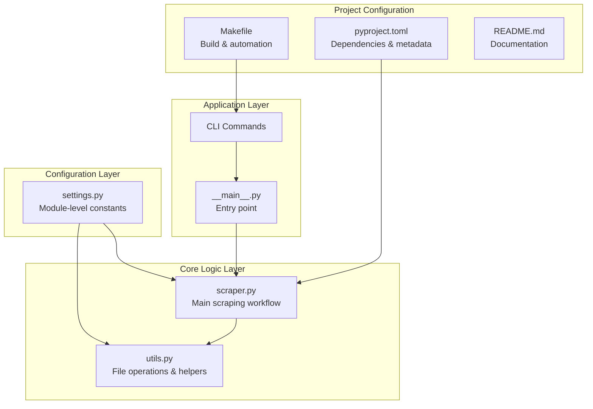
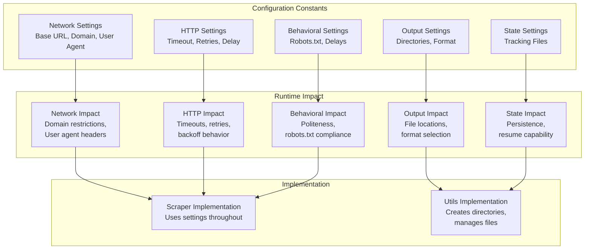
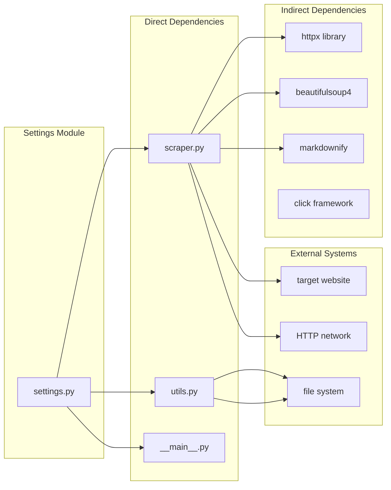
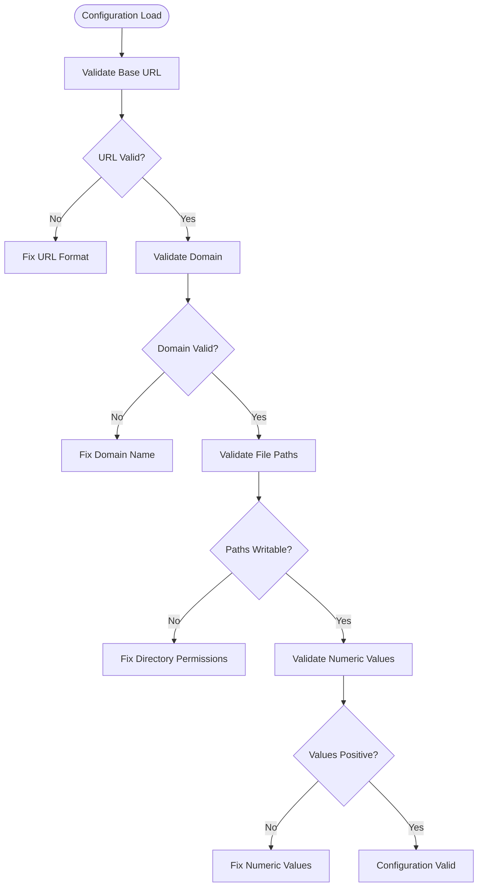

# Settings Module Configuration

<cite>
**Referenced Files in This Document**
- [settings.py](file://src/pico_doc_scraper/settings.py)
- [scraper.py](file://src/pico_doc_scraper/scraper.py)
- [utils.py](file://src/pico_doc_scraper/utils.py)
- [README.md](file://README.md)
- [Makefile](file://Makefile)
- [__main__.py](file://src/pico_doc_scraper/__main__.py)
- [pyproject.toml](file://pyproject.toml)
</cite>

## Table of Contents
1. [Introduction](#introduction)
2. [Project Structure](#project-structure)
3. [Core Components](#core-components)
4. [Architecture Overview](#architecture-overview)
5. [Detailed Component Analysis](#detailed-component-analysis)
6. [Dependency Analysis](#dependency-analysis)
7. [Performance Considerations](#performance-considerations)
8. [Troubleshooting Guide](#troubleshooting-guide)
9. [Conclusion](#conclusion)

## Introduction
This document provides comprehensive API documentation for the settings.py module configuration constants that control the pico.css documentation scraper's behavior. The settings module defines all configuration parameters that govern network behavior, file system operations, state management, and scraping characteristics. These constants serve as the central configuration interface for tuning the scraper's performance, reliability, and resource usage across different environments and use cases.

## Project Structure
The settings module is part of a focused scraping application with clear separation between configuration, core logic, and utilities:

**Diagram sources**
- [settings.py](file://src/pico_doc_scraper/settings.py#L1-L33)
- [scraper.py](file://src/pico_doc_scraper/scraper.py#L1-L391)
- [utils.py](file://src/pico_doc_scraper/utils.py#L1-L175)
- [__main__.py](file://src/pico_doc_scraper/__main__.py#L1-L7)
- [pyproject.toml](file://pyproject.toml#L1-L75)
- [Makefile](file://Makefile#L1-L126)

**Section sources**
- [settings.py](file://src/pico_doc_scraper/settings.py#L1-L33)
- [scraper.py](file://src/pico_doc_scraper/scraper.py#L1-L391)
- [utils.py](file://src/pico_doc_scraper/utils.py#L1-L175)
- [README.md](file://README.md#L1-L134)

## Core Components
The settings module defines 11 key configuration constants organized into logical categories:

### Network Configuration Constants
- **PICO_DOCS_BASE_URL**: Primary documentation domain URL (default: https://picocss.com/docs)
- **ALLOWED_DOMAIN**: Domain restriction for scraping (default: picocss.com)
- **USER_AGENT**: HTTP client identification header (default: pico-doc-scraper/0.1.0)
- **REQUEST_TIMEOUT**: Request duration limit in seconds (default: 30)
- **MAX_RETRIES**: Maximum retry attempts for failed requests (default: 3)
- **RETRY_DELAY**: Backoff timing between retries in seconds (default: 1)

### Behavioral Configuration Constants
- **RESPECT_ROBOTS_TXT**: Enable robots.txt compliance (default: True)
- **DELAY_BETWEEN_REQUESTS**: Politeness delay between requests in seconds (default: 1.0)

### Output Configuration Constants
- **OUTPUT_DIR**: Directory for scraped content output (default: ./scraped)
- **DATA_DIR**: Directory for state file storage (default: ./data)
- **OUTPUT_FORMAT**: Content output format (default: markdown)

### State Management Constants
- **DISCOVERED_URLS_FILE**: URL tracking persistence file path
- **PROCESSED_URLS_FILE**: Processed URL tracking file path  
- **FAILED_URLS_FILE**: Failure recovery tracking file path

**Section sources**
- [settings.py](file://src/pico_doc_scraper/settings.py#L5-L33)

## Architecture Overview
The settings module serves as the central configuration hub that influences every aspect of the scraping operation:

**Diagram sources**
- [settings.py](file://src/pico_doc_scraper/settings.py#L6-L32)
- [scraper.py](file://src/pico_doc_scraper/scraper.py#L24-L52)
- [utils.py](file://src/pico_doc_scraper/utils.py#L7-L175)

## Detailed Component Analysis

### Base URL Configuration
The base URL configuration establishes the starting point and scope for the entire scraping operation.

**Constant**: PICO_DOCS_BASE_URL
- **Default Value**: https://picocss.com/docs
- **Type**: String (URL)
- **Validation**: Must be a valid HTTPS URL
- **Impact**: 
  - Defines the initial crawl starting point
  - Establishes the primary documentation domain boundary
  - Used in resume mode to display current scrape context
- **Performance Characteristics**: No direct performance impact
- **Reliability**: Critical for establishing correct crawling scope

**Section sources**
- [settings.py](file://src/pico_doc_scraper/settings.py#L6-L6)
- [scraper.py](file://src/pico_doc_scraper/scraper.py#L280-L283)

### Domain Restriction Configuration
Domain restriction ensures the scraper operates within defined boundaries and prevents accidental cross-domain crawling.

**Constant**: ALLOWED_DOMAIN
- **Default Value**: picocss.com
- **Type**: String (domain name)
- **Validation**: Must be a valid domain identifier
- **Impact**:
  - Filters discovered links to only include the specified domain
  - Prevents crawling external resources or download links
  - Ensures compliance with target website structure
- **Performance Characteristics**: Minimal overhead in URL filtering
- **Reliability**: Essential for maintaining scrape scope and avoiding errors

**Section sources**
- [settings.py](file://src/pico_doc_scraper/settings.py#L7-L7)
- [scraper.py](file://src/pico_doc_scraper/scraper.py#L76-L83)

### HTTP Client Configuration
HTTP client settings control network behavior, error handling, and connection management.

**Constants**:
- **REQUEST_TIMEOUT**: Default 30 seconds
  - **Type**: Integer/Float (seconds)
  - **Validation**: Must be positive number
  - **Impact**: Controls maximum wait time for HTTP responses
  - **Performance**: Higher values increase total processing time but improve reliability
  - **Reliability**: Prevents indefinite hanging on network issues

- **MAX_RETRIES**: Default 3 attempts
  - **Type**: Integer
  - **Validation**: Must be non-negative integer
  - **Impact**: Determines retry attempts for failed HTTP requests
  - **Performance**: Increases total processing time linearly with retry count
  - **Reliability**: Significantly improves success rate for transient network issues

- **RETRY_DELAY**: Default 1 second
  - **Type**: Integer/Float (seconds)
  - **Validation**: Must be non-negative number
  - **Impact**: Controls backoff timing between retry attempts
  - **Performance**: Directly affects total processing time
  - **Reliability**: Prevents overwhelming servers with rapid retry bursts

**Section sources**
- [settings.py](file://src/pico_doc_scraper/settings.py#L20-L22)
- [scraper.py](file://src/pico_doc_scraper/scraper.py#L36-L52)

### User Agent Configuration
User agent identification helps establish the scraper's identity to target servers.

**Constant**: USER_AGENT
- **Default Value**: pico-doc-scraper/0.1.0 (Educational purposes)
- **Type**: String
- **Validation**: Must be a valid user agent string
- **Impact**:
  - Identifies the scraper to target servers
  - May influence server response behavior
  - Supports transparency about educational usage
- **Performance Characteristics**: No performance impact
- **Reliability**: Important for maintaining good relationships with target servers

**Section sources**
- [settings.py](file://src/pico_doc_scraper/settings.py#L25-L25)
- [scraper.py](file://src/pico_doc_scraper/scraper.py#L36-L36)

### Behavioral Configuration
Behavioral settings control the scraper's politeness and compliance with web standards.

**Constants**:
- **RESPECT_ROBOTS_TXT**: Default True
  - **Type**: Boolean
  - **Validation**: Must be boolean value
  - **Impact**: Enables robots.txt compliance checking
  - **Performance**: Minimal overhead in URL filtering
  - **Reliability**: Essential for legal and ethical scraping

- **DELAY_BETWEEN_REQUESTS**: Default 1.0 seconds
  - **Type**: Float (seconds)
  - **Validation**: Must be non-negative number
  - **Impact**: Controls politeness delay between requests
  - **Performance**: Directly affects total processing time
  - **Reliability**: Prevents overwhelming target servers

**Section sources**
- [settings.py](file://src/pico_doc_scraper/settings.py#L28-L29)
- [scraper.py](file://src/pico_doc_scraper/scraper.py#L322-L324)

### Output Configuration
Output configuration determines where and how scraped content is stored.

**Constants**:
- **OUTPUT_DIR**: Default ./scraped
  - **Type**: Path object
  - **Validation**: Must be writable directory path
  - **Impact**: Root directory for scraped content storage
  - **Performance**: Affects disk I/O operations
  - **Reliability**: Critical for successful content saving

- **DATA_DIR**: Default ./data
  - **Type**: Path object
  - **Validation**: Must be writable directory path
  - **Impact**: Root directory for state tracking files
  - **Performance**: Affects file I/O operations
  - **Reliability**: Essential for resume functionality

- **OUTPUT_FORMAT**: Default markdown
  - **Type**: String
  - **Validation**: Must be one of: markdown, json, html
  - **Impact**: Determines content serialization format
  - **Performance**: Minimal impact on processing
  - **Reliability**: Affects downstream processing compatibility

**Section sources**
- [settings.py](file://src/pico_doc_scraper/settings.py#L10-L12)
- [settings.py](file://src/pico_doc_scraper/settings.py#L31-L32)
- [utils.py](file://src/pico_doc_scraper/utils.py#L17-L47)

### State Management Configuration
State management configuration controls persistence and recovery mechanisms.

**Constants**:
- **DISCOVERED_URLS_FILE**: State tracking for all discovered URLs
- **PROCESSED_URLS_FILE**: State tracking for successfully processed URLs
- **FAILED_URLS_FILE**: State tracking for failed URLs requiring retry

These files enable:
- **Resume Capability**: Continue from previous scraping session
- **Failure Recovery**: Retry only failed URLs from previous run
- **Progress Tracking**: Monitor scraping progress and completion status

**Section sources**
- [settings.py](file://src/pico_doc_scraper/settings.py#L14-L17)
- [utils.py](file://src/pico_doc_scraper/utils.py#L130-L158)
- [utils.py](file://src/pico_doc_scraper/utils.py#L92-L127)

## Dependency Analysis
The settings module has extensive dependencies throughout the application:

**Diagram sources**
- [settings.py](file://src/pico_doc_scraper/settings.py#L1-L33)
- [scraper.py](file://src/pico_doc_scraper/scraper.py#L1-L21)
- [utils.py](file://src/pico_doc_scraper/utils.py#L1-L47)
- [pyproject.toml](file://pyproject.toml#L9-L14)

**Section sources**
- [settings.py](file://src/pico_doc_scraper/settings.py#L1-L33)
- [scraper.py](file://src/pico_doc_scraper/scraper.py#L1-L21)
- [utils.py](file://src/pico_doc_scraper/utils.py#L1-L47)
- [pyproject.toml](file://pyproject.toml#L9-L14)

## Performance Considerations

### Network Performance Tuning
The HTTP configuration constants provide the primary levers for controlling network performance:

**Timeout Configuration Impact**:
- Lower timeouts (10-15s): Faster detection of network issues but higher failure rates
- Moderate timeouts (20-30s): Balanced approach for most websites
- Higher timeouts (45-60s): More reliable but slower processing

**Retry Strategy Impact**:
- Fewer retries (1-2): Faster but less reliable
- Moderate retries (3-5): Good balance of reliability and speed
- Many retries (6+): Highly reliable but significantly slower

**Politeness Delays**:
- Zero delay: Fastest but may overwhelm servers
- Minimal delay (0.5s): Good compromise for most scenarios
- Moderate delay (1.0s+): Very polite, slower but respectful

### Storage Performance Considerations
Output and state file management affects disk I/O performance:

**Directory Structure Benefits**:
- Separate output and data directories prevent I/O contention
- Automatic directory creation reduces startup overhead
- Incremental state saving minimizes write operations

**File Format Impact**:
- Markdown: Fastest to write, smallest files
- JSON: Good balance of readability and performance
- HTML: Largest files, slower to write but preserves original structure

### Memory Usage Patterns
The settings influence memory consumption through:

- URL tracking sets (discovered, processed, failed)
- HTTP response caching (automatic with httpx)
- Content processing buffers (HTML parsing and markdown conversion)

**Section sources**
- [settings.py](file://src/pico_doc_scraper/settings.py#L20-L29)
- [scraper.py](file://src/pico_doc_scraper/scraper.py#L322-L324)
- [utils.py](file://src/pico_doc_scraper/utils.py#L130-L158)

## Troubleshooting Guide

### Common Configuration Issues

**Network Timeout Problems**:
- **Symptom**: Frequent HTTP timeout errors
- **Solution**: Increase REQUEST_TIMEOUT value (e.g., from 30 to 60 seconds)
- **Impact**: Reduces timeout-related failures but increases processing time

**Excessive Retry Failures**:
- **Symptom**: Constant retry loops with no progress
- **Solution**: Adjust MAX_RETRIES and RETRY_DELAY values
- **Impact**: Better reliability with controlled processing time

**Domain Restriction Issues**:
- **Symptom**: Links not being discovered or processed
- **Solution**: Verify ALLOWED_DOMAIN matches target website
- **Impact**: Critical for maintaining scrape scope

**File Permission Errors**:
- **Symptom**: Cannot create output or state files
- **Solution**: Ensure OUTPUT_DIR and DATA_DIR are writable
- **Impact**: Prevents any scraping functionality

### Validation and Debugging

**Configuration Validation Flow**:

**Section sources**
- [settings.py](file://src/pico_doc_scraper/settings.py#L6-L32)
- [utils.py](file://src/pico_doc_scraper/utils.py#L7-L14)
- [utils.py](file://src/pico_doc_scraper/utils.py#L130-L158)

## Conclusion
The settings.py module provides a comprehensive configuration system that balances performance, reliability, and ethical scraping practices. The 11 configuration constants offer fine-grained control over every aspect of the scraping operation, from network behavior and file management to state persistence and output formatting.

Key strengths of the configuration system include:
- **Centralized Control**: All settings in a single, well-documented module
- **Comprehensive Coverage**: Addresses all major aspects of scraping operations
- **Performance Flexibility**: Allows tuning for different environments and requirements
- **Reliability Focus**: Built-in retry mechanisms and state persistence
- **Ethical Design**: Politeness delays and robots.txt compliance

The configuration system enables effective adaptation to various use cases, from quick prototyping to production-scale scraping operations, while maintaining robust error handling and recovery capabilities.