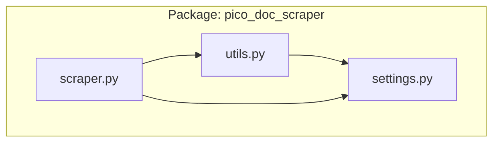
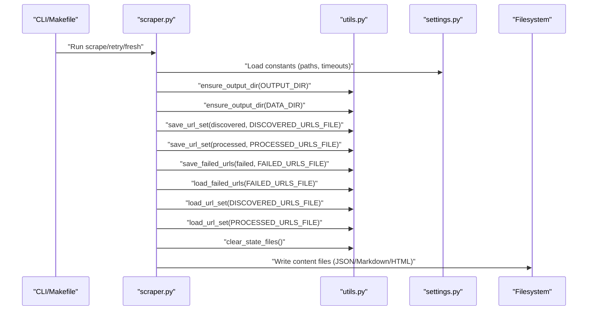
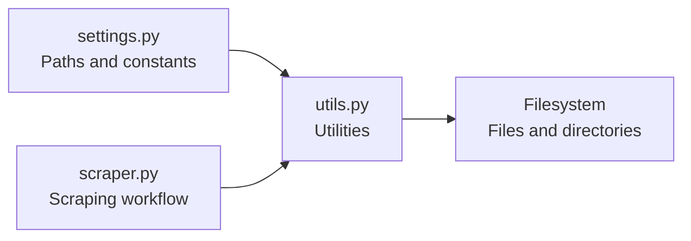

# Utils Module Utilities

<cite>
**Referenced Files in This Document**
- [utils.py](file://src/pico_doc_scraper/utils.py)
- [settings.py](file://src/pico_doc_scraper/settings.py)
- [scraper.py](file://src/pico_doc_scraper/scraper.py)
- [Makefile](file://Makefile)
- [README.md](file://README.md)
</cite>

## Table of Contents
1. [Introduction](#introduction)
2. [Project Structure](#project-structure)
3. [Core Components](#core-components)
4. [Architecture Overview](#architecture-overview)
5. [Detailed Component Analysis](#detailed-component-analysis)
6. [Dependency Analysis](#dependency-analysis)
7. [Performance Considerations](#performance-considerations)
8. [Troubleshooting Guide](#troubleshooting-guide)
9. [Conclusion](#conclusion)
10. [Appendices](#appendices)

## Introduction
This document provides comprehensive API documentation for the utils.py module, focusing on utility functions that support file operations, state management, and content processing. The module offers helpers for directory creation and validation, filename sanitization, content serialization, URL tracking persistence, failure recovery state management, and cleanup operations. Practical usage examples and thread-safety considerations are included to guide both developers and operators integrating these utilities into scraping workflows.

## Project Structure
The utils module resides under the pico_doc_scraper package and collaborates with settings and scraper modules to implement a robust scraping pipeline with state persistence and resumable operation.

**Diagram sources**
- [utils.py](file://src/pico_doc_scraper/utils.py#L1-L175)
- [settings.py](file://src/pico_doc_scraper/settings.py#L1-L33)
- [scraper.py](file://src/pico_doc_scraper/scraper.py#L1-L22)

**Section sources**
- [utils.py](file://src/pico_doc_scraper/utils.py#L1-L175)
- [settings.py](file://src/pico_doc_scraper/settings.py#L1-L33)
- [scraper.py](file://src/pico_doc_scraper/scraper.py#L1-L22)

## Core Components
This section documents the primary utility functions and their roles in the scraping workflow.

- ensure_output_dir: Creates and validates output directories.
- sanitize_filename: Produces filesystem-safe filenames.
- save_content: Serializes and writes content to disk with format-aware handling.
- save_url_set/load_url_set: Persist and load sets of URLs to plain-text files.
- save_failed_urls/load_failed_urls: Persist and load lists of failed URLs for retry.
- clear_state_files: Removes state tracking files.
- format_url: Combines base URL and path with slash normalization.

These functions collectively enable reliable file I/O, state persistence, and content formatting across the scraper.

**Section sources**
- [utils.py](file://src/pico_doc_scraper/utils.py#L7-L175)
- [settings.py](file://src/pico_doc_scraper/settings.py#L14-L17)

## Architecture Overview
The utils module integrates with the scraper and settings modules to provide stateful, resumable scraping with explicit file-based persistence.

**Diagram sources**
- [scraper.py](file://src/pico_doc_scraper/scraper.py#L287-L358)
- [utils.py](file://src/pico_doc_scraper/utils.py#L7-L175)
- [settings.py](file://src/pico_doc_scraper/settings.py#L14-L17)

## Detailed Component Analysis

### ensure_output_dir
Creates parent directories as needed and prints a readiness message.

- Purpose: Ensure output directories exist prior to writing content or state files.
- Parameters:
  - directory: Path to the directory to create.
- Returns: None
- Exceptions: Propagates exceptions raised by directory creation operations.
- Behavior:
  - Creates missing parent directories.
  - Prints a readiness message indicating the directory is prepared.
- Thread Safety: Safe for concurrent callers; directory creation is atomic at the OS level.
- Practical Usage:
  - Called before saving content and state files to prevent write failures.

**Section sources**
- [utils.py](file://src/pico_doc_scraper/utils.py#L7-L15)

### sanitize_filename
Produces a filesystem-safe filename by replacing unsafe characters, trimming whitespace and leading dots, and enforcing a maximum length.

- Purpose: Prevent invalid or unsafe filenames on various operating systems.
- Parameters:
  - filename: String to sanitize.
- Returns: Sanitized filename string.
- Behavior:
  - Replaces unsafe characters with underscores.
  - Strips leading/trailing spaces and dots.
  - Limits length to a maximum threshold.
  - Returns a default name if the result is empty.
- Thread Safety: Pure function; safe for concurrent use.
- Practical Usage:
  - Used to derive output filenames from URLs before saving content.

**Section sources**
- [utils.py](file://src/pico_doc_scraper/utils.py#L50-L74)

### save_content
Writes scraped content to a file with format-aware serialization.

- Purpose: Serialize and persist parsed content in a chosen format.
- Parameters:
  - output_file: Path to the file to write.
  - data: Dictionary containing scraped content (title, content, raw_html).
- Returns: None
- Behavior:
  - Ensures parent directory exists.
  - Writes in one of several formats based on file extension:
    - .json: JSON dump with indentation and UTF-8 encoding.
    - .md: Markdown header and content.
    - .html: Raw HTML content.
    - Default: Text representation of data.
- Thread Safety: Not inherently thread-safe; concurrent writes to the same file can cause corruption.
- Practical Usage:
  - Called after parsing a page to save the resulting content.

**Section sources**
- [utils.py](file://src/pico_doc_scraper/utils.py#L17-L48)

### save_url_set
Persists a set of URLs to a plain-text file, one URL per line, sorted and deduplicated.

- Purpose: Maintain discovered and processed URL sets for resumable scraping.
- Parameters:
  - urls: Set of URLs to save.
  - file_path: Path to the destination file.
- Returns: None
- Behavior:
  - Ensures parent directory exists.
  - Writes each URL on a separate line, sorted lexicographically.
- Thread Safety: Not inherently thread-safe; concurrent writes can corrupt the file.
- Practical Usage:
  - Called periodically during scraping to checkpoint state.

**Section sources**
- [utils.py](file://src/pico_doc_scraper/utils.py#L130-L141)

### load_url_set
Loads a set of URLs from a plain-text file, ignoring blank lines and whitespace.

- Purpose: Restore previously saved URL sets to resume or retry scraping.
- Parameters:
  - file_path: Path to the file containing URLs.
- Returns: Set of URLs.
- Behavior:
  - Returns an empty set if the file does not exist.
  - Reads non-empty lines, strips whitespace, and constructs a set.
- Thread Safety: Not inherently thread-safe; concurrent reads/writes can race.
- Practical Usage:
  - Called at startup to initialize discovered and processed URL sets.

**Section sources**
- [utils.py](file://src/pico_doc_scraper/utils.py#L143-L158)

### save_failed_urls
Persists failed URLs to a file for later retry.

- Purpose: Record URLs that failed to scrape to enable targeted retry.
- Parameters:
  - failed_urls: List of failed URLs.
  - file_path: Path to the destination file.
- Returns: None
- Behavior:
  - If the list is empty, removes the file if present.
  - Otherwise, ensures parent directory exists and writes each URL on a separate line, sorted and deduplicated.
  - Prints a summary of saved URLs.
- Thread Safety: Not inherently thread-safe; concurrent writes can corrupt the file.
- Practical Usage:
  - Called at the end of a scraping session to persist failures.

**Section sources**
- [utils.py](file://src/pico_doc_scraper/utils.py#L92-L110)

### load_failed_urls
Loads failed URLs from a file for retry processing.

- Purpose: Retrieve URLs that failed in the last run to retry.
- Parameters:
  - file_path: Path to the file containing failed URLs.
- Returns: List of URLs to retry.
- Behavior:
  - Returns an empty list if the file does not exist.
  - Reads non-empty lines, strips whitespace, and returns them as a list.
- Thread Safety: Not inherently thread-safe; concurrent reads/writes can race.
- Practical Usage:
  - Called at startup in retry mode to populate the initial URL queue.

**Section sources**
- [utils.py](file://src/pico_doc_scraper/utils.py#L112-L127)

### clear_state_files
Removes state tracking files to reset persistent state.

- Purpose: Clear all state tracking files to start fresh.
- Parameters: None
- Returns: None
- Behavior:
  - Loads state file paths from settings.
  - Iterates over the list and deletes each file if present.
  - Prints a message for each cleared file.
- Thread Safety: Not inherently thread-safe; deletion races with concurrent writers.
- Practical Usage:
  - Invoked when forcing a fresh start to clear all persisted state.

**Section sources**
- [utils.py](file://src/pico_doc_scraper/utils.py#L161-L175)

### format_url
Combines a base URL and a path, normalizing trailing and leading slashes.

- Purpose: Construct absolute URLs from base and path segments.
- Parameters:
  - base_url: The base URL.
  - path: The path segment to append.
- Returns: Combined URL string.
- Behavior:
  - Removes trailing slash from base.
  - Removes leading slash from path.
  - Joins with a single slash if path is non-empty; otherwise returns base.
- Thread Safety: Pure function; safe for concurrent use.
- Practical Usage:
  - Used to construct canonical URLs for deduplication and persistence.

**Section sources**
- [utils.py](file://src/pico_doc_scraper/utils.py#L77-L89)

## Dependency Analysis
The utils module depends on settings for file paths and is consumed by the scraper module to implement stateful scraping.

**Diagram sources**
- [utils.py](file://src/pico_doc_scraper/utils.py#L163-L169)
- [settings.py](file://src/pico_doc_scraper/settings.py#L14-L17)
- [scraper.py](file://src/pico_doc_scraper/scraper.py#L287-L358)

**Section sources**
- [utils.py](file://src/pico_doc_scraper/utils.py#L161-L175)
- [settings.py](file://src/pico_doc_scraper/settings.py#L14-L17)
- [scraper.py](file://src/pico_doc_scraper/scraper.py#L287-L358)

## Performance Considerations
- Directory creation: ensure_output_dir performs minimal work; repeated calls are inexpensive.
- File I/O:
  - save_content writes once per content item; choose appropriate formats to balance readability and storage.
  - save_url_set and save_failed_urls sort and write lines; cost scales linearly with URL count.
  - load_url_set and load_failed_urls read and filter lines; cost scales linearly with file size.
- Encoding: All file operations use UTF-8; ensure consistent encoding across environments.
- Atomicity: Current implementations do not provide atomic writes; concurrent access can lead to partial or corrupted files.

[No sources needed since this section provides general guidance]

## Troubleshooting Guide
- Permission errors when creating directories or writing files:
  - Verify that the process has write permissions to the target directories.
  - Ensure ensure_output_dir is called with correct paths before attempting writes.
- Empty or missing state files:
  - load_url_set and load_failed_urls return empty collections when files do not exist; this is expected behavior.
  - Use clear_state_files to remove stale state files if corrupted.
- Filename collisions or invalid characters:
  - sanitize_filename replaces unsafe characters and trims whitespace; confirm output filenames meet platform constraints.
- Concurrent access issues:
  - Multiple processes writing to the same file can corrupt data. Use a single writer or implement external synchronization.
- Retry mode behavior:
  - save_failed_urls removes the file when the input list is empty; load_failed_urls returns an empty list when the file is absent.

**Section sources**
- [utils.py](file://src/pico_doc_scraper/utils.py#L7-L175)
- [settings.py](file://src/pico_doc_scraper/settings.py#L14-L17)

## Conclusion
The utils module provides essential building blocks for reliable file operations, state persistence, and content serialization in the scraping pipeline. By leveraging ensure_output_dir, sanitize_filename, save_content, and the URL/state persistence functions, the scraper achieves resumable, fault-tolerant operation. While the current implementations are not inherently thread-safe, they offer predictable behavior suitable for single-process workflows. Operators can integrate these utilities into automated scripts and CI/CD pipelines using the provided CLI targets.

[No sources needed since this section summarizes without analyzing specific files]

## Appendices

### API Reference Summary
- ensure_output_dir(directory: Path) -> None
- sanitize_filename(filename: str) -> str
- save_content(output_file: Path, data: dict) -> None
- save_url_set(urls: set[str], file_path: Path) -> None
- load_url_set(file_path: Path) -> set[str]
- save_failed_urls(failed_urls: list[str], file_path: Path) -> None
- load_failed_urls(file_path: Path) -> list[str]
- clear_state_files() -> None
- format_url(base_url: str, path: str) -> str

**Section sources**
- [utils.py](file://src/pico_doc_scraper/utils.py#L7-L175)

### Usage Examples
- Saving content in Markdown:
  - Call save_content with a .md output file and a dictionary containing title and content.
- Persisting discovered URLs:
  - After discovering new links, call save_url_set with the updated set and the discovered URLs file path.
- Recording failures:
  - At the end of a run, call save_failed_urls with the list of failed URLs and the failed URLs file path.
- Resuming or retrying:
  - Load existing sets with load_url_set and load_failed_urls; use clear_state_files to start fresh.
- Creating output directories:
  - Call ensure_output_dir with the output and data directories before writing files.

**Section sources**
- [utils.py](file://src/pico_doc_scraper/utils.py#L17-L175)
- [settings.py](file://src/pico_doc_scraper/settings.py#L14-L17)
- [scraper.py](file://src/pico_doc_scraper/scraper.py#L287-L358)
- [Makefile](file://Makefile#L115-L125)
- [README.md](file://README.md#L23-L53)