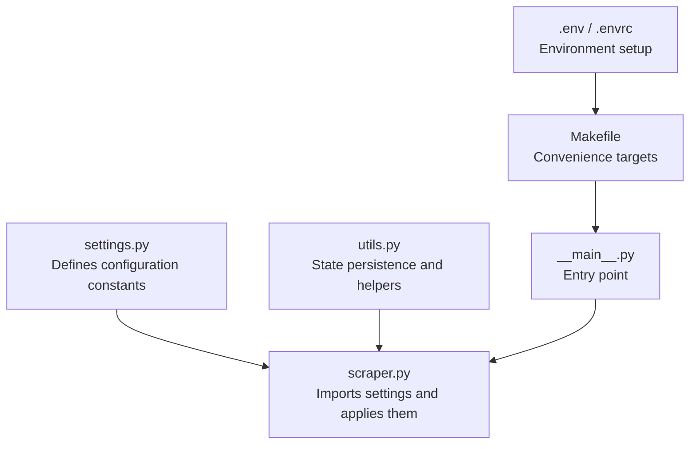
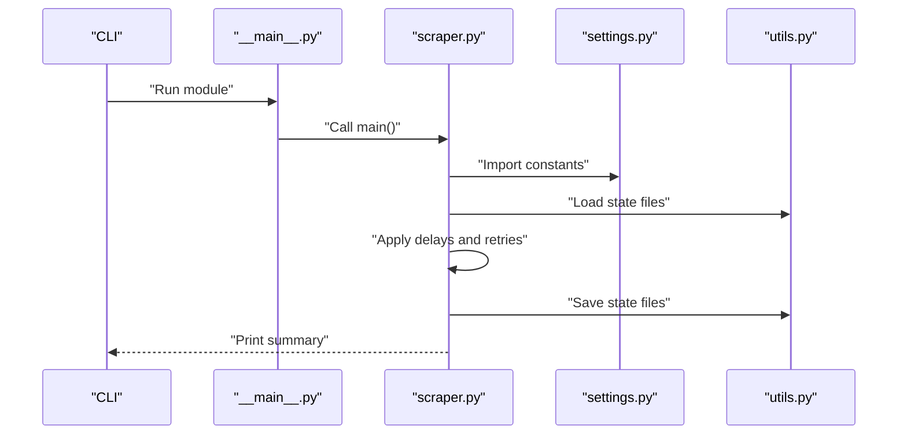
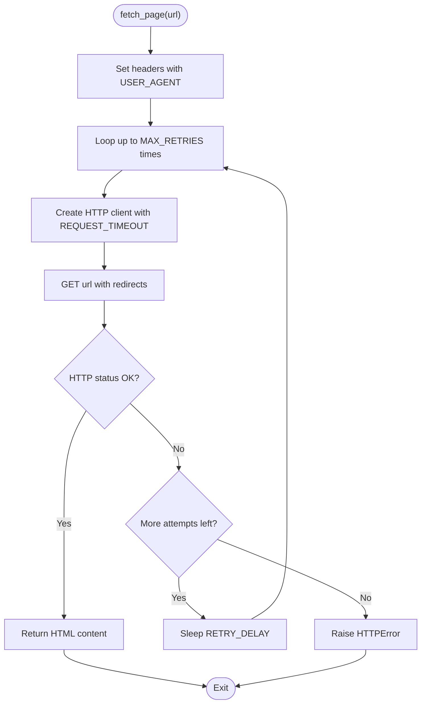
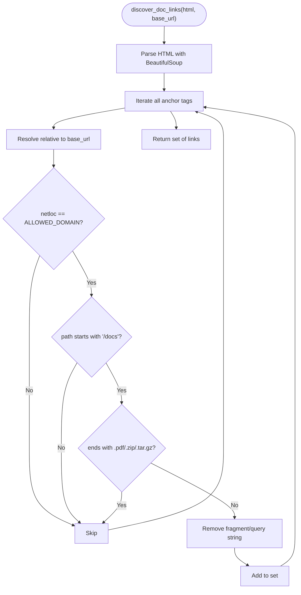
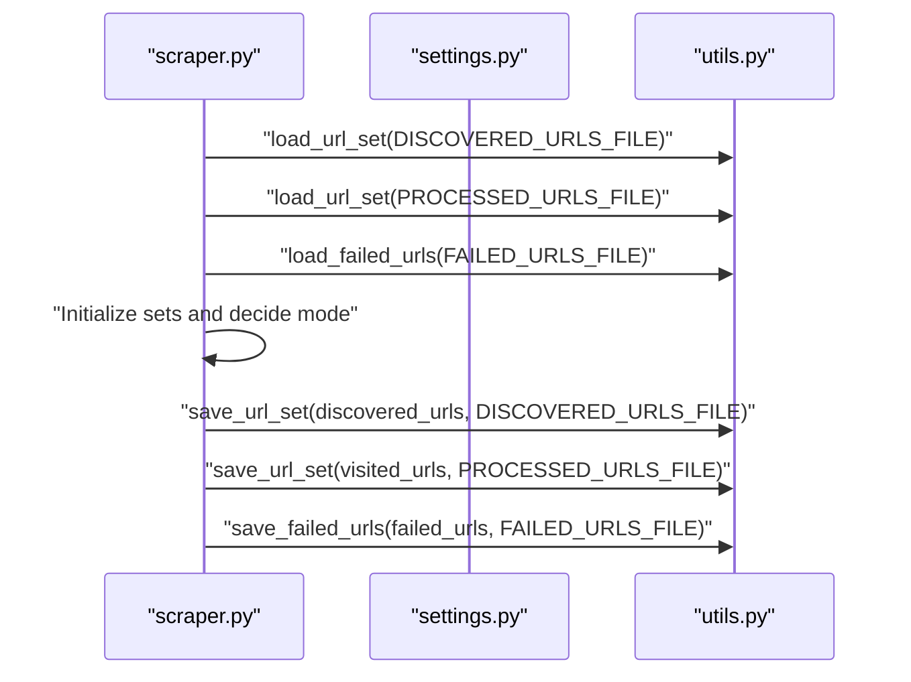
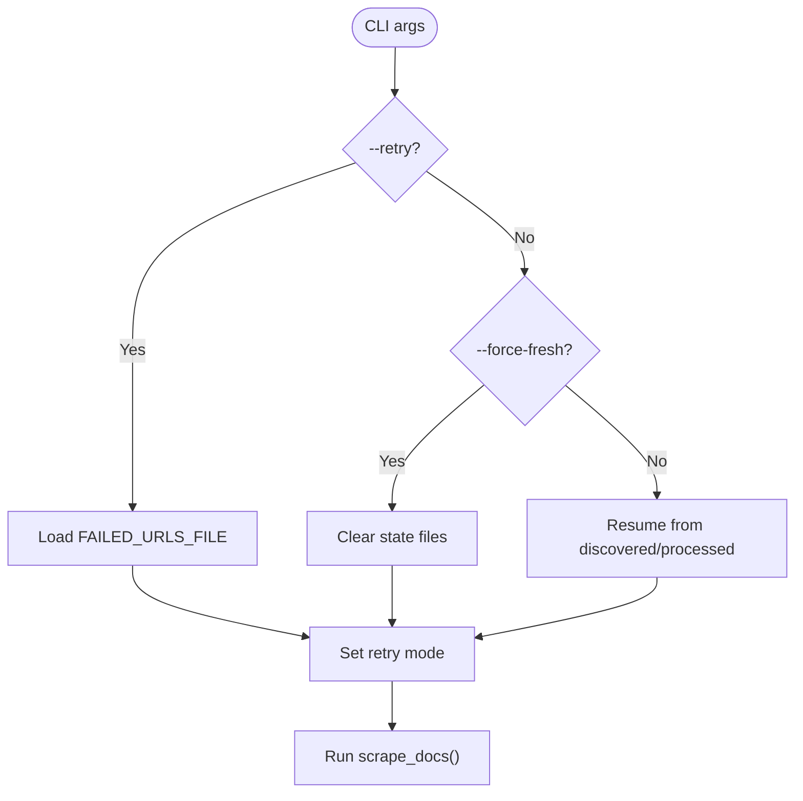
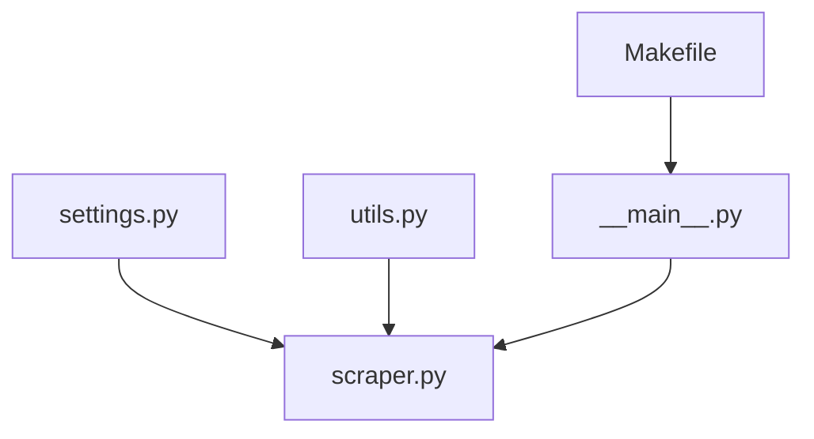

# Configuration and Settings

<cite>
**Referenced Files in This Document**
- [settings.py](file://src/pico_doc_scraper/settings.py)
- [scraper.py](file://src/pico_doc_scraper/scraper.py)
- [utils.py](file://src/pico_doc_scraper/utils.py)
- [__main__.py](file://src/pico_doc_scraper/__main__.py)
- [README.md](file://README.md)
- [.env](file://.env)
- [.envrc](file://.envrc)
- [Makefile](file://Makefile)
- [pyproject.toml](file://pyproject.toml)
</cite>

## Table of Contents
1. [Introduction](#introduction)
2. [Project Structure](#project-structure)
3. [Core Components](#core-components)
4. [Architecture Overview](#architecture-overview)
5. [Detailed Component Analysis](#detailed-component-analysis)
6. [Dependency Analysis](#dependency-analysis)
7. [Performance Considerations](#performance-considerations)
8. [Troubleshooting Guide](#troubleshooting-guide)
9. [Conclusion](#conclusion)
10. [Appendices](#appendices)

## Introduction
This document explains the configuration and settings system for the Pico CSS Documentation Scraper. It covers all configurable parameters defined in the settings module, how they are loaded and applied across the application lifecycle, and how CLI options relate to configuration. Practical examples, validation and error handling guidance, and optimization tips for different environments are included to help administrators and developers tailor the scraper to their specific needs.

## Project Structure
The configuration system centers around a single module that defines constants used throughout the application. The scraper module imports these settings and applies them during runtime. The Makefile and entry point provide convenient ways to run the scraper with different modes that influence how settings are used.

**Diagram sources**
- [settings.py](file://src/pico_doc_scraper/settings.py#L1-L33)
- [scraper.py](file://src/pico_doc_scraper/scraper.py#L11-L21)
- [utils.py](file://src/pico_doc_scraper/utils.py#L161-L175)
- [__main__.py](file://src/pico_doc_scraper/__main__.py#L1-L7)
- [Makefile](file://Makefile#L115-L125)
- [.env](file://.env#L1-L3)
- [.envrc](file://.envrc#L1-L2)

**Section sources**
- [settings.py](file://src/pico_doc_scraper/settings.py#L1-L33)
- [scraper.py](file://src/pico_doc_scraper/scraper.py#L11-L21)
- [utils.py](file://src/pico_doc_scraper/utils.py#L161-L175)
- [__main__.py](file://src/pico_doc_scraper/__main__.py#L1-L7)
- [Makefile](file://Makefile#L115-L125)
- [.env](file://.env#L1-L3)
- [.envrc](file://.envrc#L1-L2)

## Core Components
This section documents each configuration parameter and its role in the application.

- PICO_DOCS_BASE_URL
  - Purpose: The starting URL for the scraping session.
  - Default: Defined in settings.
  - Usage: Used to seed the initial URL set and printed during startup.
  - Related behavior: Controls the root URL for discovery and parsing.

- ALLOWED_DOMAIN
  - Purpose: Domain restriction to limit scraping to the specified host.
  - Default: Defined in settings.
  - Usage: Applied when discovering links to ensure only allowed-domain URLs are considered.
  - Related behavior: Combined with path filtering to restrict to documentation paths.

- REQUEST_TIMEOUT
  - Purpose: HTTP request timeout in seconds.
  - Default: Defined in settings.
  - Usage: Passed to the HTTP client to control request duration limits.

- MAX_RETRIES
  - Purpose: Maximum number of retry attempts for failed requests.
  - Default: Defined in settings.
  - Usage: Controls the retry loop for fetching pages.

- RETRY_DELAY
  - Purpose: Delay between retry attempts in seconds.
  - Default: Defined in settings.
  - Usage: Applied between retries to avoid overwhelming the server.

- DELAY_BETWEEN_REQUESTS
  - Purpose: Polite delay between requests in seconds.
  - Default: Defined in settings.
  - Usage: Applied between page fetches to reduce server load.

- USER_AGENT
  - Purpose: Identifies the scraper to servers.
  - Default: Defined in settings.
  - Usage: Sent in HTTP headers during requests.

- RESPECT_ROBOTS_TXT
  - Purpose: Whether to respect robots.txt policies.
  - Default: Defined in settings.
  - Usage: Not currently enforced in code; included for future extensibility.

- OUTPUT_DIR, DATA_DIR
  - Purpose: Output and data directories for scraped content and state files.
  - Default: Derived from project root in settings.
  - Usage: Ensured to exist and used for saving content and state.

- DISCOVERED_URLS_FILE, PROCESSED_URLS_FILE, FAILED_URLS_FILE
  - Purpose: State tracking files persisted to disk.
  - Default: Paths derived from DATA_DIR in settings.
  - Usage: Loaded at startup to resume or retry; saved incrementally during execution.

- OUTPUT_FORMAT
  - Purpose: Output format selection.
  - Default: Defined in settings.
  - Usage: Influences how content is saved; the scraper writes Markdown by default.

**Section sources**
- [settings.py](file://src/pico_doc_scraper/settings.py#L5-L32)
- [scraper.py](file://src/pico_doc_scraper/scraper.py#L24-L52)
- [scraper.py](file://src/pico_doc_scraper/scraper.py#L55-L85)
- [scraper.py](file://src/pico_doc_scraper/scraper.py#L322-L324)
- [utils.py](file://src/pico_doc_scraper/utils.py#L161-L175)

## Architecture Overview
The configuration system is a centralized constants module consumed by the scraper and utilities. The Makefile and entry point provide CLI-driven workflows that influence how settings are applied.

**Diagram sources**
- [__main__.py](file://src/pico_doc_scraper/__main__.py#L1-L7)
- [scraper.py](file://src/pico_doc_scraper/scraper.py#L361-L387)
- [settings.py](file://src/pico_doc_scraper/settings.py#L1-L33)
- [utils.py](file://src/pico_doc_scraper/utils.py#L161-L175)

## Detailed Component Analysis

### Settings Module
The settings module defines all configuration constants used by the scraper. These include base URLs, output directories, state file locations, HTTP client settings, user agent, scraping behavior, and output format.

Key characteristics:
- Centralized configuration for easy maintenance.
- Defaults chosen to balance reliability and politeness.
- Paths are computed relative to the project root.

How settings are used:
- HTTP client creation uses REQUEST_TIMEOUT and USER_AGENT.
- Link discovery uses ALLOWED_DOMAIN and path constraints.
- Delays between requests are controlled by DELAY_BETWEEN_REQUESTS.
- State files are managed via paths defined in settings.

**Section sources**
- [settings.py](file://src/pico_doc_scraper/settings.py#L5-L32)
- [scraper.py](file://src/pico_doc_scraper/scraper.py#L36-L52)
- [scraper.py](file://src/pico_doc_scraper/scraper.py#L55-L85)
- [scraper.py](file://src/pico_doc_scraper/scraper.py#L322-L324)
- [utils.py](file://src/pico_doc_scraper/utils.py#L161-L175)

### HTTP Request Flow and Retry Logic
The fetch_page function demonstrates how settings are applied to HTTP requests, including timeouts, retries, and delays.

**Diagram sources**
- [scraper.py](file://src/pico_doc_scraper/scraper.py#L24-L52)
- [settings.py](file://src/pico_doc_scraper/settings.py#L19-L22)
- [settings.py](file://src/pico_doc_scraper/settings.py#L25-L25)

**Section sources**
- [scraper.py](file://src/pico_doc_scraper/scraper.py#L24-L52)
- [settings.py](file://src/pico_doc_scraper/settings.py#L19-L22)
- [settings.py](file://src/pico_doc_scraper/settings.py#L25-L25)

### Link Discovery and Filtering
Link discovery respects ALLOWED_DOMAIN and filters to documentation paths. It also cleans URLs and avoids binary downloads.

**Diagram sources**
- [scraper.py](file://src/pico_doc_scraper/scraper.py#L55-L85)
- [settings.py](file://src/pico_doc_scraper/settings.py#L6-L7)

**Section sources**
- [scraper.py](file://src/pico_doc_scraper/scraper.py#L55-L85)
- [settings.py](file://src/pico_doc_scraper/settings.py#L6-L7)

### State Management and Persistence
State files track discovered, processed, and failed URLs. They are loaded at startup and saved incrementally during execution.

**Diagram sources**
- [scraper.py](file://src/pico_doc_scraper/scraper.py#L231-L284)
- [utils.py](file://src/pico_doc_scraper/utils.py#L130-L158)
- [utils.py](file://src/pico_doc_scraper/utils.py#L92-L109)
- [settings.py](file://src/pico_doc_scraper/settings.py#L14-L17)

**Section sources**
- [scraper.py](file://src/pico_doc_scraper/scraper.py#L231-L284)
- [utils.py](file://src/pico_doc_scraper/utils.py#L130-L158)
- [utils.py](file://src/pico_doc_scraper/utils.py#L92-L109)
- [settings.py](file://src/pico_doc_scraper/settings.py#L14-L17)

### CLI Options and Configuration Relationship
The CLI options map to internal modes that influence how settings are applied:
- --retry: Loads failed URLs from the failed state file and scrapes only those.
- --force-fresh: Clears all state files and starts a fresh scrape.

These options do not change the settings themselves but alter the initial URL set and whether state is resumed.

**Diagram sources**
- [scraper.py](file://src/pico_doc_scraper/scraper.py#L361-L387)
- [scraper.py](file://src/pico_doc_scraper/scraper.py#L231-L284)
- [utils.py](file://src/pico_doc_scraper/utils.py#L161-L175)

**Section sources**
- [scraper.py](file://src/pico_doc_scraper/scraper.py#L361-L387)
- [scraper.py](file://src/pico_doc_scraper/scraper.py#L231-L284)
- [utils.py](file://src/pico_doc_scraper/utils.py#L161-L175)

## Dependency Analysis
The scraper depends on the settings module for configuration and on utilities for state persistence. The entry point and Makefile provide convenient ways to run the scraper.

**Diagram sources**
- [settings.py](file://src/pico_doc_scraper/settings.py#L1-L33)
- [scraper.py](file://src/pico_doc_scraper/scraper.py#L11-L21)
- [utils.py](file://src/pico_doc_scraper/utils.py#L161-L175)
- [__main__.py](file://src/pico_doc_scraper/__main__.py#L1-L7)
- [Makefile](file://Makefile#L115-L125)

**Section sources**
- [settings.py](file://src/pico_doc_scraper/settings.py#L1-L33)
- [scraper.py](file://src/pico_doc_scraper/scraper.py#L11-L21)
- [utils.py](file://src/pico_doc_scraper/utils.py#L161-L175)
- [__main__.py](file://src/pico_doc_scraper/__main__.py#L1-L7)
- [Makefile](file://Makefile#L115-L125)

## Performance Considerations
- REQUEST_TIMEOUT: Lower values increase failure rates under network latency; higher values improve resilience but risk longer hangs.
- MAX_RETRIES and RETRY_DELAY: Increase robustness against transient failures; tune to balance speed and reliability.
- DELAY_BETWEEN_REQUESTS: Higher delays reduce server load and improve politeness; lower delays increase throughput.
- OUTPUT_DIR and DATA_DIR: Ensure sufficient disk space; consider separate volumes for large crawls.
- State persistence: Incremental saves minimize data loss on interruption but add I/O overhead.

[No sources needed since this section provides general guidance]

## Troubleshooting Guide
Common configuration-related issues and resolutions:
- Excessive timeouts or retries
  - Symptom: Long pauses or repeated failures.
  - Action: Adjust REQUEST_TIMEOUT, MAX_RETRIES, and RETRY_DELAY to match network conditions.
  - Reference: [settings.py](file://src/pico_doc_scraper/settings.py#L19-L22)

- Too aggressive scraping
  - Symptom: Rate limiting or server-side blocks.
  - Action: Increase DELAY_BETWEEN_REQUESTS to be more polite.
  - Reference: [settings.py](file://src/pico_doc_scraper/settings.py#L29-L29)

- Wrong domain or path filtering
  - Symptom: Links not discovered or unexpected URLs filtered out.
  - Action: Verify ALLOWED_DOMAIN and ensure documentation paths start with "/docs".
  - Reference: [scraper.py](file://src/pico_doc_scraper/scraper.py#L75-L84), [settings.py](file://src/pico_doc_scraper/settings.py#L6-L7)

- State not resuming or failing to retry
  - Symptom: No progress after interruption or retry not working.
  - Action: Confirm state files exist and are readable; use --force-fresh to reset if corrupted.
  - Reference: [scraper.py](file://src/pico_doc_scraper/scraper.py#L231-L284), [utils.py](file://src/pico_doc_scraper/utils.py#L130-L158), [utils.py](file://src/pico_doc_scraper/utils.py#L92-L109)

- Output format mismatch
  - Symptom: Unexpected file extensions or content.
  - Action: Check OUTPUT_FORMAT and file suffixes; the scraper writes Markdown by default.
  - Reference: [settings.py](file://src/pico_doc_scraper/settings.py#L32-L32)

**Section sources**
- [settings.py](file://src/pico_doc_scraper/settings.py#L19-L22)
- [settings.py](file://src/pico_doc_scraper/settings.py#L29-L29)
- [scraper.py](file://src/pico_doc_scraper/scraper.py#L75-L84)
- [scraper.py](file://src/pico_doc_scraper/scraper.py#L231-L284)
- [utils.py](file://src/pico_doc_scraper/utils.py#L130-L158)
- [utils.py](file://src/pico_doc_scraper/utils.py#L92-L109)
- [settings.py](file://src/pico_doc_scraper/settings.py#L32-L32)

## Conclusion
The configuration system is intentionally simple and centralized, enabling straightforward customization of the scraper’s behavior. By adjusting the parameters in the settings module and leveraging CLI modes, administrators and developers can optimize the scraper for various environments and use cases while maintaining reliability and politeness.

[No sources needed since this section summarizes without analyzing specific files]

## Appendices

### Configuration File Structure and Environment Variables
- Configuration file: settings.py
  - Location: src/pico_doc_scraper/settings.py
  - Purpose: Define all configurable constants used by the scraper.

- Environment variables
  - The project includes environment setup files for local development:
    - .env: Virtual environment and Python version markers.
    - .envrc: Activates the virtual environment and loads environment variables.
  - Note: The scraper does not currently read environment variables for configuration. All settings are defined in settings.py.

- Makefile targets
  - Convenience wrappers for running the scraper:
    - scrape: Runs the scraper normally.
    - scrape-retry: Retries only failed URLs.
    - scrape-fresh: Starts a fresh scrape, clearing all state.

- CLI options
  - --retry: Retry only failed URLs from the previous run.
  - --force-fresh: Clear all state and start from scratch.

**Section sources**
- [settings.py](file://src/pico_doc_scraper/settings.py#L1-L33)
- [.env](file://.env#L1-L3)
- [.envrc](file://.envrc#L1-L2)
- [Makefile](file://Makefile#L115-L125)
- [scraper.py](file://src/pico_doc_scraper/scraper.py#L361-L387)

### Practical Configuration Scenarios and Customization Patterns
- Scenario A: Low-latency network with reliable connectivity
  - Goal: Faster scraping with fewer retries.
  - Suggested adjustments:
    - REQUEST_TIMEOUT: Reduce moderately.
    - MAX_RETRIES: Lower to 1–2.
    - RETRY_DELAY: Keep low.
    - DELAY_BETWEEN_REQUESTS: Slightly lower than default.
  - Validation: Monitor for timeouts and adjust upward if needed.

- Scenario B: Unstable network or rate-limited target
  - Goal: Reliable scraping despite intermittent failures.
  - Suggested adjustments:
    - REQUEST_TIMEOUT: Increase.
    - MAX_RETRIES: Increase to 3–5.
    - RETRY_DELAY: Increase to 2–5 seconds.
    - DELAY_BETWEEN_REQUESTS: Increase to 2–3 seconds.
  - Validation: Observe retry counts and adjust delays to balance throughput and stability.

- Scenario C: Large-scale crawl with limited disk space
  - Goal: Manage disk usage and state persistence.
  - Suggested adjustments:
    - Ensure OUTPUT_DIR and DATA_DIR are on separate volumes.
    - Consider increasing DELAY_BETWEEN_REQUESTS to reduce concurrent I/O.
  - Validation: Monitor disk usage and I/O performance.

- Scenario D: Testing or development
  - Goal: Quick iteration with minimal state.
  - Suggested adjustments:
    - Use --force-fresh to start clean.
    - Keep DELAY_BETWEEN_REQUESTS low for rapid testing.
  - Validation: Confirm state files are cleared and reloaded as expected.

[No sources needed since this section provides general guidance]

### Relationship Between CLI Options and Configuration Settings
- --retry
  - Behavior: Loads FAILED_URLS_FILE and scrapes only those URLs.
  - Configuration impact: Does not modify settings; influences initial URL set and mode.
  - References: [scraper.py](file://src/pico_doc_scraper/scraper.py#L254-L262), [utils.py](file://src/pico_doc_scraper/utils.py#L112-L127)

- --force-fresh
  - Behavior: Clears DISCOVERED_URLS_FILE, PROCESSED_URLS_FILE, and FAILED_URLS_FILE.
  - Configuration impact: Does not modify settings; forces a fresh start.
  - References: [utils.py](file://src/pico_doc_scraper/utils.py#L161-L175), [scraper.py](file://src/pico_doc_scraper/scraper.py#L244-L247)

**Section sources**
- [scraper.py](file://src/pico_doc_scraper/scraper.py#L254-L262)
- [utils.py](file://src/pico_doc_scraper/utils.py#L112-L127)
- [utils.py](file://src/pico_doc_scraper/utils.py#L161-L175)
- [scraper.py](file://src/pico_doc_scraper/scraper.py#L244-L247)

### Configuration Validation and Error Handling
- Validation
  - REQUEST_TIMEOUT: Ensure positive numeric values suitable for network conditions.
  - MAX_RETRIES: Keep reasonable to avoid excessive retry loops.
  - RETRY_DELAY: Avoid overly long delays that stall progress.
  - DELAY_BETWEEN_REQUESTS: Balance politeness with throughput.
  - ALLOWED_DOMAIN: Match the target host to prevent accidental cross-domain scraping.
  - OUTPUT_DIR and DATA_DIR: Ensure write permissions and sufficient disk space.

- Error handling
  - HTTP errors: The fetch_page function raises exceptions after retries; the scraper logs and continues.
  - Unexpected errors: The main loop catches and logs errors; failed URLs are saved for retry.
  - State corruption: Use --force-fresh to reset state files if needed.

**Section sources**
- [scraper.py](file://src/pico_doc_scraper/scraper.py#L24-L52)
- [scraper.py](file://src/pico_doc_scraper/scraper.py#L350-L358)
- [utils.py](file://src/pico_doc_scraper/utils.py#L92-L109)