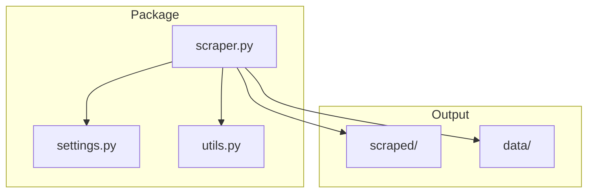
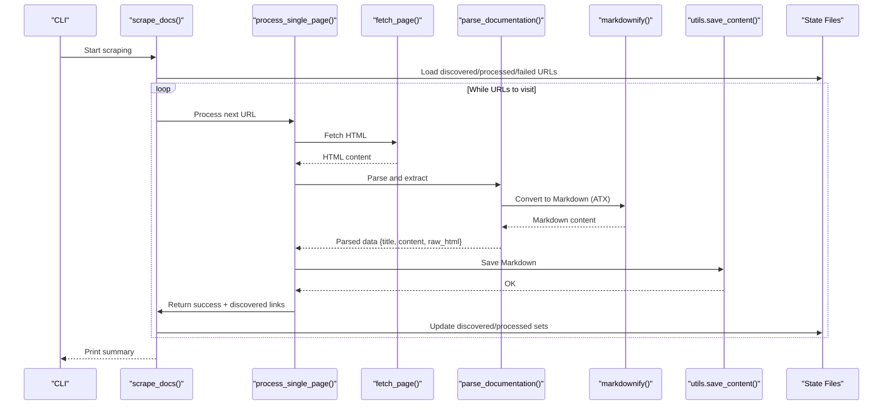
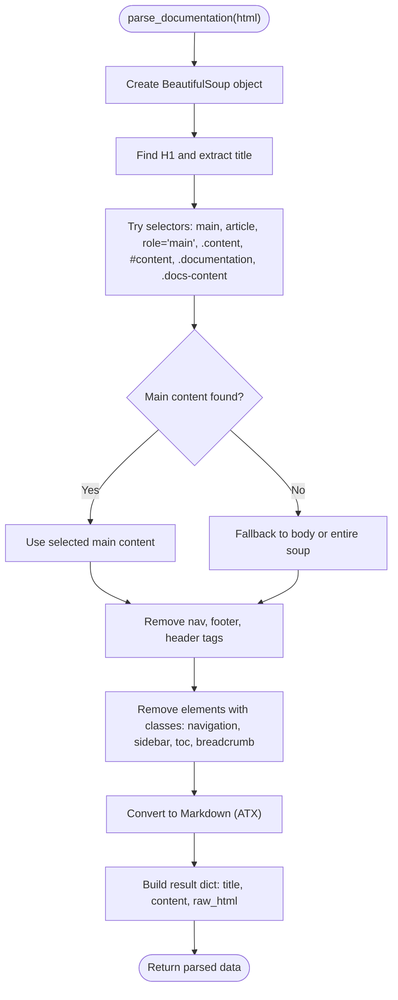
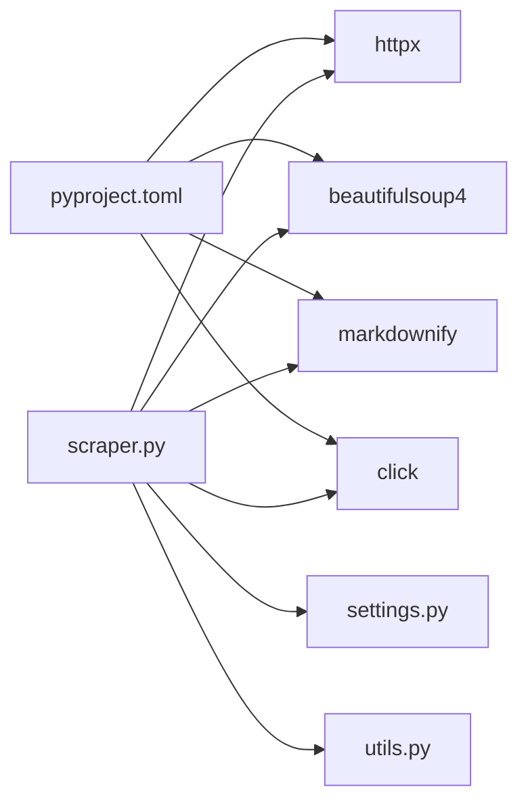

# Content Processing Pipeline

<cite>
**Referenced Files in This Document**
- [scraper.py](file://src/pico_doc_scraper/scraper.py)
- [settings.py](file://src/pico_doc_scraper/settings.py)
- [utils.py](file://src/pico_doc_scraper/utils.py)
- [README.md](file://README.md)
- [pyproject.toml](file://pyproject.toml)
- [Makefile](file://Makefile)
- [index.md](file://scraped/index.md)
- [button.md](file://scraped/button.md)
- [forms.md](file://scraped/forms.md)
- [v1_buttons.html.md](file://scraped/v1_buttons.html.md)
- [v1_forms.html.md](file://scraped/v1_forms.html.md)
</cite>

## Table of Contents
1. [Introduction](#introduction)
2. [Project Structure](#project-structure)
3. [Core Components](#core-components)
4. [Architecture Overview](#architecture-overview)
5. [Detailed Component Analysis](#detailed-component-analysis)
6. [Dependency Analysis](#dependency-analysis)
7. [Performance Considerations](#performance-considerations)
8. [Troubleshooting Guide](#troubleshooting-guide)
9. [Conclusion](#conclusion)

## Introduction
This document explains the content processing pipeline that transforms HTML documentation into structured Markdown format. The pipeline centers around the `parse_documentation()` function, which orchestrates HTML parsing with BeautifulSoup, content selection and cleanup, and conversion to Markdown using the markdownify library. It also covers content filtering strategies, formatting consistency, and adaptation to varying documentation site layouts.

## Project Structure
The project is organized as a Python package with a clear separation of concerns:
- `src/pico_doc_scraper/`: Core scraping and processing logic
  - `scraper.py`: Main scraping workflow, HTTP fetching, parsing, and saving
  - `settings.py`: Configuration constants and paths
  - `utils.py`: Utility functions for file I/O, sanitization, and state persistence
- `scraped/`: Output directory for generated Markdown files
- `data/`: State tracking files for discovered, processed, and failed URLs
- Top-level configuration and development scripts

**Diagram sources**
- [scraper.py](file://src/pico_doc_scraper/scraper.py#L1-L391)
- [settings.py](file://src/pico_doc_scraper/settings.py#L1-L33)
- [utils.py](file://src/pico_doc_scraper/utils.py#L1-L175)

**Section sources**
- [README.md](file://README.md#L119-L134)
- [Makefile](file://Makefile#L1-L126)

## Core Components
- HTTP fetching with retry logic and user-agent header
- Link discovery with domain and path filtering
- HTML parsing and content extraction using BeautifulSoup
- Content filtering to remove navigation, footers, and sidebars
- Markdown conversion using markdownify with ATX heading style
- State persistence for resumable scraping and incremental updates

Key implementation references:
- Fetching and retry: [fetch_page](file://src/pico_doc_scraper/scraper.py#L24-L52)
- Link discovery: [discover_doc_links](file://src/pico_doc_scraper/scraper.py#L55-L85)
- Parsing and extraction: [parse_documentation](file://src/pico_doc_scraper/scraper.py#L88-L142)
- Saving content: [save_content](file://src/pico_doc_scraper/utils.py#L17-L48)
- State management: [load_or_initialize_state](file://src/pico_doc_scraper/scraper.py#L231-L284), [save_url_set](file://src/pico_doc_scraper/utils.py#L130-L141), [load_url_set](file://src/pico_doc_scraper/utils.py#L143-L158)

**Section sources**
- [scraper.py](file://src/pico_doc_scraper/scraper.py#L24-L142)
- [utils.py](file://src/pico_doc_scraper/utils.py#L17-L158)
- [settings.py](file://src/pico_doc_scraper/settings.py#L1-L33)

## Architecture Overview
The pipeline follows a stateful, resumable workflow:
1. Initialize or resume state from disk
2. For each URL:
   - Fetch HTML with retry logic
   - Parse and extract content
   - Convert to Markdown
   - Save output and update state
   - Discover new links and enqueue them

**Diagram sources**
- [scraper.py](file://src/pico_doc_scraper/scraper.py#L287-L359)
- [scraper.py](file://src/pico_doc_scraper/scraper.py#L145-L194)
- [scraper.py](file://src/pico_doc_scraper/scraper.py#L88-L142)
- [utils.py](file://src/pico_doc_scraper/utils.py#L17-L48)

## Detailed Component Analysis

### HTML Parsing Workflow with BeautifulSoup
The `parse_documentation()` function performs the following steps:
- Parse HTML with BeautifulSoup
- Extract title from the first H1 tag
- Identify the main content area using a prioritized selector list targeting common documentation containers
- Fallback to body or entire document if no main content is found
- Remove non-documentation elements (navigation, footer, header) and common navigation classes
- Convert remaining content to Markdown using markdownify with ATX heading style

**Diagram sources**
- [scraper.py](file://src/pico_doc_scraper/scraper.py#L88-L142)

**Section sources**
- [scraper.py](file://src/pico_doc_scraper/scraper.py#L88-L142)

### Content Extraction Process
- Title extraction: The function locates the first H1 element and uses its text as the document title, falling back to a default if none is present.
- Main content identification: A prioritized list of selectors is tested against the parsed HTML. The first successful match becomes the main content area. If none match, the parser falls back to the body element or the entire document.
- Cleanup of navigation elements: The function removes structural tags and classes commonly associated with navigation, sidebars, and breadcrumbs to preserve only the primary content.

Examples of content selectors used for different documentation site structures:
- Semantic roles: `[role='main']`
- Structural containers: `main`, `article`
- Common class names: `.content`, `#content`, `.documentation`, `.docs-content`

Adaptation to site layout changes:
- The selector list is intentionally broad and ordered to handle various layouts. If a new site introduces a different container class, adding it earlier in the list ensures priority.
- The fallback mechanism ensures robustness when no selectors match.

**Section sources**
- [scraper.py](file://src/pico_doc_scraper/scraper.py#L99-L124)

### Markdown Conversion with markdownify
- Conversion style: The pipeline uses ATX-style headings for Markdown output, which produces level-specific hashes (e.g., # Heading, ## Subheading).
- Content sanitization: The conversion preserves semantic HTML tags and attributes supported by markdownify, while removing structural noise introduced by navigation and sidebars.

Consistency considerations:
- ATX headings provide predictable Markdown formatting across documents.
- The pipeline saves only the converted Markdown content, not the original HTML, ensuring a clean output format.

**Section sources**
- [scraper.py](file://src/pico_doc_scraper/scraper.py#L134-L142)

### Content Filtering Mechanisms
The pipeline removes non-documentation elements to improve signal-to-noise ratio:
- Structural tags: `nav`, `footer`, `header`
- Common navigation classes: `navigation`, `sidebar`, `toc`, `breadcrumb`

These filters prevent navigation menus, sidebars, and footers from appearing in the final Markdown output, focusing on the primary content area.

**Section sources**
- [scraper.py](file://src/pico_doc_scraper/scraper.py#L125-L132)

### Content Preservation Strategies and Edge Cases
- Title preservation: The first H1 is treated as the canonical title, ensuring each Markdown file starts with a meaningful heading.
- Fallback behavior: If no main content container is detected, the parser uses the body or entire document, preventing total failure on unexpected layouts.
- Filename sanitization: Output filenames are sanitized to avoid invalid characters and length limits, ensuring reliable filesystem writes.
- Incremental state persistence: The pipeline saves discovered and processed URLs incrementally, enabling graceful restarts and retries.

Edge cases handled:
- Missing H1: Falls back to a default title.
- No main content selectors: Uses body or entire document.
- Non-ASCII characters and special symbols: Handled by UTF-8 encoding in file writes.
- Interrupted runs: State files allow resuming from the last known position.

**Section sources**
- [scraper.py](file://src/pico_doc_scraper/scraper.py#L99-L124)
- [utils.py](file://src/pico_doc_scraper/utils.py#L50-L74)
- [utils.py](file://src/pico_doc_scraper/utils.py#L17-L48)

### Example Outputs
Sample Markdown outputs demonstrate the pipeline’s effectiveness:
- Index page: [index.md](file://scraped/index.md#L1-L76)
- Button component: [button.md](file://scraped/button.md#L1-L45)
- Forms overview: [forms.md](file://scraped/forms.md#L1-L31)
- Legacy version (HTML preserved): [v1_buttons.html.md](file://scraped/v1_buttons.html.md#L1-L21), [v1_forms.html.md](file://scraped/v1_forms.html.md#L1-L29)

These files illustrate:
- ATX heading usage
- Code blocks and inline markup
- Relative links preserved in Markdown
- Structured sections and subheadings

**Section sources**
- [index.md](file://scraped/index.md#L1-L76)
- [button.md](file://scraped/button.md#L1-L45)
- [forms.md](file://scraped/forms.md#L1-L31)
- [v1_buttons.html.md](file://scraped/v1_buttons.html.md#L1-L21)
- [v1_forms.html.md](file://scraped/v1_forms.html.md#L1-L29)

## Dependency Analysis
The pipeline relies on the following libraries and their roles:
- httpx: HTTP client with timeouts and redirects
- beautifulsoup4: HTML parsing and DOM traversal
- markdownify: HTML-to-Markdown conversion with configurable heading style
- click: CLI interface for scraping modes

**Diagram sources**
- [pyproject.toml](file://pyproject.toml#L9-L14)
- [scraper.py](file://src/pico_doc_scraper/scraper.py#L1-L21)

**Section sources**
- [pyproject.toml](file://pyproject.toml#L9-L14)
- [scraper.py](file://src/pico_doc_scraper/scraper.py#L1-L21)

## Performance Considerations
- Politeness: Requests are delayed between pages to avoid overloading the target server.
- Retry logic: Failed HTTP requests are retried with exponential backoff-like behavior.
- Incremental state: Saves discovered and processed URLs frequently to minimize work duplication.
- Selector prioritization: Efficiently identifies main content using targeted selectors before falling back.

[No sources needed since this section provides general guidance]

## Troubleshooting Guide
Common issues and resolutions:
- HTTP errors: The pipeline catches HTTP exceptions and continues scraping other URLs. Failed URLs are recorded for retry.
- Selector mismatches: If main content is not extracted, adjust the selector list in the parsing function to match the target site’s structure.
- Output encoding problems: Ensure UTF-8 encoding is used when writing files.
- State file corruption: Use the retry mode to re-process failed URLs without restarting from scratch.

Operational controls:
- Retry failed URLs: Use the retry flag or the dedicated Makefile target.
- Fresh start: Clear state files and restart scraping from the base URL.
- Resume mode: Automatically resumes from previously discovered and processed URLs.

**Section sources**
- [scraper.py](file://src/pico_doc_scraper/scraper.py#L195-L229)
- [scraper.py](file://src/pico_doc_scraper/scraper.py#L231-L284)
- [Makefile](file://Makefile#L119-L125)

## Conclusion
The content processing pipeline provides a robust, resumable solution for converting HTML documentation into Markdown. By combining BeautifulSoup-based parsing, targeted content selection, and markdownify conversion with ATX headings, it consistently produces clean, readable Markdown outputs. Its filtering mechanisms and fallback strategies adapt to diverse documentation site layouts, while state persistence enables reliable, incremental processing.