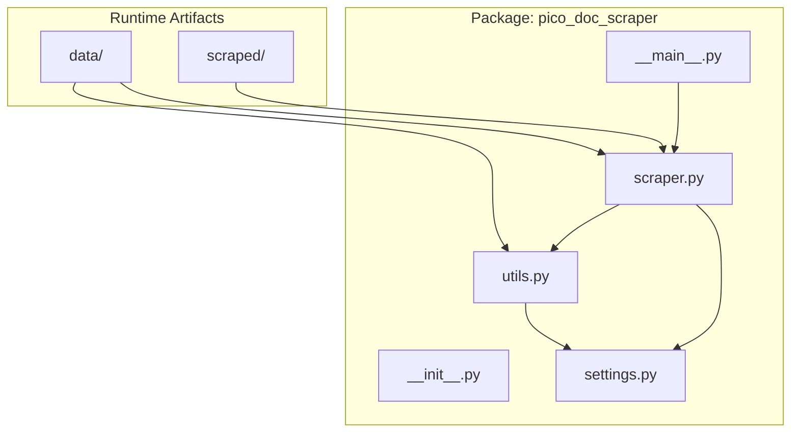
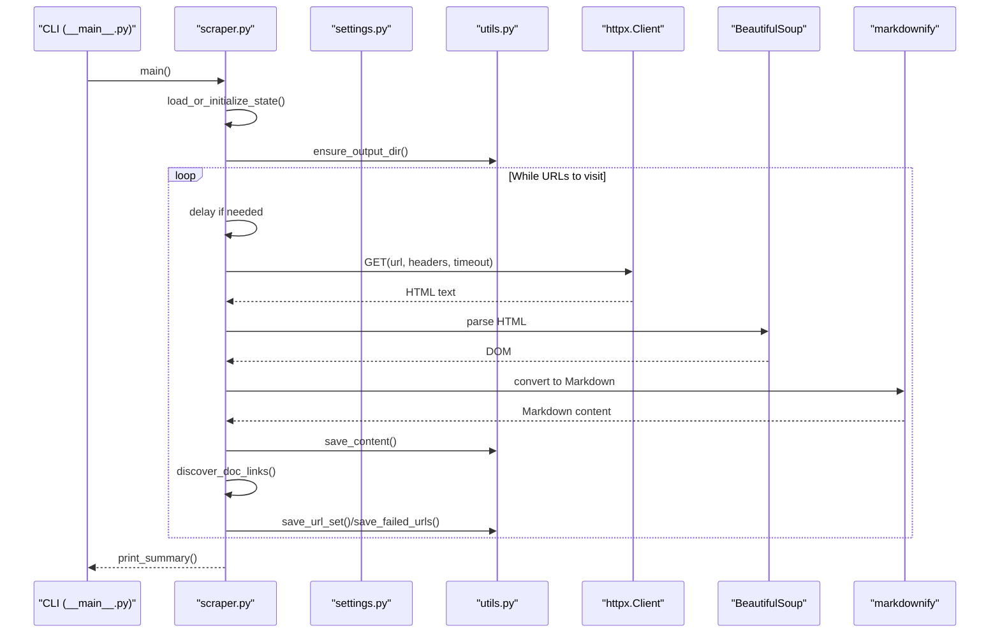
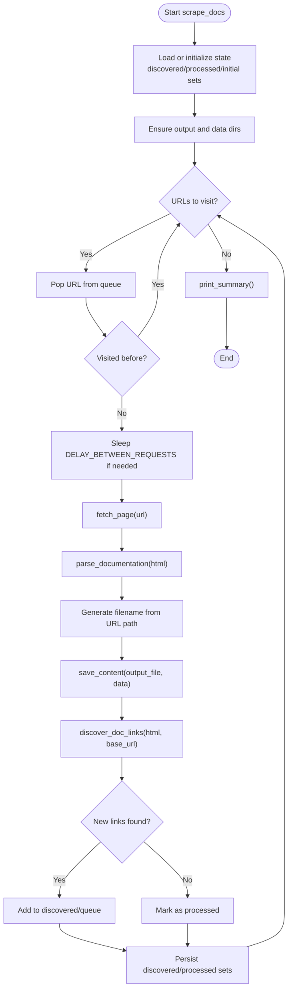
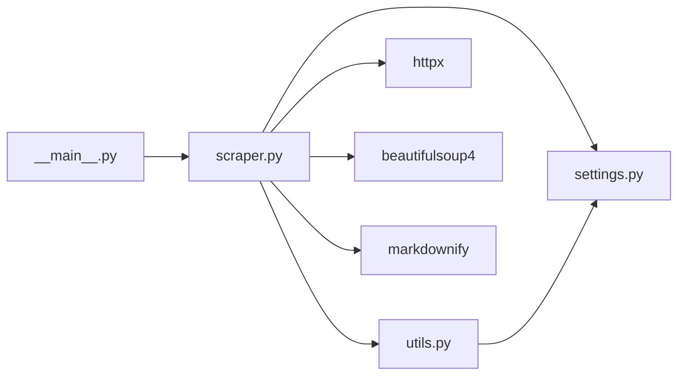
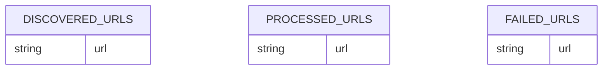

# Core Architecture

<cite>
**Referenced Files in This Document**
- [README.md](file://README.md)
- [pyproject.toml](file://pyproject.toml)
- [Makefile](file://Makefile)
- [src/pico_doc_scraper/__init__.py](file://src/pico_doc_scraper/__init__.py)
- [src/pico_doc_scraper/__main__.py](file://src/pico_doc_scraper/__main__.py)
- [src/pico_doc_scraper/scraper.py](file://src/pico_doc_scraper/scraper.py)
- [src/pico_doc_scraper/settings.py](file://src/pico_doc_scraper/settings.py)
- [src/pico_doc_scraper/utils.py](file://src/pico_doc_scraper/utils.py)
- [data/discovered_urls.txt](file://data/discovered_urls.txt)
- [data/processed_urls.txt](file://data/processed_urls.txt)
</cite>

## Table of Contents
1. [Introduction](#introduction)
2. [Project Structure](#project-structure)
3. [Core Components](#core-components)
4. [Architecture Overview](#architecture-overview)
5. [Detailed Component Analysis](#detailed-component-analysis)
6. [Dependency Analysis](#dependency-analysis)
7. [Performance Considerations](#performance-considerations)
8. [Troubleshooting Guide](#troubleshooting-guide)
9. [Conclusion](#conclusion)
10. [Appendices](#appendices)

## Introduction
This document describes the core architecture of the Pico CSS Documentation Scraper, a modular Python package designed to crawl and convert Pico.css documentation pages into Markdown. The system emphasizes resilience, state persistence, and clean separation of concerns across three primary modules: scraper.py (orchestration and processing), settings.py (configuration), and utils.py (utilities and state management). It integrates external libraries for HTTP requests, HTML parsing, and Markdown conversion, and implements patterns such as Strategy for content extraction, State for resume capability, and Factory for HTTP client creation.

## Project Structure
The project follows a clear package layout with a single module under src/pico_doc_scraper. The package exposes an entry point via python -m pico_doc_scraper and supports Makefile-driven workflows for scraping, retry, and fresh runs.



**Diagram sources**
- [src/pico_doc_scraper/__main__.py](file://src/pico_doc_scraper/__main__.py#L1-L7)
- [src/pico_doc_scraper/scraper.py](file://src/pico_doc_scraper/scraper.py#L1-L391)
- [src/pico_doc_scraper/settings.py](file://src/pico_doc_scraper/settings.py#L1-L33)
- [src/pico_doc_scraper/utils.py](file://src/pico_doc_scraper/utils.py#L1-L175)

**Section sources**
- [README.md](file://README.md#L119-L134)
- [pyproject.toml](file://pyproject.toml#L1-L75)
- [Makefile](file://Makefile#L1-L126)

## Core Components
- scraper.py: Implements the main scraping workflow, including fetching pages, discovering links, parsing content, and orchestrating state updates. It defines the Strategy for content extraction and coordinates the State machine for resume capability.
- settings.py: Centralized configuration for base URLs, output directories, state tracking files, HTTP client settings, user agent, politeness delays, and output format.
- utils.py: Provides utilities for output directory creation, content saving in multiple formats, URL persistence, failed URL tracking, sanitization, and state file clearing.

Key responsibilities:
- scraper.py: HTTP orchestration, HTML parsing, Markdown conversion, URL discovery, and stateful iteration.
- settings.py: Immutable configuration constants and derived paths.
- utils.py: Cross-cutting utilities for IO, persistence, and cleanup.

**Section sources**
- [src/pico_doc_scraper/scraper.py](file://src/pico_doc_scraper/scraper.py#L24-L391)
- [src/pico_doc_scraper/settings.py](file://src/pico_doc_scraper/settings.py#L1-L33)
- [src/pico_doc_scraper/utils.py](file://src/pico_doc_scraper/utils.py#L1-L175)

## Architecture Overview
The system is a pipeline that transforms URLs into Markdown documents. It uses a breadth-first traversal with state persistence to support resumable scraping.



**Diagram sources**
- [src/pico_doc_scraper/__main__.py](file://src/pico_doc_scraper/__main__.py#L1-L7)
- [src/pico_doc_scraper/scraper.py](file://src/pico_doc_scraper/scraper.py#L24-L391)
- [src/pico_doc_scraper/settings.py](file://src/pico_doc_scraper/settings.py#L1-L33)
- [src/pico_doc_scraper/utils.py](file://src/pico_doc_scraper/utils.py#L1-L175)

## Detailed Component Analysis

### Module: scraper.py
Responsibilities:
- HTTP fetching with retry logic and timeouts.
- URL discovery with domain restriction and path filtering.
- Content extraction using a Strategy-like approach (selector-based content area selection).
- Markdown conversion and output formatting.
- Stateful orchestration for resume and retry modes.

Architectural patterns:
- Strategy pattern for content extraction: The parser tries multiple selectors to locate the main content area, then removes non-content elements before conversion.
- State pattern for resume capability: The system tracks discovered, processed, and failed URLs to resume or retry.
- Factory pattern for HTTP client creation: A new httpx.Client is created per request with configured timeout and headers.

Processing logic:
- fetch_page: Creates an httpx.Client with timeout, sends a GET request with headers, follows redirects, and retries on failure.
- discover_doc_links: Parses HTML, resolves relative links, filters by allowed domain and /docs path, excludes binary-like extensions, and deduplicates.
- parse_documentation: Selects main content area, strips navigation and TOC elements, converts to Markdown with ATX headings.
- process_single_page: Orchestrates fetch, parse, filename generation, save, and link discovery.
- scrape_docs: Manages state, queue, delays, and incremental persistence.
- load_or_initialize_state: Handles force-fresh, resume, and retry modes with state file loading and initialization.



**Diagram sources**
- [src/pico_doc_scraper/scraper.py](file://src/pico_doc_scraper/scraper.py#L287-L359)

**Section sources**
- [src/pico_doc_scraper/scraper.py](file://src/pico_doc_scraper/scraper.py#L24-L391)

### Module: settings.py
Responsibilities:
- Define base URLs, allowed domain, output directories, and state tracking files.
- Configure HTTP client settings (timeout, retries, delay).
- Set user agent and politeness delay.
- Define output format.

Design decisions:
- Centralized configuration improves maintainability and testability.
- Paths are derived from the project root for portability.
- Constants are immutable and used across modules.

**Section sources**
- [src/pico_doc_scraper/settings.py](file://src/pico_doc_scraper/settings.py#L1-L33)

### Module: utils.py
Responsibilities:
- Ensure output directories exist.
- Save content in multiple formats (JSON, Markdown, HTML).
- Sanitize filenames to avoid OS issues.
- Persist and load URL sets and failed URLs.
- Clear state files when requested.

Patterns and utilities:
- Save functions branch on file extension to support multiple output formats.
- URL persistence uses sorted sets to ensure deterministic ordering and de-duplication.
- Failed URLs are tracked for easy retry.

**Section sources**
- [src/pico_doc_scraper/utils.py](file://src/pico_doc_scraper/utils.py#L1-L175)

### Module: __main__.py
Responsibilities:
- Provides the command-line entry point for running the scraper as a module.
- Delegates to the main function in scraper.py.

**Section sources**
- [src/pico_doc_scraper/__main__.py](file://src/pico_doc_scraper/__main__.py#L1-L7)

### Module: __init__.py
Responsibilities:
- Package metadata and version.

**Section sources**
- [src/pico_doc_scraper/__init__.py](file://src/pico_doc_scraper/__init__.py#L1-L4)

## Dependency Analysis
External library integrations:
- httpx: HTTP client with timeouts and automatic redirect following; used for fetching pages with retry logic.
- beautifulsoup4: HTML parsing and DOM manipulation for content extraction and cleanup.
- markdownify: Conversion of HTML fragments to Markdown with ATX-style headings.
- click: CLI argument parsing for retry and force-fresh options.

Internal dependencies:
- scraper.py depends on settings.py for configuration and utils.py for IO and state management.
- utils.py depends on settings.py indirectly via state file paths.



**Diagram sources**
- [src/pico_doc_scraper/scraper.py](file://src/pico_doc_scraper/scraper.py#L1-L21)
- [src/pico_doc_scraper/utils.py](file://src/pico_doc_scraper/utils.py#L1-L175)
- [src/pico_doc_scraper/__main__.py](file://src/pico_doc_scraper/__main__.py#L1-L7)

**Section sources**
- [pyproject.toml](file://pyproject.toml#L9-L14)
- [src/pico_doc_scraper/scraper.py](file://src/pico_doc_scraper/scraper.py#L1-L21)
- [src/pico_doc_scraper/utils.py](file://src/pico_doc_scraper/utils.py#L1-L175)

## Performance Considerations
- Politeness: A configurable delay between requests reduces server load and avoids rate limiting.
- Retry logic: Fixed attempts with a short delay improve resilience against transient network issues.
- Incremental persistence: State files are updated after each URL, enabling quick recovery and minimizing wasted work.
- Selector-based extraction: Multiple candidate selectors reduce brittle parsing and improve robustness.
- Output format choice: Markdown output is compact and suitable for documentation consumption.

Scalability considerations:
- Current breadth-first traversal with a set-based queue scales with the number of discovered URLs.
- Network I/O dominates performance; CPU usage is modest due to parsing and conversion.
- Future enhancements could include concurrency with bounded workers and caching of fetched HTML.

[No sources needed since this section provides general guidance]

## Troubleshooting Guide
Common issues and remedies:
- HTTP errors: The system retries up to a configured number of times with delays. Review logs for repeated failures and consider increasing retries or delays.
- Domain restriction failures: Ensure ALLOWED_DOMAIN matches the target host and that URLs are within the /docs path.
- State file corruption: Use force-fresh mode to clear state files and restart. State files are stored in data/.
- Output directory permissions: Ensure the user has write permissions to the scraped/ directory.
- Interrupted runs: The scraper saves state incrementally; re-run to resume automatically.

Operational controls:
- Retry failed URLs: Use the retry flag or scrape-retry target to process only failed URLs.
- Fresh start: Use force-fresh to clear state and begin anew.
- Verbose logs: The scraper prints progress and errors during execution.

**Section sources**
- [src/pico_doc_scraper/scraper.py](file://src/pico_doc_scraper/scraper.py#L287-L359)
- [src/pico_doc_scraper/utils.py](file://src/pico_doc_scraper/utils.py#L161-L175)
- [Makefile](file://Makefile#L115-L126)

## Conclusion
The Pico CSS Documentation Scraper is a well-structured, resilient system that separates concerns across three modules while integrating modern Python libraries for HTTP, parsing, and conversion. Its design supports stateful, resumable scraping with retry logic, domain restriction, and clean output formatting. The Strategy pattern enables robust content extraction, the State pattern ensures continuity across runs, and the Factory pattern encapsulates HTTP client creation. Together, these patterns and utilities deliver a scalable and maintainable solution for converting documentation to Markdown.

[No sources needed since this section summarizes without analyzing specific files]

## Appendices

### System Context Diagram
```mermaid
graph TB
subgraph "External"
SITE["picocss.com/docs"]
end
subgraph "Local"
SCRAPER["scraper.py"]
SETTINGS["settings.py"]
UTILS["utils.py"]
DATA["data/ (state files)"]
OUTPUT["scraped/ (Markdown)"]
end
SITE <- --> SCRAPER
SETTINGS --> SCRAPER
UTILS --> SCRAPER
DATA <- --> UTILS
OUTPUT <- --> SCRAPER
```

**Diagram sources**
- [src/pico_doc_scraper/scraper.py](file://src/pico_doc_scraper/scraper.py#L1-L391)
- [src/pico_doc_scraper/settings.py](file://src/pico_doc_scraper/settings.py#L1-L33)
- [src/pico_doc_scraper/utils.py](file://src/pico_doc_scraper/utils.py#L1-L175)
- [data/discovered_urls.txt](file://data/discovered_urls.txt#L1-L81)
- [data/processed_urls.txt](file://data/processed_urls.txt#L1-L81)

### Data Model: State Files


**Diagram sources**
- [data/discovered_urls.txt](file://data/discovered_urls.txt#L1-L81)
- [data/processed_urls.txt](file://data/processed_urls.txt#L1-L81)