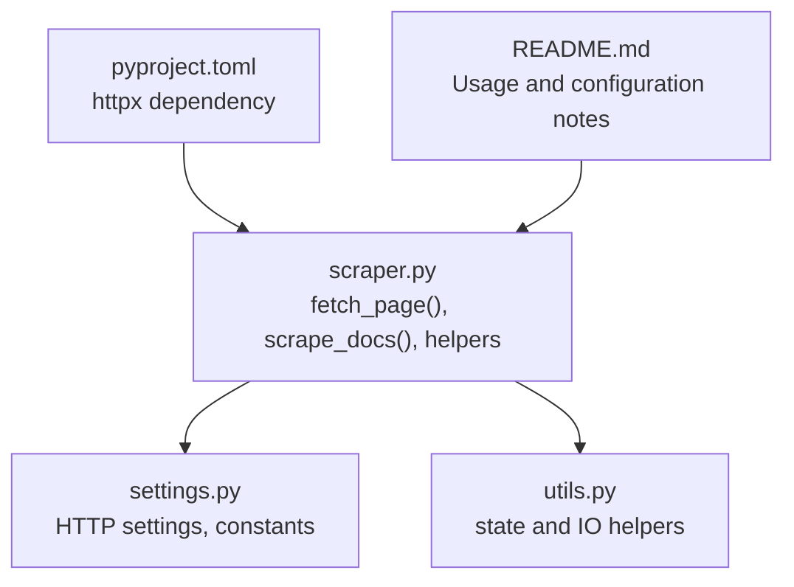
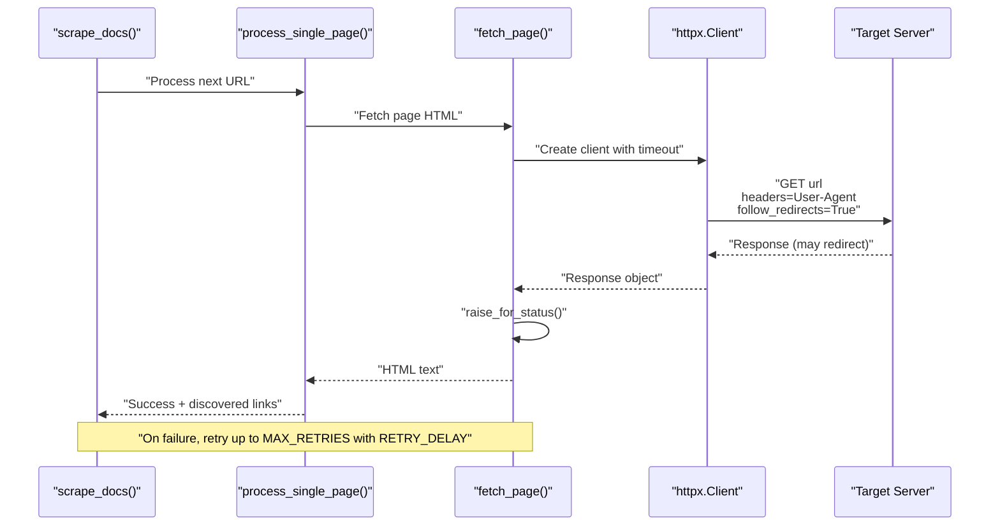
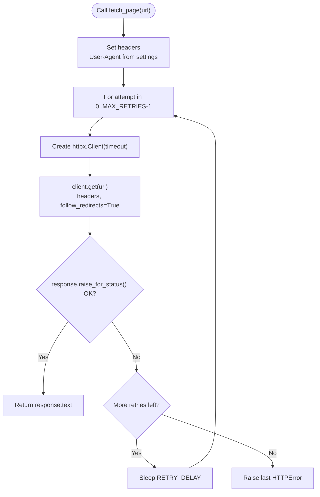
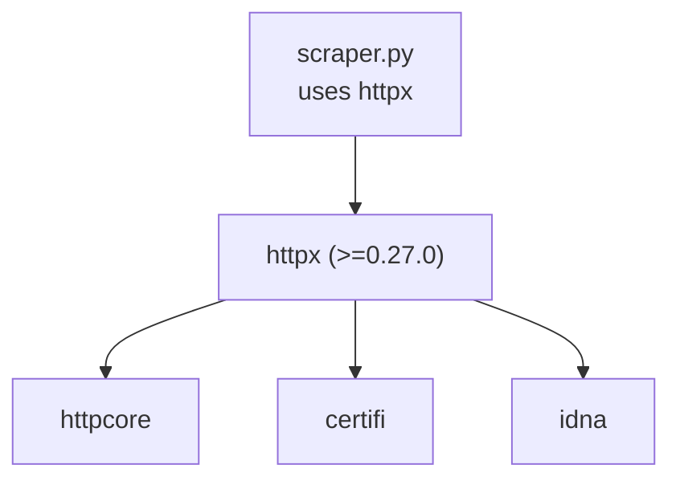

# HTTP Client and Networking Layer

<cite>
**Referenced Files in This Document**
- [scraper.py](file://src/pico_doc_scraper/scraper.py)
- [settings.py](file://src/pico_doc_scraper/settings.py)
- [utils.py](file://src/pico_doc_scraper/utils.py)
- [README.md](file://README.md)
- [pyproject.toml](file://pyproject.toml)
</cite>

## Table of Contents
1. [Introduction](#introduction)
2. [Project Structure](#project-structure)
3. [Core Components](#core-components)
4. [Architecture Overview](#architecture-overview)
5. [Detailed Component Analysis](#detailed-component-analysis)
6. [Dependency Analysis](#dependency-analysis)
7. [Performance Considerations](#performance-considerations)
8. [Troubleshooting Guide](#troubleshooting-guide)
9. [Conclusion](#conclusion)
10. [Appendices](#appendices)

## Introduction
This document explains the HTTP client and networking layer used by the scraper. It focuses on the fetch_page() function, detailing how the HTTP client is configured with httpx, how timeouts and retries are handled, and how redirects and user-agent headers are managed. It also covers customization options, security and ethical considerations, and practical troubleshooting tips.

## Project Structure
The networking logic is encapsulated in the scraper module, with configuration centralized in settings and auxiliary utilities in utils. The CLI entry point delegates to the main scraping workflow.

**Diagram sources**
- [scraper.py](file://src/pico_doc_scraper/scraper.py#L24-L52)
- [settings.py](file://src/pico_doc_scraper/settings.py#L19-L32)
- [utils.py](file://src/pico_doc_scraper/utils.py#L1-L175)
- [pyproject.toml](file://pyproject.toml#L9-L14)
- [README.md](file://README.md#L101-L118)

**Section sources**
- [scraper.py](file://src/pico_doc_scraper/scraper.py#L1-L391)
- [settings.py](file://src/pico_doc_scraper/settings.py#L1-L33)
- [utils.py](file://src/pico_doc_scraper/utils.py#L1-L175)
- [README.md](file://README.md#L101-L118)
- [pyproject.toml](file://pyproject.toml#L9-L14)

## Core Components
- fetch_page(): Implements HTTP fetching with retry logic, timeout handling, and redirect following. It constructs an httpx.Client with a per-request timeout, sets a user-agent header, and follows redirects automatically.
- Settings: Centralized configuration for REQUEST_TIMEOUT, MAX_RETRIES, RETRY_DELAY, USER_AGENT, and other scraping behavior.
- Utilities: Support for saving/loading state and failed URLs, ensuring output directories, and sanitizing filenames.

Key behaviors:
- HTTP client lifecycle: A new httpx.Client is created per request and closed immediately after use.
- Timeout: Applied per request via the timeout parameter.
- Redirects: Enabled via follow_redirects.
- Retries: Implemented with a linear backoff using RETRY_DELAY between attempts.
- User-Agent: Set from settings.USER_AGENT.

**Section sources**
- [scraper.py](file://src/pico_doc_scraper/scraper.py#L24-L52)
- [settings.py](file://src/pico_doc_scraper/settings.py#L19-L32)
- [utils.py](file://src/pico_doc_scraper/utils.py#L92-L128)

## Architecture Overview
The HTTP client and retry flow is embedded in the main scraping pipeline. The fetch_page() function is invoked for each URL during the crawl, and the surrounding workflow applies a polite delay between requests.

**Diagram sources**
- [scraper.py](file://src/pico_doc_scraper/scraper.py#L24-L52)
- [scraper.py](file://src/pico_doc_scraper/scraper.py#L145-L194)
- [scraper.py](file://src/pico_doc_scraper/scraper.py#L287-L359)
- [settings.py](file://src/pico_doc_scraper/settings.py#L19-L32)

## Detailed Component Analysis

### fetch_page() Function
Purpose:
- Retrieve HTML content for a given URL with robust error handling and retry logic.

Implementation highlights:
- Header configuration: Sets a custom User-Agent header from settings.
- Client creation: Uses httpx.Client with a per-call timeout derived from settings.
- Redirect handling: Enables automatic redirect following.
- Status checking: Calls raise_for_status() to convert HTTP errors into exceptions.
- Retry loop: Attempts up to MAX_RETRIES times, sleeping RETRY_DELAY seconds between attempts.
- Error propagation: Re-raises the last exception after exhausting retries.

**Diagram sources**
- [scraper.py](file://src/pico_doc_scraper/scraper.py#L24-L52)
- [settings.py](file://src/pico_doc_scraper/settings.py#L19-L32)

**Section sources**
- [scraper.py](file://src/pico_doc_scraper/scraper.py#L24-L52)
- [settings.py](file://src/pico_doc_scraper/settings.py#L19-L32)

### HTTP Client Creation and Behavior
- Library: httpx is used for modern HTTP client capabilities.
- Per-request client: A new httpx.Client is created for each fetch_page() call and closed immediately after use.
- Timeout: Applied per request via the timeout parameter passed to httpx.Client.
- Redirects: Automatic redirect following is enabled.
- User-Agent: Provided via headers to identify the scraper.

Notes on connection pooling:
- The current implementation creates a new client per request and does not reuse connections. This keeps memory footprint small and avoids long-lived connection overhead, which is suitable for a batch-style scraper.

**Section sources**
- [scraper.py](file://src/pico_doc_scraper/scraper.py#L40-L42)
- [settings.py](file://src/pico_doc_scraper/settings.py#L19-L32)
- [pyproject.toml](file://pyproject.toml#L9-L14)

### Retry Logic and Backoff
- Attempts: Up to MAX_RETRIES attempts are performed.
- Delay: Linear backoff using RETRY_DELAY seconds between attempts.
- Scope: Catches httpx.HTTPError and re-raises after the final attempt.
- Logging: Prints a message indicating the current attempt number and the underlying error.

Recommendations:
- For production or high-availability targets, consider implementing exponential backoff to reduce server load and improve success rates under transient failures.

**Section sources**
- [scraper.py](file://src/pico_doc_scraper/scraper.py#L38-L49)
- [settings.py](file://src/pico_doc_scraper/settings.py#L20-L22)

### Timeout Configuration
- Value: REQUEST_TIMEOUT seconds per request.
- Impact: Controls how long the client waits for a response before raising a timeout exception. Shorter timeouts increase responsiveness to network issues but risk premature failures; longer timeouts improve resilience at the cost of slower failure detection.

Guidance:
- Adjust REQUEST_TIMEOUT based on network conditions and target server latency. For slow networks or unreliable targets, consider increasing the value moderately.

**Section sources**
- [settings.py](file://src/pico_doc_scraper/settings.py#L20)

### Redirect Handling
- Enabled: follow_redirects=True ensures that 3xx responses are followed automatically.
- Implications: Simplifies URL normalization and avoids manual redirect handling, but may increase total transfer time if many redirects occur.

**Section sources**
- [scraper.py](file://src/pico_doc_scraper/scraper.py#L41)

### User Agent Configuration
- Provided: A custom User-Agent header is attached to each request.
- Purpose: Identifies the scraper to the server, aiding maintainers and compliance with good scraping practices.

**Section sources**
- [scraper.py](file://src/pico_doc_scraper/scraper.py#L36)
- [settings.py](file://src/pico_doc_scraper/settings.py#L24-L25)

### Error Handling Strategies
- HTTP errors: Converted to exceptions via raise_for_status(); caught by fetch_page() and retried according to policy.
- Network failures: Transient network errors trigger retries until exhausted.
- Non-retriable errors: After MAX_RETRIES, the exception is re-raised and handled upstream (e.g., logged and recorded as failed).

**Section sources**
- [scraper.py](file://src/pico_doc_scraper/scraper.py#L42-L49)
- [scraper.py](file://src/pico_doc_scraper/scraper.py#L187-L193)

### Customizing HTTP Behavior
- Timeout: Modify REQUEST_TIMEOUT in settings to adjust per-request limits.
- Retries: Change MAX_RETRIES and RETRY_DELAY to tune resilience and pacing.
- Redirects: Keep follow_redirects=True for simplicity; disabling may be considered if redirect loops are suspected.
- User-Agent: Update USER_AGENT to reflect branding or internal tracking needs.
- Authentication: The current implementation does not attach credentials. To support protected resources, add appropriate headers or credentials to the httpx.Client call.

Note: The current implementation does not configure proxies, SSL verification overrides, or advanced httpx features. Extending the client initialization would enable these capabilities.

**Section sources**
- [settings.py](file://src/pico_doc_scraper/settings.py#L19-L32)
- [scraper.py](file://src/pico_doc_scraper/scraper.py#L36-L42)

## Dependency Analysis
The HTTP client relies on httpx, which in turn depends on httpcore and related libraries. The scraper module imports httpx and uses it directly.

**Diagram sources**
- [pyproject.toml](file://pyproject.toml#L9-L14)
- [uv.lock](file://uv.lock#L142-L167)

**Section sources**
- [pyproject.toml](file://pyproject.toml#L9-L14)
- [uv.lock](file://uv.lock#L142-L167)

## Performance Considerations
- Per-request client lifecycle: Creating a new httpx.Client per request avoids connection reuse and reduces memory overhead. This suits a batch-like scraper but does not leverage persistent connections.
- Timeout tuning: REQUEST_TIMEOUT should balance responsiveness and reliability. Too short risks premature failures; too long delays failure feedback.
- Retry backoff: Current linear backoff is simple and predictable. Exponential backoff can reduce server load and improve throughput under contention.
- Politeness: DELAY_BETWEEN_REQUESTS adds a pause between requests to avoid overloading the server. Increasing this value reduces bandwidth pressure but increases total runtime.
- Redirects: Automatic redirect following simplifies logic but may increase latency and bandwidth usage.

[No sources needed since this section provides general guidance]

## Troubleshooting Guide
Common issues and remedies:
- Timeouts: Increase REQUEST_TIMEOUT if requests frequently fail due to slow responses.
- Frequent retries: Verify network stability and consider reducing MAX_RETRIES or increasing RETRY_DELAY to avoid repeated bursts.
- Redirect loops: Temporarily disable follow_redirects to investigate; re-enable once resolved.
- Authentication-required pages: Add credentials or headers to the httpx.Client call; ensure proper session handling if needed.
- Rate limiting: Observe server-side throttling and increase DELAY_BETWEEN_REQUESTS accordingly.
- SSL/TLS errors: Confirm certificate chain and system trust store; avoid disabling SSL verification in production.
- Proxy connectivity: Configure proxy settings in httpx.Client if behind a corporate firewall.

Operational tips:
- Inspect failed URLs saved to data/failed_urls.txt and retry selectively using the retry mode.
- Monitor logs for attempt counts and error messages to diagnose recurring failures.

**Section sources**
- [utils.py](file://src/pico_doc_scraper/utils.py#L92-L128)
- [settings.py](file://src/pico_doc_scraper/settings.py#L28-L29)
- [README.md](file://README.md#L35-L53)

## Conclusion
The HTTP client and networking layer are intentionally simple and robust: a per-request httpx.Client with a configurable timeout, automatic redirect handling, and a straightforward retry loop with linear backoff. This design favors reliability and ease of maintenance for a documentation scraper. For advanced scenarios, extending the client initialization to support authentication, proxies, and exponential backoff can further improve resilience and performance.

[No sources needed since this section summarizes without analyzing specific files]

## Appendices

### Configuration Reference
- REQUEST_TIMEOUT: Per-request timeout in seconds.
- MAX_RETRIES: Maximum number of retry attempts.
- RETRY_DELAY: Seconds to sleep between retries.
- USER_AGENT: Header value sent with each request.
- DELAY_BETWEEN_REQUESTS: Seconds to sleep between page fetches in the main loop.

**Section sources**
- [settings.py](file://src/pico_doc_scraper/settings.py#L19-L32)
- [README.md](file://README.md#L101-L118)