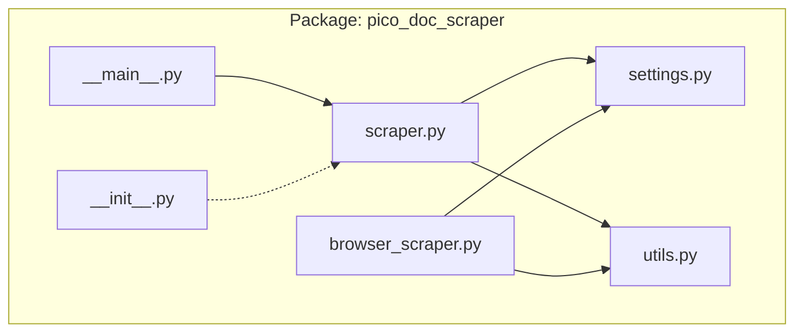
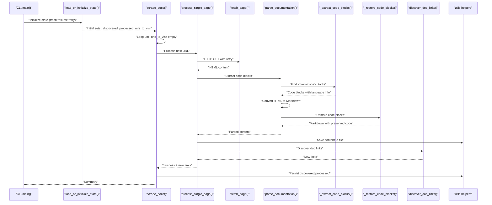
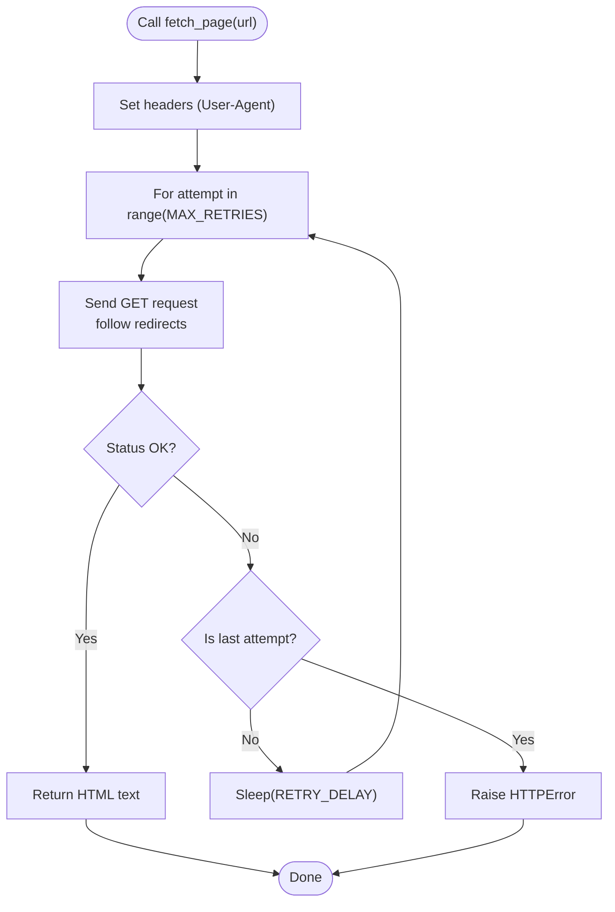
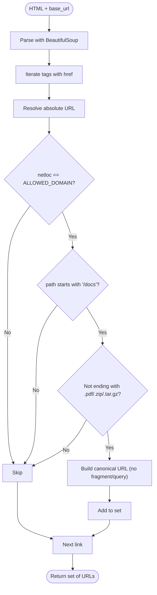
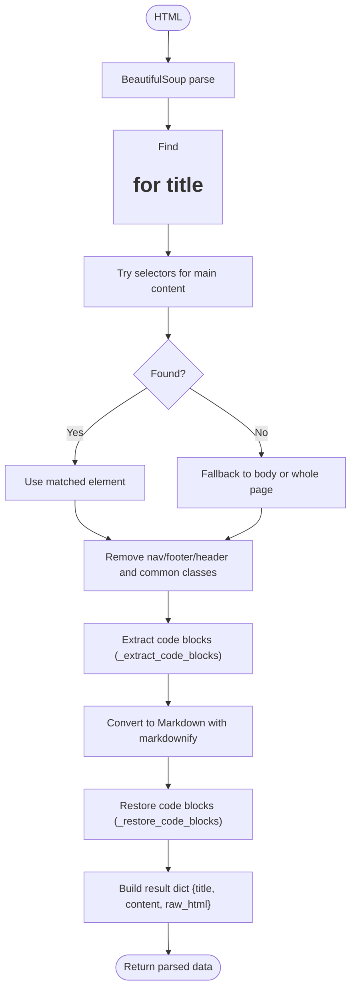
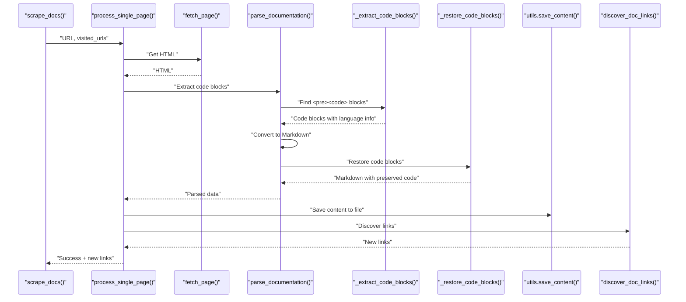
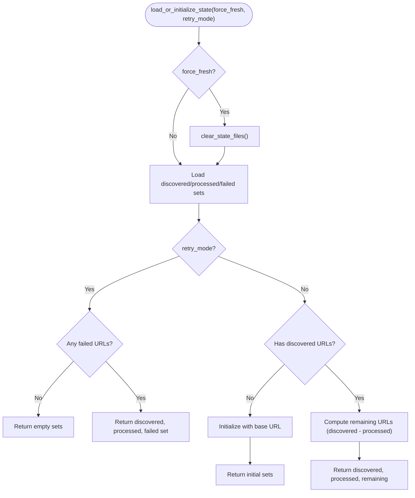
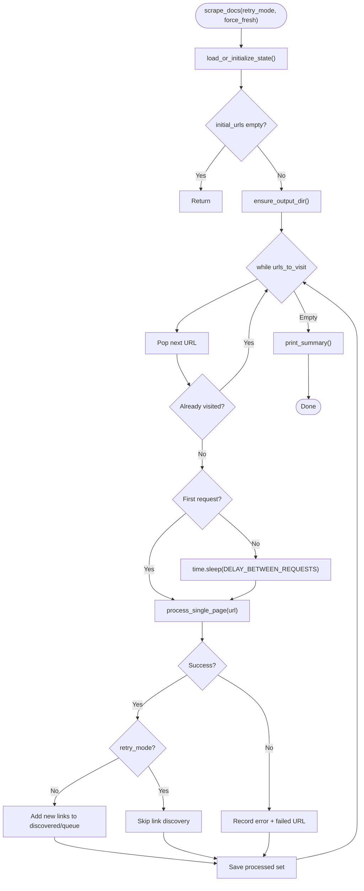
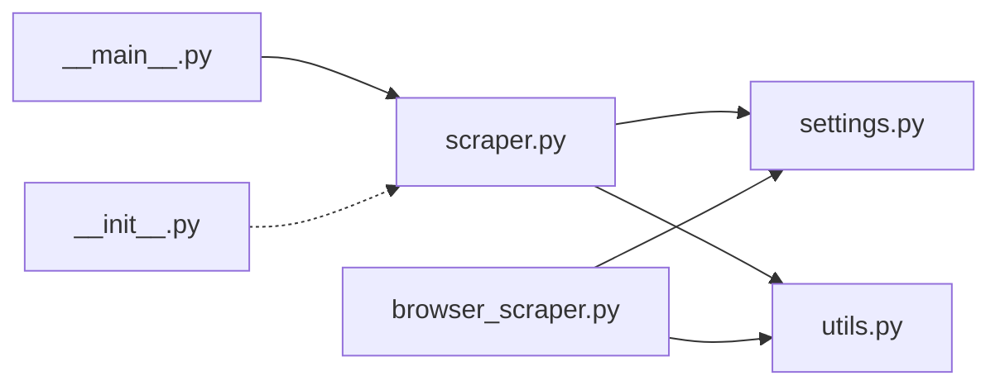

# Scraping Engine

<cite>
**Referenced Files in This Document**
- [README.md](file://README.md)
- [Makefile](file://Makefile)
- [pyproject.toml](file://pyproject.toml)
- [src/pico_doc_scraper/__init__.py](file://src/pico_doc_scraper/__init__.py)
- [src/pico_doc_scraper/__main__.py](file://src/pico_doc_scraper/__main__.py)
- [src/pico_doc_scraper/scraper.py](file://src/pico_doc_scraper/scraper.py)
- [src/pico_doc_scraper/browser_scraper.py](file://src/pico_doc_scraper/browser_scraper.py)
- [src/pico_doc_scraper/settings.py](file://src/pico_doc_scraper/settings.py)
- [src/pico_doc_scraper/utils.py](file://src/pico_doc_scraper/utils.py)
</cite>

## Update Summary
**Changes Made**
- Enhanced content parsing section to document the new code preservation system
- Added detailed explanation of code extraction and restoration pipeline
- Updated architecture diagrams to show the new code preservation workflow
- Added practical examples of code preservation in action
- Updated troubleshooting guide to address code-related issues

## Table of Contents
1. [Introduction](#introduction)
2. [Project Structure](#project-structure)
3. [Core Components](#core-components)
4. [Architecture Overview](#architecture-overview)
5. [Detailed Component Analysis](#detailed-component-analysis)
6. [Dependency Analysis](#dependency-analysis)
7. [Performance Considerations](#performance-considerations)
8. [Troubleshooting Guide](#troubleshooting-guide)
9. [Conclusion](#conclusion)
10. [Appendices](#appendices)

## Introduction
This document explains the core scraping engine of the Pico CSS Documentation Scraper. It focuses on the main scraping workflow implemented by the scrape_docs() function, including URL discovery algorithms, HTTP request handling with retry logic, and domain restriction enforcement. It documents the state management system enabling resume capability via load_or_initialize_state(), and the URL processing pipeline orchestrated by process_single_page(). The engine now features an advanced code preservation system that maintains syntax highlighting and formatting during HTML-to-Markdown conversion through a sophisticated code extraction and restoration pipeline. Politeness measures such as configurable delays between requests and rate limiting strategies are covered, along with practical examples, error handling mechanisms, and performance optimization techniques. The integration with external libraries and state persistence across sessions are explained in detail.

## Project Structure
The scraping engine is organized around a small set of focused modules:
- Entry point and CLI orchestration
- Core scraping logic with enhanced code preservation
- Configuration and constants
- Utilities for file I/O, sanitization, and state persistence
- Optional browser-based scraper for JavaScript-rendered content

**Diagram sources**
- [src/pico_doc_scraper/__main__.py](file://src/pico_doc_scraper/__main__.py#L1-L7)
- [src/pico_doc_scraper/scraper.py](file://src/pico_doc_scraper/scraper.py#L1-L512)
- [src/pico_doc_scraper/browser_scraper.py](file://src/pico_doc_scraper/browser_scraper.py#L1-L254)
- [src/pico_doc_scraper/settings.py](file://src/pico_doc_scraper/settings.py#L1-L33)
- [src/pico_doc_scraper/utils.py](file://src/pico_doc_scraper/utils.py#L1-L175)
- [src/pico_doc_scraper/__init__.py](file://src/pico_doc_scraper/__init__.py#L1-L4)

**Section sources**
- [README.md](file://README.md#L176-L192)
- [pyproject.toml](file://pyproject.toml#L1-L78)

## Core Components
- HTTP fetching with retry logic: fetch_page()
- URL discovery with domain/path restrictions: discover_doc_links()
- Enhanced content parsing with code preservation: parse_documentation()
- Code extraction and restoration pipeline: _extract_code_blocks() and _restore_code_blocks()
- Single-page processing pipeline: process_single_page()
- State management and resume capability: load_or_initialize_state()
- Main scraping workflow: scrape_docs()
- CLI entry point: main()

Key responsibilities:
- Enforce domain restriction and path filtering to stay within the documentation site.
- Persist state incrementally to support resuming after interruptions.
- Convert HTML content to Markdown for human-readable documentation while preserving code formatting.
- Apply politeness delays and retry logic to handle transient network issues.
- Extract and restore code blocks to maintain syntax highlighting and formatting integrity.

**Section sources**
- [src/pico_doc_scraper/scraper.py](file://src/pico_doc_scraper/scraper.py#L25-L53)
- [src/pico_doc_scraper/scraper.py](file://src/pico_doc_scraper/scraper.py#L56-L86)
- [src/pico_doc_scraper/scraper.py](file://src/pico_doc_scraper/scraper.py#L89-L220)
- [src/pico_doc_scraper/scraper.py](file://src/pico_doc_scraper/scraper.py#L223-L277)
- [src/pico_doc_scraper/scraper.py](file://src/pico_doc_scraper/scraper.py#L314-L367)
- [src/pico_doc_scraper/scraper.py](file://src/pico_doc_scraper/scraper.py#L370-L442)

## Architecture Overview
The scraping engine follows a breadth-first-like traversal controlled by a queue of URLs to visit. It enforces domain and path constraints, applies retry logic on HTTP failures, and persists state to files for resilience. The enhanced architecture now includes a sophisticated code preservation pipeline that extracts code blocks before HTML-to-Markdown conversion and restores them afterward.

**Diagram sources**
- [src/pico_doc_scraper/scraper.py](file://src/pico_doc_scraper/scraper.py#L370-L442)
- [src/pico_doc_scraper/scraper.py](file://src/pico_doc_scraper/scraper.py#L89-L220)
- [src/pico_doc_scraper/utils.py](file://src/pico_doc_scraper/utils.py#L17-L175)

## Detailed Component Analysis

### HTTP Request Handling with Retry Logic
The fetch_page() function encapsulates HTTP fetching with:
- Configurable timeout and user-agent header
- Built-in retry loop with exponential backoff-like delay
- Graceful propagation of HTTP errors

**Diagram sources**
- [src/pico_doc_scraper/scraper.py](file://src/pico_doc_scraper/scraper.py#L25-L53)
- [src/pico_doc_scraper/settings.py](file://src/pico_doc_scraper/settings.py#L21-L23)

**Section sources**
- [src/pico_doc_scraper/scraper.py](file://src/pico_doc_scraper/scraper.py#L25-L53)
- [src/pico_doc_scraper/settings.py](file://src/pico_doc_scraper/settings.py#L21-L23)

### URL Discovery and Domain Restriction
The discover_doc_links() function:
- Parses HTML with BeautifulSoup
- Resolves relative links to absolute URLs
- Filters by allowed domain and path prefix
- Excludes binary assets and fragments
- Normalizes URLs to a canonical form

**Diagram sources**
- [src/pico_doc_scraper/scraper.py](file://src/pico_doc_scraper/scraper.py#L56-L86)
- [src/pico_doc_scraper/settings.py](file://src/pico_doc_scraper/settings.py#L6-L7)

**Section sources**
- [src/pico_doc_scraper/scraper.py](file://src/pico_doc_scraper/scraper.py#L56-L86)
- [src/pico_doc_scraper/settings.py](file://src/pico_doc_scraper/settings.py#L6-L7)

### Enhanced Content Parsing with Code Preservation
The parse_documentation() function now features an advanced code preservation system:
- Extracts code blocks before HTML-to-Markdown conversion using _extract_code_blocks()
- Removes navigation and non-content elements while preserving code examples
- Converts remaining HTML to Markdown using markdownify
- Restores code blocks with proper syntax highlighting using _restore_code_blocks()

**Updated** Enhanced with sophisticated code extraction and restoration pipeline that maintains syntax highlighting and formatting integrity.

**Diagram sources**
- [src/pico_doc_scraper/scraper.py](file://src/pico_doc_scraper/scraper.py#L89-L220)

**Section sources**
- [src/pico_doc_scraper/scraper.py](file://src/pico_doc_scraper/scraper.py#L89-L220)

### Code Extraction and Restoration Pipeline
The code preservation system consists of two specialized functions:

**_extract_code_blocks()**: Extracts code blocks before markdown conversion
- Identifies `<pre>` tags containing `<code>` elements
- Extracts language information from code class attributes (e.g., "language-html")
- Creates unique placeholder identifiers for each code block
- Replaces code blocks with placeholders to preserve formatting during conversion

**_restore_code_blocks()**: Restores code blocks after markdown conversion
- Replaces placeholders with properly formatted fenced code blocks
- Maintains original language specifications for syntax highlighting
- Handles both plain placeholders and those wrapped in bold formatting

**Section sources**
- [src/pico_doc_scraper/scraper.py](file://src/pico_doc_scraper/scraper.py#L89-L145)

### Single-Page Processing Pipeline
The process_single_page() function orchestrates:
- Fetching HTML
- Parsing and converting to Markdown with code preservation
- Determining filename from URL path
- Saving content to disk
- Discovering new links and returning them

**Diagram sources**
- [src/pico_doc_scraper/scraper.py](file://src/pico_doc_scraper/scraper.py#L223-L277)
- [src/pico_doc_scraper/scraper.py](file://src/pico_doc_scraper/scraper.py#L89-L220)
- [src/pico_doc_scraper/utils.py](file://src/pico_doc_scraper/utils.py#L17-L48)
- [src/pico_doc_scraper/scraper.py](file://src/pico_doc_scraper/scraper.py#L56-L86)

**Section sources**
- [src/pico_doc_scraper/scraper.py](file://src/pico_doc_scraper/scraper.py#L223-L277)
- [src/pico_doc_scraper/utils.py](file://src/pico_doc_scraper/utils.py#L17-L48)

### State Management and Resume Capability
The load_or_initialize_state() function manages three modes:
- Fresh start: initializes with the base URL
- Resume: loads previously discovered and processed sets
- Retry: loads only failed URLs for targeted reprocessing

It also handles force-fresh mode to clear existing state files.

**Diagram sources**
- [src/pico_doc_scraper/scraper.py](file://src/pico_doc_scraper/scraper.py#L314-L367)
- [src/pico_doc_scraper/utils.py](file://src/pico_doc_scraper/utils.py#L161-L175)

**Section sources**
- [src/pico_doc_scraper/scraper.py](file://src/pico_doc_scraper/scraper.py#L314-L367)
- [src/pico_doc_scraper/utils.py](file://src/pico_doc_scraper/utils.py#L161-L175)

### Main Scraping Workflow
The scrape_docs() function coordinates the entire process:
- Loads or initializes state
- Ensures output directories exist
- Iteratively processes URLs with politeness delays
- Saves discovered and processed sets incrementally
- Aggregates errors and prints a summary

**Diagram sources**
- [src/pico_doc_scraper/scraper.py](file://src/pico_doc_scraper/scraper.py#L370-L442)
- [src/pico_doc_scraper/settings.py](file://src/pico_doc_scraper/settings.py#L29)

**Section sources**
- [src/pico_doc_scraper/scraper.py](file://src/pico_doc_scraper/scraper.py#L370-L442)
- [src/pico_doc_scraper/settings.py](file://src/pico_doc_scraper/settings.py#L29)

### Politeness Measures and Rate Limiting
- Configurable delay between requests to avoid overloading the server
- Retry logic with bounded attempts and fixed delay for transient failures
- Domain and path filtering to constrain scope and reduce unnecessary traffic
- Incremental state persistence to minimize repeated work

Practical configuration keys:
- DELAY_BETWEEN_REQUESTS: seconds between requests
- MAX_RETRIES and RETRY_DELAY: retry policy for HTTP failures
- REQUEST_TIMEOUT: request timeout for responsiveness

**Section sources**
- [src/pico_doc_scraper/settings.py](file://src/pico_doc_scraper/settings.py#L21-L29)
- [src/pico_doc_scraper/scraper.py](file://src/pico_doc_scraper/scraper.py#L406-L407)
- [src/pico_doc_scraper/scraper.py](file://src/pico_doc_scraper/scraper.py#L77-L84)

### Practical Examples of the Scraping Workflow
- Basic scraping: run the module or use the Makefile target to start a scrape
- Retry failed URLs: use the retry flag or Makefile target to re-process only failed entries
- Fresh start: clear all state and restart from the base URL
- Code preservation: observe how code blocks maintain syntax highlighting in output

Command-line usage:
- Start or resume: python -m pico_doc_scraper
- Retry only failed: python -m pico_doc_scraper --retry
- Fresh start: python -m pico_doc_scraper --force-fresh

Makefile targets:
- make scrape
- make scrape-retry
- make scrape-fresh

Output:
- Markdown files saved under scraped/
- State files under data/ for discovered, processed, and failed URLs

**Section sources**
- [README.md](file://README.md#L41-L97)
- [Makefile](file://Makefile#L115-L125)
- [src/pico_doc_scraper/__main__.py](file://src/pico_doc_scraper/__main__.py#L1-L7)

### Error Handling Mechanisms
- HTTP errors are caught and retried according to policy
- Exceptions during processing are logged and recorded as failed URLs
- Summary prints counts and details, and persists failed URLs for later retry
- KeyboardInterrupt is handled gracefully to allow clean termination

**Section sources**
- [src/pico_doc_scraper/scraper.py](file://src/pico_doc_scraper/scraper.py#L270-L277)
- [src/pico_doc_scraper/scraper.py](file://src/pico_doc_scraper/scraper.py#L433-L441)
- [src/pico_doc_scraper/scraper.py](file://src/pico_doc_scraper/scraper.py#L196-L220)

### Performance Optimization Techniques
- Incremental state persistence reduces recomputation on restart
- Politeness delays prevent server-side throttling and improve reliability
- Efficient URL deduplication using sets minimizes redundant work
- Selective link discovery avoids downloading non-documentation assets
- Code preservation pipeline optimizes HTML processing by extracting code blocks early

**Section sources**
- [src/pico_doc_scraper/scraper.py](file://src/pico_doc_scraper/scraper.py#L422-L431)
- [src/pico_doc_scraper/scraper.py](file://src/pico_doc_scraper/scraper.py#L406-L407)
- [src/pico_doc_scraper/scraper.py](file://src/pico_doc_scraper/scraper.py#L77-L86)

## Dependency Analysis
External library integrations:
- httpx: HTTP client with timeouts and redirect handling
- beautifulsoup4: HTML parsing and DOM manipulation
- markdownify: HTML-to-Markdown conversion with code preservation support
- click: CLI argument parsing and help text

Internal dependencies:
- scraper.py depends on settings.py for configuration and utils.py for file I/O and state persistence
- browser_scraper.py provides optional Playwright-based scraping for JavaScript-rendered content
- __main__.py delegates to scraper.main()

**Diagram sources**
- [src/pico_doc_scraper/scraper.py](file://src/pico_doc_scraper/scraper.py#L1-L22)
- [src/pico_doc_scraper/browser_scraper.py](file://src/pico_doc_scraper/browser_scraper.py#L1-L21)
- [src/pico_doc_scraper/__main__.py](file://src/pico_doc_scraper/__main__.py#L1-L7)
- [src/pico_doc_scraper/__init__.py](file://src/pico_doc_scraper/__init__.py#L1-L4)

**Section sources**
- [pyproject.toml](file://pyproject.toml#L9-L14)
- [src/pico_doc_scraper/scraper.py](file://src/pico_doc_scraper/scraper.py#L1-L22)

## Performance Considerations
- Adjust DELAY_BETWEEN_REQUESTS to balance speed and politeness
- Tune MAX_RETRIES and RETRY_DELAY for your network conditions
- Monitor output directory creation and incremental saves to avoid I/O bottlenecks
- Keep the URL sets small by relying on domain and path filters
- The code preservation pipeline adds minimal overhead while significantly improving output quality

## Troubleshooting Guide
Common issues and resolutions:
- No URLs to process: verify that discovered_urls.txt contains entries or start fresh
- Failed URLs persist: use retry mode to re-run only failed entries
- Interrupted mid-run: resume automatically; state is saved incrementally
- Permission errors on data/scraped directories: ensure write permissions and correct paths
- Code formatting issues: verify that code blocks contain proper language classes (e.g., "language-html")

Operational tips:
- Use --force-fresh to clear stale state
- Review summary output for counts and failed URLs
- Inspect data/ files for debugging state
- For code-related issues, check that HTML contains proper `<pre><code>` structure with language classes

**Section sources**
- [src/pico_doc_scraper/scraper.py](file://src/pico_doc_scraper/scraper.py#L347-L367)
- [src/pico_doc_scraper/scraper.py](file://src/pico_doc_scraper/scraper.py#L433-L441)
- [README.md](file://README.md#L120-L128)

## Conclusion
The Pico CSS Documentation Scraper's engine is a robust, stateful, and polite web crawler with enhanced code preservation capabilities. Its design emphasizes resilience through retry logic, domain/path filtering, and incremental state persistence. The new code preservation system maintains syntax highlighting and formatting integrity during HTML-to-Markdown conversion, significantly improving the quality of generated documentation. The main workflow integrates fetching, parsing, saving, and link discovery into a cohesive pipeline, while the code extraction and restoration pipeline ensures that code examples remain properly formatted. CLI and Makefile targets provide flexible operational modes, and the optional browser-based scraper offers enhanced support for JavaScript-rendered content. By tuning configuration parameters and leveraging the built-in retry and resume capabilities, users can reliably convert the documentation site into high-quality Markdown with minimal manual intervention.

## Appendices

### Configuration Reference
Key settings and their roles:
- PICO_DOCS_BASE_URL: Starting URL for scraping
- ALLOWED_DOMAIN: Domain restriction for safety
- REQUEST_TIMEOUT: Request timeout for responsiveness
- MAX_RETRIES and RETRY_DELAY: Retry policy for transient failures
- USER_AGENT: Header identifying the scraper
- DELAY_BETWEEN_REQUESTS: Politeness delay between requests
- OUTPUT_DIR and DATA_DIR: Output and state directories

**Section sources**
- [src/pico_doc_scraper/settings.py](file://src/pico_doc_scraper/settings.py#L5-L32)

### State Persistence Details
State files managed under data/:
- discovered_urls.txt: All URLs discovered during crawling
- processed_urls.txt: URLs successfully processed
- failed_urls.txt: URLs that failed to scrape

Persistence strategy:
- Incremental writes after each URL to enable safe interruption and resume
- Clearing of failed file when no failures occur

**Section sources**
- [README.md](file://README.md#L120-L128)
- [src/pico_doc_scraper/utils.py](file://src/pico_doc_scraper/utils.py#L130-L158)
- [src/pico_doc_scraper/utils.py](file://src/pico_doc_scraper/utils.py#L92-L128)

### Code Preservation System Details
The code preservation system consists of three key components:

**Extraction Phase**: _extract_code_blocks() identifies and extracts code blocks
- Finds all `<pre>` tags containing `<code>` elements
- Extracts language information from code class attributes
- Replaces code blocks with unique placeholder identifiers

**Conversion Phase**: HTML-to-Markdown conversion with preserved formatting
- Runs markdownify on cleaned HTML content
- Preserves structural formatting while converting other elements

**Restoration Phase**: _restore_code_blocks() rebuilds code blocks
- Replaces placeholders with properly formatted fenced code blocks
- Maintains original language specifications for syntax highlighting
- Handles edge cases where placeholders are wrapped in formatting

**Section sources**
- [src/pico_doc_scraper/scraper.py](file://src/pico_doc_scraper/scraper.py#L89-L220)