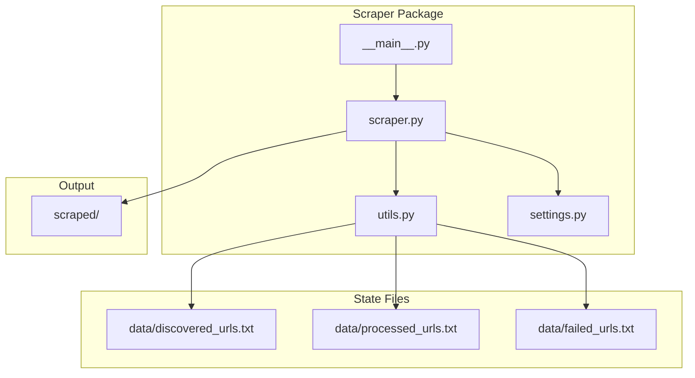
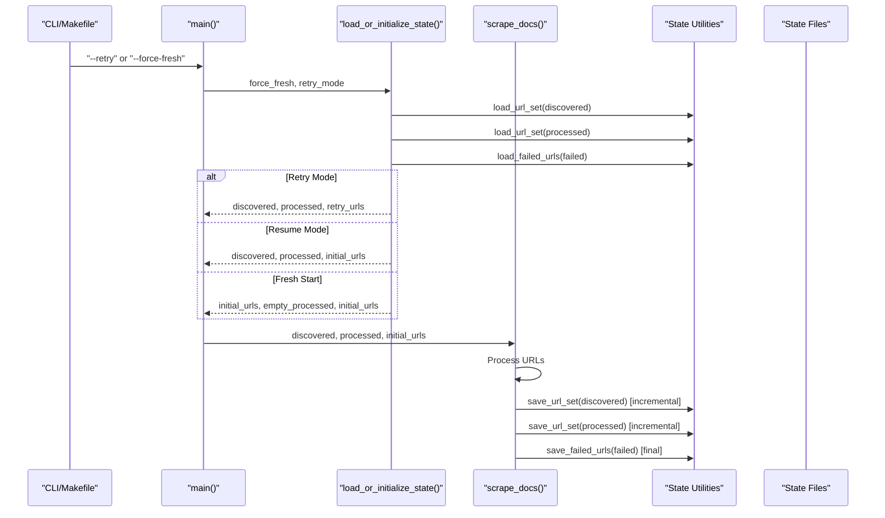
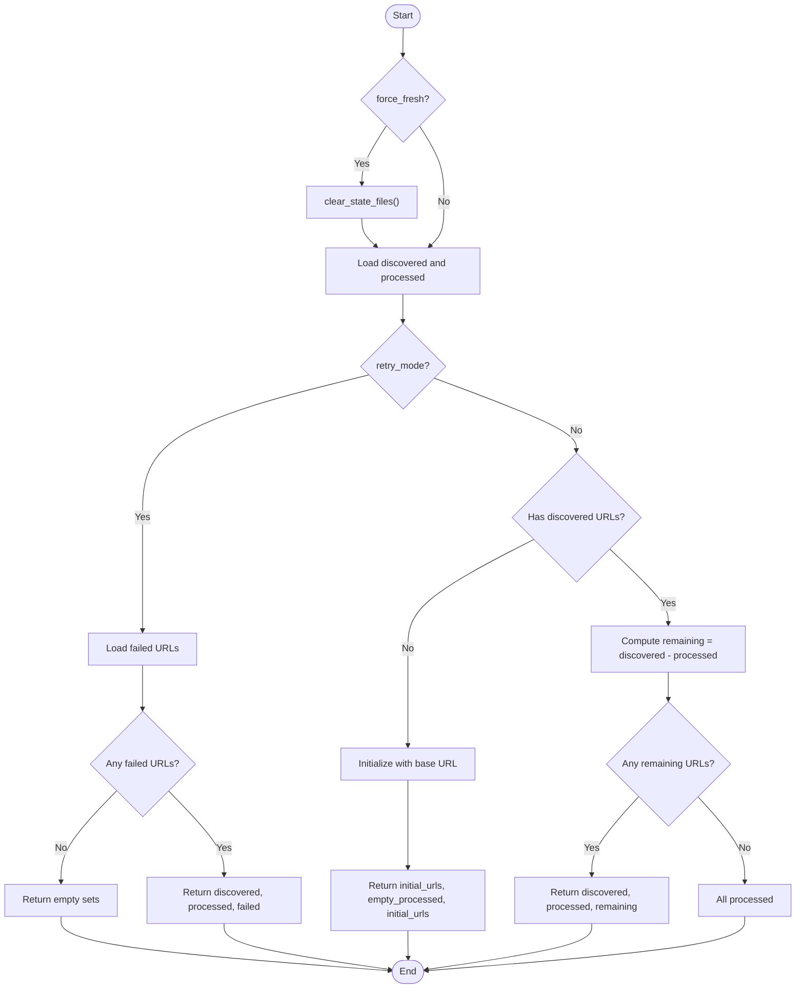
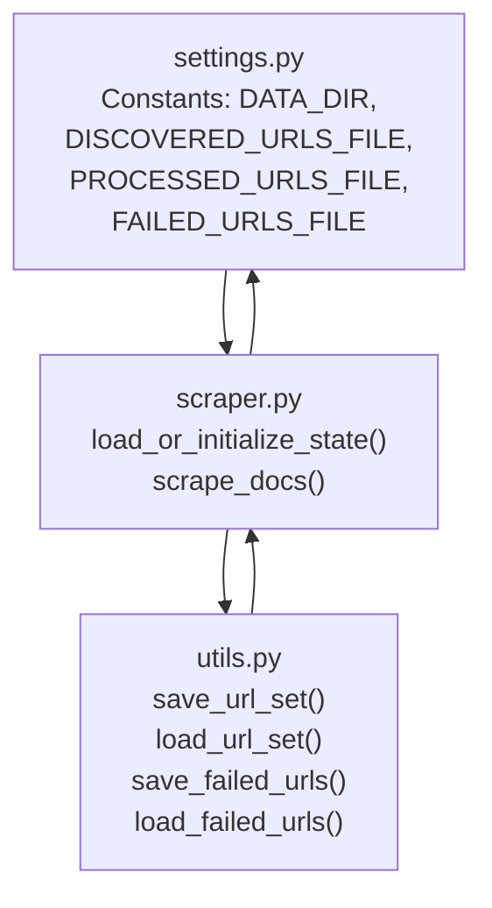

# State Management System

<cite>
**Referenced Files in This Document**
- [scraper.py](file://src/pico_doc_scraper/scraper.py)
- [utils.py](file://src/pico_doc_scraper/utils.py)
- [settings.py](file://src/pico_doc_scraper/settings.py)
- [__main__.py](file://src/pico_doc_scraper/__main__.py)
- [Makefile](file://Makefile)
- [README.md](file://README.md)
- [discovered_urls.txt](file://data/discovered_urls.txt)
- [processed_urls.txt](file://data/processed_urls.txt)
</cite>

## Table of Contents
1. [Introduction](#introduction)
2. [Project Structure](#project-structure)
3. [Core Components](#core-components)
4. [Architecture Overview](#architecture-overview)
5. [Detailed Component Analysis](#detailed-component-analysis)
6. [Dependency Analysis](#dependency-analysis)
7. [Performance Considerations](#performance-considerations)
8. [Troubleshooting Guide](#troubleshooting-guide)
9. [Conclusion](#conclusion)

## Introduction
This document explains the state management system that enables resume capability and persistent tracking across scraping sessions. The system maintains three distinct states:
- Discovered URLs tracking: All URLs found during crawling
- Processed URLs monitoring: Successfully processed URLs
- Failed URLs recovery: URLs that failed to scrape for later retry

The state loading and initialization process supports three operational modes: fresh start, resume, and retry. Incremental state updates occur during scraping to ensure reliable continuation after interruptions. State files are managed through dedicated utilities with a simple text-based format for portability and human readability.

## Project Structure
The state management system spans several modules and files:
- Main scraping logic and orchestration in scraper.py
- State file utilities in utils.py
- Configuration constants in settings.py
- Entry point and CLI integration in __main__.py
- Build and execution commands in Makefile
- Documentation and usage guidance in README.md
- Persistent state files in data/ directory



**Diagram sources**
- [scraper.py](file://src/pico_doc_scraper/scraper.py#L231-L285)
- [utils.py](file://src/pico_doc_scraper/utils.py#L130-L158)
- [settings.py](file://src/pico_doc_scraper/settings.py#L14-L17)
- [__main__.py](file://src/pico_doc_scraper/__main__.py#L1-L7)

**Section sources**
- [scraper.py](file://src/pico_doc_scraper/scraper.py#L1-L391)
- [utils.py](file://src/pico_doc_scraper/utils.py#L1-L175)
- [settings.py](file://src/pico_doc_scraper/settings.py#L1-L33)
- [Makefile](file://Makefile#L115-L125)
- [README.md](file://README.md#L65-L76)

## Core Components
The state management system comprises three primary components:
- State loading and initialization: Determines whether to start fresh, resume from existing state, or retry failed URLs
- Incremental state updates: Persists discovered and processed URLs after each successful page fetch
- State file utilities: Provides robust file I/O for saving and loading URL sets and failed URLs

Key functions and their roles:
- load_or_initialize_state(): Orchestrates state loading and mode selection
- save_url_set()/load_url_set(): Persist and restore URL collections
- save_failed_urls()/load_failed_urls(): Manage failed URL recovery
- scrape_docs(): Main workflow integrating state management with scraping

**Section sources**
- [scraper.py](file://src/pico_doc_scraper/scraper.py#L231-L285)
- [utils.py](file://src/pico_doc_scraper/utils.py#L130-L158)
- [utils.py](file://src/pico_doc_scraper/utils.py#L92-L128)

## Architecture Overview
The state management architecture follows a three-state model with explicit persistence points:



**Diagram sources**
- [scraper.py](file://src/pico_doc_scraper/scraper.py#L361-L387)
- [scraper.py](file://src/pico_doc_scraper/scraper.py#L231-L285)
- [scraper.py](file://src/pico_doc_scraper/scraper.py#L287-L359)
- [utils.py](file://src/pico_doc_scraper/utils.py#L130-L158)
- [utils.py](file://src/pico_doc_scraper/utils.py#L92-L128)

## Detailed Component Analysis

### State Loading and Initialization
The load_or_initialize_state() function determines the operational mode and returns the appropriate state sets:
- Force fresh mode: Clears all existing state files and starts with a clean slate
- Retry mode: Loads only failed URLs for targeted retry
- Resume mode: Loads existing discovered and processed URLs, computing remaining URLs to process

Operational modes and behavior:
- Fresh start: Initializes with the configured base URL and prints configuration details
- Resume: Computes remaining URLs as discovered minus processed and validates state consistency
- Retry: Loads failed URLs and returns them as the initial queue



**Diagram sources**
- [scraper.py](file://src/pico_doc_scraper/scraper.py#L231-L285)

**Section sources**
- [scraper.py](file://src/pico_doc_scraper/scraper.py#L231-L285)

### Incremental State Updates During Scraping
The scraping workflow updates state incrementally to ensure reliable continuation:
- After successful page fetch: Newly discovered URLs are added to discovered_urls and appended to the queue
- After processing each URL: The URL is added to processed_urls
- At completion: Failed URLs are saved to failed_urls for later retry

Processing logic highlights:
- New discovery: Only URLs not already in discovered_urls are added
- Queue management: URLs are popped from the set and processed sequentially
- Delay policy: A configurable delay is applied between requests to be polite

```mermaid
sequenceDiagram
participant Loop as "scrape_docs() Loop"
participant Page as "process_single_page()"
participant Utils as "save_url_set()"
participant Files as "State Files"
Loop->>Page : Fetch and parse URL
alt Success
Page-->>Loop : success, parsed, new_links
Loop->>Loop : discovered_urls.update(new_discovered)
Loop->>Loop : urls_to_visit.update(new_discovered)
Loop->>Utils : save_url_set(discovered_urls)
Loop->>Utils : save_url_set(processed_urls)
else Failure
Page-->>Loop : failure, error, []
Loop->>Loop : record failed_url
end
```

**Diagram sources**
- [scraper.py](file://src/pico_doc_scraper/scraper.py#L314-L359)
- [scraper.py](file://src/pico_doc_scraper/scraper.py#L145-L194)
- [utils.py](file://src/pico_doc_scraper/utils.py#L130-L158)

**Section sources**
- [scraper.py](file://src/pico_doc_scraper/scraper.py#L314-L359)
- [scraper.py](file://src/pico_doc_scraper/scraper.py#L145-L194)

### State File Management Utilities
The state file utilities provide robust persistence with simple text-based formats:
- save_url_set(): Writes a sorted set of URLs to a file, one per line
- load_url_set(): Reads URLs from a file into a set, skipping empty lines
- save_failed_urls(): Writes failed URLs to a file and removes the file when empty
- load_failed_urls(): Reads failed URLs from a file, returning an empty list if missing
- clear_state_files(): Removes all state files to support fresh starts

File organization and format:
- Discovered URLs: data/discovered_urls.txt
- Processed URLs: data/processed_urls.txt
- Failed URLs: data/failed_urls.txt

Example state file contents:
- Discovered URLs file: Contains one URL per line, starting with the base URL and continuing with discovered links
- Processed URLs file: Mirrors the discovered URLs file as pages are processed
- Failed URLs file: Contains failed URLs collected during the run

**Section sources**
- [utils.py](file://src/pico_doc_scraper/utils.py#L130-L158)
- [utils.py](file://src/pico_doc_scraper/utils.py#L92-L128)
- [utils.py](file://src/pico_doc_scraper/utils.py#L161-L175)
- [discovered_urls.txt](file://data/discovered_urls.txt#L1-L81)
- [processed_urls.txt](file://data/processed_urls.txt#L1-L81)

### Relationship Between State Management and Scraping Workflow
State persistence integrates seamlessly with the scraping workflow:
- Initialization phase: load_or_initialize_state() selects the appropriate mode and prepares queues
- Execution phase: scrape_docs() processes URLs, updating state incrementally
- Completion phase: print_summary() saves failed URLs for retry and prints summary statistics

The workflow ensures that:
- Interruptions can occur at any time without losing progress
- Resume mode automatically computes remaining URLs to process
- Retry mode focuses only on failed URLs from the last run

**Section sources**
- [scraper.py](file://src/pico_doc_scraper/scraper.py#L287-L359)
- [scraper.py](file://src/pico_doc_scraper/scraper.py#L196-L229)

## Dependency Analysis
The state management system depends on configuration constants and utility functions:



**Diagram sources**
- [settings.py](file://src/pico_doc_scraper/settings.py#L14-L17)
- [utils.py](file://src/pico_doc_scraper/utils.py#L130-L158)
- [scraper.py](file://src/pico_doc_scraper/scraper.py#L231-L285)

**Section sources**
- [settings.py](file://src/pico_doc_scraper/settings.py#L14-L17)
- [utils.py](file://src/pico_doc_scraper/utils.py#L130-L158)
- [scraper.py](file://src/pico_doc_scraper/scraper.py#L231-L285)

## Performance Considerations
- Incremental persistence: Saving state after each successful page reduces I/O overhead while ensuring frequent checkpoints
- Set-based deduplication: Using sets for discovered and processed URLs prevents redundant processing and reduces memory usage
- Sorted output: Writing URLs in sorted order improves readability and makes diffs easier to interpret
- Polite delays: Configurable delays between requests balance efficiency with server politeness

## Troubleshooting Guide
Common state-related issues and resolutions:
- No state files present: The system starts in fresh mode automatically
- All URLs processed: Resume mode detects completion and exits gracefully
- Retry mode with no failed URLs: The system reports no URLs to retry and exits
- Interrupted scrape: Use resume mode to continue from the last checkpoint
- Corrupted state files: Use force-fresh mode to clear state and start over

Recovery procedures:
- Resume: Run the scraper normally to continue from discovered URLs minus processed URLs
- Retry: Use the retry command to process only failed URLs from the last run
- Fresh start: Use the fresh command to clear all state files and restart

**Section sources**
- [scraper.py](file://src/pico_doc_scraper/scraper.py#L254-L277)
- [scraper.py](file://src/pico_doc_scraper/scraper.py#L258-L260)
- [Makefile](file://Makefile#L119-L125)
- [README.md](file://README.md#L35-L53)

## Conclusion
The state management system provides robust, incremental persistence for the scraping workflow. By maintaining three complementary state files and supporting three operational modes—fresh start, resume, and retry—the system enables reliable continuation of interrupted scrapes, efficient recovery from failures, and flexible execution strategies. The simple text-based format ensures portability and human readability, while the modular design keeps state management decoupled from core scraping logic.