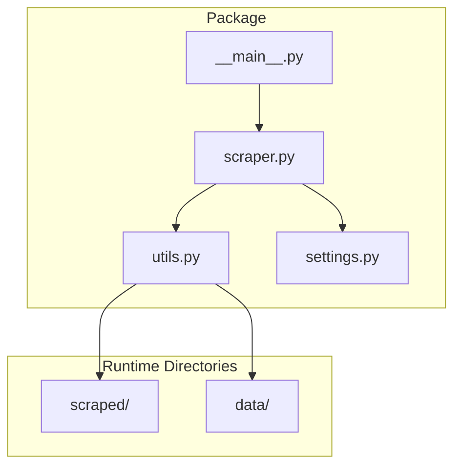
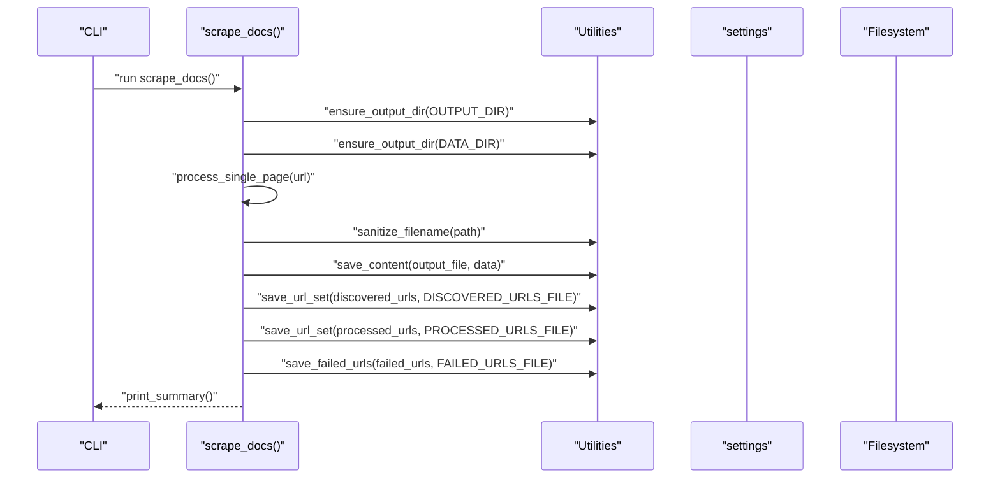
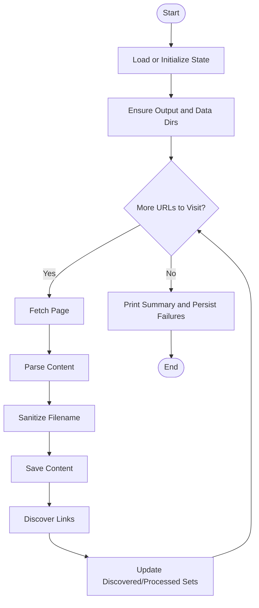
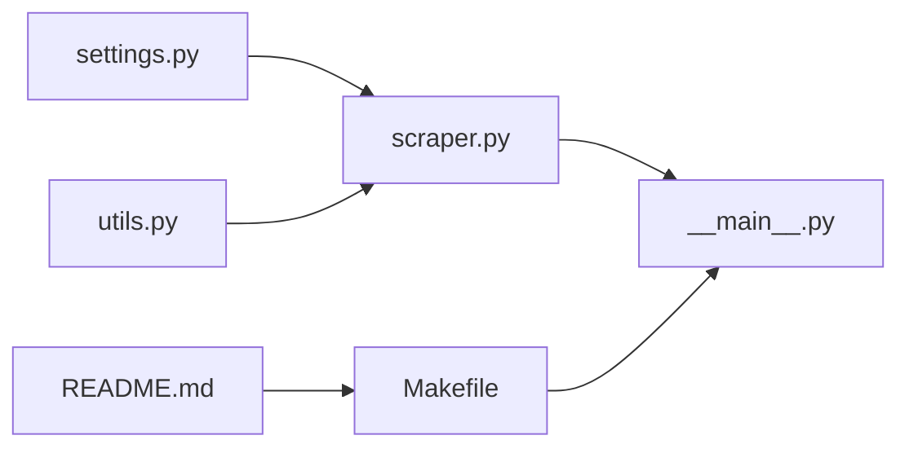

# Utility Functions and Helpers

<cite>
**Referenced Files in This Document**
- [utils.py](file://src/pico_doc_scraper/utils.py)
- [settings.py](file://src/pico_doc_scraper/settings.py)
- [scraper.py](file://src/pico_doc_scraper/scraper.py)
- [__main__.py](file://src/pico_doc_scraper/__main__.py)
- [README.md](file://README.md)
- [Makefile](file://Makefile)
</cite>

## Table of Contents
1. [Introduction](#introduction)
2. [Project Structure](#project-structure)
3. [Core Components](#core-components)
4. [Architecture Overview](#architecture-overview)
5. [Detailed Component Analysis](#detailed-component-analysis)
6. [Dependency Analysis](#dependency-analysis)
7. [Performance Considerations](#performance-considerations)
8. [Troubleshooting Guide](#troubleshooting-guide)
9. [Conclusion](#conclusion)

## Introduction
This document focuses on the utility functions and helper modules that support the main scraping functionality. It explains file system operations, filename sanitization, state file management, and configuration organization. It also demonstrates how these utilities integrate with the main scraping workflow to maintain modularity and reusability.

## Project Structure
The utility and configuration modules live under the package directory alongside the main scraping logic. The Makefile and README provide usage and development commands that demonstrate how the utilities are integrated into the end-to-end workflow.

**Diagram sources**
- [utils.py](file://src/pico_doc_scraper/utils.py#L1-L175)
- [settings.py](file://src/pico_doc_scraper/settings.py#L1-L33)
- [scraper.py](file://src/pico_doc_scraper/scraper.py#L1-L391)
- [__main__.py](file://src/pico_doc_scraper/__main__.py#L1-L7)

**Section sources**
- [README.md](file://README.md#L1-L134)
- [Makefile](file://Makefile#L1-L126)

## Core Components
- File system helpers: ensure_output_dir(), save_content()
- Filename sanitization: sanitize_filename()
- URL state management: load_failed_urls(), save_failed_urls(), load_url_set(), save_url_set()
- Formatting helper: format_url()
- State cleanup: clear_state_files()

These utilities encapsulate cross-cutting concerns (I/O, persistence, path safety) and are reused throughout the scraping workflow.

**Section sources**
- [utils.py](file://src/pico_doc_scraper/utils.py#L7-L175)
- [scraper.py](file://src/pico_doc_scraper/scraper.py#L12-L21)

## Architecture Overview
The main scraping workflow orchestrates fetching, parsing, and saving content. Utilities are invoked for:
- Ensuring output directories exist
- Saving content in multiple formats
- Sanitizing filenames derived from URLs
- Managing discovered, processed, and failed URLs
- Persisting state incrementally

**Diagram sources**
- [scraper.py](file://src/pico_doc_scraper/scraper.py#L287-L359)
- [utils.py](file://src/pico_doc_scraper/utils.py#L7-L175)
- [settings.py](file://src/pico_doc_scraper/settings.py#L9-L33)

## Detailed Component Analysis

### File System Operations
- ensure_output_dir(directory): Creates directories recursively and prints a readiness message.
- save_content(output_file, data): Writes content to disk with format selection based on file extension:
  - JSON: dumps with UTF-8 encoding and indentation
  - Markdown: writes title and content
  - HTML: writes raw HTML
  - Default: writes string representation

Usage patterns:
- Called early in the workflow to ensure output and data directories exist.
- Used inside process_single_page() to persist parsed content.

Integration points:
- Invoked by scrape_docs() before processing begins.
- Used by process_single_page() to write each page’s content.

Error handling:
- save_content() ensures parent directories exist before writing.
- Uses explicit UTF-8 encoding for all text modes.

**Section sources**
- [utils.py](file://src/pico_doc_scraper/utils.py#L7-L48)
- [scraper.py](file://src/pico_doc_scraper/scraper.py#L303-L305)
- [scraper.py](file://src/pico_doc_scraper/scraper.py#L174-L177)

### Filename Sanitization
- sanitize_filename(filename): Produces a safe filename by:
  - Replacing unsafe characters with underscores
  - Stripping leading/trailing spaces and dots
  - Limiting length to a maximum
  - Returning a fallback name if empty

Safety measures:
- Prevents invalid characters on Windows and Unix systems
- Removes leading/trailing whitespace and dots that can cause issues
- Caps length to avoid filesystem limits

Integration:
- Applied to generated filenames derived from URLs to ensure filesystem compatibility.

**Section sources**
- [utils.py](file://src/pico_doc_scraper/utils.py#L50-L74)
- [scraper.py](file://src/pico_doc_scraper/scraper.py#L164-L172)

### URL State Management
- save_failed_urls(failed_urls, file_path): Writes a sorted, deduplicated list of failed URLs to a file. If the list is empty, removes the file. Prints a summary count.
- load_failed_urls(file_path): Reads a file and returns a list of non-empty lines; returns an empty list if the file does not exist.
- save_url_set(urls, file_path): Writes a sorted set of URLs to a file.
- load_url_set(file_path): Reads a file and returns a set of stripped, non-empty lines; returns an empty set if the file does not exist.
- clear_state_files(): Removes discovered, processed, and failed state files if present.

Persistence model:
- State is saved incrementally during the run to enable resuming after interruptions.
- Retry mode loads only failed URLs for targeted reprocessing.

**Section sources**
- [utils.py](file://src/pico_doc_scraper/utils.py#L92-L158)
- [scraper.py](file://src/pico_doc_scraper/scraper.py#L231-L284)
- [scraper.py](file://src/pico_doc_scraper/scraper.py#L332-L348)
- [README.md](file://README.md#L65-L76)

### Formatting Helper
- format_url(base_url, path): Normalizes base and path segments by trimming slashes and combining them safely.

Use cases:
- Constructing canonical URLs for deduplication and logging.

**Section sources**
- [utils.py](file://src/pico_doc_scraper/utils.py#L77-L89)
- [scraper.py](file://src/pico_doc_scraper/scraper.py#L82-L83)

### Configuration Management
The settings module centralizes configuration:
- Base URLs and allowed domain
- Output and data directories
- State tracking file paths
- HTTP client settings (timeout, retries, delays)
- User agent and scraping behavior (respect robots.txt, delay between requests)
- Output format preference

Organization:
- Constants are grouped by functional area for easy maintenance.
- Paths are constructed relative to the project root for portability.

**Section sources**
- [settings.py](file://src/pico_doc_scraper/settings.py#L5-L33)

### Integration with the Main Workflow
- scrape_docs() orchestrates state loading/resuming, directory creation, and the main loop.
- process_single_page() performs fetching, parsing, filename sanitization, and saving.
- print_summary() persists failed URLs and prints a final report.
- load_or_initialize_state() handles force-fresh and retry modes.

**Diagram sources**
- [scraper.py](file://src/pico_doc_scraper/scraper.py#L287-L359)
- [utils.py](file://src/pico_doc_scraper/utils.py#L7-L48)

**Section sources**
- [scraper.py](file://src/pico_doc_scraper/scraper.py#L287-L359)

## Dependency Analysis
Utilities are consumed by the scraper module and settings by both utilities and scraper. The Makefile and README define how these pieces are wired together for end-to-end operation.

**Diagram sources**
- [settings.py](file://src/pico_doc_scraper/settings.py#L1-L33)
- [scraper.py](file://src/pico_doc_scraper/scraper.py#L1-L391)
- [utils.py](file://src/pico_doc_scraper/utils.py#L1-L175)
- [__main__.py](file://src/pico_doc_scraper/__main__.py#L1-L7)
- [Makefile](file://Makefile#L115-L125)
- [README.md](file://README.md#L23-L59)

**Section sources**
- [scraper.py](file://src/pico_doc_scraper/scraper.py#L11-L21)
- [utils.py](file://src/pico_doc_scraper/utils.py#L163-L174)
- [Makefile](file://Makefile#L115-L125)
- [README.md](file://README.md#L23-L59)

## Performance Considerations
- Directory creation is performed once per run for output and data directories to avoid repeated overhead.
- Incremental state persistence minimizes I/O pressure and enables quick restarts.
- Using sets for URL tracking avoids redundant processing and reduces memory footprint.
- Polite delays between requests reduce server load and improve reliability.

## Troubleshooting Guide
Common issues and resolutions:
- Permission errors when writing to output or data directories:
  - Ensure ensure_output_dir() runs before any write operations.
  - Verify the process has write permissions to the project root.
- Invalid filenames causing write failures:
  - Confirm sanitize_filename() is applied to all generated filenames.
- State file corruption or unexpected behavior:
  - Use clear_state_files() to reset state when necessary.
  - Validate that load_* and save_* functions are invoked consistently during the run.
- HTTP timeouts or transient errors:
  - Adjust REQUEST_TIMEOUT and MAX_RETRIES in settings.py.
  - Use retry mode to reprocess failed URLs.

Operational commands:
- Start a fresh scrape and clear all state: make scrape-fresh or python -m pico_doc_scraper --force-fresh.
- Retry only failed URLs: make scrape-retry or python -m pico_doc_scraper --retry.
- Resume from previous state: make scrape or python -m pico_doc_scraper.

**Section sources**
- [utils.py](file://src/pico_doc_scraper/utils.py#L161-L175)
- [settings.py](file://src/pico_doc_scraper/settings.py#L19-L32)
- [README.md](file://README.md#L23-L59)
- [Makefile](file://Makefile#L115-L125)

## Conclusion
The utility and helper modules provide robust, reusable building blocks for the scraping pipeline. They encapsulate file system operations, state management, and path safety, enabling a clean separation of concerns. By organizing configuration in settings.py and wiring everything together via the Makefile and CLI, the project remains modular, maintainable, and easy to operate.