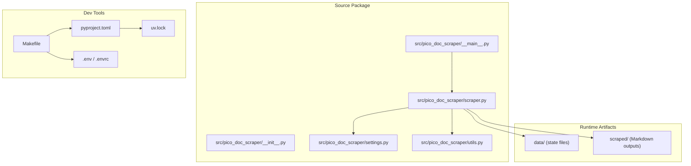
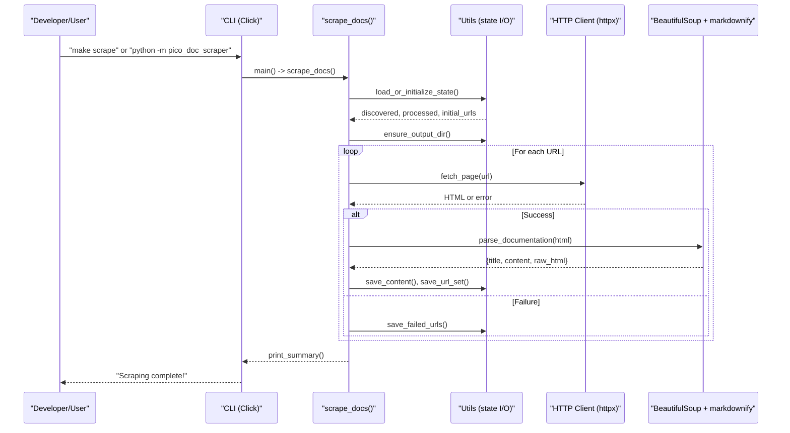
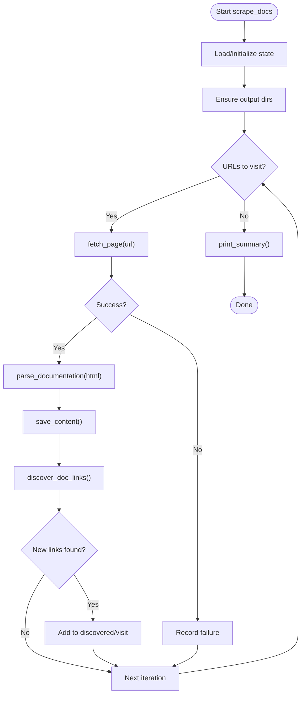
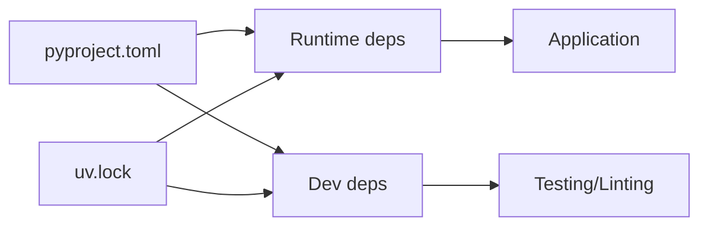

# Development and Testing

<cite>
**Referenced Files in This Document**
- [README.md](file://README.md)
- [pyproject.toml](file://pyproject.toml)
- [Makefile](file://Makefile)
- [src/pico_doc_scraper/__init__.py](file://src/pico_doc_scraper/__init__.py)
- [src/pico_doc_scraper/__main__.py](file://src/pico_doc_scraper/__main__.py)
- [src/pico_doc_scraper/settings.py](file://src/pico_doc_scraper/settings.py)
- [src/pico_doc_scraper/utils.py](file://src/pico_doc_scraper/utils.py)
- [src/pico_doc_scraper/scraper.py](file://src/pico_doc_scraper/scraper.py)
- [.env](file://.env)
- [.envrc](file://.envrc)
- [uv.lock](file://uv.lock)
</cite>

## Table of Contents
1. [Introduction](#introduction)
2. [Project Structure](#project-structure)
3. [Core Components](#core-components)
4. [Architecture Overview](#architecture-overview)
5. [Detailed Component Analysis](#detailed-component-analysis)
6. [Dependency Analysis](#dependency-analysis)
7. [Performance Considerations](#performance-considerations)
8. [Troubleshooting Guide](#troubleshooting-guide)
9. [Contribution Guidelines and Workflow](#contribution-guidelines-and-workflow)
10. [Extending the Scraper](#extending-the-scraper)
11. [Debugging Techniques](#debugging-techniques)
12. [Conclusion](#conclusion)

## Introduction
This document provides comprehensive development and testing guidance for contributors working on the Pico CSS Documentation Scraper. It covers environment setup, virtual environments, dependency management, testing with pytest, code quality with ruff and mypy, Makefile targets, configuration via .env and .envrc, debugging tips, and practical guidance for extending the scraper with new features or customizations.

## Project Structure
The project follows a clear package layout with a CLI entry point, configuration, scraping logic, utilities, and generated data and output directories. Development tasks are automated via a Makefile, and project metadata and dependencies are managed with pyproject.toml and uv.lock.

**Diagram sources**
- [src/pico_doc_scraper/__main__.py](file://src/pico_doc_scraper/__main__.py#L1-L7)
- [src/pico_doc_scraper/scraper.py](file://src/pico_doc_scraper/scraper.py#L1-L391)
- [src/pico_doc_scraper/settings.py](file://src/pico_doc_scraper/settings.py#L1-L33)
- [src/pico_doc_scraper/utils.py](file://src/pico_doc_scraper/utils.py#L1-L175)
- [Makefile](file://Makefile#L1-L126)
- [pyproject.toml](file://pyproject.toml#L1-L75)
- [.env](file://.env#L1-L3)
- [.envrc](file://.envrc#L1-L2)

**Section sources**
- [README.md](file://README.md#L119-L134)
- [Makefile](file://Makefile#L1-L126)
- [pyproject.toml](file://pyproject.toml#L1-L75)

## Core Components
- Settings: Centralized configuration for base URLs, domains, output directories, timeouts, retries, delays, and output format.
- Utilities: Directory creation, content saving (Markdown/JSON/HTML), filename sanitization, URL helpers, state persistence/loading, and cleanup.
- Scraper: HTTP fetching with retries, link discovery with domain restrictions, content extraction and Markdown conversion, processing pipeline, and CLI entry point.
- CLI: Click-based interface supporting resume, retry, and fresh-start modes.

Key responsibilities and relationships:
- Settings defines constants and paths used across the app.
- Utils encapsulates I/O and state management.
- Scraper orchestrates fetching, parsing, saving, and state updates.
- CLI wires user options to the scraping workflow.

**Section sources**
- [src/pico_doc_scraper/settings.py](file://src/pico_doc_scraper/settings.py#L1-L33)
- [src/pico_doc_scraper/utils.py](file://src/pico_doc_scraper/utils.py#L1-L175)
- [src/pico_doc_scraper/scraper.py](file://src/pico_doc_scraper/scraper.py#L1-L391)
- [src/pico_doc_scraper/__main__.py](file://src/pico_doc_scraper/__main__.py#L1-L7)

## Architecture Overview
The scraper is a command-line tool that:
- Loads or initializes state (resume/retry/fresh).
- Ensures output directories exist.
- Iteratively fetches pages, parses content, saves outputs, discovers new links, and persists state incrementally.
- Handles errors gracefully and continues processing.

**Diagram sources**
- [src/pico_doc_scraper/scraper.py](file://src/pico_doc_scraper/scraper.py#L287-L387)
- [src/pico_doc_scraper/utils.py](file://src/pico_doc_scraper/utils.py#L17-L175)
- [src/pico_doc_scraper/__main__.py](file://src/pico_doc_scraper/__main__.py#L1-L7)

## Detailed Component Analysis

### Settings Module
Defines:
- Base URLs and allowed domain.
- Output directories and state file paths.
- HTTP client settings (timeout, retries, delay).
- User agent and politeness settings.
- Output format selection.

Operational impact:
- Controls domain restriction and URL normalization.
- Determines where state and outputs are stored.
- Influences network behavior and rate limiting.

**Section sources**
- [src/pico_doc_scraper/settings.py](file://src/pico_doc_scraper/settings.py#L1-L33)

### Utilities Module
Core functions:
- ensure_output_dir(): Creates directories as needed.
- save_content(): Writes Markdown, JSON, or raw HTML depending on file suffix.
- sanitize_filename(): Removes unsafe characters and normalizes filenames.
- format_url(): Normalizes base and path joining.
- save_failed_urls()/load_failed_urls(): Persist and reload failed URLs.
- save_url_set()/load_url_set(): Persist and reload sets of URLs.
- clear_state_files(): Wipe state files.

Error handling:
- Gracefully handles missing files and empty sets.
- Uses consistent directory creation with parents and existence checks.

**Section sources**
- [src/pico_doc_scraper/utils.py](file://src/pico_doc_scraper/utils.py#L1-L175)

### Scraper Module
Key logic:
- fetch_page(): HTTP GET with retries and timeout.
- discover_doc_links(): Extracts internal documentation links with strict filtering.
- parse_documentation(): Selects main content, strips navigation, converts to Markdown.
- process_single_page(): Orchestrates fetch, parse, save, and link discovery.
- scrape_docs(): Main workflow with state loading, loop, delays, and summary.
- CLI main(): Exposes retry and force-fresh options.

Processing flow:

**Diagram sources**
- [src/pico_doc_scraper/scraper.py](file://src/pico_doc_scraper/scraper.py#L287-L387)
- [src/pico_doc_scraper/utils.py](file://src/pico_doc_scraper/utils.py#L17-L175)

**Section sources**
- [src/pico_doc_scraper/scraper.py](file://src/pico_doc_scraper/scraper.py#L24-L391)

### CLI Entry Point
- Provides a module entry point for python -m pico_doc_scraper.
- Delegates to the main scraping function.

**Section sources**
- [src/pico_doc_scraper/__main__.py](file://src/pico_doc_scraper/__main__.py#L1-L7)

## Dependency Analysis
- Runtime dependencies: httpx, beautifulsoup4, markdownify, click.
- Development dependencies: pytest, pytest-mock, responses, ruff, mypy, build.
- Version pinning and extras are declared in pyproject.toml.
- uv.lock captures resolved dependency tree and hashes.

**Diagram sources**
- [pyproject.toml](file://pyproject.toml#L9-L24)
- [uv.lock](file://uv.lock#L1-L546)

**Section sources**
- [pyproject.toml](file://pyproject.toml#L1-L75)
- [uv.lock](file://uv.lock#L1-L546)

## Performance Considerations
- Politeness: Configurable delay between requests reduces server load.
- Incremental state persistence: Saves discovered and processed sets frequently to avoid rework.
- Retry with backoff: Reduces transient failure impact.
- Content extraction: Strips non-content regions to minimize Markdown conversion overhead.

Recommendations:
- Tune REQUEST_TIMEOUT and DELAY_BETWEEN_REQUESTS for target site responsiveness.
- Monitor network latency and adjust MAX_RETRIES accordingly.
- Keep content selectors aligned with site structure to reduce unnecessary parsing.

**Section sources**
- [src/pico_doc_scraper/settings.py](file://src/pico_doc_scraper/settings.py#L19-L33)
- [src/pico_doc_scraper/scraper.py](file://src/pico_doc_scraper/scraper.py#L24-L53)
- [src/pico_doc_scraper/scraper.py](file://src/pico_doc_scraper/scraper.py#L322-L358)

## Troubleshooting Guide
Common issues and resolutions:
- Network errors: Verify ALLOWED_DOMAIN and PICO_DOCS_BASE_URL. Increase REQUEST_TIMEOUT or MAX_RETRIES if needed.
- Permission or missing directories: ensure_output_dir() creates directories; confirm write permissions in project root.
- State file conflicts: Use --force-fresh to clear state or --retry to limit scope to failed URLs.
- Unexpected failures: Review summary output and inspect FAILED_URLS_FILE for details.

Debugging tips:
- Run with verbose logs by invoking the module directly.
- Temporarily increase verbosity in fetch_page() or print intermediate states.
- Validate content selectors in parse_documentation() against live pages.

**Section sources**
- [src/pico_doc_scraper/scraper.py](file://src/pico_doc_scraper/scraper.py#L196-L229)
- [src/pico_doc_scraper/utils.py](file://src/pico_doc_scraper/utils.py#L92-L128)
- [src/pico_doc_scraper/scraper.py](file://src/pico_doc_scraper/scraper.py#L287-L387)

## Contribution Guidelines and Workflow
Recommended workflow:
- Fork and branch from main.
- Install dependencies with Makefile targets.
- Write tests with pytest markers (unit/integration/slow).
- Lint with ruff and type-check with mypy.
- Commit with clear messages; open a pull request.

Environment setup:
- Use uv for reproducible installs and virtual environments.
- Activate .env and .envrc for consistent interpreter and environment variables.

Testing markers:
- unit: Fast, isolated tests.
- integration: May involve HTTP or multiple components.
- slow: External service-dependent tests.

**Section sources**
- [Makefile](file://Makefile#L56-L126)
- [pyproject.toml](file://pyproject.toml#L33-L39)
- [README.md](file://README.md#L81-L99)

## Extending the Scraper
To add new features or customize behavior:

1) Modify content selectors
- Edit parse_documentation() content_selectors list to target new site structures.
- Validate selector effectiveness on representative pages.

2) Adjust domain and path filters
- Update discover_doc_links() filters in scraper.py to expand or restrict link discovery.

3) Change output format or filename strategy
- Extend save_content() in utils.py to support additional formats.
- Customize sanitize_filename() or filename generation logic.

4) Introduce new state tracking
- Add new state files in settings.py and update utils.py load/save routines.
- Wire new state into scrape_docs() initialization and persistence.

5) Add CLI options
- Extend main() in scraper.py with new click options.
- Update Makefile scrape targets if needed.

Example change points (described):
- Content extraction selectors: [parse_documentation selectors](file://src/pico_doc_scraper/scraper.py#L104-L124)
- Link discovery filters: [discover_doc_links filters](file://src/pico_doc_scraper/scraper.py#L75-L84)
- Output format handling: [save_content format branches](file://src/pico_doc_scraper/utils.py#L31-L48)
- State file definitions: [state paths](file://src/pico_doc_scraper/settings.py#L14-L18)

**Section sources**
- [src/pico_doc_scraper/scraper.py](file://src/pico_doc_scraper/scraper.py#L88-L142)
- [src/pico_doc_scraper/scraper.py](file://src/pico_doc_scraper/scraper.py#L55-L86)
- [src/pico_doc_scraper/utils.py](file://src/pico_doc_scraper/utils.py#L17-L48)
- [src/pico_doc_scraper/settings.py](file://src/pico_doc_scraper/settings.py#L14-L18)

## Debugging Techniques
- Interactive shell: Use the Makefile target to drop into a Python shell inside the virtual environment.
- Verbose logging: Print statements around critical steps (fetch, parse, save).
- Test isolation: Run unit tests separately to validate small changes.
- Dry runs: Limit scope by focusing on a single page or a small subset of URLs.

**Section sources**
- [Makefile](file://Makefile#L87-L89)
- [src/pico_doc_scraper/scraper.py](file://src/pico_doc_scraper/scraper.py#L322-L358)

## Development Environment Setup

### Python Version and Virtual Environment
- Requires Python 3.12+.
- Create and activate a virtual environment using uv.
- Use .env and .envrc to configure VIRTUAL_ENV and UV_PYTHON.

Commands:
- make setup: Create virtual environment and install dev dependencies.
- make install: Install runtime dependencies into active venv.
- make install-dev: Install development dependencies into active venv.

**Section sources**
- [README.md](file://README.md#L16-L21)
- [pyproject.toml](file://pyproject.toml#L7)
- [.env](file://.env#L1-L3)
- [.envrc](file://.envrc#L1-L2)
- [Makefile](file://Makefile#L56-L68)

### Dependencies and Lock File
- pyproject.toml declares project metadata, dependencies, and dev extras.
- uv.lock pins exact versions and hashes for reproducibility.

**Section sources**
- [pyproject.toml](file://pyproject.toml#L1-L75)
- [uv.lock](file://uv.lock#L1-L546)

### Testing Framework
- pytest configuration includes markers for unit, integration, and slow tests.
- Run tests via Makefile targets:
  - make test or make test-all
  - make test-unit
  - make test-integration

**Section sources**
- [pyproject.toml](file://pyproject.toml#L33-L39)
- [Makefile](file://Makefile#L91-L106)

### Code Quality Tools
- Linting: ruff with line-length limits, exclusions, and selected rulesets.
- Type checking: mypy with Python version alignment and strictness toggles.

Targets:
- make lint
- make type-check

**Section sources**
- [pyproject.toml](file://pyproject.toml#L41-L64)
- [Makefile](file://Makefile#L107-L114)

### Makefile Targets
Common tasks:
- setup, install, install-dev, package, package-install, clean
- test, test-all, test-unit, test-integration
- lint, type-check
- scrape, scrape-retry, scrape-fresh
- python (interactive shell)

Usage:
- make <target> [args...]
- TEST_ARGS, LINT_ARGS, PYTHON_ARGS can be passed via environment or inline.

**Section sources**
- [Makefile](file://Makefile#L14-L49)
- [Makefile](file://Makefile#L56-L126)

### Environment Configuration
- .env: Sets VIRTUAL_ENV and UV_PYTHON for consistent interpreter selection.
- .envrc: Activates the virtual environment and loads .env variables.

Best practices:
- Keep .envrc in version control; keep .env out of version control.
- Ensure .envrc executes before running development commands.

**Section sources**
- [.env](file://.env#L1-L3)
- [.envrc](file://.envrc#L1-L2)

## Conclusion
This guide consolidates the development and testing ecosystem for the Pico CSS Documentation Scraper. By following the environment setup, leveraging Makefile targets, adhering to testing and quality standards, and understanding the scraper’s architecture, contributors can efficiently extend functionality, maintain code quality, and troubleshoot effectively.