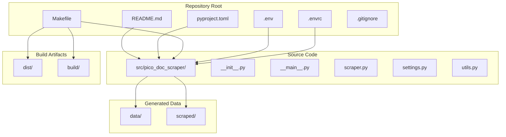

# Installation and Setup

<cite>
**Referenced Files in This Document**
- [README.md](file://README.md)
- [pyproject.toml](file://pyproject.toml)
- [Makefile](file://Makefile)
- [.env](file://.env)
- [.envrc](file://.envrc)
- [src/pico_doc_scraper/settings.py](file://src/pico_doc_scraper/settings.py)
- [src/pico_doc_scraper/__main__.py](file://src/pico_doc_scraper/__main__.py)
- [src/pico_doc_scraper/scraper.py](file://src/pico_doc_scraper/scraper.py)
- [src/pico_doc_scraper/utils.py](file://src/pico_doc_scraper/utils.py)
</cite>

## Table of Contents
1. [Introduction](#introduction)
2. [Prerequisites](#prerequisites)
3. [Virtual Environment Setup](#virtual-environment-setup)
4. [Step-by-Step Installation](#step-by-step-installation)
5. [Project Structure](#project-structure)
6. [Environment Configuration](#environment-configuration)
7. [Verification Steps](#verification-steps)
8. [Troubleshooting Guide](#troubleshooting-guide)
9. [Conclusion](#conclusion)

## Introduction
This guide provides comprehensive installation and setup instructions for the Pico CSS Documentation Scraper. It covers prerequisites, virtual environment setup, dependency installation, project structure, configuration options, verification steps, and troubleshooting guidance. The content is designed to be accessible to beginners while offering sufficient technical depth for experienced developers who may need to customize the setup process.

## Prerequisites
Before installing the Pico CSS Documentation Scraper, ensure your system meets the following requirements:

- **Python 3.12+**: The project requires Python 3.12 or newer. This is enforced by the project configuration.
- **System Dependencies**: The project uses modern Python packaging and does not require additional system-level dependencies beyond a standard Python installation. The Makefile targets use `uv` for virtual environment creation and dependency management.

Key indicators from the repository:
- Python version requirement is explicitly declared in the project configuration.
- The Makefile targets rely on `uv` for virtual environment creation and dependency installation.

**Section sources**
- [pyproject.toml](file://pyproject.toml#L7-L7)
- [Makefile](file://Makefile#L56-L59)

## Virtual Environment Setup
The project uses `uv` to manage the virtual environment and dependencies. The recommended approach is to use the provided Makefile targets to create and configure the environment automatically.

### Using the Makefile (Recommended)
Run the setup target to create a virtual environment and install development dependencies:
```bash
make setup
```

This target performs two actions:
1. Creates a virtual environment named `.venv`
2. Installs development dependencies into the virtual environment

### Manual Alternative
If you prefer manual control or need to customize the process:
1. Create a virtual environment using your preferred method (e.g., `python -m venv .venv`)
2. Activate the virtual environment
3. Install dependencies using the project configuration

**Section sources**
- [Makefile](file://Makefile#L56-L59)
- [.env](file://.env#L1-L3)

## Step-by-Step Installation
Follow these steps to install and prepare the Pico CSS Documentation Scraper:

### Step 1: Prepare the Virtual Environment
Use the Makefile to create and configure the virtual environment:
```bash
make setup
```

### Step 2: Verify the Environment
After setup, verify that the virtual environment is active and contains the expected packages. You can run:
```bash
make python
```
This starts an interactive Python shell within the configured virtual environment.

### Step 3: Install Runtime Dependencies (Optional)
If you only need runtime dependencies without development tools:
```bash
make install
```

### Step 4: Install Development Dependencies (Optional)
To install development tools and testing frameworks:
```bash
make install-dev
```

### Step 5: Build Distribution (Optional)
To create a wheel distribution for deployment:
```bash
make package
```

### Step 6: Clean Build Artifacts (Optional)
To remove generated files and caches:
```bash
make clean
```

**Section sources**
- [Makefile](file://Makefile#L56-L85)

## Project Structure
The Pico CSS Documentation Scraper follows a standard Python project layout with clear separation of concerns:



**Diagram sources**
- [README.md](file://README.md#L119-L134)
- [pyproject.toml](file://pyproject.toml#L26-L28)

### Directory Organization
- **src/pico_doc_scraper/**: Main package containing all source code
- **data/**: State tracking files (auto-generated during scraping)
- **scraped/**: Output directory for scraped content (auto-generated)
- **dist/**: Build artifacts (wheel distributions)
- **build/**: Temporary build files

**Section sources**
- [README.md](file://README.md#L119-L134)

## Environment Configuration
The project provides several configuration mechanisms to tailor the scraping behavior:

### Configuration Options
The scraper exposes the following configurable settings:

| Setting | Description | Default Value |
|---------|-------------|---------------|
| `PICO_DOCS_BASE_URL` | Starting URL for scraping | https://picocss.com/docs |
| `ALLOWED_DOMAIN` | Domain restriction for scraping | picocss.com |
| `REQUEST_TIMEOUT` | HTTP request timeout in seconds | 30 |
| `MAX_RETRIES` | Number of retry attempts for failed requests | 3 |
| `RETRY_DELAY` | Delay between retry attempts in seconds | 1 |
| `USER_AGENT` | User agent string for HTTP requests | pico-doc-scraper/0.1.0 |
| `RESPECT_ROBOTS_TXT` | Whether to respect robots.txt | True |
| `DELAY_BETWEEN_REQUESTS` | Polite delay between requests in seconds | 1.0 |
| `OUTPUT_FORMAT` | Output format (markdown, json, html) | markdown |

### Environment Variables
The project uses environment variables for virtual environment configuration:
- `VIRTUAL_ENV`: Specifies the virtual environment directory (`.venv`)
- `UV_PYTHON`: Specifies the Python interpreter version (`python3.12`)

### Configuration Files
- **.env**: Environment configuration file with virtual environment settings
- **.envrc**: Environment configuration for automatic activation and dotenv loading

**Section sources**
- [src/pico_doc_scraper/settings.py](file://src/pico_doc_scraper/settings.py#L5-L33)
- [.env](file://.env#L1-L3)
- [.envrc](file://.envrc#L1-L2)

## Verification Steps
After installation, verify that everything is working correctly:

### Verify Virtual Environment
Check that the virtual environment is active and contains the expected packages:
```bash
make python
```

### Verify Dependencies
List installed packages to confirm dependencies are present:
```bash
pip list
```

### Test Basic Functionality
Run a simple test to ensure the scraper can start:
```bash
make scrape-fresh
```

### Check Generated Files
Verify that the expected directories are created:
- `data/` directory with state tracking files
- `scraped/` directory for output content

**Section sources**
- [Makefile](file://Makefile#L115-L125)
- [src/pico_doc_scraper/settings.py](file://src/pico_doc_scraper/settings.py#L9-L17)

## Troubleshooting Guide
Common installation issues and their solutions:

### Python Version Issues
**Problem**: Installation fails due to incompatible Python version
**Solution**: Ensure you have Python 3.12 or newer installed. Check your version with:
```bash
python --version
```

### Virtual Environment Creation Failures
**Problem**: Cannot create virtual environment
**Solution**: 
1. Verify `uv` is installed: `uv --version`
2. Check disk space and permissions
3. Try creating the environment manually: `uv venv .venv`

### Dependency Installation Problems
**Problem**: Dependencies fail to install
**Solution**:
1. Clear pip cache: `pip cache purge`
2. Upgrade pip: `pip install --upgrade pip`
3. Reinstall with verbose logging: `pip install -e .[dev] -v`

### Permission Issues
**Problem**: Permission denied when writing to directories
**Solution**:
1. Check directory permissions: `ls -la`
2. Fix permissions: `chmod -R 755 .venv`
3. Run as administrator if necessary

### Network Connectivity Issues
**Problem**: HTTP requests fail during scraping
**Solution**:
1. Check internet connectivity
2. Configure proxy settings if behind corporate firewall
3. Increase timeout values in settings

### Module Import Errors
**Problem**: Cannot import pico_doc_scraper modules
**Solution**:
1. Verify virtual environment is activated
2. Check PYTHONPATH includes the src directory
3. Reinstall the package: `pip install -e .`

### State File Conflicts
**Problem**: Previous scraping state interferes with new runs
**Solution**:
1. Clear state files: `rm data/*`
2. Use fresh start option: `make scrape-fresh`
3. Reset configuration settings

**Section sources**
- [Makefile](file://Makefile#L56-L85)
- [src/pico_doc_scraper/settings.py](file://src/pico_doc_scraper/settings.py#L19-L33)

## Conclusion
The Pico CSS Documentation Scraper provides a streamlined installation process using modern Python tooling and Makefile automation. By following the steps outlined above, you can quickly set up a functional development environment, configure the scraper according to your needs, and troubleshoot common issues efficiently. The project's design emphasizes simplicity and reliability, making it accessible to both beginners and experienced developers while maintaining flexibility for customization.