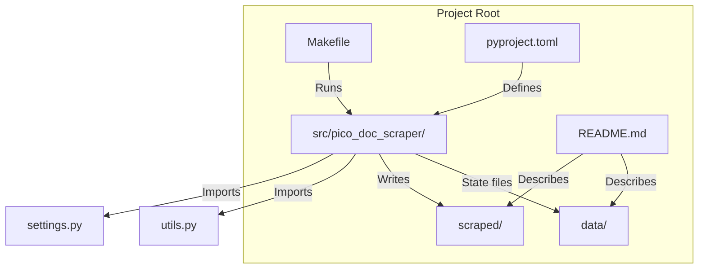
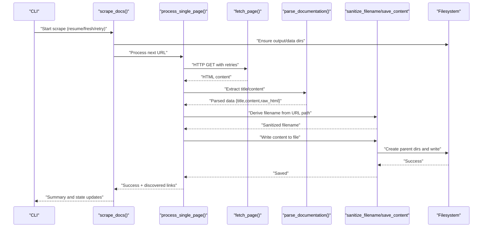
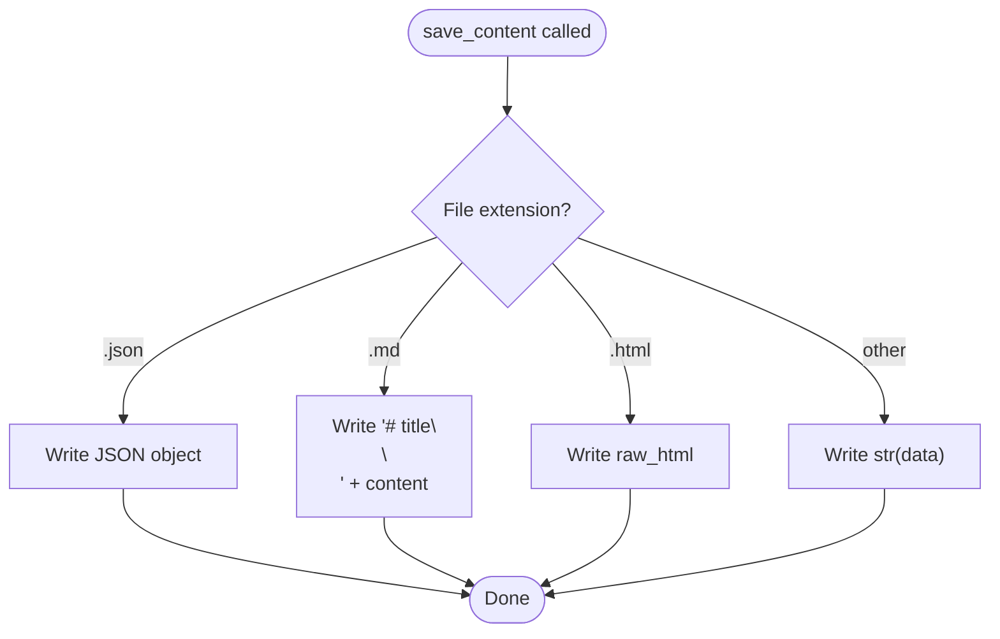
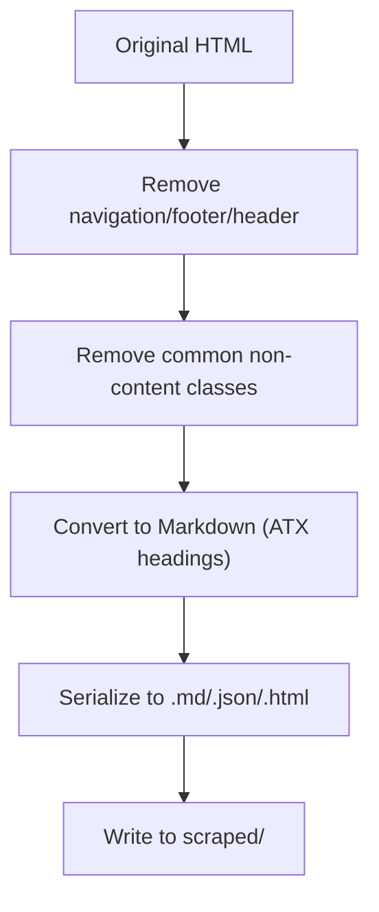
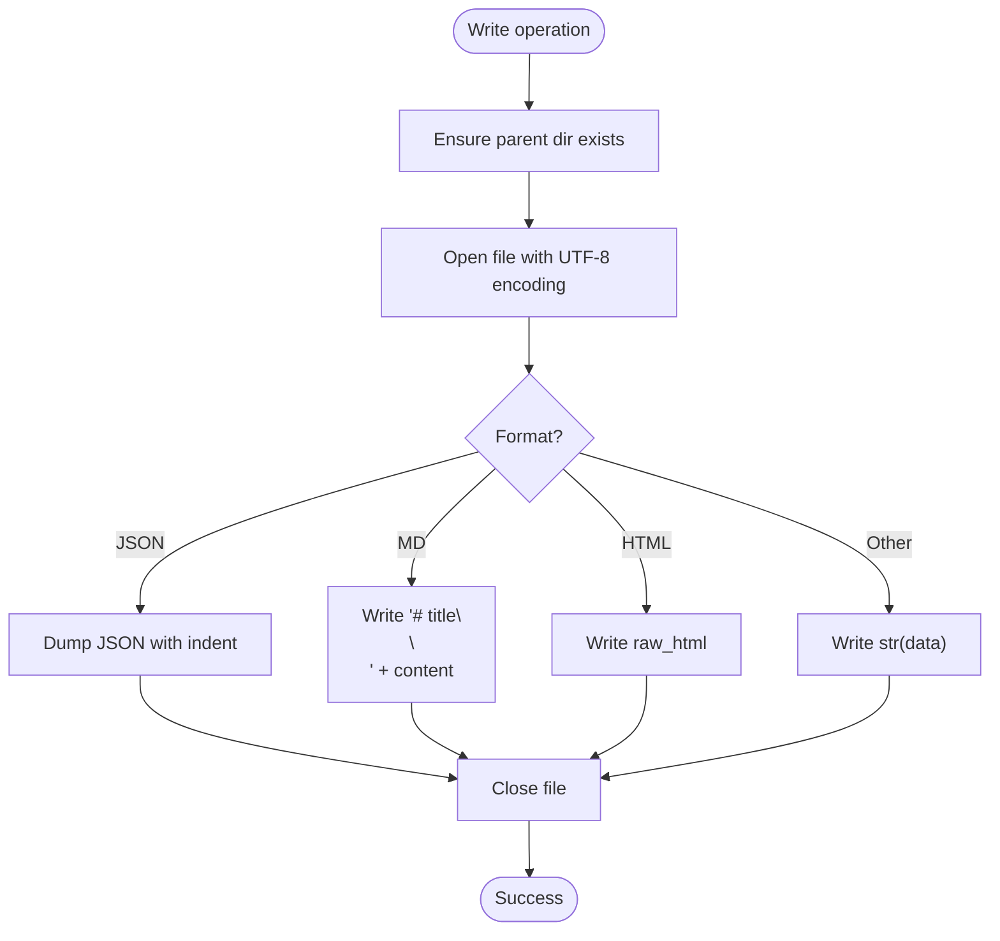
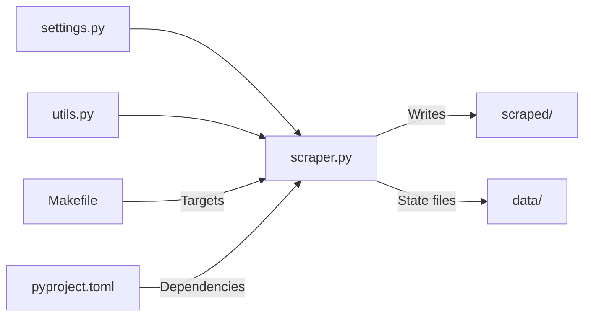

# Output Generation

<cite>
**Referenced Files in This Document**
- [README.md](file://README.md)
- [Makefile](file://Makefile)
- [pyproject.toml](file://pyproject.toml)
- [src/pico_doc_scraper/__init__.py](file://src/pico_doc_scraper/__init__.py)
- [src/pico_doc_scraper/__main__.py](file://src/pico_doc_scraper/__main__.py)
- [src/pico_doc_scraper/scraper.py](file://src/pico_doc_scraper/scraper.py)
- [src/pico_doc_scraper/settings.py](file://src/pico_doc_scraper/settings.py)
- [src/pico_doc_scraper/utils.py](file://src/pico_doc_scraper/utils.py)
- [scraped/index.md](file://scraped/index.md)
- [scraped/button.md](file://scraped/button.md)
- [scraped/forms.md](file://scraped/forms.md)
- [scraped/v1_buttons.html.md](file://scraped/v1_buttons.html.md)
- [scraped/version-picker_blue.md](file://scraped/version-picker_blue.md)
</cite>

## Table of Contents
1. [Introduction](#introduction)
2. [Project Structure](#project-structure)
3. [Core Components](#core-components)
4. [Architecture Overview](#architecture-overview)
5. [Detailed Component Analysis](#detailed-component-analysis)
6. [Dependency Analysis](#dependency-analysis)
7. [Performance Considerations](#performance-considerations)
8. [Troubleshooting Guide](#troubleshooting-guide)
9. [Conclusion](#conclusion)
10. [Appendices](#appendices)

## Introduction
This document explains the output generation system that transforms scraped HTML content into structured Markdown files. It covers how filenames are derived and sanitized, where files are written, how content is serialized, and how the system supports multiple output formats. It also describes the directory organization, the mapping from original HTML content to final Markdown, customization options, error handling for write operations, and practical guidance for post-processing and integrating the generated content into documentation systems.

## Project Structure
The project organizes output under a dedicated directory and persists state in a separate data directory. The scraper writes Markdown files to the scraped/ directory and tracks discovered, processed, and failed URLs in the data/ directory.



**Diagram sources**
- [README.md](file://README.md#L77-L79)
- [src/pico_doc_scraper/scraper.py](file://src/pico_doc_scraper/scraper.py#L303-L305)
- [src/pico_doc_scraper/settings.py](file://src/pico_doc_scraper/settings.py#L9-L17)

**Section sources**
- [README.md](file://README.md#L77-L79)
- [src/pico_doc_scraper/settings.py](file://src/pico_doc_scraper/settings.py#L9-L17)

## Core Components
- Settings define base URLs, allowed domain, output directories, state tracking files, HTTP client behavior, and output format selection.
- Utilities provide directory creation, content saving with format detection, filename sanitization, URL formatting helpers, and state persistence for URLs.
- Scraper orchestrates fetching, parsing, discovery, filename generation, and writing to disk, with robust error handling and resumable state.

Key responsibilities:
- Filename generation: Converts URL paths to Markdown filenames and sanitizes invalid characters.
- Content serialization: Writes Markdown, JSON, or raw HTML depending on file extension.
- Directory organization: Ensures output and data directories exist before writing.
- Error handling: Captures HTTP and unexpected errors, records failed URLs, and prints summaries.

**Section sources**
- [src/pico_doc_scraper/settings.py](file://src/pico_doc_scraper/settings.py#L1-L33)
- [src/pico_doc_scraper/utils.py](file://src/pico_doc_scraper/utils.py#L7-L175)
- [src/pico_doc_scraper/scraper.py](file://src/pico_doc_scraper/scraper.py#L24-L391)

## Architecture Overview
The output generation pipeline transforms HTML into Markdown and writes files to the scraped/ directory. The flow integrates HTTP fetching, HTML parsing, Markdown conversion, filename derivation, sanitization, and file writing.



**Diagram sources**
- [src/pico_doc_scraper/scraper.py](file://src/pico_doc_scraper/scraper.py#L287-L359)
- [src/pico_doc_scraper/scraper.py](file://src/pico_doc_scraper/scraper.py#L145-L194)
- [src/pico_doc_scraper/scraper.py](file://src/pico_doc_scraper/scraper.py#L24-L53)
- [src/pico_doc_scraper/scraper.py](file://src/pico_doc_scraper/scraper.py#L88-L142)
- [src/pico_doc_scraper/utils.py](file://src/pico_doc_scraper/utils.py#L50-L74)
- [src/pico_doc_scraper/utils.py](file://src/pico_doc_scraper/utils.py#L17-L48)

## Detailed Component Analysis

### File Naming Strategy and Directory Organization
- Base URL and domain restrictions ensure only documentation pages are scraped.
- Output directory is configured and ensured to exist before writing.
- Filename derivation:
  - The root documentation URL maps to index.md.
  - Other URLs convert /docs/{path} to {path}.md, replacing path separators with underscores.
  - The resulting filename is sanitized to avoid invalid filesystem characters and lengths.
- Directory organization:
  - All files are written under scraped/.
  - State files (discovered, processed, failed) are written under data/.

Examples of generated filenames and their origins:
- Root URL produces index.md.
- A URL like /docs/button becomes button.md.
- A URL like /docs/forms/input becomes forms_input.md.
- Version-specific pages like /docs/version-picker/blue become version-picker_blue.md.
- Legacy HTML content is preserved with .html.md suffixes to indicate raw HTML preservation.

**Section sources**
- [src/pico_doc_scraper/scraper.py](file://src/pico_doc_scraper/scraper.py#L164-L172)
- [src/pico_doc_scraper/utils.py](file://src/pico_doc_scraper/utils.py#L50-L74)
- [src/pico_doc_scraper/settings.py](file://src/pico_doc_scraper/settings.py#L9-L17)
- [scraped/index.md](file://scraped/index.md#L1-L76)
- [scraped/button.md](file://scraped/button.md#L1-L45)
- [scraped/forms.md](file://scraped/forms.md#L1-L31)
- [scraped/version-picker_blue.md](file://scraped/version-picker_blue.md#L1-L56)
- [scraped/v1_buttons.html.md](file://scraped/v1_buttons.html.md#L1-L21)

### Content Serialization and Multi-format Support
- Format selection is driven by the file extension:
  - .json: Writes a JSON object with keys for title, content, and raw_html.
  - .md: Writes a Markdown document with a top-level heading followed by the content.
  - .html: Writes the raw HTML content extracted from the main content area.
  - Other extensions: Writes a string representation of the data.
- Markdown serialization uses ATX-style headings for robust rendering compatibility.



**Diagram sources**
- [src/pico_doc_scraper/utils.py](file://src/pico_doc_scraper/utils.py#L17-L48)

**Section sources**
- [src/pico_doc_scraper/utils.py](file://src/pico_doc_scraper/utils.py#L17-L48)
- [src/pico_doc_scraper/scraper.py](file://src/pico_doc_scraper/scraper.py#L133-L142)

### Relationship Between Original HTML and Final Markdown
- The parser extracts the main content area from the HTML, removes navigation and non-content regions, and converts the remaining HTML to Markdown using ATX headings.
- The final Markdown includes the page title as a top-level heading and the converted content, preserving structure and readability.
- Some legacy content retains raw HTML in files suffixed with .html.md to preserve original markup for historical references.



**Diagram sources**
- [src/pico_doc_scraper/scraper.py](file://src/pico_doc_scraper/scraper.py#L88-L142)
- [src/pico_doc_scraper/utils.py](file://src/pico_doc_scraper/utils.py#L17-L48)

**Section sources**
- [src/pico_doc_scraper/scraper.py](file://src/pico_doc_scraper/scraper.py#L88-L142)
- [scraped/button.md](file://scraped/button.md#L1-L45)
- [scraped/forms.md](file://scraped/forms.md#L1-L31)
- [scraped/v1_buttons.html.md](file://scraped/v1_buttons.html.md#L1-L21)

### Filename Sanitization Techniques
- Replaces filesystem-invalid characters with underscores.
- Strips leading and trailing spaces and dots.
- Limits filename length to a safe maximum.
- Falls back to a default name if the result is empty.

```mermaid
flowchart TD
S(["Input filename"]) --> R1["Replace '/', '\\\\', ':', '*', '?', '\"', '<', '>', '|' with '_'"]
R1 --> R2["Strip leading/trailing spaces and dots"]
R2 --> Len{"Length > 200?"}
Len --> |Yes| Trunc["Truncate to 200 chars"]
Len --> |No| Keep["Keep as-is"]
Trunc --> Empty{"Empty?"}
Keep --> Empty
Empty --> |Yes| Def["Use 'untitled'"]
Empty --> |No| Out["Return sanitized filename"]
Def --> Out
```

**Diagram sources**
- [src/pico_doc_scraper/utils.py](file://src/pico_doc_scraper/utils.py#L50-L74)

**Section sources**
- [src/pico_doc_scraper/utils.py](file://src/pico_doc_scraper/utils.py#L50-L74)

### Directory Structure Organization and Category Mapping
- The scraped/ directory contains Markdown files organized by feature or topic derived from the URL path.
- Categories are implicit in the URL path segments:
  - /docs/button → button.md
  - /docs/forms/input → forms_input.md
  - /docs/version-picker/blue → version-picker_blue.md
- Legacy content is preserved with .html.md suffixes to maintain historical references.

**Section sources**
- [src/pico_doc_scraper/scraper.py](file://src/pico_doc_scraper/scraper.py#L164-L172)
- [scraped/button.md](file://scraped/button.md#L1-L45)
- [scraped/forms.md](file://scraped/forms.md#L1-L31)
- [scraped/version-picker_blue.md](file://scraped/version-picker_blue.md#L1-L56)
- [scraped/v1_buttons.html.md](file://scraped/v1_buttons.html.md#L1-L21)

### Examples of Generated File Contents and Structure
- index.md: Top-level quick start guide with installation and usage instructions.
- button.md: Feature-focused Markdown with headings and examples.
- forms.md: Overview and guidance with responsive form behavior.
- version-picker_blue.md: Themed variant documentation with configuration and usage examples.
- v1_buttons.html.md: Legacy HTML content preserved with .html.md suffix.

**Section sources**
- [scraped/index.md](file://scraped/index.md#L1-L76)
- [scraped/button.md](file://scraped/button.md#L1-L45)
- [scraped/forms.md](file://scraped/forms.md#L1-L31)
- [scraped/version-picker_blue.md](file://scraped/version-picker_blue.md#L1-L56)
- [scraped/v1_buttons.html.md](file://scraped/v1_buttons.html.md#L1-L21)

### Output Customization and Formatting Preferences
- Output format is configurable in settings; supported formats include markdown, json, and html.
- Markdown serialization uses ATX-style headings for broad compatibility.
- The system preserves raw HTML for legacy content by writing .html.md files.

**Section sources**
- [src/pico_doc_scraper/settings.py](file://src/pico_doc_scraper/settings.py#L31-L33)
- [src/pico_doc_scraper/scraper.py](file://src/pico_doc_scraper/scraper.py#L133-L142)
- [src/pico_doc_scraper/utils.py](file://src/pico_doc_scraper/utils.py#L17-L48)

### File System Integration Patterns and Error Handling
- Directory creation: Parent directories are created automatically before writing.
- Write operations:
  - UTF-8 encoding is used for all text formats.
  - JSON is written with indentation and ASCII preservation.
  - Markdown and HTML are written as plain text.
- Error handling:
  - HTTP errors and unexpected exceptions are caught per page.
  - Failed URLs are recorded to a state file for later retry.
  - Summary prints counts and saves failed URLs for convenience.



**Diagram sources**
- [src/pico_doc_scraper/utils.py](file://src/pico_doc_scraper/utils.py#L17-L48)

**Section sources**
- [src/pico_doc_scraper/utils.py](file://src/pico_doc_scraper/utils.py#L7-L175)
- [src/pico_doc_scraper/scraper.py](file://src/pico_doc_scraper/scraper.py#L195-L229)

## Dependency Analysis
The scraper depends on configuration, utilities, and third-party libraries for HTTP, parsing, and Markdown conversion. The Makefile and pyproject.toml define how to run and package the project.



**Diagram sources**
- [src/pico_doc_scraper/scraper.py](file://src/pico_doc_scraper/scraper.py#L11-L21)
- [src/pico_doc_scraper/settings.py](file://src/pico_doc_scraper/settings.py#L1-L33)
- [src/pico_doc_scraper/utils.py](file://src/pico_doc_scraper/utils.py#L1-L175)
- [Makefile](file://Makefile#L115-L125)
- [pyproject.toml](file://pyproject.toml#L9-L14)

**Section sources**
- [src/pico_doc_scraper/scraper.py](file://src/pico_doc_scraper/scraper.py#L11-L21)
- [Makefile](file://Makefile#L115-L125)
- [pyproject.toml](file://pyproject.toml#L9-L14)

## Performance Considerations
- Politeness: A configurable delay is applied between requests to avoid overloading the target server.
- Resumable work: State files enable interruption and continuation without reprocessing successful pages.
- Incremental persistence: Discovered and processed URLs are saved incrementally to minimize data loss.

**Section sources**
- [src/pico_doc_scraper/settings.py](file://src/pico_doc_scraper/settings.py#L28-L30)
- [src/pico_doc_scraper/scraper.py](file://src/pico_doc_scraper/scraper.py#L339-L348)

## Troubleshooting Guide
Common issues and resolutions:
- Permission errors when writing to scraped/: Ensure the directory exists and is writable; the code creates parent directories automatically.
- Invalid filenames: Filenames are sanitized; if a URL produces an empty result, a default name is used.
- Failed URLs: Failures are recorded in the failed state file; use the retry command to process only those URLs.
- Interrupted runs: The scraper can be stopped and resumed; discovered and processed URLs are persisted.

Operational commands:
- Start or resume scraping: make scrape
- Retry only failed URLs: make scrape-retry
- Fresh start: make scrape-fresh

**Section sources**
- [src/pico_doc_scraper/utils.py](file://src/pico_doc_scraper/utils.py#L50-L74)
- [src/pico_doc_scraper/utils.py](file://src/pico_doc_scraper/utils.py#L92-L128)
- [src/pico_doc_scraper/scraper.py](file://src/pico_doc_scraper/scraper.py#L221-L227)
- [README.md](file://README.md#L23-L53)
- [Makefile](file://Makefile#L115-L125)

## Conclusion
The output generation system reliably transforms Pico.css documentation HTML into Markdown files, with careful filename sanitization, explicit directory organization, and multi-format support. It offers resumable execution, incremental state persistence, and clear error reporting. The generated content is suitable for documentation systems and can be further processed or integrated as needed.

## Appendices

### A. Configuration Reference
- Output format: Selectable in settings; default is Markdown.
- Output directory: Configured in settings; used for scraped/ content.
- Data directory: Configured in settings; used for state tracking files.

**Section sources**
- [src/pico_doc_scraper/settings.py](file://src/pico_doc_scraper/settings.py#L31-L33)
- [src/pico_doc_scraper/settings.py](file://src/pico_doc_scraper/settings.py#L9-L17)

### B. Post-processing and Integration Guidance
- Validation: Verify that generated Markdown renders correctly in your documentation platform.
- Automation: Use the Makefile targets to run scraping and retries consistently.
- Packaging: Build a distribution using the project configuration for deployment or sharing.

**Section sources**
- [README.md](file://README.md#L101-L118)
- [Makefile](file://Makefile#L115-L125)
- [pyproject.toml](file://pyproject.toml#L1-L75)