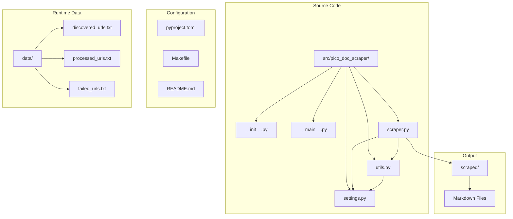
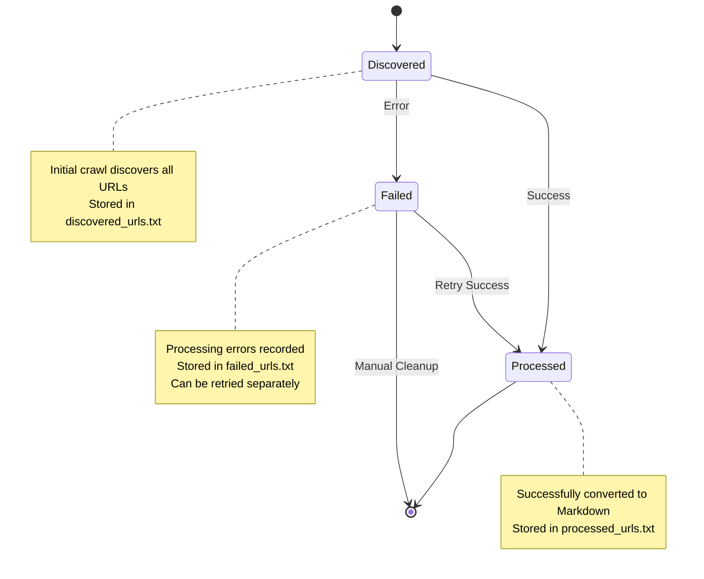
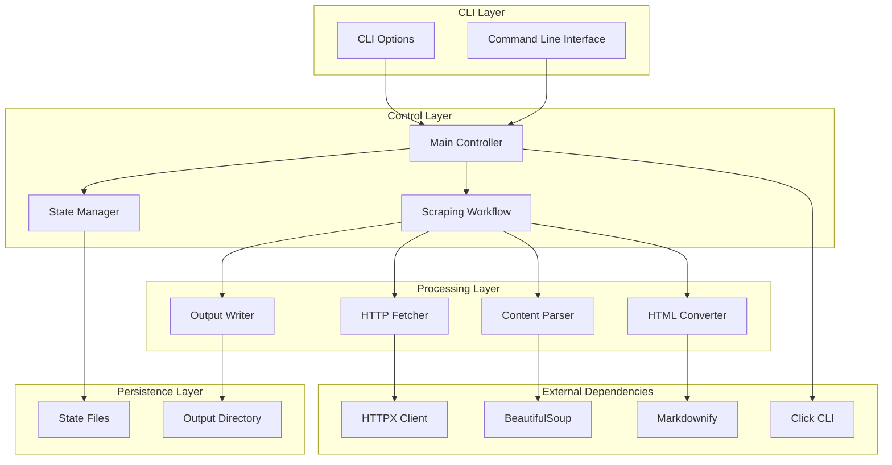
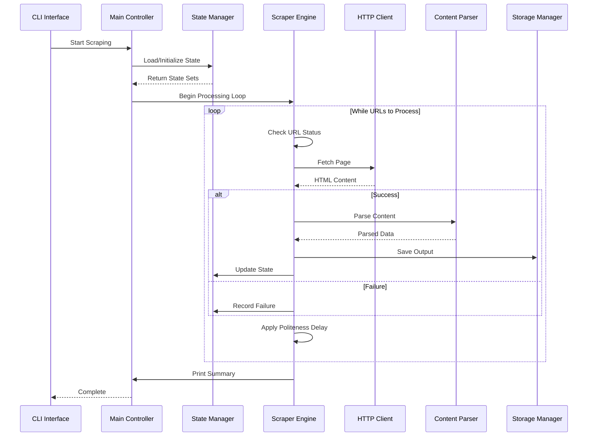
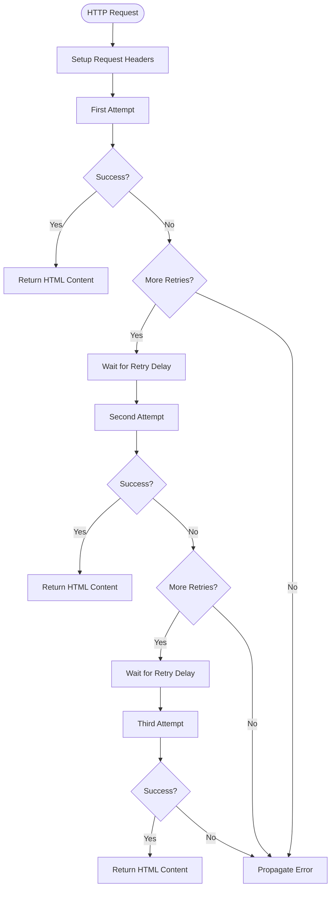
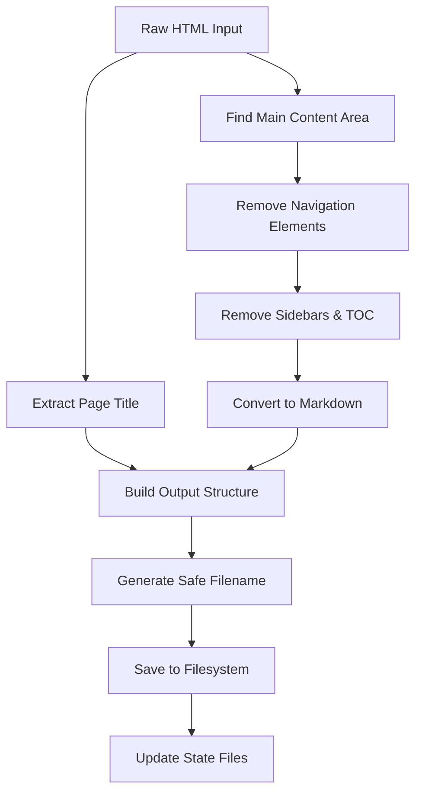
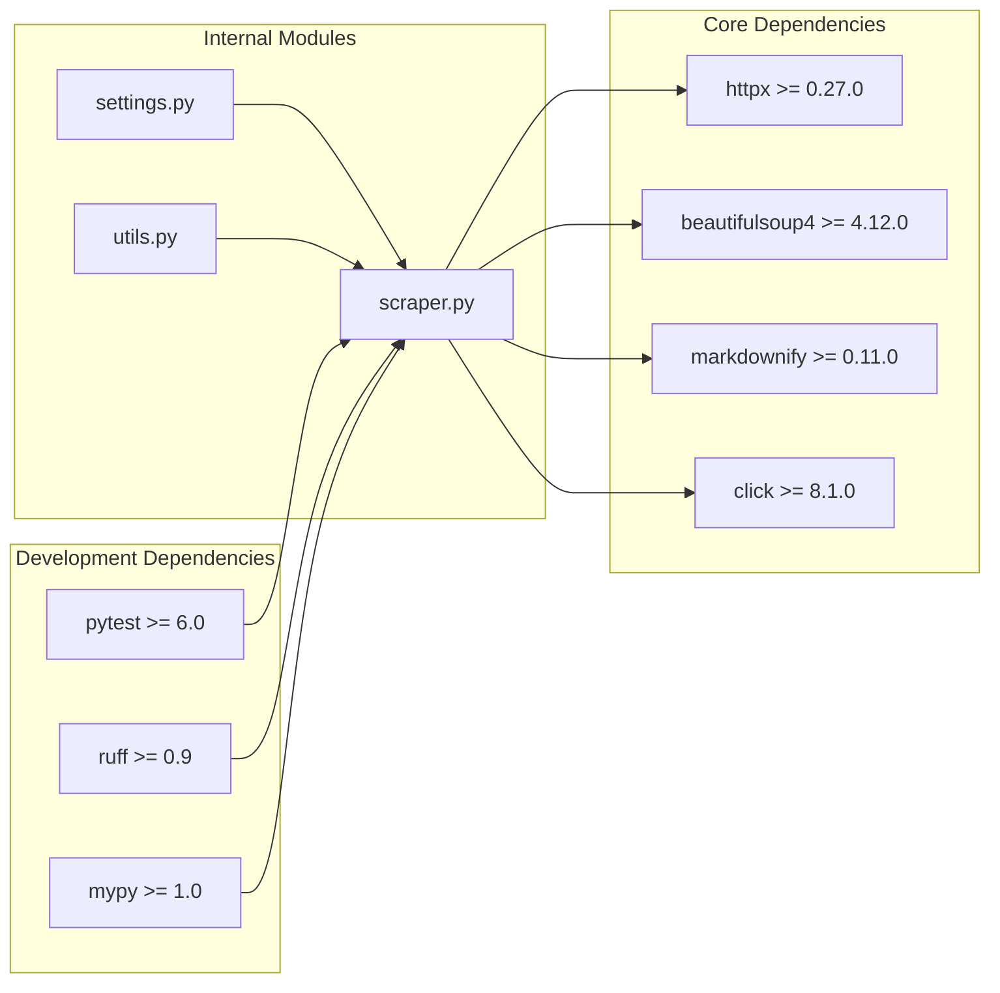

# Core Features and Capabilities

<cite>
**Referenced Files in This Document**
- [README.md](file://README.md)
- [src/pico_doc_scraper/scraper.py](file://src/pico_doc_scraper/scraper.py)
- [src/pico_doc_scraper/settings.py](file://src/pico_doc_scraper/settings.py)
- [src/pico_doc_scraper/utils.py](file://src/pico_doc_scraper/utils.py)
- [src/pico_doc_scraper/__main__.py](file://src/pico_doc_scraper/__main__.py)
- [Makefile](file://Makefile)
- [pyproject.toml](file://pyproject.toml)
</cite>

## Table of Contents
1. [Introduction](#introduction)
2. [Project Structure](#project-structure)
3. [Core Components](#core-components)
4. [Architecture Overview](#architecture-overview)
5. [Detailed Component Analysis](#detailed-component-analysis)
6. [Dependency Analysis](#dependency-analysis)
7. [Performance Considerations](#performance-considerations)
8. [Troubleshooting Guide](#troubleshooting-guide)
9. [Conclusion](#conclusion)

## Introduction
The Pico CSS Documentation Scraper is a resilient web scraper designed to convert HTML documentation pages from picocss.com into well-formatted Markdown files. Built with Python 3.12+, it provides robust state management, automatic resume functionality, and graceful error handling to ensure reliable documentation extraction even when encountering network issues or page failures.

The scraper operates as a command-line tool with intuitive CLI options for different scraping modes, making it accessible to both developers and non-technical users. Its modular architecture separates concerns between HTTP handling, content parsing, state management, and output generation.

## Project Structure
The project follows a clean, modular structure that promotes maintainability and extensibility:

**Diagram sources**
- [src/pico_doc_scraper/scraper.py](file://src/pico_doc_scraper/scraper.py#L1-L391)
- [src/pico_doc_scraper/settings.py](file://src/pico_doc_scraper/settings.py#L1-L33)
- [src/pico_doc_scraper/utils.py](file://src/pico_doc_scraper/utils.py#L1-L175)

**Section sources**
- [src/pico_doc_scraper/scraper.py](file://src/pico_doc_scraper/scraper.py#L1-L391)
- [src/pico_doc_scraper/settings.py](file://src/pico_doc_scraper/settings.py#L1-L33)
- [src/pico_doc_scraper/utils.py](file://src/pico_doc_scraper/utils.py#L1-L175)

## Core Components

### Automatic Resume System
The scraper implements a sophisticated state persistence mechanism that enables seamless continuation from where it left off after interruptions. This system maintains three separate state files that track the scraper's progress:

- **Discovered URLs**: Complete inventory of all URLs found during crawling
- **Processed URLs**: Successfully converted pages that are ready for output
- **Failed URLs**: Pages that encountered errors during processing

The state management works through incremental persistence, saving updates after each URL completion. This design ensures that even if the scraper is interrupted mid-process, it can resume from the last saved state without losing progress.

**Section sources**
- [src/pico_doc_scraper/scraper.py](file://src/pico_doc_scraper/scraper.py#L231-L285)
- [src/pico_doc_scraper/utils.py](file://src/pico_doc_scraper/utils.py#L130-L158)

### State Tracking Management
The state tracking system employs a three-tier approach to manage URL lifecycle:

**Diagram sources**
- [src/pico_doc_scraper/scraper.py](file://src/pico_doc_scraper/scraper.py#L231-L285)
- [src/pico_doc_scraper/utils.py](file://src/pico_doc_scraper/utils.py#L130-L158)

**Section sources**
- [src/pico_doc_scraper/scraper.py](file://src/pico_doc_scraper/scraper.py#L231-L285)
- [src/pico_doc_scraper/utils.py](file://src/pico_doc_scraper/utils.py#L130-L158)

### Retry Mechanism Implementation
The retry system provides granular control over failed URL processing:

- **Selective Retry**: Only URLs from the failed state file are processed
- **Incremental Updates**: Failed URLs are saved immediately after detection
- **Clean State Management**: Empty failed state clears the persistent file
- **Progressive Recovery**: Failed URLs can be retried independently without reprocessing successful pages

The retry mechanism integrates seamlessly with the main scraping workflow, allowing operators to address intermittent network issues or temporary server problems without restarting the entire scraping operation.

**Section sources**
- [src/pico_doc_scraper/scraper.py](file://src/pico_doc_scraper/scraper.py#L254-L262)
- [src/pico_doc_scraper/utils.py](file://src/pico_doc_scraper/utils.py#L112-L127)

### Fresh Start Capability
The fresh start option provides complete reset functionality:

- **Complete State Clearing**: Removes all three state files (discovered, processed, failed)
- **Clean Slate Operation**: Starts scraping from the configured base URL
- **Domain Restriction Reset**: Maintains domain restrictions while clearing historical state
- **Progress Monitoring**: Provides clear feedback about the reset operation

This feature is essential for maintaining data integrity when scraping configurations change or when operators need to restart the scraping process entirely.

**Section sources**
- [src/pico_doc_scraper/scraper.py](file://src/pico_doc_scraper/scraper.py#L244-L247)
- [src/pico_doc_scraper/utils.py](file://src/pico_doc_scraper/utils.py#L161-L175)

### Domain Restriction System
The domain restriction mechanism ensures focused scraping within the target website:

- **Strict Domain Validation**: Only URLs matching the allowed domain are processed
- **Path Filtering**: Restricts scraping to the `/docs` path structure
- **File Type Exclusion**: Automatically filters out binary files (PDF, ZIP, TAR.GZ)
- **URL Normalization**: Removes fragments and query parameters for consistent comparison

This system prevents the scraper from venturing outside the intended documentation site, maintaining focus on relevant content while avoiding unnecessary resource consumption.

**Section sources**
- [src/pico_doc_scraper/scraper.py](file://src/pico_doc_scraper/scraper.py#L75-L84)
- [src/pico_doc_scraper/settings.py](file://src/pico_doc_scraper/settings.py#L6-L7)

### HTML to Markdown Conversion
The content transformation pipeline converts HTML documentation into clean Markdown format:

- **Structured Content Extraction**: Identifies main content areas using multiple selectors
- **Navigation Removal**: Strips navigation elements, footers, and sidebars
- **Semantic Preservation**: Maintains heading structure and content hierarchy
- **Markdown Generation**: Uses markdownify with ATX heading style for clean output

The conversion process prioritizes readability and maintainability of the extracted content, ensuring that the resulting Markdown files are suitable for documentation systems and static site generators.

**Section sources**
- [src/pico_doc_scraper/scraper.py](file://src/pico_doc_scraper/scraper.py#L88-L142)

### Graceful Error Handling
The error handling system ensures continuous operation despite individual page failures:

- **Individual Page Isolation**: Failed pages don't interrupt the entire scraping process
- **Error Classification**: Distinguishes between HTTP errors and parsing exceptions
- **Failure Logging**: Records detailed error information for debugging
- **State Persistence**: Continues saving successful state updates even during failures

This approach maximizes throughput by preventing cascading failures and allowing operators to address issues systematically.

**Section sources**
- [src/pico_doc_scraper/scraper.py](file://src/pico_doc_scraper/scraper.py#L187-L193)

### Polite Scraping Configuration
The scraping behavior includes configurable politeness measures:

- **Configurable Delays**: Adjustable wait time between requests (default: 1 second)
- **User Agent Identification**: Clear identification of the scraper for ethical scraping
- **Timeout Management**: Configurable request timeouts to prevent hanging connections
- **Retry Logic**: Built-in retry mechanism for transient network issues

These features ensure respectful interaction with the target server while maintaining efficient scraping performance.

**Section sources**
- [src/pico_doc_scraper/scraper.py](file://src/pico_doc_scraper/scraper.py#L322-L324)
- [src/pico_doc_scraper/settings.py](file://src/pico_doc_scraper/settings.py#L28-L29)

## Architecture Overview

The scraper follows a layered architecture that separates concerns and promotes maintainability:

**Diagram sources**
- [src/pico_doc_scraper/scraper.py](file://src/pico_doc_scraper/scraper.py#L1-L391)
- [src/pico_doc_scraper/settings.py](file://src/pico_doc_scraper/settings.py#L1-L33)

The architecture emphasizes separation of concerns:
- **CLI Layer**: Handles user interaction and argument parsing
- **Control Layer**: Manages scraping workflow and state coordination
- **Processing Layer**: Performs HTTP requests, content parsing, and output generation
- **Persistence Layer**: Handles file I/O and state management

## Detailed Component Analysis

### Main Scraping Workflow
The primary scraping workflow orchestrates the entire scraping process through a sophisticated state machine:

**Diagram sources**
- [src/pico_doc_scraper/scraper.py](file://src/pico_doc_scraper/scraper.py#L287-L359)

**Section sources**
- [src/pico_doc_scraper/scraper.py](file://src/pico_doc_scraper/scraper.py#L287-L359)

### HTTP Request Processing
The HTTP fetching mechanism implements robust retry logic with exponential backoff:

**Diagram sources**
- [src/pico_doc_scraper/scraper.py](file://src/pico_doc_scraper/scraper.py#L24-L52)

**Section sources**
- [src/pico_doc_scraper/scraper.py](file://src/pico_doc_scraper/scraper.py#L24-L52)

### Content Processing Pipeline
The content processing pipeline transforms raw HTML into structured Markdown:

**Diagram sources**
- [src/pico_doc_scraper/scraper.py](file://src/pico_doc_scraper/scraper.py#L88-L142)

**Section sources**
- [src/pico_doc_scraper/scraper.py](file://src/pico_doc_scraper/scraper.py#L88-L142)

## Dependency Analysis

The project maintains minimal external dependencies while providing comprehensive functionality:

**Diagram sources**
- [pyproject.toml](file://pyproject.toml#L9-L24)
- [src/pico_doc_scraper/scraper.py](file://src/pico_doc_scraper/scraper.py#L1-L21)

The dependency graph reveals a clean, focused architecture where each external library serves a specific purpose:
- **httpx**: Modern HTTP client with advanced features
- **beautifulsoup4**: Robust HTML parsing and manipulation
- **markdownify**: Reliable HTML to Markdown conversion
- **click**: User-friendly command-line interface

**Section sources**
- [pyproject.toml](file://pyproject.toml#L9-L24)

## Performance Considerations

The scraper implements several performance optimization strategies:

### Memory Efficiency
- **Set-Based URL Tracking**: Uses Python sets for O(1) lookup performance
- **Incremental State Persistence**: Saves state updates rather than accumulating in memory
- **Lazy Loading**: Loads state files only when needed

### Network Optimization
- **Connection Pooling**: Reuses HTTP connections through httpx client context
- **Configurable Delays**: Prevents overwhelming target servers
- **Retry Logic**: Balances persistence with network efficiency

### File I/O Optimization
- **Batch State Updates**: Writes state files after significant progress
- **Efficient File Operations**: Uses appropriate buffering and encoding
- **Directory Creation**: Creates output directories only when needed

## Troubleshooting Guide

### Common Issues and Solutions

**State File Corruption**
- **Symptom**: Inconsistent state or repeated processing of URLs
- **Solution**: Use the fresh start option to clear corrupted state files
- **Prevention**: Allow scraper to complete normally before interruption

**Network Connectivity Issues**
- **Symptom**: Frequent HTTP errors or timeouts
- **Solution**: Adjust REQUEST_TIMEOUT and MAX_RETRIES settings
- **Alternative**: Use retry mode to process only failed URLs

**Memory Exhaustion**
- **Symptom**: Out of memory errors during large scrapes
- **Solution**: Monitor state file sizes and use incremental processing
- **Prevention**: Regularly save state during long scraping sessions

**Domain Restriction Problems**
- **Symptom**: URLs being filtered incorrectly
- **Solution**: Verify ALLOWED_DOMAIN setting matches target site
- **Debugging**: Check discovered URLs file for unexpected entries

**Output Quality Issues**
- **Symptom**: Poorly formatted Markdown output
- **Solution**: Review content selectors and adjust parsing logic
- **Customization**: Modify content extraction selectors for specific needs

**Section sources**
- [src/pico_doc_scraper/scraper.py](file://src/pico_doc_scraper/scraper.py#L350-L358)
- [src/pico_doc_scraper/settings.py](file://src/pico_doc_scraper/settings.py#L20-L22)

## Conclusion

The Pico CSS Documentation Scraper represents a mature, production-ready solution for automated documentation extraction. Its comprehensive feature set, including automatic resume functionality, robust state management, and graceful error handling, makes it suitable for both small-scale documentation projects and large-scale content migration efforts.

The modular architecture ensures maintainability while the clean separation of concerns facilitates future enhancements. The combination of domain restriction, polite scraping configuration, and flexible output formats positions this scraper as a versatile tool for documentation automation across various use cases.

Key strengths include:
- **Reliability**: Automatic resume and comprehensive error handling
- **Flexibility**: Multiple scraping modes and configuration options
- **Maintainability**: Clean architecture with clear separation of concerns
- **Ethical Design**: Polite scraping with configurable delays and user agent identification

The scraper's design demonstrates best practices in web scraping, balancing efficiency with respect for target servers while providing operators with powerful tools for managing complex scraping workflows.