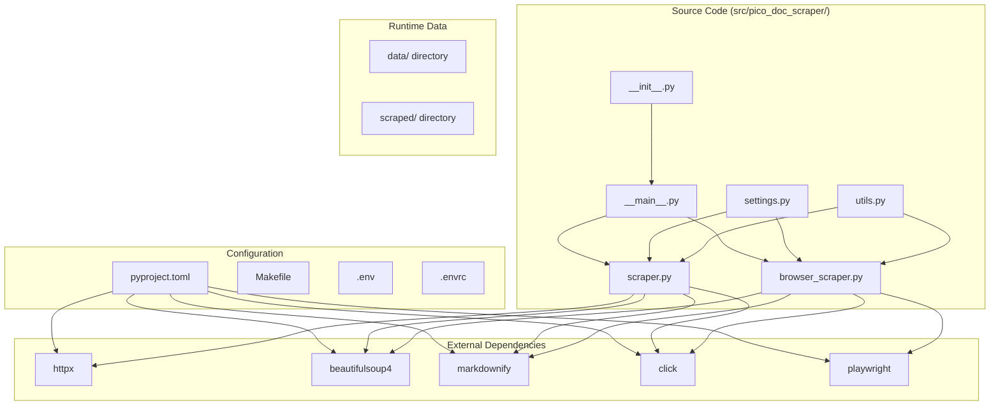
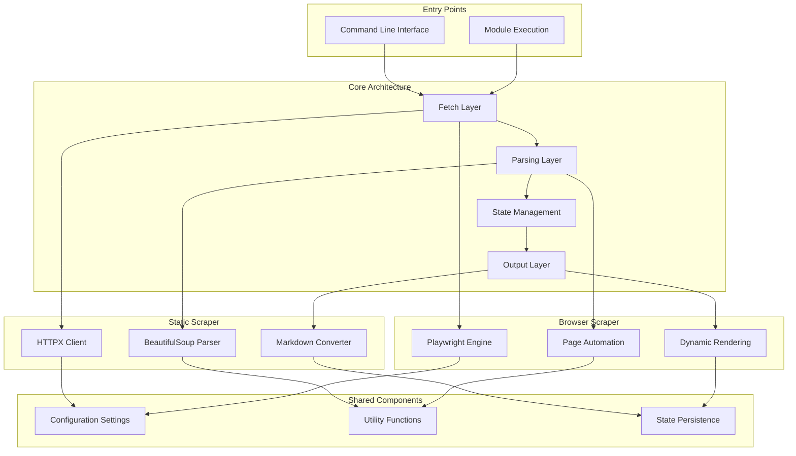
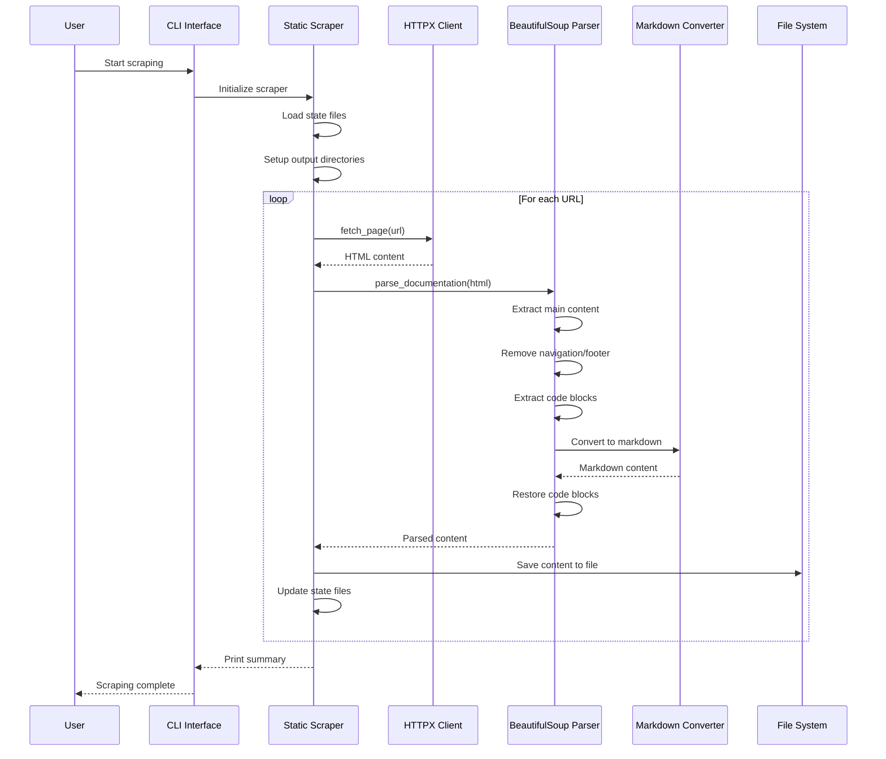
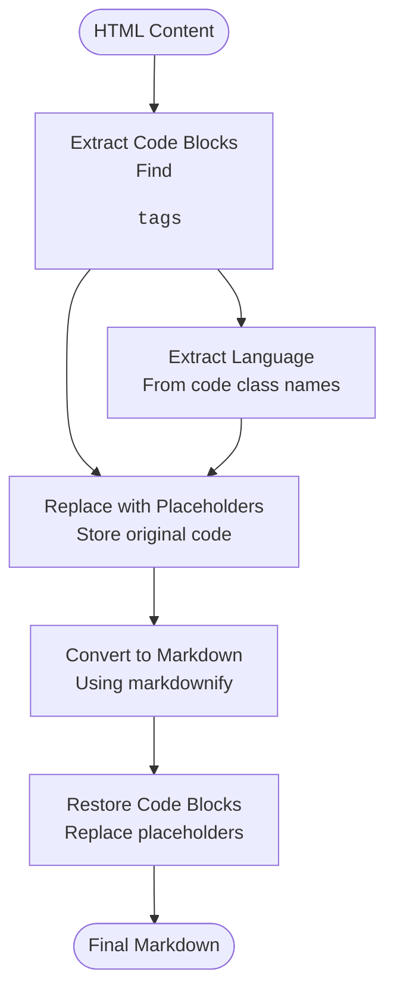
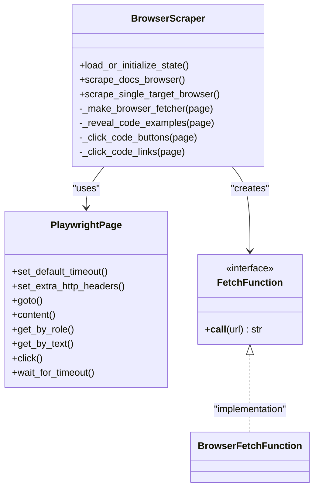
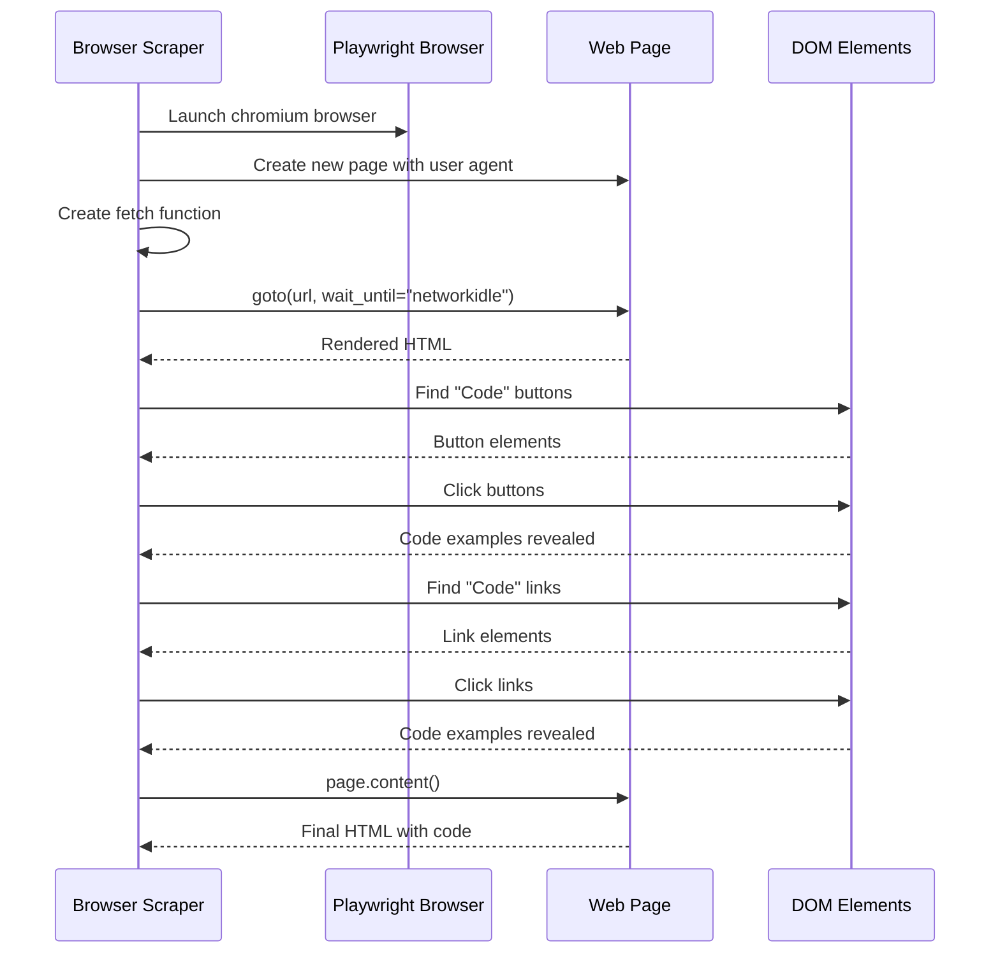
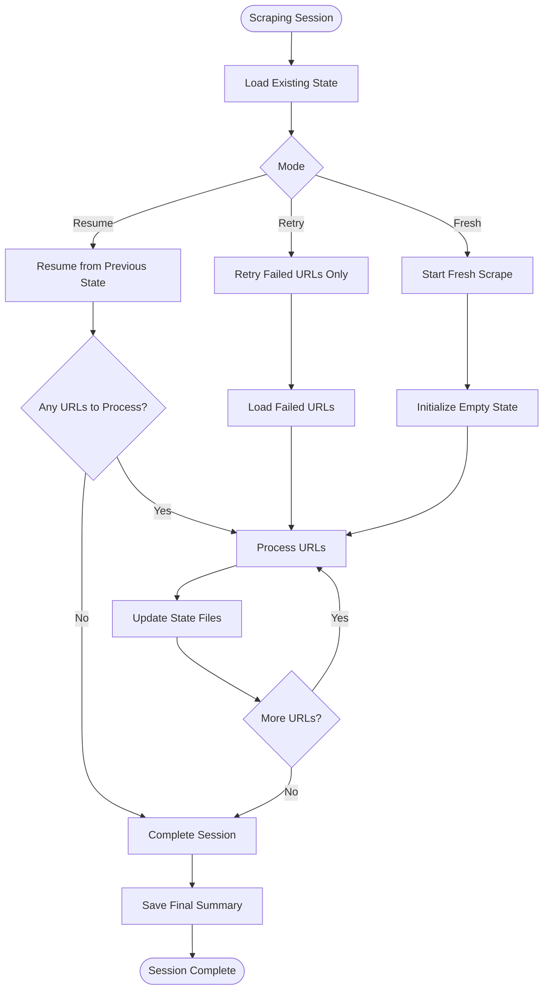
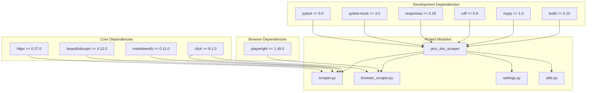

# JavaScript-Aware Browser Scraping

<cite>
**Referenced Files in This Document**
- [README.md](file://README.md)
- [pyproject.toml](file://pyproject.toml)
- [Makefile](file://Makefile)
- [.env](file://.env)
- [.envrc](file://.envrc)
- [src/pico_doc_scraper/__init__.py](file://src/pico_doc_scraper/__init__.py)
- [src/pico_doc_scraper/__main__.py](file://src/pico_doc_scraper/__main__.py)
- [src/pico_doc_scraper/settings.py](file://src/pico_doc_scraper/settings.py)
- [src/pico_doc_scraper/utils.py](file://src/pico_doc_scraper/utils.py)
- [src/pico_doc_scraper/scraper.py](file://src/pico_doc_scraper/scraper.py)
- [src/pico_doc_scraper/browser_scraper.py](file://src/pico_doc_scraper/browser_scraper.py)
</cite>

## Table of Contents
1. [Introduction](#introduction)
2. [Project Structure](#project-structure)
3. [Core Components](#core-components)
4. [Architecture Overview](#architecture-overview)
5. [Detailed Component Analysis](#detailed-component-analysis)
6. [Dependency Analysis](#dependency-analysis)
7. [Performance Considerations](#performance-considerations)
8. [Troubleshooting Guide](#troubleshooting-guide)
9. [Conclusion](#conclusion)

## Introduction
This project is a resilient web scraper specifically designed for the Pico.css documentation website. It provides two distinct scraping modes: a traditional HTTP-based scraper for static content and a JavaScript-aware browser scraper powered by Playwright for dynamic, JavaScript-rendered content. The scraper automatically handles state persistence, retry mechanisms, and graceful error handling while converting HTML content to well-formatted Markdown.

The project emphasizes modularity and resilience, featuring automatic resume capabilities, domain restriction, and configurable politeness settings to respect server resources. Its architecture demonstrates clean separation of concerns, allowing for easy extension and maintenance.

## Project Structure
The project follows a well-organized structure that separates concerns across different modules:

**Diagram sources**
- [src/pico_doc_scraper/__main__.py](file://src/pico_doc_scraper/__main__.py#L1-L7)
- [src/pico_doc_scraper/scraper.py](file://src/pico_doc_scraper/scraper.py#L1-L512)
- [src/pico_doc_scraper/browser_scraper.py](file://src/pico_doc_scraper/browser_scraper.py#L1-L254)
- [pyproject.toml](file://pyproject.toml#L1-L78)

**Section sources**
- [src/pico_doc_scraper/__init__.py](file://src/pico_doc_scraper/__init__.py#L1-L4)
- [src/pico_doc_scraper/__main__.py](file://src/pico_doc_scraper/__main__.py#L1-L7)
- [pyproject.toml](file://pyproject.toml#L1-L78)

## Core Components
The scraper consists of several interconnected components that work together to provide robust web scraping capabilities:

### Configuration Management
The settings module centralizes all configuration parameters, including base URLs, domain restrictions, timeouts, and output formatting preferences. This design enables easy customization without modifying core logic.

### State Management
The utility module provides comprehensive state persistence functionality, managing three critical state files:
- `discovered_urls.txt`: Tracks all URLs found during crawling
- `processed_urls.txt`: Records successfully processed URLs  
- `failed_urls.txt`: Maintains URLs that failed during scraping attempts

### Content Processing Pipeline
The core scraping logic implements a sophisticated content processing pipeline that handles HTML-to-Markdown conversion while preserving code examples through a three-phase extraction and restoration process.

### Browser Integration
The JavaScript-aware scraper integrates Playwright for headless browser automation, enabling dynamic content rendering and interactive element manipulation before content extraction.

**Section sources**
- [src/pico_doc_scraper/settings.py](file://src/pico_doc_scraper/settings.py#L1-L33)
- [src/pico_doc_scraper/utils.py](file://src/pico_doc_scraper/utils.py#L1-L175)
- [src/pico_doc_scraper/scraper.py](file://src/pico_doc_scraper/scraper.py#L1-L512)
- [src/pico_doc_scraper/browser_scraper.py](file://src/pico_doc_scraper/browser_scraper.py#L1-L254)

## Architecture Overview
The project employs a modular, pluggable architecture that separates scraping concerns into distinct layers:

**Diagram sources**
- [src/pico_doc_scraper/scraper.py](file://src/pico_doc_scraper/scraper.py#L1-L512)
- [src/pico_doc_scraper/browser_scraper.py](file://src/pico_doc_scraper/browser_scraper.py#L1-L254)
- [src/pico_doc_scraper/settings.py](file://src/pico_doc_scraper/settings.py#L1-L33)
- [src/pico_doc_scraper/utils.py](file://src/pico_doc_scraper/utils.py#L1-L175)

The architecture demonstrates several key design principles:
- **Separation of Concerns**: Each component has a specific responsibility
- **Pluggable Fetchers**: The same parsing logic works with different fetch methods
- **State Persistence**: All progress is saved incrementally for resilience
- **Clean Abstraction**: Browser-specific code is isolated from core logic

## Detailed Component Analysis

### Static Scraper Implementation
The static scraper provides reliable content extraction for traditional web pages using HTTPX for requests, BeautifulSoup for HTML parsing, and markdownify for content conversion.

**Diagram sources**
- [src/pico_doc_scraper/scraper.py](file://src/pico_doc_scraper/scraper.py#L25-L512)
- [src/pico_doc_scraper/utils.py](file://src/pico_doc_scraper/utils.py#L17-L175)

The static scraper implements several sophisticated features:

#### Code Block Preservation Mechanism
The scraper employs a three-phase process to preserve code examples during HTML-to-Markdown conversion:

**Diagram sources**
- [src/pico_doc_scraper/scraper.py](file://src/pico_doc_scraper/scraper.py#L89-L146)

#### Link Discovery and Filtering
The scraper implements intelligent link discovery with strict filtering criteria:
- Domain restriction to prevent crawling external sites
- Path filtering to focus on documentation content
- Extension filtering to avoid downloading files
- Fragment and query string normalization

**Section sources**
- [src/pico_doc_scraper/scraper.py](file://src/pico_doc_scraper/scraper.py#L25-L512)

### Browser Scraper Implementation
The browser scraper extends the core functionality by adding JavaScript rendering capabilities through Playwright integration.

**Diagram sources**
- [src/pico_doc_scraper/browser_scraper.py](file://src/pico_doc_scraper/browser_scraper.py#L23-L254)

#### Dynamic Content Interaction
The browser scraper implements sophisticated interaction with JavaScript-rendered content:

**Diagram sources**
- [src/pico_doc_scraper/browser_scraper.py](file://src/pico_doc_scraper/browser_scraper.py#L23-L96)

**Section sources**
- [src/pico_doc_scraper/browser_scraper.py](file://src/pico_doc_scraper/browser_scraper.py#L1-L254)

### State Management System
The state management system provides comprehensive progress tracking and recovery capabilities:

**Diagram sources**
- [src/pico_doc_scraper/scraper.py](file://src/pico_doc_scraper/scraper.py#L314-L442)
- [src/pico_doc_scraper/utils.py](file://src/pico_doc_scraper/utils.py#L92-L175)

**Section sources**
- [src/pico_doc_scraper/scraper.py](file://src/pico_doc_scraper/scraper.py#L314-L442)
- [src/pico_doc_scraper/utils.py](file://src/pico_doc_scraper/utils.py#L92-L175)

## Dependency Analysis
The project maintains a clean dependency structure with clear separation between core functionality and optional browser support:

**Diagram sources**
- [pyproject.toml](file://pyproject.toml#L9-L27)
- [src/pico_doc_scraper/scraper.py](file://src/pico_doc_scraper/scraper.py#L1-L22)
- [src/pico_doc_scraper/browser_scraper.py](file://src/pico_doc_scraper/browser_scraper.py#L1-L21)

The dependency analysis reveals several important characteristics:

### Optional Browser Support
The browser functionality is implemented as an optional dependency, allowing users to install only the core scraping functionality if JavaScript rendering is not required. This design choice reduces installation overhead for basic use cases.

### Clean Module Separation
Each module has a specific responsibility:
- `scraper.py`: Core scraping logic and HTTP-based fetching
- `browser_scraper.py`: Browser-based scraping with Playwright integration
- `settings.py`: Centralized configuration management
- `utils.py`: Shared utility functions for state management and file operations

**Section sources**
- [pyproject.toml](file://pyproject.toml#L9-L27)
- [src/pico_doc_scraper/scraper.py](file://src/pico_doc_scraper/scraper.py#L1-L22)
- [src/pico_doc_scraper/browser_scraper.py](file://src/pico_doc_scraper/browser_scraper.py#L1-L21)

## Performance Considerations
The scraper implements several performance optimization strategies:

### Polite Request Handling
- Configurable delays between requests to avoid overwhelming servers
- Respectful user agent identification for transparency
- Graceful handling of rate limiting and server-side throttling

### Memory-Efficient Processing
- Incremental state saving prevents memory accumulation
- Set-based URL tracking minimizes memory footprint
- Stream-based file writing for large content volumes

### Intelligent Retry Logic
- Exponential backoff for failed requests
- Configurable retry limits to balance persistence and efficiency
- Selective retry for failed URLs only

### Browser Optimization
- Headless browser execution for reduced resource consumption
- Efficient page lifecycle management
- Timeout configuration for responsive scraping

## Troubleshooting Guide

### Common Issues and Solutions

#### Installation Problems
**Issue**: Missing Playwright dependencies
**Solution**: Install browser dependencies using the provided commands
- Install Playwright: `uv run playwright install`
- Install system dependencies: `uv run playwright install-deps`

**Issue**: Virtual environment activation problems
**Solution**: Use the provided environment configuration
- Activate environment: `source .venv/bin/activate`
- Load environment variables: `dotenv`

#### Scraping Failures
**Issue**: HTTP timeouts or connection errors
**Solution**: Adjust timeout settings in configuration
- Increase REQUEST_TIMEOUT value
- Reduce MAX_RETRIES for faster failure detection
- Configure appropriate DELAY_BETWEEN_REQUESTS

**Issue**: JavaScript content not rendering properly
**Solution**: Verify browser installation and configuration
- Ensure Playwright browsers are installed
- Check network connectivity for browser downloads
- Verify user agent settings match target site requirements

#### State Management Issues
**Issue**: State files not updating correctly
**Solution**: Manual state file management
- Clear state files: `utils.clear_state_files()`
- Verify file permissions for data directory
- Check disk space availability

**Section sources**
- [src/pico_doc_scraper/utils.py](file://src/pico_doc_scraper/utils.py#L161-L175)
- [src/pico_doc_scraper/settings.py](file://src/pico_doc_scraper/settings.py#L19-L32)

### Debugging Strategies
The scraper provides comprehensive logging and error reporting:

1. **Verbose Logging**: Each major operation prints status updates
2. **Error Details**: Specific error messages for failed URLs
3. **State Inspection**: Progress tracking through state files
4. **Manual Verification**: Single URL testing mode for isolated debugging

## Conclusion
The JavaScript-Aware Browser Scraping project demonstrates excellent software engineering practices through its modular architecture, comprehensive error handling, and thoughtful design decisions. The dual-mode approach allows users to choose between lightweight static scraping and powerful JavaScript-aware scraping based on their specific needs.

Key strengths of the implementation include:
- **Resilient Architecture**: Automatic state persistence and incremental progress saving
- **Flexible Design**: Pluggable fetcher system enabling easy extension
- **Robust Error Handling**: Comprehensive retry mechanisms and graceful degradation
- **Clean Separation**: Well-defined boundaries between concerns
- **Developer Experience**: Comprehensive CLI interface and development tools

The project serves as an excellent foundation for web scraping applications, particularly for documentation sites with dynamic content. Its modular design makes it straightforward to adapt for other websites or extend with additional scraping strategies.