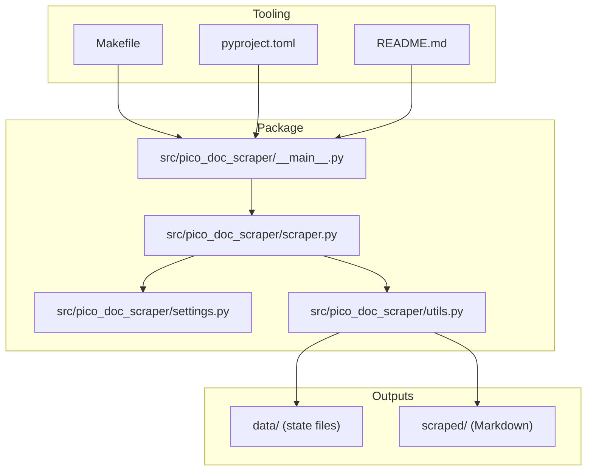
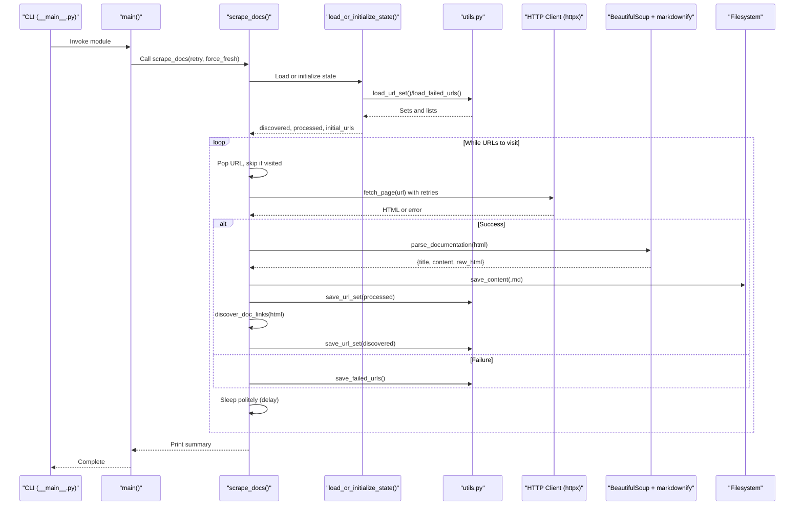
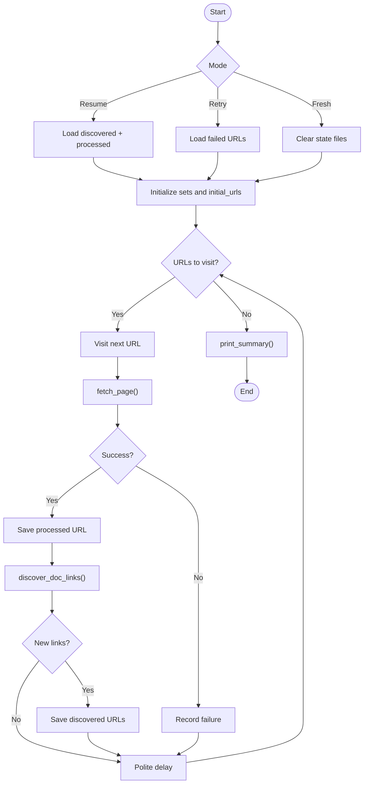
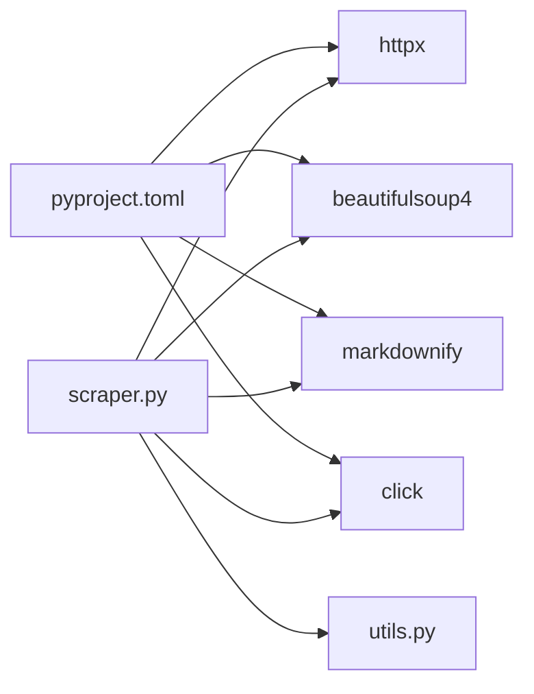

# Project Overview

<cite>
**Referenced Files in This Document**
- [README.md](file://README.md)
- [pyproject.toml](file://pyproject.toml)
- [Makefile](file://Makefile)
- [src/pico_doc_scraper/__main__.py](file://src/pico_doc_scraper/__main__.py)
- [src/pico_doc_scraper/scraper.py](file://src/pico_doc_scraper/scraper.py)
- [src/pico_doc_scraper/settings.py](file://src/pico_doc_scraper/settings.py)
- [src/pico_doc_scraper/utils.py](file://src/pico_doc_scraper/utils.py)
- [scraped/index.md](file://scraped/index.md)
- [scraped/button.md](file://scraped/button.md)
- [data/discovered_urls.txt](file://data/discovered_urls.txt)
</cite>

## Table of Contents
1. [Introduction](#introduction)
2. [Project Structure](#project-structure)
3. [Core Components](#core-components)
4. [Architecture Overview](#architecture-overview)
5. [Detailed Component Analysis](#detailed-component-analysis)
6. [Dependency Analysis](#dependency-analysis)
7. [Performance Considerations](#performance-considerations)
8. [Troubleshooting Guide](#troubleshooting-guide)
9. [Conclusion](#conclusion)
10. [Appendices](#appendices)

## Introduction
The Pico CSS Documentation Scraper is a resilient Python-based command-line tool designed to crawl the Pico.css documentation site, convert HTML pages to Markdown, and persist state to enable reliable, resumable operation. It emphasizes:
- Automatic resume capability through state persistence
- Incremental progress tracking across discovered, processed, and failed URLs
- Retry functionality for failed URLs
- Domain restriction to ensure focused scraping
- Polite scraping with configurable delays
- Graceful error handling to keep the pipeline moving

The tool produces Markdown files suitable for local consumption, documentation archiving, or downstream processing.

## Project Structure
The project follows a clear, modular layout centered around a CLI entry point, a main scraping engine, configuration, and shared utilities. Development tasks are streamlined via a Makefile.



**Diagram sources**
- [src/pico_doc_scraper/__main__.py](file://src/pico_doc_scraper/__main__.py#L1-L7)
- [src/pico_doc_scraper/scraper.py](file://src/pico_doc_scraper/scraper.py#L1-L391)
- [src/pico_doc_scraper/settings.py](file://src/pico_doc_scraper/settings.py#L1-L33)
- [src/pico_doc_scraper/utils.py](file://src/pico_doc_scraper/utils.py#L1-L175)
- [Makefile](file://Makefile#L1-L126)
- [pyproject.toml](file://pyproject.toml#L1-L75)
- [README.md](file://README.md#L1-L134)

**Section sources**
- [README.md](file://README.md#L1-L134)
- [pyproject.toml](file://pyproject.toml#L1-L75)
- [Makefile](file://Makefile#L1-L126)

## Core Components
- CLI entry point: Runs the scraper as a module and delegates to the main function.
- Scraper engine: Implements fetching, parsing, saving, discovery, and state management.
- Settings: Centralized configuration for URLs, timeouts, retries, delays, and output format.
- Utilities: Provide state persistence, output formatting, sanitization, and helpers.
- Outputs: Persist state to data/ and write Markdown to scraped/.

Key features visible in the implementation:
- Automatic resume: Loads discovered and processed sets to avoid rework.
- State tracking: Maintains discovered_urls.txt, processed_urls.txt, and failed_urls.txt.
- Retry functionality: Saves failed URLs and supports retry mode.
- Domain restriction: Filters links to the allowed domain and docs path.
- Polite scraping: Delays between requests and respects robots considerations.
- Graceful error handling: Continues processing despite individual failures.

**Section sources**
- [src/pico_doc_scraper/__main__.py](file://src/pico_doc_scraper/__main__.py#L1-L7)
- [src/pico_doc_scraper/scraper.py](file://src/pico_doc_scraper/scraper.py#L287-L387)
- [src/pico_doc_scraper/settings.py](file://src/pico_doc_scraper/settings.py#L1-L33)
- [src/pico_doc_scraper/utils.py](file://src/pico_doc_scraper/utils.py#L130-L175)
- [README.md](file://README.md#L5-L14)

## Architecture Overview
The scraper is a breadth-first, stateful pipeline that:
- Initializes state (fresh, resume, or retry)
- Ensures output directories
- Iteratively fetches pages, parses content, saves Markdown, and discovers new links
- Persists incremental state to disk
- Prints a summary and provides retry guidance



**Diagram sources**
- [src/pico_doc_scraper/__main__.py](file://src/pico_doc_scraper/__main__.py#L1-L7)
- [src/pico_doc_scraper/scraper.py](file://src/pico_doc_scraper/scraper.py#L287-L387)
- [src/pico_doc_scraper/utils.py](file://src/pico_doc_scraper/utils.py#L17-L175)

## Detailed Component Analysis

### CLI and Entry Point
- The module entry point delegates to the main function in the scraper module.
- The main function prints branding, then runs the scraping workflow with optional retry or fresh-start modes.

Usage patterns:
- Start/resume: make scrape or python -m pico_doc_scraper
- Retry only failed: make scrape-retry or python -m pico_doc_scraper --retry
- Fresh start: make scrape-fresh or python -m pico_doc_scraper --force-fresh

**Section sources**
- [src/pico_doc_scraper/__main__.py](file://src/pico_doc_scraper/__main__.py#L1-L7)
- [src/pico_doc_scraper/scraper.py](file://src/pico_doc_scraper/scraper.py#L361-L387)
- [README.md](file://README.md#L23-L64)
- [Makefile](file://Makefile#L115-L126)

### State Management and Persistence
- State files live under data/:
  - discovered_urls.txt: all URLs discovered during crawling
  - processed_urls.txt: successfully processed URLs
  - failed_urls.txt: URLs that failed to scrape
- Persistence is incremental:
  - After each URL, processed URLs are saved
  - Discovered URLs are saved when new ones are found
  - Failed URLs are saved at the end of the run
- Modes:
  - Resume mode: loads existing discovered and processed sets
  - Retry mode: loads failed URLs only
  - Fresh start: clears state files and starts over



**Diagram sources**
- [src/pico_doc_scraper/scraper.py](file://src/pico_doc_scraper/scraper.py#L231-L359)
- [src/pico_doc_scraper/utils.py](file://src/pico_doc_scraper/utils.py#L130-L175)

**Section sources**
- [src/pico_doc_scraper/scraper.py](file://src/pico_doc_scraper/scraper.py#L231-L359)
- [src/pico_doc_scraper/utils.py](file://src/pico_doc_scraper/utils.py#L130-L175)
- [README.md](file://README.md#L65-L80)

### HTTP Fetching and Retry Logic
- Uses httpx with a per-attempt timeout and automatic redirects.
- Retries are attempted up to MAX_RETRIES with a fixed RETRY_DELAY between attempts.
- On repeated failure, the error bubbles up to the caller for state recording.

```mermaid
flowchart TD
Enter([fetch_page(url)]) --> Attempt["Attempt 1..MAX_RETRIES"]
Attempt --> TryReq["HTTP GET with timeout"]
TryReq --> Ok{"Status OK?"}
Ok --> |Yes| ReturnHTML["Return HTML"]
Ok --> |No| MoreTries{"More attempts?"}
MoreTries --> |Yes| Wait["Wait RETRY_DELAY"] --> Attempt
MoreTries --> |No| RaiseErr["Raise HTTPError"]
```

**Diagram sources**
- [src/pico_doc_scraper/scraper.py](file://src/pico_doc_scraper/scraper.py#L24-L52)
- [src/pico_doc_scraper/settings.py](file://src/pico_doc_scraper/settings.py#L20-L29)

**Section sources**
- [src/pico_doc_scraper/scraper.py](file://src/pico_doc_scraper/scraper.py#L24-L52)
- [src/pico_doc_scraper/settings.py](file://src/pico_doc_scraper/settings.py#L20-L29)

### Link Discovery and Domain Restriction
- Discovers anchor links from HTML and normalizes them to absolute URLs.
- Filters to ALLOWED_DOMAIN and enforces /docs path.
- Skips binary-like extensions and removes fragments and query strings for consistency.
- Returns a set of canonicalized URLs for further processing.

```mermaid
flowchart TD
Parse([discover_doc_links(html, base_url)]) --> Soup["Parse with BeautifulSoup"]
Soup --> Iterate["Iterate <a> tags"]
Iterate --> Abs["urljoin(base, href)"]
Abs --> Check{"netloc==ALLOWED_DOMAIN<br/>path starts with '/docs'<br/>not binary ext?"}
Check --> |Yes| Clean["Strip query/fragment"]
Clean --> Add["Add to set"]
Check --> |No| Skip["Skip"]
Add --> Done([Return set])
Skip --> Iterate
```

**Diagram sources**
- [src/pico_doc_scraper/scraper.py](file://src/pico_doc_scraper/scraper.py#L55-L85)
- [src/pico_doc_scraper/settings.py](file://src/pico_doc_scraper/settings.py#L6-L7)

**Section sources**
- [src/pico_doc_scraper/scraper.py](file://src/pico_doc_scraper/scraper.py#L55-L85)
- [src/pico_doc_scraper/settings.py](file://src/pico_doc_scraper/settings.py#L6-L7)

### Parsing and Markdown Conversion
- Extracts the page title and identifies the main content area using common selectors.
- Removes navigation and non-content regions.
- Converts cleaned HTML to Markdown using markdownify with ATX-style headers.
- Produces a structured dictionary with title, Markdown content, and raw HTML for potential reuse.

```mermaid
flowchart TD
In([parse_documentation(html)]) --> BS["BeautifulSoup(html)"]
BS --> Title["Find <h1> for title"]
BS --> ContentSel["Try selectors for main content"]
ContentSel --> Clean["Remove nav/footer/header and TOC-like classes"]
Clean --> MD["markdownify(content, heading_style='ATX')"]
MD --> Out({title, content, raw_html})
```

**Diagram sources**
- [src/pico_doc_scraper/scraper.py](file://src/pico_doc_scraper/scraper.py#L88-L142)

**Section sources**
- [src/pico_doc_scraper/scraper.py](file://src/pico_doc_scraper/scraper.py#L88-L142)

### Output Formatting and Filename Sanitization
- Supports multiple output formats (.md, .json, .html) via save_content.
- For Markdown, writes a header with the extracted title followed by content.
- Sanitizes filenames to remove unsafe characters and enforce length limits.
- Ensures output directories exist before writing.

```mermaid
flowchart TD
Save([save_content(output_file, data)]) --> Ensure["ensure_output_dir()"]
Ensure --> Ext{"Suffix?"}
Ext --> |.md| WriteMD["Write '# title\\n\\n' + content"]
Ext --> |.json| WriteJSON["json.dump(data)"]
Ext --> |.html| WriteHTML["Write raw_html"]
Ext --> |other| WriteText["Write str(data)"]
WriteMD --> Done([Done])
WriteJSON --> Done
WriteHTML --> Done
WriteText --> Done
```

**Diagram sources**
- [src/pico_doc_scraper/utils.py](file://src/pico_doc_scraper/utils.py#L17-L48)
- [src/pico_doc_scraper/utils.py](file://src/pico_doc_scraper/utils.py#L50-L74)

**Section sources**
- [src/pico_doc_scraper/utils.py](file://src/pico_doc_scraper/utils.py#L17-L74)

### Practical Workflow Examples
- Basic scraping:
  - Run make scrape or python -m pico_doc_scraper
  - The tool prints progress, saves Markdown files to scraped/, and persists state to data/
- Retry failed URLs:
  - Run make scrape-retry or python -m pico_doc_scraper --retry
  - The tool loads failed_urls.txt and retries only those URLs
- Fresh start:
  - Run make scrape-fresh or python -m pico_doc_scraper --force-fresh
  - Clears state files and restarts from the base URL

Output examples:
- Index page: scraped/index.md
- Component page: scraped/button.md

**Section sources**
- [README.md](file://README.md#L23-L64)
- [Makefile](file://Makefile#L115-L126)
- [scraped/index.md](file://scraped/index.md#L1-L76)
- [scraped/button.md](file://scraped/button.md#L1-L45)

## Dependency Analysis
The project relies on a small set of modern Python libraries and a Makefile for developer ergonomics.



**Diagram sources**
- [pyproject.toml](file://pyproject.toml#L9-L14)
- [src/pico_doc_scraper/scraper.py](file://src/pico_doc_scraper/scraper.py#L6-L11)

**Section sources**
- [pyproject.toml](file://pyproject.toml#L1-L75)
- [src/pico_doc_scraper/scraper.py](file://src/pico_doc_scraper/scraper.py#L1-L30)

## Performance Considerations
- Politeness: A configurable delay between requests reduces server load and improves reliability.
- Incremental persistence: Frequent saves minimize work lost on interruption.
- Minimal parsing: Selectors target main content areas to reduce unnecessary DOM traversal.
- Retry strategy: Limited attempts with a fixed delay balance resilience and speed.

Recommendations:
- Adjust DELAY_BETWEEN_REQUESTS for target site policies.
- Monitor network conditions and tune REQUEST_TIMEOUT and MAX_RETRIES accordingly.
- Consider batching state writes if scraping very large sets.

[No sources needed since this section provides general guidance]

## Troubleshooting Guide
Common scenarios and resolutions:
- No URLs to retry:
  - The tool reports that there are no failed URLs to retry when the failed file is empty or missing.
- Interrupted mid-run:
  - The tool can be stopped with Ctrl+C and resumed; discovered and processed sets are saved incrementally.
- All discovered URLs processed:
  - The tool detects when there are no remaining URLs and suggests using a fresh start or checking failed URLs.
- Output not appearing:
  - Ensure output directories exist (they are created automatically) and verify permissions.

Operational tips:
- Use make scrape-fresh to reset state when needed.
- Inspect data/discovered_urls.txt and data/processed_urls.txt to understand progress.
- Review the summary printed at the end for counts and retry instructions.

**Section sources**
- [src/pico_doc_scraper/scraper.py](file://src/pico_doc_scraper/scraper.py#L254-L277)
- [src/pico_doc_scraper/scraper.py](file://src/pico_doc_scraper/scraper.py#L350-L358)
- [src/pico_doc_scraper/utils.py](file://src/pico_doc_scraper/utils.py#L161-L175)
- [data/discovered_urls.txt](file://data/discovered_urls.txt#L1-L81)

## Conclusion
The Pico CSS Documentation Scraper delivers a robust, stateful, and polite web scraping solution tailored for converting Pico.css documentation to Markdown. Its design prioritizes reliability, resumability, and ease of use, making it suitable for both educational exploration and production documentation archiving.

[No sources needed since this section summarizes without analyzing specific files]

## Appendices

### Configuration Options
- PICO_DOCS_BASE_URL: Starting URL for scraping
- ALLOWED_DOMAIN: Domain restriction for scraping
- REQUEST_TIMEOUT: HTTP request timeout in seconds
- MAX_RETRIES: Number of retry attempts for failed requests
- RETRY_DELAY: Delay between retry attempts in seconds
- DELAY_BETWEEN_REQUESTS: Polite delay between requests in seconds
- OUTPUT_FORMAT: Desired output format (markdown, json, html)
- USER_AGENT: HTTP user agent string
- RESPECT_ROBOTS_TXT: Whether to respect robots.txt (configured in client)

**Section sources**
- [src/pico_doc_scraper/settings.py](file://src/pico_doc_scraper/settings.py#L6-L32)

### Example Outputs
- Index page: scraped/index.md
- Component page: scraped/button.md

**Section sources**
- [scraped/index.md](file://scraped/index.md#L1-L76)
- [scraped/button.md](file://scraped/button.md#L1-L45)