# Technical Architecture and Design

<cite>
**Referenced Files in This Document**
- [README.md](file://README.md)
- [pyproject.toml](file://pyproject.toml)
- [Makefile](file://Makefile)
- [src/pico_doc_scraper/__init__.py](file://src/pico_doc_scraper/__init__.py)
- [src/pico_doc_scraper/__main__.py](file://src/pico_doc_scraper/__main__.py)
- [src/pico_doc_scraper/scraper.py](file://src/pico_doc_scraper/scraper.py)
- [src/pico_doc_scraper/settings.py](file://src/pico_doc_scraper/settings.py)
- [src/pico_doc_scraper/utils.py](file://src/pico_doc_scraper/utils.py)
</cite>

## Table of Contents
1. [Introduction](#introduction)
2. [Project Structure](#project-structure)
3. [Core Components](#core-components)
4. [Architecture Overview](#architecture-overview)
5. [Detailed Component Analysis](#detailed-component-analysis)
6. [Dependency Analysis](#dependency-analysis)
7. [Performance Considerations](#performance-considerations)
8. [Troubleshooting Guide](#troubleshooting-guide)
9. [Conclusion](#conclusion)
10. [Appendices](#appendices)

## Introduction
This document presents a comprehensive technical architecture and design overview of the Pico CSS Documentation Scraper. The system is designed as a modular, resilient web scraper that converts Pico CSS documentation pages into Markdown while maintaining robust state persistence, graceful error handling, and configurable politeness toward the target website. The architecture emphasizes separation of concerns across the scraping engine, configuration management, and utility functions, enabling incremental updates, domain restriction, and a clean CLI interface.

## Project Structure
The project follows a clear package layout with a dedicated package for the scraper, configuration, and utilities. The Makefile and pyproject.toml define the build and development workflow, while the README documents usage and design goals.

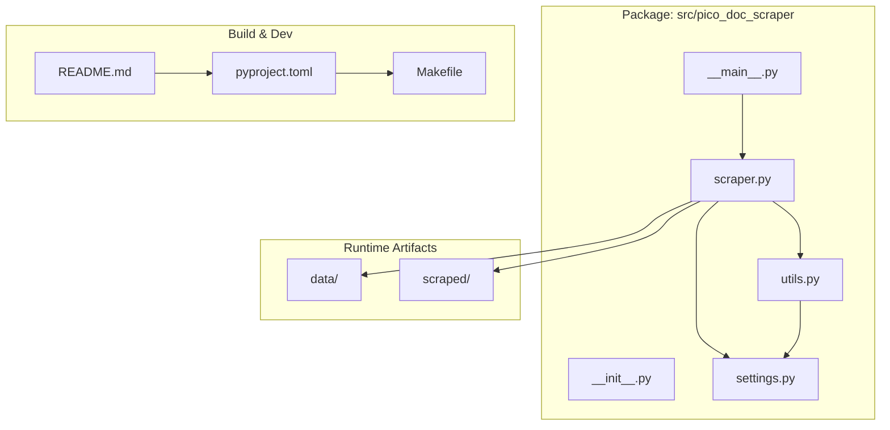

**Diagram sources**
- [src/pico_doc_scraper/__main__.py](file://src/pico_doc_scraper/__main__.py#L1-L7)
- [src/pico_doc_scraper/scraper.py](file://src/pico_doc_scraper/scraper.py#L1-L391)
- [src/pico_doc_scraper/settings.py](file://src/pico_doc_scraper/settings.py#L1-L33)
- [src/pico_doc_scraper/utils.py](file://src/pico_doc_scraper/utils.py#L1-L175)
- [pyproject.toml](file://pyproject.toml#L1-L75)
- [Makefile](file://Makefile#L1-L126)
- [README.md](file://README.md#L1-L134)

**Section sources**
- [README.md](file://README.md#L119-L134)
- [pyproject.toml](file://pyproject.toml#L1-L75)
- [Makefile](file://Makefile#L1-L126)

## Core Components
The system comprises four primary components:

- Entry Point and CLI: The module entry point delegates to the main scraping function, which is exposed via the Click CLI for user interaction.
- Scraping Engine: Implements fetching, parsing, discovery, and saving logic with retry and rate-limiting policies.
- Configuration Manager: Centralizes all configuration constants and paths for consistent behavior across modules.
- Utilities: Provides state persistence, output formatting, sanitization, and helper functions.

Key responsibilities:
- Entry Point and CLI: Initialize the CLI, parse options, and invoke the scraping workflow.
- Scraping Engine: Manage state, orchestrate HTTP requests, parse HTML, convert to Markdown, and persist state incrementally.
- Configuration Manager: Define base URLs, output directories, state file locations, HTTP settings, and scraping behavior.
- Utilities: Ensure directories, save content in multiple formats, sanitize filenames, manage state files, and format URLs.

**Section sources**
- [src/pico_doc_scraper/__main__.py](file://src/pico_doc_scraper/__main__.py#L1-L7)
- [src/pico_doc_scraper/scraper.py](file://src/pico_doc_scraper/scraper.py#L24-L391)
- [src/pico_doc_scraper/settings.py](file://src/pico_doc_scraper/settings.py#L1-L33)
- [src/pico_doc_scraper/utils.py](file://src/pico_doc_scraper/utils.py#L1-L175)

## Architecture Overview
The scraper employs a modular architecture with explicit separation between the engine, configuration, and utilities. The HTTP client uses httpx with retry logic, and content processing relies on BeautifulSoup and markdownify. State is persisted to disk for incremental updates and resumable runs.

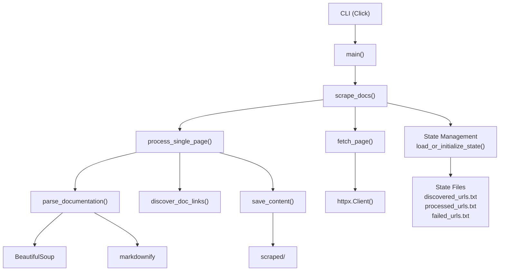

**Diagram sources**
- [src/pico_doc_scraper/scraper.py](file://src/pico_doc_scraper/scraper.py#L287-L391)
- [src/pico_doc_scraper/utils.py](file://src/pico_doc_scraper/utils.py#L17-L175)
- [src/pico_doc_scraper/settings.py](file://src/pico_doc_scraper/settings.py#L1-L33)

## Detailed Component Analysis

### Entry Point and CLI
The module entry point defines the command-line interface using Click. The CLI exposes two flags:
- --retry/-r: Retry only failed URLs from the previous run.
- --force-fresh/-f: Start a fresh scrape and clear all existing state.

Behavior:
- Initializes the CLI banner and prints the program title.
- Invokes the main scraping workflow with the selected mode.

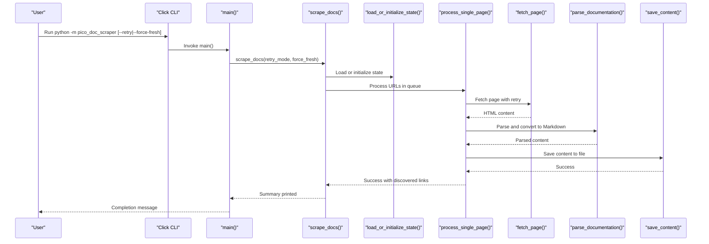

**Diagram sources**
- [src/pico_doc_scraper/scraper.py](file://src/pico_doc_scraper/scraper.py#L361-L391)
- [src/pico_doc_scraper/scraper.py](file://src/pico_doc_scraper/scraper.py#L287-L359)

**Section sources**
- [src/pico_doc_scraper/__main__.py](file://src/pico_doc_scraper/__main__.py#L1-L7)
- [src/pico_doc_scraper/scraper.py](file://src/pico_doc_scraper/scraper.py#L361-L391)

### HTTP Client Architecture with Retry Logic
The HTTP client uses httpx with a retry loop configured by settings. The fetch function:
- Sets a user agent header.
- Iterates up to MAX_RETRIES times.
- Uses a context-managed httpx.Client with REQUEST_TIMEOUT.
- Follows redirects automatically.
- Raises exceptions on failure; otherwise returns HTML text.

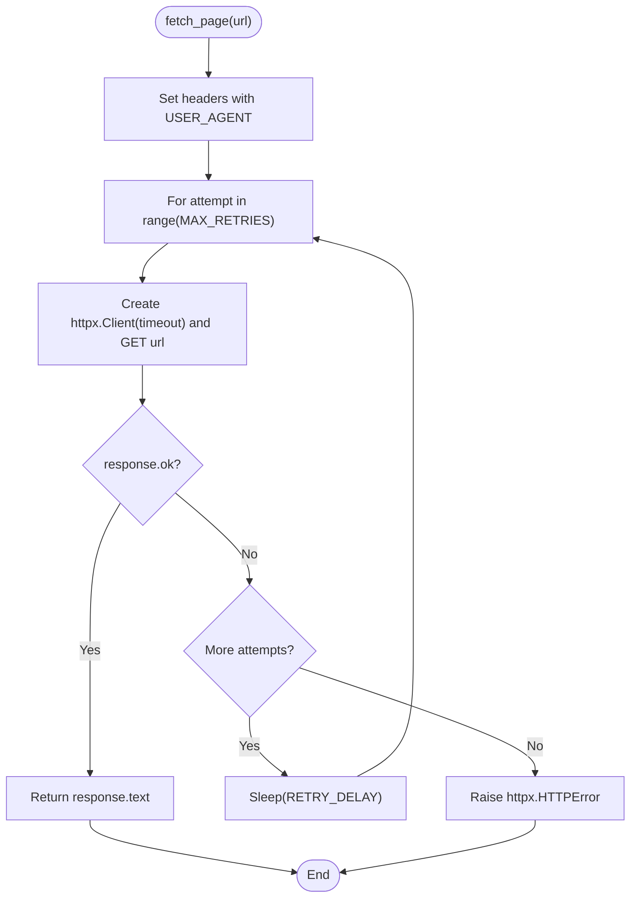

**Diagram sources**
- [src/pico_doc_scraper/scraper.py](file://src/pico_doc_scraper/scraper.py#L24-L52)
- [src/pico_doc_scraper/settings.py](file://src/pico_doc_scraper/settings.py#L19-L29)

**Section sources**
- [src/pico_doc_scraper/scraper.py](file://src/pico_doc_scraper/scraper.py#L24-L52)
- [src/pico_doc_scraper/settings.py](file://src/pico_doc_scraper/settings.py#L19-L29)

### Content Processing Pipeline (BeautifulSoup + markdownify)
The parser extracts the page title and identifies the main content area using multiple selectors. It removes navigation and non-content elements, then converts the remaining HTML to Markdown using markdownify with ATX-style headers.

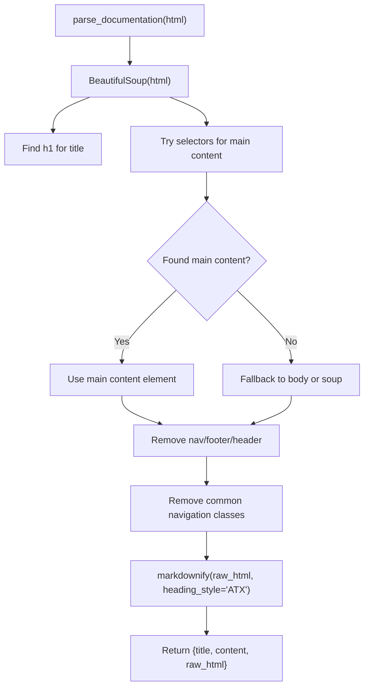

**Diagram sources**
- [src/pico_doc_scraper/scraper.py](file://src/pico_doc_scraper/scraper.py#L88-L142)

**Section sources**
- [src/pico_doc_scraper/scraper.py](file://src/pico_doc_scraper/scraper.py#L88-L142)

### State Management Architecture and Incremental Updates
State is managed through three files in the data directory:
- discovered_urls.txt: All URLs discovered during crawling.
- processed_urls.txt: URLs successfully processed.
- failed_urls.txt: URLs that failed to scrape.

The state loader supports:
- Force fresh mode: clears all state files and starts over.
- Resume mode: loads existing discovered and processed sets, then computes remaining URLs.
- Retry mode: loads only failed URLs for targeted retries.

Incremental persistence:
- After discovering new links, discovered_urls.txt is updated.
- After processing each URL, processed_urls.txt is updated.
- Failed URLs are appended to failed_urls.txt and cleared when empty.

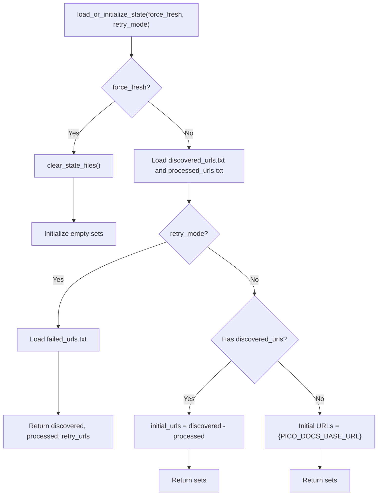

**Diagram sources**
- [src/pico_doc_scraper/scraper.py](file://src/pico_doc_scraper/scraper.py#L231-L284)
- [src/pico_doc_scraper/utils.py](file://src/pico_doc_scraper/utils.py#L161-L175)

**Section sources**
- [src/pico_doc_scraper/scraper.py](file://src/pico_doc_scraper/scraper.py#L231-L284)
- [src/pico_doc_scraper/utils.py](file://src/pico_doc_scraper/utils.py#L130-L175)

### Domain Restriction Implementation
The link discovery function enforces strict domain and path restrictions:
- Only URLs with netloc equal to ALLOWED_DOMAIN are accepted.
- Only URLs whose path starts with "/docs" are considered.
- Downloads (ending with .pdf, .zip, .tar.gz) are excluded.
- Fragments and query strings are removed for consistency.

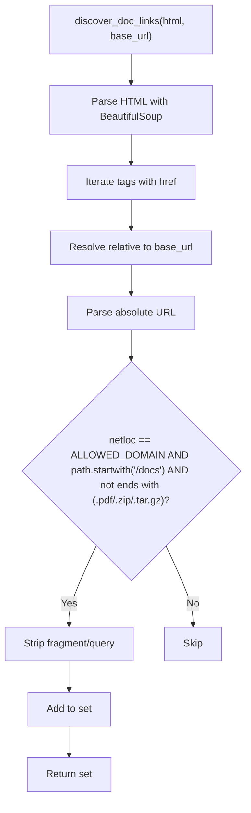

**Diagram sources**
- [src/pico_doc_scraper/scraper.py](file://src/pico_doc_scraper/scraper.py#L55-L85)
- [src/pico_doc_scraper/settings.py](file://src/pico_doc_scraper/settings.py#L5-L7)

**Section sources**
- [src/pico_doc_scraper/scraper.py](file://src/pico_doc_scraper/scraper.py#L55-L85)
- [src/pico_doc_scraper/settings.py](file://src/pico_doc_scraper/settings.py#L5-L7)

### Rate Limiting Mechanisms
The scraper introduces a configurable delay between requests to be respectful to the server:
- DELAY_BETWEEN_REQUESTS controls the sleep duration after the first request.
- The delay is applied only after the first successful fetch to avoid unnecessary pauses at startup.

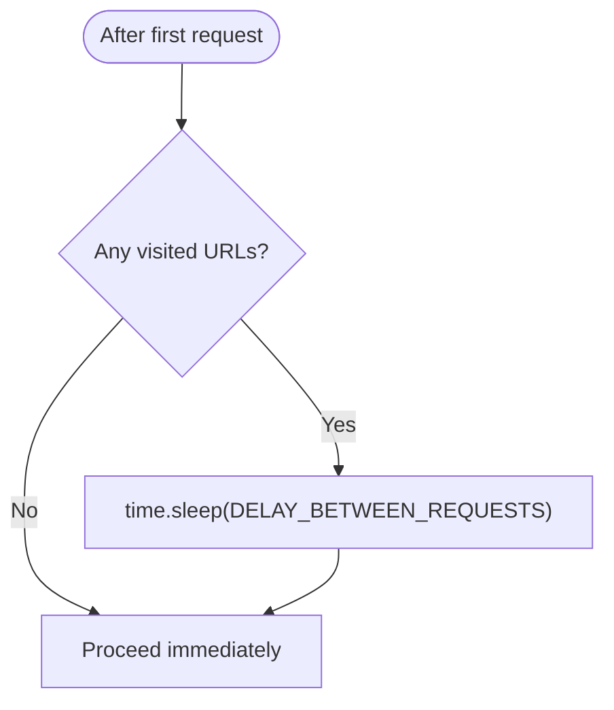

**Diagram sources**
- [src/pico_doc_scraper/scraper.py](file://src/pico_doc_scraper/scraper.py#L322-L324)
- [src/pico_doc_scraper/settings.py](file://src/pico_doc_scraper/settings.py#L29)

**Section sources**
- [src/pico_doc_scraper/scraper.py](file://src/pico_doc_scraper/scraper.py#L322-L324)
- [src/pico_doc_scraper/settings.py](file://src/pico_doc_scraper/settings.py#L29)

### Error Handling Strategy
The scraper implements layered error handling:
- HTTP-level errors: caught and retried according to MAX_RETRIES; failures recorded in failed_urls.txt.
- General exceptions: logged and recorded as failures.
- Keyboard interruption: caught gracefully to allow resuming.
- Summary printing: aggregates counts and prints actionable retry instructions.

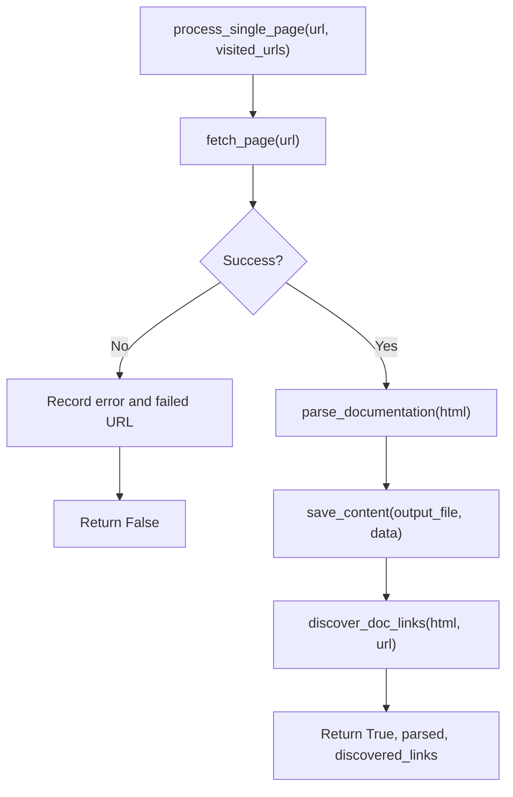

**Diagram sources**
- [src/pico_doc_scraper/scraper.py](file://src/pico_doc_scraper/scraper.py#L145-L194)

**Section sources**
- [src/pico_doc_scraper/scraper.py](file://src/pico_doc_scraper/scraper.py#L145-L194)

### CLI Interface Design Using Click
The CLI provides:
- --retry/-r flag to run only failed URLs.
- --force-fresh/-f flag to clear state and start over.
- Help text and usage examples documented in README.

Integration:
- The CLI invokes main(), which calls scrape_docs() with the selected mode.
- The Makefile provides convenience targets for scraping, retry, and fresh start.

**Section sources**
- [src/pico_doc_scraper/scraper.py](file://src/pico_doc_scraper/scraper.py#L361-L391)
- [Makefile](file://Makefile#L115-L125)
- [README.md](file://README.md#L23-L64)

## Dependency Analysis
External dependencies and internal module relationships:

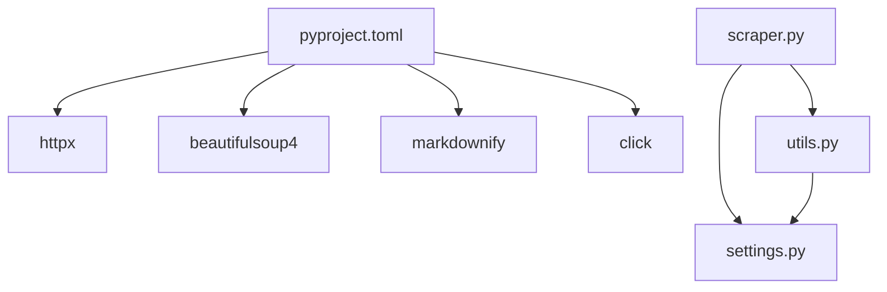

**Diagram sources**
- [pyproject.toml](file://pyproject.toml#L9-L14)
- [src/pico_doc_scraper/scraper.py](file://src/pico_doc_scraper/scraper.py#L1-L21)
- [src/pico_doc_scraper/utils.py](file://src/pico_doc_scraper/utils.py#L1-L5)
- [src/pico_doc_scraper/settings.py](file://src/pico_doc_scraper/settings.py#L1-L33)

Internal coupling and cohesion:
- Low coupling: scraper.py depends on settings.py and utils.py via imports; utilities depend on settings for paths.
- High cohesion: each module encapsulates a single responsibility (engine, config, utilities).
- No circular dependencies observed.

**Section sources**
- [pyproject.toml](file://pyproject.toml#L9-L14)
- [src/pico_doc_scraper/scraper.py](file://src/pico_doc_scraper/scraper.py#L1-L21)
- [src/pico_doc_scraper/utils.py](file://src/pico_doc_scraper/utils.py#L1-L5)
- [src/pico_doc_scraper/settings.py](file://src/pico_doc_scraper/settings.py#L1-L33)

## Performance Considerations
- HTTP client timeouts and retries balance reliability against latency.
- Polite delays reduce server load and improve stability.
- Incremental state persistence minimizes rework on restart.
- Selective retry reduces total workload by focusing on failed URLs.
- Output formatting is efficient, writing content once per page.

[No sources needed since this section provides general guidance]

## Troubleshooting Guide
Common scenarios and remedies:
- No failed URLs to retry: The loader detects empty failed_urls.txt and exits gracefully.
- Interrupted mid-run: State is saved incrementally; resume with default mode to continue.
- All URLs processed: Resume mode reports completion and suggests alternatives.
- Clean slate required: Use --force-fresh to clear state files and start over.

Operational tips:
- Use make scrape-retry to retry only failed URLs.
- Use make scrape-fresh to start over cleanly.
- Adjust settings (DELAYS, TIMEOUTS, RETRIES) in settings.py for different environments.

**Section sources**
- [src/pico_doc_scraper/scraper.py](file://src/pico_doc_scraper/scraper.py#L254-L277)
- [src/pico_doc_scraper/utils.py](file://src/pico_doc_scraper/utils.py#L161-L175)
- [README.md](file://README.md#L35-L53)

## Conclusion
The Pico CSS Documentation Scraper demonstrates a well-structured, modular architecture that separates concerns across the scraping engine, configuration, and utilities. Its state persistence enables resilient, incremental scraping with domain restriction and polite rate limiting. The CLI provides flexible operation modes, while the content processing pipeline ensures consistent Markdown output. These design choices yield a robust, maintainable system suitable for educational and practical use.

[No sources needed since this section summarizes without analyzing specific files]

## Appendices

### Program Flow from Initialization Through Completion
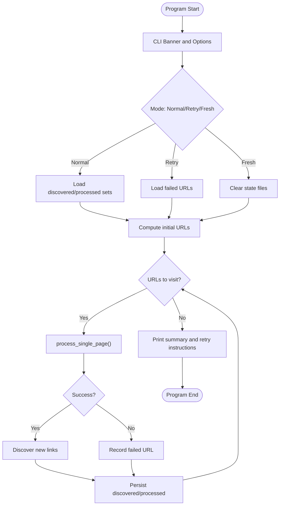

**Diagram sources**
- [src/pico_doc_scraper/scraper.py](file://src/pico_doc_scraper/scraper.py#L287-L359)
- [src/pico_doc_scraper/scraper.py](file://src/pico_doc_scraper/scraper.py#L231-L284)
- [src/pico_doc_scraper/utils.py](file://src/pico_doc_scraper/utils.py#L130-L175)

### Design Decisions Behind State Persistence and Modular Architecture
- State persistence: Three separate files enable targeted operations (resume, retry, fresh start) and simplify debugging.
- Modular architecture: Separating engine, config, and utilities improves testability, maintainability, and extensibility.
- Domain restriction: Prevents scraping unintended resources and keeps the crawl scoped to documentation.
- Politeness: Configurable delays and retries reduce server impact and improve reliability.
- Output formatting: Markdown-first approach aligns with documentation consumption workflows.

**Section sources**
- [README.md](file://README.md#L65-L80)
- [src/pico_doc_scraper/settings.py](file://src/pico_doc_scraper/settings.py#L1-L33)
- [src/pico_doc_scraper/scraper.py](file://src/pico_doc_scraper/scraper.py#L231-L284)