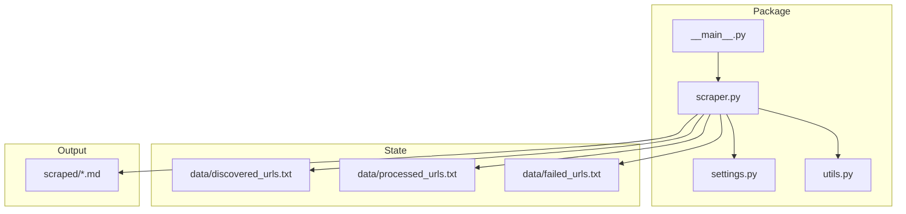
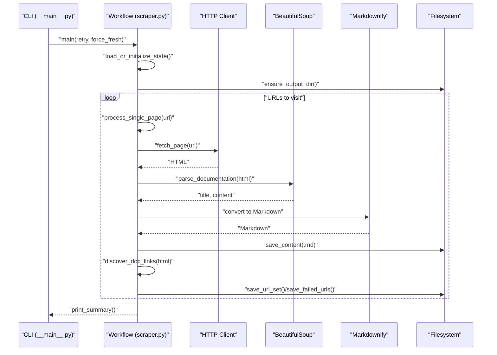
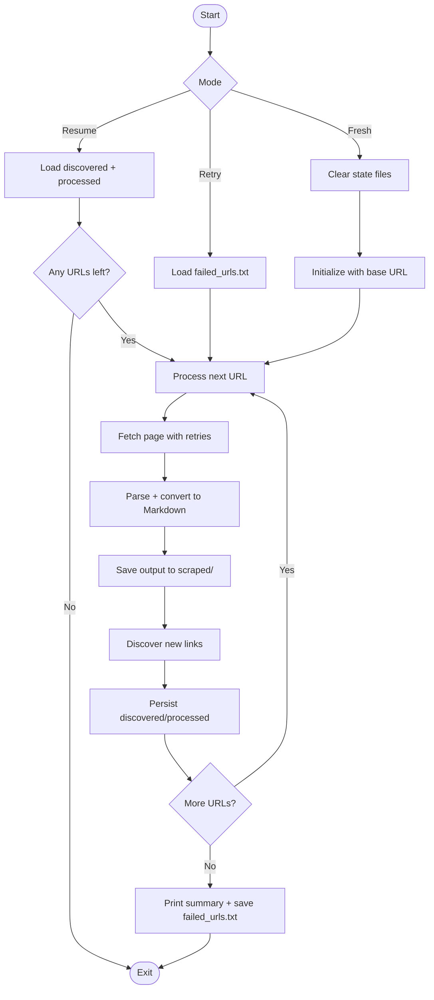
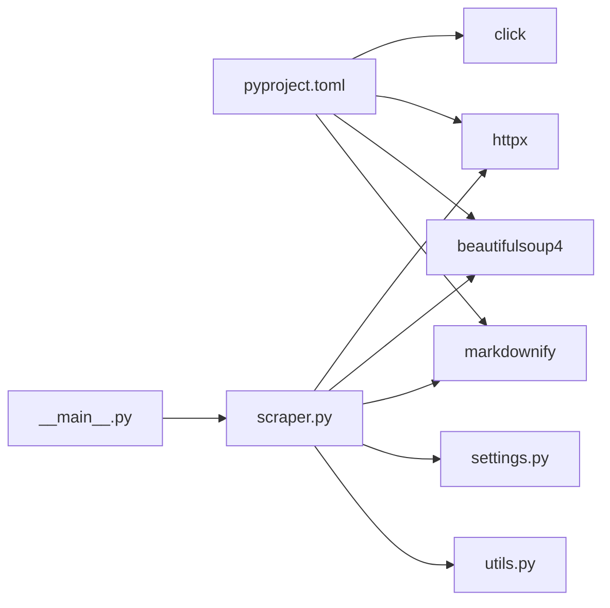

# Usage Scenarios and Examples

<cite>
**Referenced Files in This Document**
- [README.md](file://README.md)
- [Makefile](file://Makefile)
- [pyproject.toml](file://pyproject.toml)
- [src/pico_doc_scraper/__main__.py](file://src/pico_doc_scraper/__main__.py)
- [src/pico_doc_scraper/scraper.py](file://src/pico_doc_scraper/scraper.py)
- [src/pico_doc_scraper/settings.py](file://src/pico_doc_scraper/settings.py)
- [src/pico_doc_scraper/utils.py](file://src/pico_doc_scraper/utils.py)
</cite>

## Table of Contents
1. [Introduction](#introduction)
2. [Project Structure](#project-structure)
3. [Core Components](#core-components)
4. [Architecture Overview](#architecture-overview)
5. [Detailed Component Analysis](#detailed-component-analysis)
6. [Dependency Analysis](#dependency-analysis)
7. [Performance Considerations](#performance-considerations)
8. [Troubleshooting Guide](#troubleshooting-guide)
9. [Conclusion](#conclusion)
10. [Appendices](#appendices)

## Introduction
This document provides comprehensive usage scenarios and examples for the Pico CSS Documentation Scraper. It covers:
- Initial documentation archival
- Periodic updates to keep content current
- Selective retries of failed pages
- Complete reprocessing workflows
- Command-line usage patterns with specific examples
- Customizing scraping behavior via configuration
- Practical workflows for different user types
- Troubleshooting common issues
- Performance optimization tips
- Integration possibilities with other tools and workflows

## Project Structure
The project is organized around a focused CLI scraper with state persistence, output generation, and configurable behavior. Key directories and files:
- src/pico_doc_scraper/: Package with entry point, main logic, settings, and utilities
- data/: Auto-generated state tracking files
- scraped/: Auto-generated Markdown outputs
- pyproject.toml: Project metadata and dependencies
- Makefile: Convenience targets for setup, testing, and scraping
- README.md: Feature overview, usage, and configuration

**Diagram sources**
- [src/pico_doc_scraper/__main__.py](file://src/pico_doc_scraper/__main__.py#L1-L7)
- [src/pico_doc_scraper/scraper.py](file://src/pico_doc_scraper/scraper.py#L1-L391)
- [src/pico_doc_scraper/settings.py](file://src/pico_doc_scraper/settings.py#L1-L33)
- [src/pico_doc_scraper/utils.py](file://src/pico_doc_scraper/utils.py#L1-L175)

**Section sources**
- [README.md](file://README.md#L119-L134)
- [pyproject.toml](file://pyproject.toml#L1-L75)

## Core Components
- Entry point: Runs the scraper as a module
- Main workflow: Loads state, fetches and parses pages, saves outputs, discovers new links, and prints a summary
- Settings: Centralized configuration for URLs, timeouts, retries, delays, and output format
- Utilities: Directory creation, content saving, URL persistence, sanitization, and helpers

Key behaviors:
- Automatic resume: Uses state files to continue from where it left off
- Domain restriction: Only scrapes allowed domain under the docs path
- Polite scraping: Configurable delay between requests
- Graceful error handling: Continues on errors and records failures for retry
- Output formats: Markdown, JSON, or raw HTML depending on file extension

**Section sources**
- [src/pico_doc_scraper/__main__.py](file://src/pico_doc_scraper/__main__.py#L1-L7)
- [src/pico_doc_scraper/scraper.py](file://src/pico_doc_scraper/scraper.py#L24-L194)
- [src/pico_doc_scraper/settings.py](file://src/pico_doc_scraper/settings.py#L1-L33)
- [src/pico_doc_scraper/utils.py](file://src/pico_doc_scraper/utils.py#L17-L48)

## Architecture Overview
The scraper follows a simple, resilient pipeline:
- CLI entry point delegates to the main workflow
- Workflow loads or initializes state
- For each URL:
  - Fetch HTML with retry and timeout
  - Parse and convert to Markdown
  - Save output to scraped/
  - Discover new links and update state
- Print summary and persist failed URLs for future retry

**Diagram sources**
- [src/pico_doc_scraper/__main__.py](file://src/pico_doc_scraper/__main__.py#L1-L7)
- [src/pico_doc_scraper/scraper.py](file://src/pico_doc_scraper/scraper.py#L287-L359)
- [src/pico_doc_scraper/utils.py](file://src/pico_doc_scraper/utils.py#L17-L48)

## Detailed Component Analysis

### Initial Documentation Archival
Goal: Capture the entire Pico CSS documentation as Markdown for offline use.

Recommended approach:
- Use the Makefile target to start a fresh scrape
- Allow the scraper to discover and process all reachable documentation pages
- Monitor the summary printed at the end for total pages scraped and failed URLs

Command-line examples:
- make scrape
- python -m pico_doc_scraper

What happens:
- Starts from the base documentation URL
- Respects domain restrictions and docs path
- Saves outputs to scraped/ as Markdown
- Persists discovered and processed URLs for resuming

**Section sources**
- [README.md](file://README.md#L23-L33)
- [Makefile](file://Makefile#L115-L117)
- [src/pico_doc_scraper/scraper.py](file://src/pico_doc_scraper/scraper.py#L287-L284)

### Periodic Updates to Keep Content Current
Goal: Repeatedly update archived documentation to reflect upstream changes.

Recommended approach:
- Run the scraper periodically to resume from existing state
- The workflow automatically skips already processed URLs
- If failures occur, they are recorded for targeted retry

Command-line examples:
- make scrape
- python -m pico_doc_scraper

What happens:
- Loads discovered and processed sets
- Processes remaining URLs
- Saves incremental state after each URL

**Section sources**
- [README.md](file://README.md#L23-L33)
- [src/pico_doc_scraper/scraper.py](file://src/pico_doc_scraper/scraper.py#L231-L284)

### Selective Retries of Failed Pages
Goal: Focus on URLs that previously failed without reprocessing successful pages.

Recommended approach:
- Use the retry flag or Makefile target
- The workflow reads failed_urls.txt and retries only those URLs
- On completion, clears or updates failed_urls.txt accordingly

Command-line examples:
- make scrape-retry
- python -m pico_doc_scraper --retry

What happens:
- Loads failed URLs from data/failed_urls.txt
- Processes only those URLs
- Records any new failures for subsequent retry runs

**Section sources**
- [README.md](file://README.md#L35-L43)
- [Makefile](file://Makefile#L119-L121)
- [src/pico_doc_scraper/scraper.py](file://src/pico_doc_scraper/scraper.py#L231-L262)
- [src/pico_doc_scraper/utils.py](file://src/pico_doc_scraper/utils.py#L112-L127)

### Fresh Start and Complete Reprocessing
Goal: Clear all state and rebuild the archive from scratch.

Recommended approach:
- Use the force-fresh option or Makefile target
- Clears state files and restarts with the base URL
- Useful after configuration changes or when rebuilding the corpus

Command-line examples:
- make scrape-fresh
- python -m pico_doc_scraper --force-fresh

What happens:
- Clears discovered_urls.txt, processed_urls.txt, failed_urls.txt
- Initializes fresh state with the base URL

**Section sources**
- [README.md](file://README.md#L45-L53)
- [Makefile](file://Makefile#L123-L125)
- [src/pico_doc_scraper/scraper.py](file://src/pico_doc_scraper/scraper.py#L243-L247)
- [src/pico_doc_scraper/utils.py](file://src/pico_doc_scraper/utils.py#L161-L175)

### Customizing Scraping Behavior Through Configuration
Key settings and their impact:
- PICO_DOCS_BASE_URL: Starting URL for scraping
- ALLOWED_DOMAIN: Domain restriction for scraping
- REQUEST_TIMEOUT: HTTP request timeout in seconds
- MAX_RETRIES: Number of retry attempts for failed requests
- DELAY_BETWEEN_REQUESTS: Polite delay between requests in seconds
- OUTPUT_FORMAT: Output format (markdown, json, html)
- USER_AGENT: Identifies the scraper
- RESPECT_ROBOTS_TXT: Respect robots.txt (enabled by default)

How to change:
- Edit src/pico_doc_scraper/settings.py
- Re-run scraping commands

Example adjustments:
- Increase MAX_RETRIES for flaky networks
- Raise REQUEST_TIMEOUT for slower servers
- Adjust DELAY_BETWEEN_REQUESTS to be more or less polite
- Change OUTPUT_FORMAT to json or html if needed

**Section sources**
- [README.md](file://README.md#L101-L110)
- [src/pico_doc_scraper/settings.py](file://src/pico_doc_scraper/settings.py#L6-L32)

### Practical Workflows for Different User Types

- Casual users wanting offline documentation
  - One-time archival: make scrape
  - Review outputs in scraped/
  - Optional: make scrape-retry if a few pages failed initially

- Developers integrating into automated processes
  - CI job: run make scrape weekly/monthly
  - Use --force-fresh when configuration changes
  - Parse the summary output to detect failures and trigger alerts
  - Store scraped/ and data/ under version control for auditability

- Power users managing large-scale archives
  - Tune settings for resilience and politeness
  - Use selective retries to minimize rework
  - Combine with external tools for post-processing (e.g., static site generators)

**Section sources**
- [README.md](file://README.md#L23-L53)
- [src/pico_doc_scraper/settings.py](file://src/pico_doc_scraper/settings.py#L19-L32)

### Command-Line Usage Patterns and Examples

- Basic scraping (resume or start fresh)
  - make scrape
  - python -m pico_doc_scraper

- Retry only failed URLs
  - make scrape-retry
  - python -m pico_doc_scraper --retry

- Fresh start (clear state)
  - make scrape-fresh
  - python -m pico_doc_scraper --force-fresh

- Help and options
  - python -m pico_doc_scraper --help

Notes:
- The CLI supports short and long options for retry and force-fresh
- The Makefile wraps Python invocations with uv for reproducible environments

**Section sources**
- [README.md](file://README.md#L23-L63)
- [Makefile](file://Makefile#L115-L125)
- [src/pico_doc_scraper/scraper.py](file://src/pico_doc_scraper/scraper.py#L361-L384)

### Data Flow and State Management
The scraper maintains three state files:
- discovered_urls.txt: All URLs found during crawling
- processed_urls.txt: Successfully processed URLs
- failed_urls.txt: URLs that failed to scrape

Behavior:
- Incremental persistence after each URL
- Resume mode: starts from unprocessed URLs
- Retry mode: processes only failed URLs
- Fresh mode: clears state and starts over

**Diagram sources**
- [src/pico_doc_scraper/scraper.py](file://src/pico_doc_scraper/scraper.py#L231-L359)
- [src/pico_doc_scraper/utils.py](file://src/pico_doc_scraper/utils.py#L130-L158)

**Section sources**
- [README.md](file://README.md#L65-L79)
- [src/pico_doc_scraper/scraper.py](file://src/pico_doc_scraper/scraper.py#L231-L359)
- [src/pico_doc_scraper/utils.py](file://src/pico_doc_scraper/utils.py#L92-L127)

## Dependency Analysis
External libraries and their roles:
- httpx: HTTP client with timeouts and redirects
- beautifulsoup4: HTML parsing and content extraction
- markdownify: HTML-to-Markdown conversion
- click: CLI argument parsing

Internal dependencies:
- __main__.py depends on scraper.main
- scraper.py depends on settings and utils
- utils.py is used by scraper.py for filesystem operations and URL persistence

**Diagram sources**
- [pyproject.toml](file://pyproject.toml#L9-L14)
- [src/pico_doc_scraper/scraper.py](file://src/pico_doc_scraper/scraper.py#L1-L21)
- [src/pico_doc_scraper/__main__.py](file://src/pico_doc_scraper/__main__.py#L1-L7)

**Section sources**
- [pyproject.toml](file://pyproject.toml#L9-L14)
- [src/pico_doc_scraper/scraper.py](file://src/pico_doc_scraper/scraper.py#L1-L21)

## Performance Considerations
- Politeness: Increase DELAY_BETWEEN_REQUESTS to reduce server load and avoid rate limits
- Resilience: Adjust MAX_RETRIES and REQUEST_TIMEOUT for network conditions
- Scope: Keep ALLOWED_DOMAIN and docs path filtering to limit unnecessary traffic
- Output format: Using Markdown keeps file sizes reasonable for large archives
- Interrupt handling: The scraper saves state incrementally; you can safely stop and resume

Best practices:
- Schedule periodic runs during off-peak hours
- Monitor failed URLs and use selective retries to minimize repeated work
- Consider caching or mirroring outputs in CI for faster local iteration

[No sources needed since this section provides general guidance]

## Troubleshooting Guide
Common issues and solutions:
- No failed URLs to retry
  - Cause: failed_urls.txt is empty or missing
  - Action: Run a normal scrape to populate failed URLs, then use retry mode

- All discovered URLs processed but nothing to do
  - Cause: Previous run completed successfully
  - Action: Use --force-fresh to rebuild from scratch

- HTTP errors or timeouts
  - Cause: Network issues or server-side problems
  - Action: Increase REQUEST_TIMEOUT, adjust MAX_RETRIES, or add delays

- Excessive failures
  - Cause: Rate limiting or content changes
  - Action: Increase DELAY_BETWEEN_REQUESTS, review ALLOWED_DOMAIN and path filters

- Interrupted mid-run
  - Behavior: State is saved incrementally; resume works automatically
  - Action: Re-run the scraper; it will continue from where it left off

Where to look:
- Summary output for counts and next steps
- data/failed_urls.txt for retry targets
- data/discovered_urls.txt and data/processed_urls.txt for progress

**Section sources**
- [src/pico_doc_scraper/scraper.py](file://src/pico_doc_scraper/scraper.py#L196-L228)
- [src/pico_doc_scraper/scraper.py](file://src/pico_doc_scraper/scraper.py#L254-L276)
- [src/pico_doc_scraper/utils.py](file://src/pico_doc_scraper/utils.py#L112-L127)

## Conclusion
The Pico CSS Documentation Scraper provides a robust, resumable, and configurable solution for archiving documentation. By leveraging state persistence, selective retries, and a clean CLI, it supports both casual offline use and developer-driven automation. Adjust settings to balance speed, resilience, and politeness, and integrate the outputs into your preferred documentation or content workflows.

[No sources needed since this section summarizes without analyzing specific files]

## Appendices

### Appendix A: CLI Options Reference
- --retry, -r: Retry only failed URLs from previous scrape
- --force-fresh, -f: Start a fresh scrape, clearing all existing state
- --help: Show help message with available options

**Section sources**
- [README.md](file://README.md#L55-L63)
- [src/pico_doc_scraper/scraper.py](file://src/pico_doc_scraper/scraper.py#L361-L384)

### Appendix B: Output Formats
- .md: Markdown with title and content
- .json: JSON with title, content, and raw HTML
- .html: Raw HTML content
- Other extensions: Plain text serialization

**Section sources**
- [src/pico_doc_scraper/utils.py](file://src/pico_doc_scraper/utils.py#L17-L48)