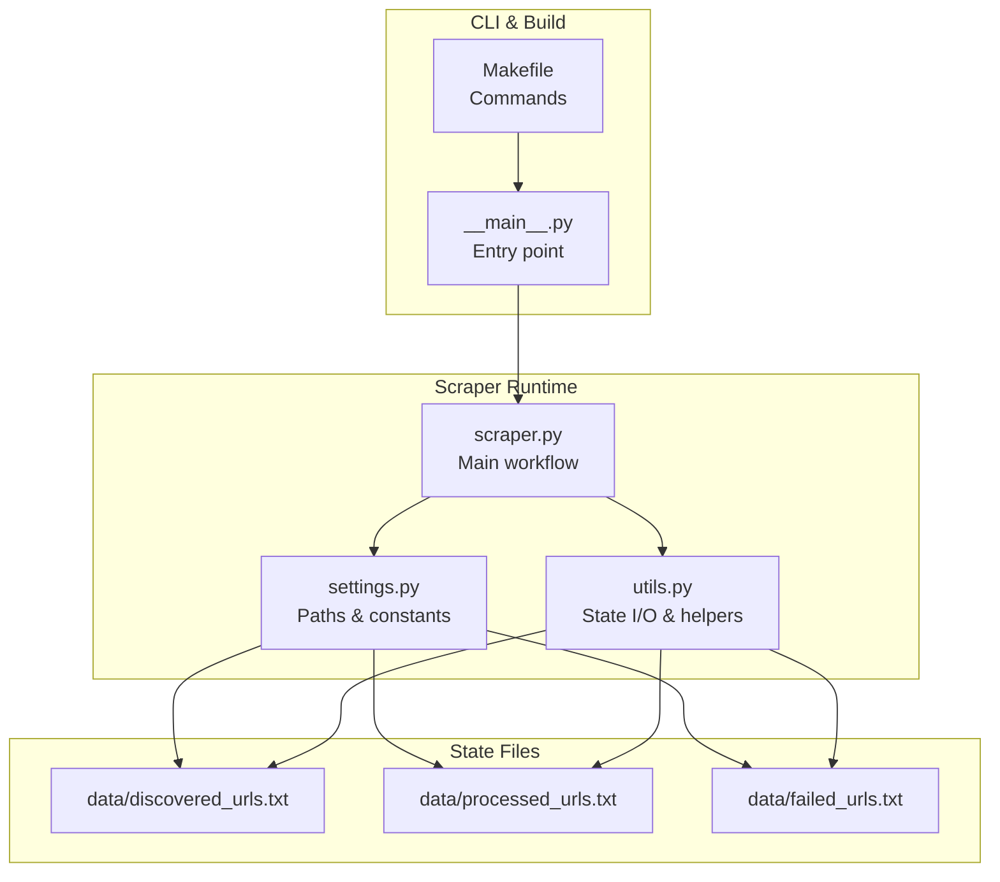
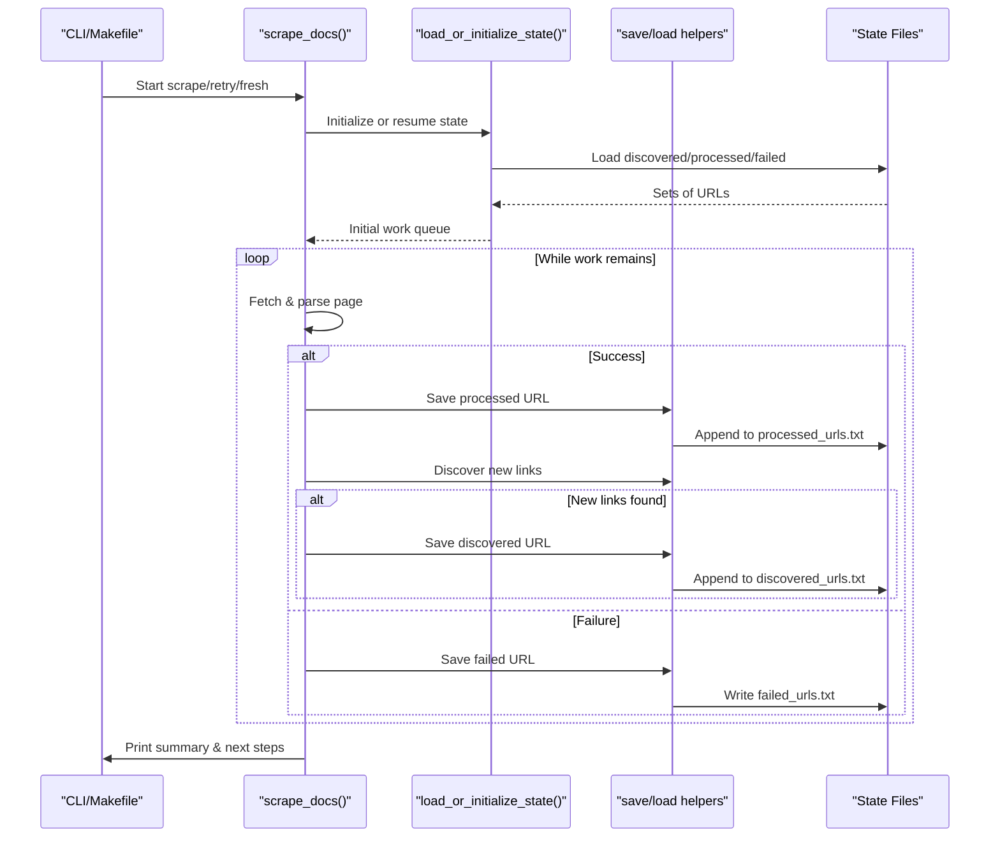
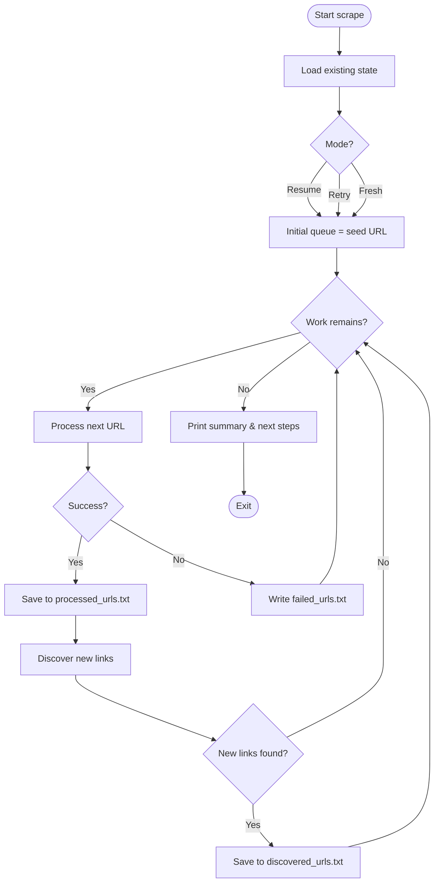
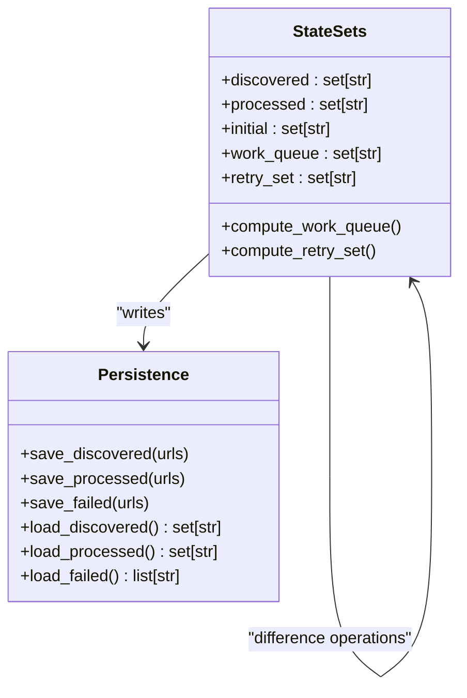
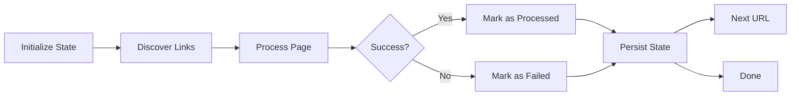
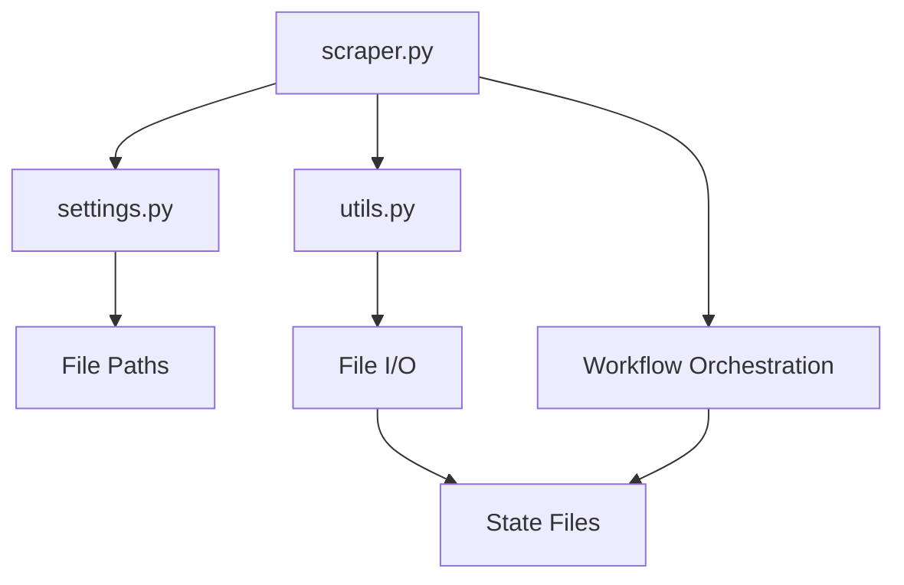

# State Management System

<cite>
**Referenced Files in This Document**
- [scraper.py](file://src/pico_doc_scraper/scraper.py)
- [settings.py](file://src/pico_doc_scraper/settings.py)
- [utils.py](file://src/pico_doc_scraper/utils.py)
- [discovered_urls.txt](file://data/discovered_urls.txt)
- [processed_urls.txt](file://data/processed_urls.txt)
- [README.md](file://README.md)
- [Makefile](file://Makefile)
- [__main__.py](file://src/pico_doc_scraper/__main__.py)
</cite>

## Table of Contents
1. [Introduction](#introduction)
2. [Project Structure](#project-structure)
3. [Core Components](#core-components)
4. [Architecture Overview](#architecture-overview)
5. [Detailed Component Analysis](#detailed-component-analysis)
6. [Dependency Analysis](#dependency-analysis)
7. [Performance Considerations](#performance-considerations)
8. [Troubleshooting Guide](#troubleshooting-guide)
9. [Conclusion](#conclusion)
10. [Appendices](#appendices)

## Introduction
This document explains the state management system that enables resilient web scraping operations. The scraper tracks three distinct sets of URLs across a session:
- Discovered URLs: All URLs found during crawling
- Processed URLs: Successfully processed URLs
- Failed URLs: URLs that failed to scrape

State is persisted incrementally to plain text files in the data/ directory, enabling interruption and resumption of scraping sessions. This document covers the three-state architecture, persistence mechanisms, URL tracking algorithms, resume capability, failure recovery, and practical troubleshooting procedures.

## Project Structure
The state management system spans several modules and files:
- Settings define file paths for state tracking and scraping behavior
- Utilities provide state file I/O and cleanup
- Scraper orchestrates discovery, processing, and persistence
- Data directory stores state files
- Makefile provides convenient commands for scraping modes

**Diagram sources**
- [scraper.py](file://src/pico_doc_scraper/scraper.py#L231-L359)
- [utils.py](file://src/pico_doc_scraper/utils.py#L130-L175)
- [settings.py](file://src/pico_doc_scraper/settings.py#L14-L17)
- [Makefile](file://Makefile#L115-L125)
- [__main__.py](file://src/pico_doc_scraper/__main__.py#L1-L7)

**Section sources**
- [README.md](file://README.md#L65-L76)
- [settings.py](file://src/pico_doc_scraper/settings.py#L14-L17)
- [Makefile](file://Makefile#L115-L125)

## Core Components
The state management system comprises three primary components:
- State file paths and configuration
- Incremental persistence utilities
- Session orchestration and resume logic

Key responsibilities:
- Persist discovered and processed URLs after each operation
- Track failures separately for targeted retry
- Determine remaining work based on differences between sets
- Provide force-fresh and retry-only modes

**Section sources**
- [settings.py](file://src/pico_doc_scraper/settings.py#L14-L17)
- [utils.py](file://src/pico_doc_scraper/utils.py#L130-L175)
- [scraper.py](file://src/pico_doc_scraper/scraper.py#L231-L359)

## Architecture Overview
The state management architecture follows a three-state model with explicit separation of concerns:
- Discovery phase updates the discovered set
- Processing phase moves URLs from discovered to processed
- Failure tracking persists failed URLs for separate retry

**Diagram sources**
- [scraper.py](file://src/pico_doc_scraper/scraper.py#L287-L359)
- [utils.py](file://src/pico_doc_scraper/utils.py#L130-L175)
- [settings.py](file://src/pico_doc_scraper/settings.py#L14-L17)

## Detailed Component Analysis

### State File Formats
Each state file is a plain text file containing one URL per line. The files are:
- discovered_urls.txt: All URLs discovered during crawling
- processed_urls.txt: URLs successfully processed
- failed_urls.txt: URLs that failed to scrape (created only when needed)

Format characteristics:
- One URL per line
- No header or metadata
- Sorted order preserved by save routines
- Empty lines ignored during load

Practical examples of state file contents:
- discovered_urls.txt: Contains the full set of discovered URLs, including duplicates filtered out during loading
- processed_urls.txt: Contains the subset of URLs successfully processed
- failed_urls.txt: Contains only URLs that failed during the last run

Interpretation guidelines:
- Remaining work = discovered_urls.txt minus processed_urls.txt
- Retry set = failed_urls.txt (when retry mode is enabled)
- Fresh start = empty discovered/processed sets

**Section sources**
- [utils.py](file://src/pico_doc_scraper/utils.py#L130-L158)
- [discovered_urls.txt](file://data/discovered_urls.txt#L1-L81)
- [processed_urls.txt](file://data/processed_urls.txt#L1-L81)

### State Persistence Mechanism
The persistence mechanism ensures resilience by writing state incrementally:
- After discovering new URLs, the discovered set is saved
- After successful processing, the processed set is saved
- Failures are recorded in a separate file for targeted retry

Persistence strategy:
- Atomic writes per URL batch
- Sorted output for deterministic diffs
- Cleanup of failed file when empty

**Diagram sources**
- [scraper.py](file://src/pico_doc_scraper/scraper.py#L287-L359)
- [utils.py](file://src/pico_doc_scraper/utils.py#L130-L175)

**Section sources**
- [scraper.py](file://src/pico_doc_scraper/scraper.py#L339-L348)
- [utils.py](file://src/pico_doc_scraper/utils.py#L130-L175)

### URL Tracking Algorithms
The URL tracking algorithms operate on sets to ensure correctness:
- Discovered set: Union of all discovered URLs
- Processed set: Union of all successfully processed URLs
- Work queue: Difference between discovered and processed sets
- Retry set: Loaded from failed_urls.txt when retry mode is enabled

Algorithmic behavior:
- Deduplication via set operations
- Efficient difference computation for remaining work
- Idempotent saves (no duplicates written)
- Sorted output for readability

**Diagram sources**
- [scraper.py](file://src/pico_doc_scraper/scraper.py#L231-L284)
- [utils.py](file://src/pico_doc_scraper/utils.py#L130-L175)

**Section sources**
- [scraper.py](file://src/pico_doc_scraper/scraper.py#L231-L284)
- [utils.py](file://src/pico_doc_scraper/utils.py#L130-L158)

### Resume Capability Implementation
Resume capability is implemented through state detection and queue initialization:
- If discovered_urls.txt exists, the system assumes a previous session
- Initial work queue is computed as discovered minus processed
- If no remaining work, the system advises using force-fresh or checking failed URLs

Resume behavior:
- Loads existing discovered and processed sets
- Computes remaining work automatically
- Skips already processed URLs
- Allows interruption and resumption at any time

**Section sources**
- [scraper.py](file://src/pico_doc_scraper/scraper.py#L264-L277)
- [utils.py](file://src/pico_doc_scraper/utils.py#L143-L158)

### Failure Recovery and Retry Coordination
Failure recovery coordinates with state tracking through:
- Separate failed_urls.txt file for failed URLs
- Retry mode loads failed URLs as the initial work queue
- Summary prints guidance to run retry mode
- Empty failed file is removed when no failures occur

Retry logic:
- Loads failed URLs from file
- Uses them as the initial queue when retry flag is set
- Saves failures to failed_urls.txt during processing
- Clears failed file when no failures remain

**Section sources**
- [scraper.py](file://src/pico_doc_scraper/scraper.py#L196-L227)
- [utils.py](file://src/pico_doc_scraper/utils.py#L92-L128)

### Relationship Between State Management and Workflow
State management integrates tightly with the overall scraping workflow:
- Initialization phase loads or creates state
- Discovery phase updates discovered set
- Processing phase updates processed set
- Failure phase updates failed set
- Finalization phase prints summary and next steps

**Diagram sources**
- [scraper.py](file://src/pico_doc_scraper/scraper.py#L287-L359)
- [utils.py](file://src/pico_doc_scraper/utils.py#L130-L175)

**Section sources**
- [scraper.py](file://src/pico_doc_scraper/scraper.py#L287-L359)

## Dependency Analysis
The state management system exhibits clear separation of concerns:
- Settings module defines file paths and constants
- Utilities encapsulate I/O operations
- Scraper orchestrates workflow and delegates persistence
- Data directory holds state files
- Makefile provides CLI integration

**Diagram sources**
- [settings.py](file://src/pico_doc_scraper/settings.py#L14-L17)
- [utils.py](file://src/pico_doc_scraper/utils.py#L130-L175)
- [scraper.py](file://src/pico_doc_scraper/scraper.py#L231-L359)

**Section sources**
- [settings.py](file://src/pico_doc_scraper/settings.py#L14-L17)
- [utils.py](file://src/pico_doc_scraper/utils.py#L130-L175)
- [scraper.py](file://src/pico_doc_scraper/scraper.py#L231-L359)

## Performance Considerations
State management performance characteristics:
- Set operations are O(n) for membership checks and differences
- File I/O is linear in the number of URLs
- Incremental saves minimize write overhead
- Sorting adds O(n log n) cost but improves readability and diffability

Optimization opportunities:
- Batch writes could reduce filesystem overhead
- Consider binary formats for very large datasets
- Use mmap for large state files if performance becomes critical

## Troubleshooting Guide

### State File Corruption Recovery
Symptoms:
- Empty or partial state files
- Duplicate entries or malformed URLs
- Inconsistent discovered vs processed counts

Recovery procedures:
1. Force fresh start to clear corrupted state:
   - Use the force-fresh option or command
   - This removes all state files and starts over
2. Manual intervention:
   - Remove or rename corrupted files
   - Recreate minimal state by copying discovered to processed for known-good URLs
   - Use retry mode to re-process only failed URLs

### Resuming from Interrupted Sessions
Common scenarios:
- Ctrl+C during scraping
- Network interruptions
- Process termination

Resolution steps:
1. Restart the scraper normally
2. The system detects existing state and resumes automatically
3. Verify remaining work calculation by comparing discovered and processed sets

### Retry Mode Issues
Symptoms:
- Retry mode shows no URLs to retry
- Failed URLs file missing or empty

Resolution steps:
1. Confirm failed_urls.txt exists and contains URLs
2. Use retry mode to process only failed URLs
3. If file is empty, run a fresh scrape to regenerate failed URLs

### Practical Commands and Options
- Normal scrape: make scrape or python -m pico_doc_scraper
- Retry failed URLs: make scrape-retry or python -m pico_doc_scraper --retry
- Fresh start: make scrape-fresh or python -m pico_doc_scraper --force-fresh

**Section sources**
- [README.md](file://README.md#L35-L53)
- [Makefile](file://Makefile#L115-L125)
- [scraper.py](file://src/pico_doc_scraper/scraper.py#L244-L262)

## Conclusion
The state management system provides robust, incremental persistence for resilient web scraping. By maintaining three distinct state files and coordinating persistence with the scraping workflow, it enables interruption and resumption, targeted retry, and clear separation of concerns. The design balances simplicity with reliability, making it straightforward to understand, modify, and troubleshoot.

## Appendices

### State File Reference
- discovered_urls.txt: Complete set of discovered URLs
- processed_urls.txt: Set of successfully processed URLs
- failed_urls.txt: Set of URLs that failed to scrape (created only when needed)

### Configuration Reference
- State file locations are defined in settings.py
- Persistence utilities handle file I/O operations
- CLI options control mode selection

**Section sources**
- [settings.py](file://src/pico_doc_scraper/settings.py#L14-L17)
- [utils.py](file://src/pico_doc_scraper/utils.py#L130-L175)
- [README.md](file://README.md#L67-L76)