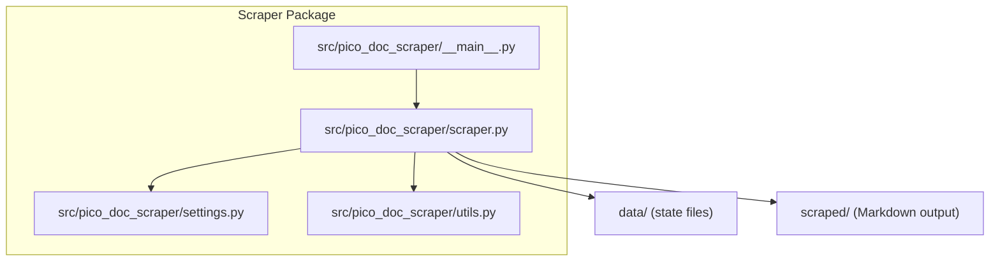
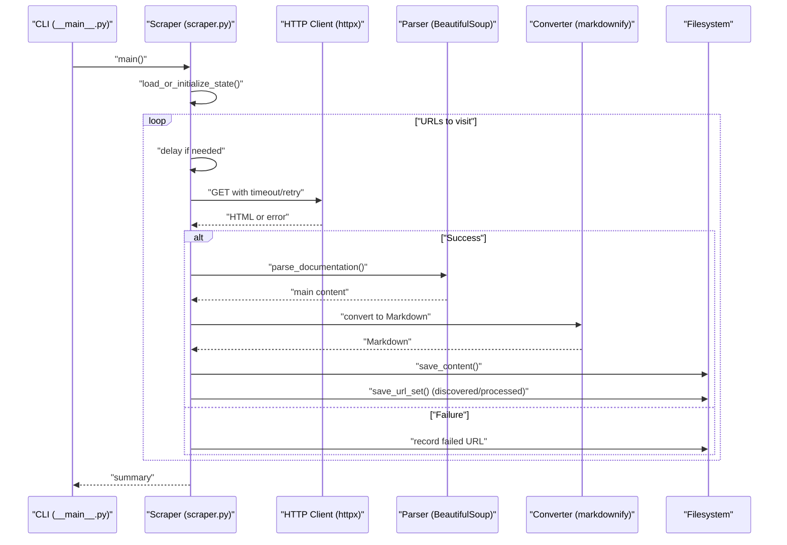
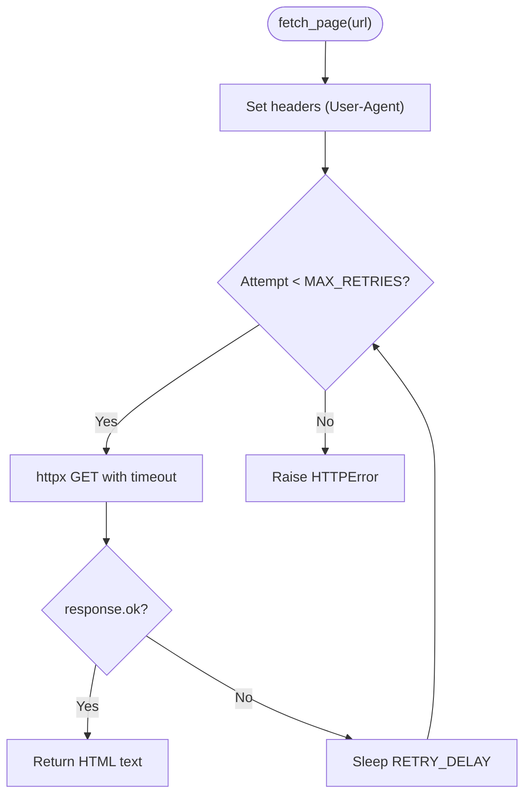
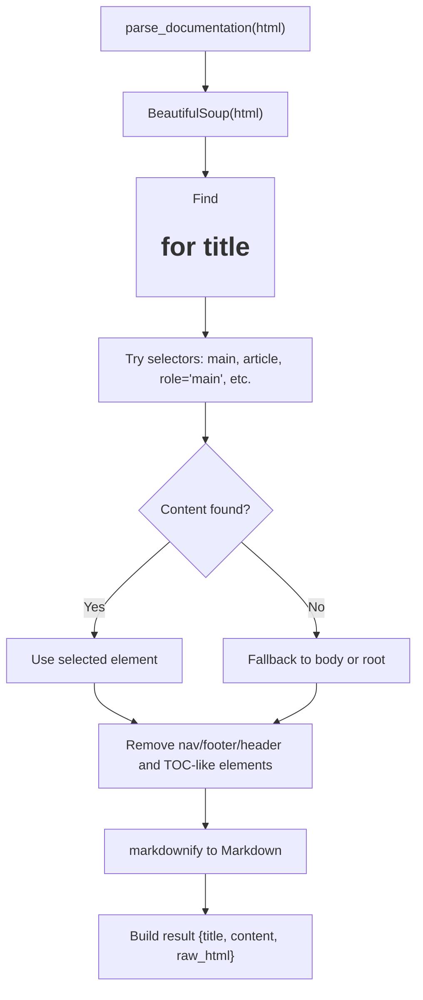
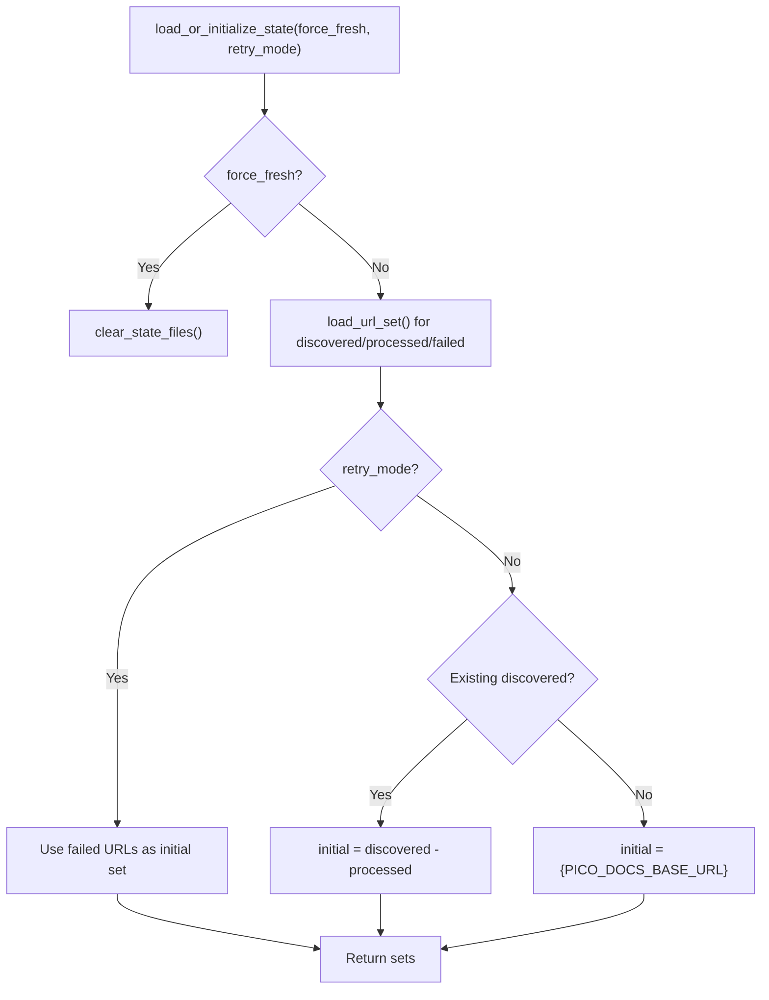
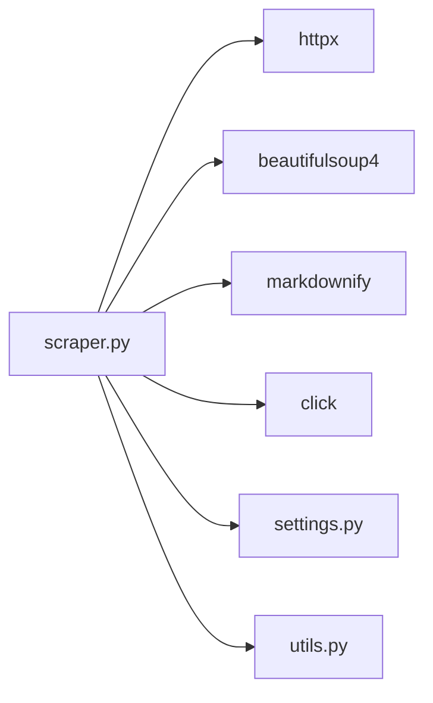

# Troubleshooting and FAQ

<cite>
**Referenced Files in This Document**
- [README.md](file://README.md)
- [Makefile](file://Makefile)
- [pyproject.toml](file://pyproject.toml)
- [src/pico_doc_scraper/__main__.py](file://src/pico_doc_scraper/__main__.py)
- [src/pico_doc_scraper/scraper.py](file://src/pico_doc_scraper/scraper.py)
- [src/pico_doc_scraper/settings.py](file://src/pico_doc_scraper/settings.py)
- [src/pico_doc_scraper/utils.py](file://src/pico_doc_scraper/utils.py)
- [data/discovered_urls.txt](file://data/discovered_urls.txt)
- [data/processed_urls.txt](file://data/processed_urls.txt)
</cite>

## Table of Contents
1. [Introduction](#introduction)
2. [Project Structure](#project-structure)
3. [Core Components](#core-components)
4. [Architecture Overview](#architecture-overview)
5. [Detailed Component Analysis](#detailed-component-analysis)
6. [Dependency Analysis](#dependency-analysis)
7. [Performance Considerations](#performance-considerations)
8. [Troubleshooting Guide](#troubleshooting-guide)
9. [FAQ](#faq)
10. [Conclusion](#conclusion)
11. [Appendices](#appendices)

## Introduction
This document provides comprehensive troubleshooting and Frequently Asked Questions for the Pico CSS Documentation Scraper. It focuses on diagnosing and resolving common issues such as network connectivity and timeouts, parsing failures, state file corruption, domain restrictions, SSL/TLS concerns, and proxy configuration. It also covers performance tuning, recovery from interrupted runs, and best practices for large-scale scraping.

## Project Structure
The scraper is organized around a small set of modules with clear separation of concerns:
- Entry point and CLI orchestration
- Core scraping logic (fetch, parse, save, crawl)
- Configuration and constants
- Utilities for persistence and file handling
- State tracking files under data/
- Output Markdown under scraped/

**Diagram sources**
- [src/pico_doc_scraper/__main__.py](file://src/pico_doc_scraper/__main__.py#L1-L7)
- [src/pico_doc_scraper/scraper.py](file://src/pico_doc_scraper/scraper.py#L1-L391)
- [src/pico_doc_scraper/settings.py](file://src/pico_doc_scraper/settings.py#L1-L33)
- [src/pico_doc_scraper/utils.py](file://src/pico_doc_scraper/utils.py#L1-L175)

**Section sources**
- [README.md](file://README.md#L119-L134)
- [Makefile](file://Makefile#L115-L126)

## Core Components
- Settings: Centralized configuration for base URL, allowed domain, timeouts, retries, delays, and output format.
- Scraper: Implements fetching, parsing, saving, and crawling with incremental state persistence.
- Utils: Handles output formatting, sanitization, and state file I/O.
- State files: Persist discovered, processed, and failed URLs to enable resumable runs.

Key behaviors:
- Automatic resume: Loads discovered and processed sets to avoid rework.
- Retry failed URLs: Saves failures to a file for targeted retries.
- Fresh start: Clears state files and restarts from the base URL.
- Domain restriction: Filters links to the allowed domain and docs path.
- Politeness: Adds a configurable delay between requests.

**Section sources**
- [src/pico_doc_scraper/settings.py](file://src/pico_doc_scraper/settings.py#L1-L33)
- [src/pico_doc_scraper/scraper.py](file://src/pico_doc_scraper/scraper.py#L24-L53)
- [src/pico_doc_scraper/scraper.py](file://src/pico_doc_scraper/scraper.py#L55-L85)
- [src/pico_doc_scraper/scraper.py](file://src/pico_doc_scraper/scraper.py#L88-L142)
- [src/pico_doc_scraper/scraper.py](file://src/pico_doc_scraper/scraper.py#L231-L285)
- [src/pico_doc_scraper/utils.py](file://src/pico_doc_scraper/utils.py#L130-L158)
- [src/pico_doc_scraper/utils.py](file://src/pico_doc_scraper/utils.py#L92-L128)

## Architecture Overview
High-level flow:
- CLI entry point invokes the main scraping routine.
- State is loaded or initialized.
- For each URL:
  - Optional delay
  - Fetch with retry and timeout
  - Parse and convert to Markdown
  - Save output
  - Discover new links and persist state
- Summary prints and persists failed URLs for retry.

**Diagram sources**
- [src/pico_doc_scraper/__main__.py](file://src/pico_doc_scraper/__main__.py#L1-L7)
- [src/pico_doc_scraper/scraper.py](file://src/pico_doc_scraper/scraper.py#L287-L359)
- [src/pico_doc_scraper/scraper.py](file://src/pico_doc_scraper/scraper.py#L24-L53)
- [src/pico_doc_scraper/scraper.py](file://src/pico_doc_scraper/scraper.py#L88-L142)
- [src/pico_doc_scraper/utils.py](file://src/pico_doc_scraper/utils.py#L17-L48)
- [src/pico_doc_scraper/utils.py](file://src/pico_doc_scraper/utils.py#L130-L158)

## Detailed Component Analysis

### HTTP Fetch and Retry Logic
- Uses an httpx client with a per-request timeout.
- Retries on transient HTTP errors with a fixed delay between attempts.
- On repeated failure, raises an HTTP error to be handled upstream.

**Diagram sources**
- [src/pico_doc_scraper/scraper.py](file://src/pico_doc_scraper/scraper.py#L24-L53)
- [src/pico_doc_scraper/settings.py](file://src/pico_doc_scraper/settings.py#L20-L22)

**Section sources**
- [src/pico_doc_scraper/scraper.py](file://src/pico_doc_scraper/scraper.py#L24-L53)
- [src/pico_doc_scraper/settings.py](file://src/pico_doc_scraper/settings.py#L20-L22)

### Parsing and Content Extraction
- Finds the main content area using common selectors for documentation sites.
- Removes navigation and non-content regions.
- Converts remaining HTML to Markdown with ATX-style headers.

**Diagram sources**
- [src/pico_doc_scraper/scraper.py](file://src/pico_doc_scraper/scraper.py#L88-L142)

**Section sources**
- [src/pico_doc_scraper/scraper.py](file://src/pico_doc_scraper/scraper.py#L88-L142)

### State Persistence and Resuming
- Maintains three files:
  - Discovered URLs
  - Processed URLs
  - Failed URLs
- Incremental saves after each URL to support interruption and resume.
- Supports retry-only mode using failed URLs from the last run.

**Diagram sources**
- [src/pico_doc_scraper/scraper.py](file://src/pico_doc_scraper/scraper.py#L231-L285)
- [src/pico_doc_scraper/utils.py](file://src/pico_doc_scraper/utils.py#L130-L158)
- [src/pico_doc_scraper/utils.py](file://src/pico_doc_scraper/utils.py#L112-L128)
- [src/pico_doc_scraper/utils.py](file://src/pico_doc_scraper/utils.py#L161-L175)

**Section sources**
- [src/pico_doc_scraper/scraper.py](file://src/pico_doc_scraper/scraper.py#L231-L285)
- [src/pico_doc_scraper/utils.py](file://src/pico_doc_scraper/utils.py#L112-L158)
- [data/discovered_urls.txt](file://data/discovered_urls.txt#L1-L81)
- [data/processed_urls.txt](file://data/processed_urls.txt#L1-L81)

## Dependency Analysis
- Runtime dependencies include httpx, beautifulsoup4, markdownify, and click.
- The scraper relies on these libraries for HTTP, parsing, conversion, and CLI.

**Diagram sources**
- [pyproject.toml](file://pyproject.toml#L9-L14)
- [src/pico_doc_scraper/scraper.py](file://src/pico_doc_scraper/scraper.py#L6-L21)

**Section sources**
- [pyproject.toml](file://pyproject.toml#L9-L14)

## Performance Considerations
- Rate limiting: Adjust the delay between requests to reduce server load and avoid throttling.
- Timeout tuning: Increase the request timeout for slower networks or heavy pages.
- Retries: Tune the number of retries and retry delay to balance resilience and speed.
- Concurrency: The current implementation is single-threaded. For higher throughput, consider adding concurrency with bounded workers and shared state coordination.
- Memory: Large pages or many concurrent requests increase memory usage; monitor and cap concurrency accordingly.
- Output format: Using Markdown is lightweight; JSON or HTML outputs increase disk I/O and storage needs.

[No sources needed since this section provides general guidance]

## Troubleshooting Guide

### Network Connectivity Issues
Symptoms:
- Repeated HTTP errors or timeouts during fetch.
- Frequent retries before failure.

Common causes:
- Unstable internet connection.
- Host firewall or ISP throttling.
- DNS resolution problems.

Remediation:
- Verify basic connectivity outside the scraper.
- Increase the request timeout setting.
- Reduce the delay between requests to minimize idle time.
- Retry failed URLs after stabilizing the network.

**Section sources**
- [src/pico_doc_scraper/scraper.py](file://src/pico_doc_scraper/scraper.py#L24-L53)
- [src/pico_doc_scraper/settings.py](file://src/pico_doc_scraper/settings.py#L20-L22)

### HTTP Timeout Errors
Symptoms:
- Requests hang or abort after the configured timeout.
- Errors indicate timeout conditions.

Remediation:
- Increase REQUEST_TIMEOUT.
- Retry failed URLs individually.
- Check for intermittent network spikes and schedule runs during off-peak hours.

**Section sources**
- [src/pico_doc_scraper/settings.py](file://src/pico_doc_scraper/settings.py#L20-L22)
- [src/pico_doc_scraper/scraper.py](file://src/pico_doc_scraper/scraper.py#L24-L53)

### Parsing Failures
Symptoms:
- Empty or partial Markdown output.
- Errors when converting HTML to Markdown.

Remediation:
- Inspect the raw HTML saved to the output directory for malformed content.
- Update content selectors in the parser if the site structure changes.
- Validate that the main content area is being identified; adjust selectors as needed.

**Section sources**
- [src/pico_doc_scraper/scraper.py](file://src/pico_doc_scraper/scraper.py#L88-L142)
- [src/pico_doc_scraper/utils.py](file://src/pico_doc_scraper/utils.py#L17-L48)

### State File Corruption
Symptoms:
- Incomplete or garbled state files.
- Scraper unable to resume or duplicates in discovered URLs.

Remediation:
- Clear state files and start fresh.
- Ensure the filesystem is healthy and write permissions are intact.
- Avoid manual edits to state files; use provided commands to manage state.

Recovery steps:
- Force fresh start to clear all state files.
- Resume scraping from the base URL.

**Section sources**
- [src/pico_doc_scraper/utils.py](file://src/pico_doc_scraper/utils.py#L161-L175)
- [src/pico_doc_scraper/scraper.py](file://src/pico_doc_scraper/scraper.py#L244-L247)
- [src/pico_doc_scraper/scraper.py](file://src/pico_doc_scraper/scraper.py#L280-L284)

### Domain Restriction Issues
Symptoms:
- Links outside the allowed domain are not followed.
- Some expected links are missing.

Explanation:
- The scraper enforces ALLOWED_DOMAIN and restricts paths to those starting with the docs path and excluding binary assets.

Remediation:
- Confirm ALLOWED_DOMAIN matches the target host.
- Ensure the base URL points to the intended documentation root.

**Section sources**
- [src/pico_doc_scraper/settings.py](file://src/pico_doc_scraper/settings.py#L6-L7)
- [src/pico_doc_scraper/scraper.py](file://src/pico_doc_scraper/scraper.py#L75-L84)

### SSL Certificate Problems
Symptoms:
- TLS handshake errors or certificate verification failures.
- Fetch errors related to HTTPS.

Remediation:
- Upgrade httpx to a recent version compatible with your environment.
- If behind a corporate proxy with custom certificates, configure the environment appropriately.
- Test connectivity with a browser or curl to isolate local SSL issues.

**Section sources**
- [pyproject.toml](file://pyproject.toml#L10-L10)
- [src/pico_doc_scraper/scraper.py](file://src/pico_doc_scraper/scraper.py#L40-L42)

### Proxy Configuration
Symptoms:
- Requests fail or hang without clear network errors.
- Access to the target domain is restricted.

Remediation:
- Configure system-wide proxy environment variables if required by your network.
- Verify that the proxy allows outbound HTTPS traffic to the target domain.
- Test with a simple HTTP client to confirm proxy connectivity.

**Section sources**
- [src/pico_doc_scraper/scraper.py](file://src/pico_doc_scraper/scraper.py#L36-L42)

### Interrupted Scraping Sessions
Symptoms:
- Partially processed state with missing output files.
- Resume does not continue from the last saved position.

Remediation:
- Use the automatic resume behavior; discovered and processed sets are persisted incrementally.
- If the last run was interrupted mid-save, re-run the scraper; it will skip already processed URLs.
- For targeted recovery, retry only failed URLs.

**Section sources**
- [src/pico_doc_scraper/scraper.py](file://src/pico_doc_scraper/scraper.py#L314-L359)
- [src/pico_doc_scraper/scraper.py](file://src/pico_doc_scraper/scraper.py#L231-L285)
- [src/pico_doc_scraper/utils.py](file://src/pico_doc_scraper/utils.py#L92-L128)

### Diagnosing Failures
Diagnostic techniques:
- Review the summary printed at the end of a run for counts and failed URLs.
- Inspect the failed URLs file to identify recurring problem domains.
- Manually fetch suspect URLs with a browser or curl to reproduce issues.
- Temporarily disable politeness delays to test pure connectivity.

**Section sources**
- [src/pico_doc_scraper/scraper.py](file://src/pico_doc_scraper/scraper.py#L196-L229)
- [src/pico_doc_scraper/utils.py](file://src/pico_doc_scraper/utils.py#L92-L128)

## FAQ

Q: How do I resume a previously interrupted scrape?
A: The scraper automatically resumes by loading discovered and processed URLs. Simply re-run the scraper; it will continue from where it left off.

Q: How do I retry only the failed URLs?
A: Use the retry command or flag. The scraper loads failed URLs from the last run and attempts them again.

Q: How do I start a completely fresh scrape?
A: Use the fresh start command or flag. It clears all state files and begins from the base URL.

Q: Can I change the delay between requests?
A: Yes, adjust the delay setting to be more or less polite depending on server capacity and your bandwidth.

Q: What happens if a page fails to parse?
A: The page is recorded as failed and saved to the failed URLs file for later retry.

Q: Are there limits on output formats?
A: The default is Markdown. The code supports JSON and HTML outputs; choose based on your downstream needs.

Q: How does the scraper handle large-scale operations?
A: The current implementation is single-threaded. For scale, consider adding concurrency with careful rate limiting and shared state management.

Q: Where are the state files located?
A: State files are stored under the data directory and include discovered, processed, and failed URLs.

Q: How do I check what URLs were discovered?
A: Inspect the discovered URLs file in the data directory.

Q: What should I do if the output directory is missing?
A: The scraper ensures output directories exist; if you removed them manually, recreate them or re-run the scraper.

**Section sources**
- [README.md](file://README.md#L65-L118)
- [src/pico_doc_scraper/scraper.py](file://src/pico_doc_scraper/scraper.py#L231-L285)
- [src/pico_doc_scraper/utils.py](file://src/pico_doc_scraper/utils.py#L7-L14)
- [data/discovered_urls.txt](file://data/discovered_urls.txt#L1-L81)

## Conclusion
This guide outlined practical steps to diagnose and resolve common issues with the Pico CSS Documentation Scraper, including network and SSL concerns, parsing problems, and state file integrity. It also provided performance tuning advice, recovery procedures, and answers to frequently asked questions. By adjusting configuration parameters and following the recommended workflows, most scraping challenges can be mitigated effectively.

[No sources needed since this section summarizes without analyzing specific files]

## Appendices

### Recovery Procedures
- Force fresh start: Clears all state and restarts from the base URL.
- Retry failed URLs: Loads the failed URLs file and retries only those entries.
- Manual cleanup: Remove state files if corrupted and rerun the scraper.

**Section sources**
- [src/pico_doc_scraper/scraper.py](file://src/pico_doc_scraper/scraper.py#L244-L247)
- [src/pico_doc_scraper/scraper.py](file://src/pico_doc_scraper/scraper.py#L254-L262)
- [src/pico_doc_scraper/utils.py](file://src/pico_doc_scraper/utils.py#L161-L175)

### Best Practices for Large-Scale Scraping
- Keep politeness delays conservative to avoid server-side throttling.
- Monitor memory usage and consider reducing concurrency if needed.
- Use retry modes to recover quickly from transient failures.
- Store outputs on fast disks and ensure adequate free space.
- Validate selectors periodically as site structures evolve.

[No sources needed since this section provides general guidance]

### Community Resources and Support Channels
- Report issues and request help on the project’s issue tracker.
- Follow the project’s contribution guidelines for bug reports and feature requests.
- Engage with maintainers via the repository’s communication channels.

[No sources needed since this section provides general guidance]