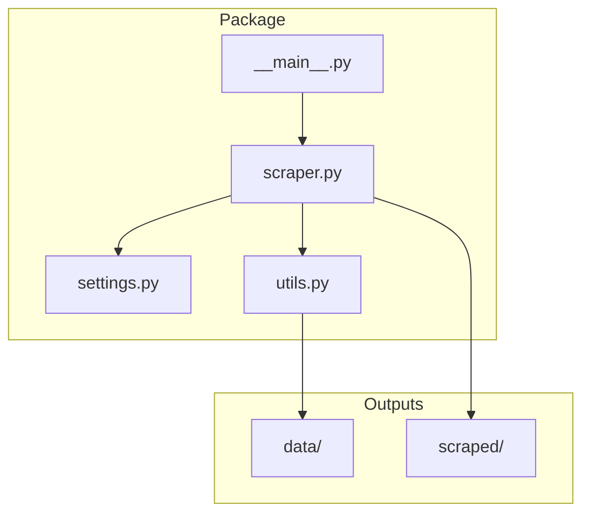
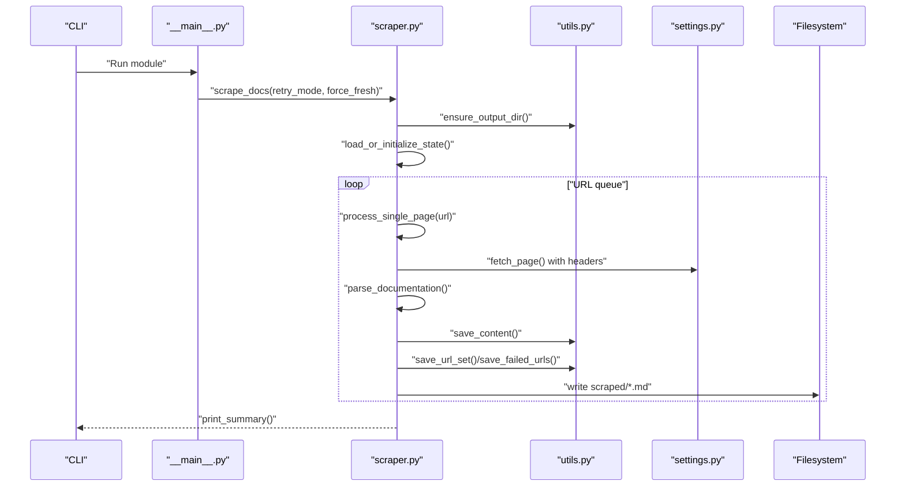
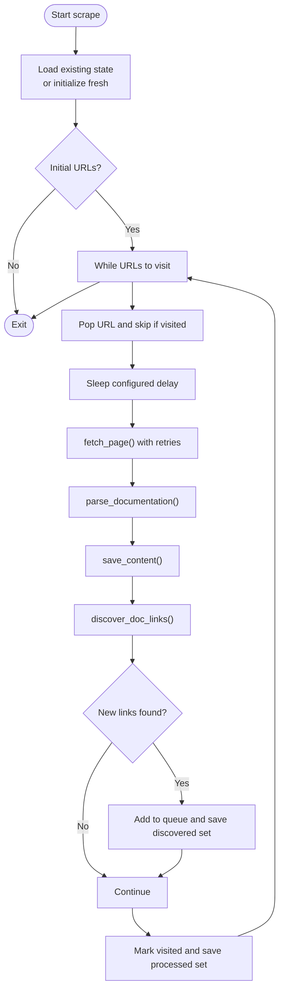
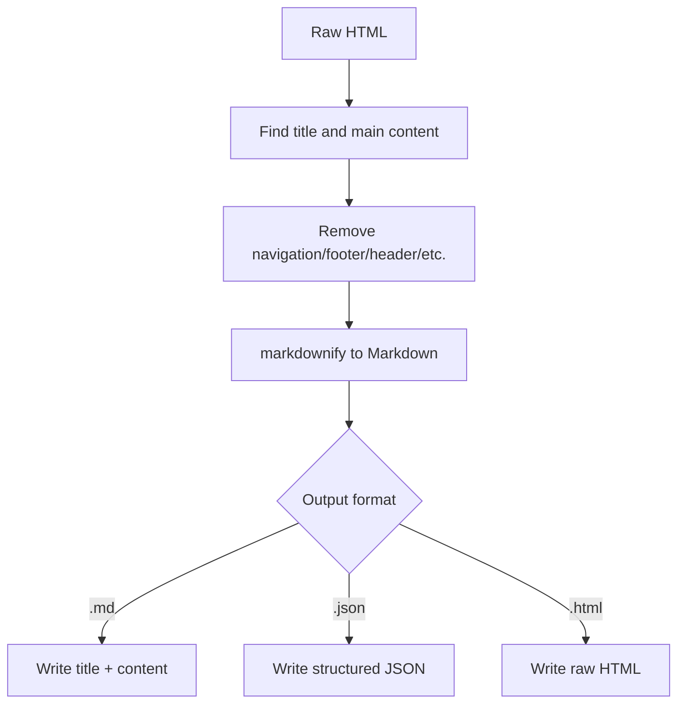
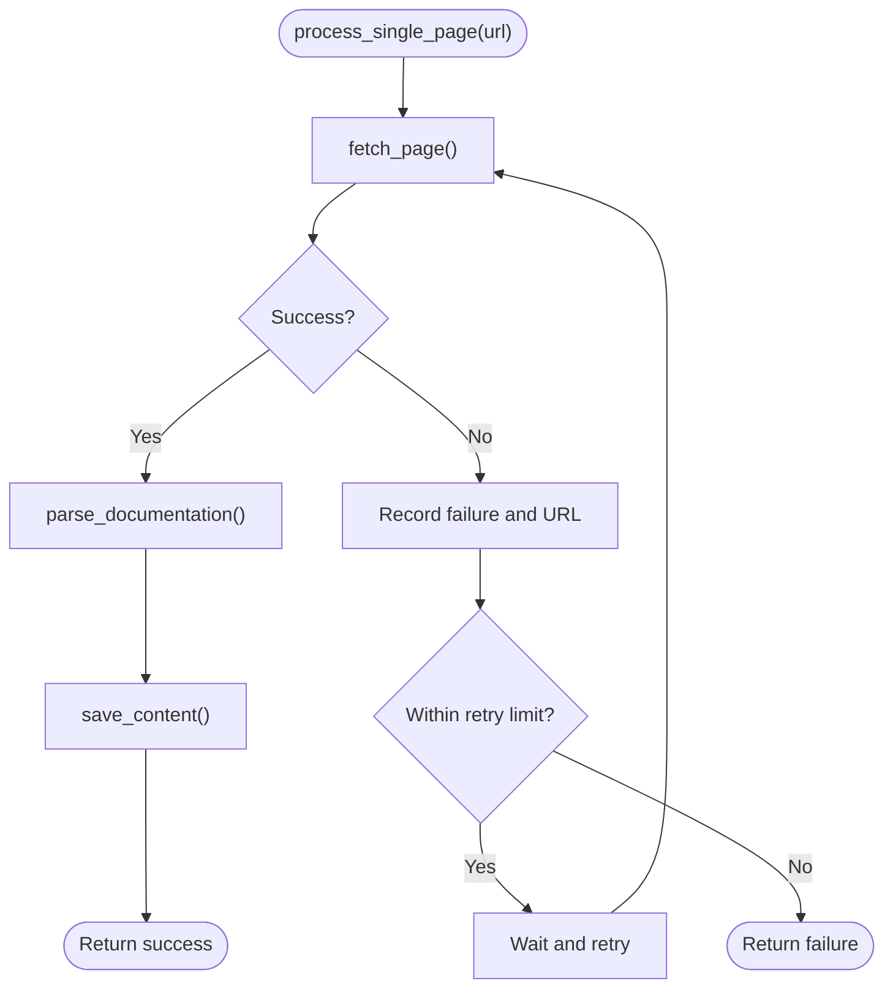
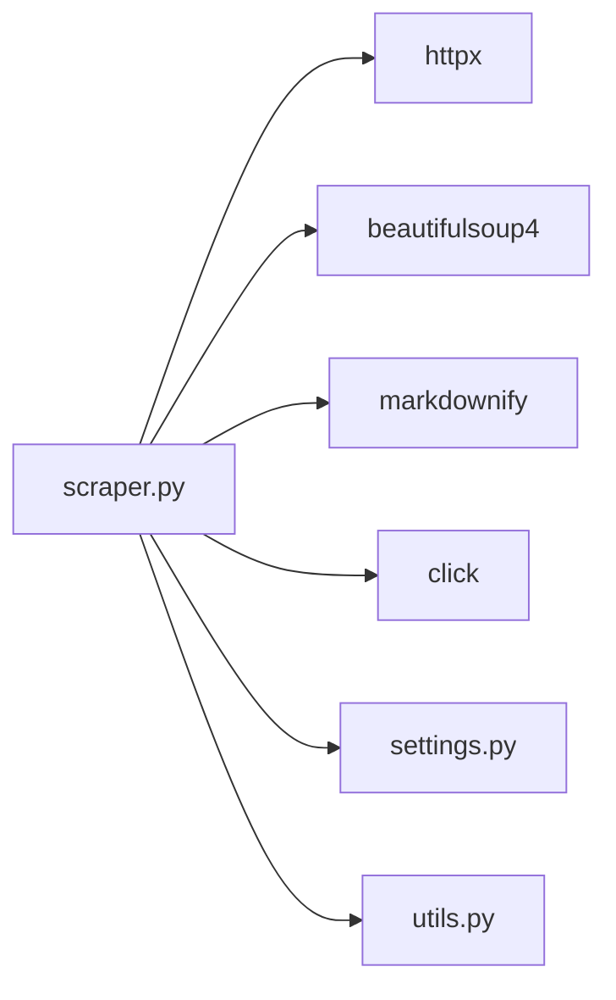
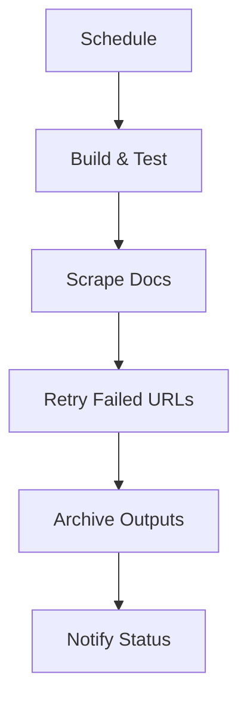

# Advanced Usage Patterns

<cite>
**Referenced Files in This Document**
- [README.md](file://README.md)
- [Makefile](file://Makefile)
- [pyproject.toml](file://pyproject.toml)
- [.env](file://.env)
- [src/pico_doc_scraper/settings.py](file://src/pico_doc_scraper/settings.py)
- [src/pico_doc_scraper/scraper.py](file://src/pico_doc_scraper/scraper.py)
- [src/pico_doc_scraper/utils.py](file://src/pico_doc_scraper/utils.py)
- [src/pico_doc_scraper/__main__.py](file://src/pico_doc_scraper/__main__.py)
</cite>

## Table of Contents
1. [Introduction](#introduction)
2. [Project Structure](#project-structure)
3. [Core Components](#core-components)
4. [Architecture Overview](#architecture-overview)
5. [Detailed Component Analysis](#detailed-component-analysis)
6. [Dependency Analysis](#dependency-analysis)
7. [Performance Considerations](#performance-considerations)
8. [Troubleshooting Guide](#troubleshooting-guide)
9. [CI/CD and Automation](#cicd-and-automation)
10. [Batch Processing Strategies](#batch-processing-strategies)
11. [Configuration Customization](#configuration-customization)
12. [Monitoring and Logging Best Practices](#monitoring-and-logging-best-practices)
13. [Workflow Recommendations](#workflow-recommendations)
14. [Conclusion](#conclusion)

## Introduction
This document provides advanced usage patterns and workflow optimization guidance for the Pico CSS Documentation Scraper. It covers integration with CI/CD pipelines, automated scheduling, batch processing for large-scale operations, configuration customization, advanced troubleshooting, performance optimization, monitoring/logging, and practical workflows for documentation archiving, educational preservation, and research.

## Project Structure
The project is organized around a focused scraper module with clear separation of concerns:
- Settings define base URLs, domains, timeouts, retries, delays, and output format.
- Scraper orchestrates fetching, parsing, saving, and state persistence.
- Utilities handle filesystem operations, sanitization, and state file management.
- Packaging and development tasks are driven by Makefile and pyproject.toml.
- Entry point enables module-style invocation.

**Diagram sources**
- [src/pico_doc_scraper/settings.py](file://src/pico_doc_scraper/settings.py#L1-L33)
- [src/pico_doc_scraper/utils.py](file://src/pico_doc_scraper/utils.py#L1-L175)
- [src/pico_doc_scraper/scraper.py](file://src/pico_doc_scraper/scraper.py#L1-L391)
- [src/pico_doc_scraper/__main__.py](file://src/pico_doc_scraper/__main__.py#L1-L7)

**Section sources**
- [README.md](file://README.md#L119-L134)
- [Makefile](file://Makefile#L1-L126)
- [pyproject.toml](file://pyproject.toml#L1-L75)

## Core Components
- Settings module centralizes configuration for base URL, allowed domain, output directories, state files, HTTP behavior, user agent, robots.txt respect, delays, and output format.
- Scraper module implements the main workflow: load/resume state, fetch pages with retry, parse and convert to Markdown, save outputs, discover new links, and persist state.
- Utilities module provides directory creation, content saving in multiple formats, filename sanitization, URL persistence/loading, and state cleanup.

Key behaviors:
- Automatic resume via state files.
- Polite scraping with configurable delays.
- Domain restriction and path filtering.
- Incremental state persistence for resilience.
- Flexible output formats (Markdown, JSON, HTML).

**Section sources**
- [src/pico_doc_scraper/settings.py](file://src/pico_doc_scraper/settings.py#L1-L33)
- [src/pico_doc_scraper/scraper.py](file://src/pico_doc_scraper/scraper.py#L24-L391)
- [src/pico_doc_scraper/utils.py](file://src/pico_doc_scraper/utils.py#L17-L175)

## Architecture Overview
The scraper follows a stateful, incremental pipeline with robust error handling and resumability.

**Diagram sources**
- [src/pico_doc_scraper/__main__.py](file://src/pico_doc_scraper/__main__.py#L1-L7)
- [src/pico_doc_scraper/scraper.py](file://src/pico_doc_scraper/scraper.py#L287-L387)
- [src/pico_doc_scraper/utils.py](file://src/pico_doc_scraper/utils.py#L17-L175)
- [src/pico_doc_scraper/settings.py](file://src/pico_doc_scraper/settings.py#L1-L33)

## Detailed Component Analysis

### State Management and Resumability
The scraper tracks discovered, processed, and failed URLs to enable resilient operation:
- Discovered URLs are appended to a set and saved incrementally.
- Processed URLs are tracked to avoid rework.
- Failed URLs are persisted for targeted retries.

**Diagram sources**
- [src/pico_doc_scraper/scraper.py](file://src/pico_doc_scraper/scraper.py#L287-L359)
- [src/pico_doc_scraper/utils.py](file://src/pico_doc_scraper/utils.py#L130-L158)

**Section sources**
- [src/pico_doc_scraper/scraper.py](file://src/pico_doc_scraper/scraper.py#L231-L285)
- [src/pico_doc_scraper/utils.py](file://src/pico_doc_scraper/utils.py#L130-L175)

### Content Parsing and Output Formatting
The parser extracts titles and main content areas, removes non-content elements, and converts to Markdown. Output format is controlled by file extension.

**Diagram sources**
- [src/pico_doc_scraper/scraper.py](file://src/pico_doc_scraper/scraper.py#L88-L142)
- [src/pico_doc_scraper/utils.py](file://src/pico_doc_scraper/utils.py#L17-L48)

**Section sources**
- [src/pico_doc_scraper/scraper.py](file://src/pico_doc_scraper/scraper.py#L88-L142)
- [src/pico_doc_scraper/utils.py](file://src/pico_doc_scraper/utils.py#L17-L48)

### Error Handling and Retry Logic
HTTP errors are caught and retried according to configured limits. On failure, URLs are recorded for later retry.

**Diagram sources**
- [src/pico_doc_scraper/scraper.py](file://src/pico_doc_scraper/scraper.py#L24-L53)
- [src/pico_doc_scraper/scraper.py](file://src/pico_doc_scraper/scraper.py#L145-L194)

**Section sources**
- [src/pico_doc_scraper/scraper.py](file://src/pico_doc_scraper/scraper.py#L24-L53)
- [src/pico_doc_scraper/scraper.py](file://src/pico_doc_scraper/scraper.py#L145-L194)

## Dependency Analysis
External dependencies include httpx for HTTP, beautifulsoup4 for parsing, markdownify for conversion, and click for CLI.

**Diagram sources**
- [src/pico_doc_scraper/scraper.py](file://src/pico_doc_scraper/scraper.py#L1-L22)
- [pyproject.toml](file://pyproject.toml#L9-L14)

**Section sources**
- [pyproject.toml](file://pyproject.toml#L9-L14)

## Performance Considerations
Current implementation is single-threaded and uses a simple queue. For large-scale operations, consider:
- Parallel processing: Introduce worker pools with bounded concurrency to respect politeness and resource limits.
- Memory management: Stream large content processing and avoid loading entire datasets into memory; periodically flush state files.
- Disk space planning: Monitor output directory growth; implement rotation or pruning policies for older content.
- Network efficiency: Reuse HTTP connections via httpx.AsyncClient with connection pooling; tune timeouts and retries per target domain characteristics.

[No sources needed since this section provides general guidance]

## Troubleshooting Guide
Common issues and advanced techniques:
- Rate limiting and IP blocking:
  - Increase delays between requests and randomize timing.
  - Rotate user agents and vary request headers.
  - Use proxies judiciously and monitor response codes.
- Domain-specific challenges:
  - Adjust ALLOWED_DOMAIN and path filters in settings.
  - Inspect site structure and update selectors in the parser if layouts change.
- State corruption or partial runs:
  - Use retry mode to reprocess failed URLs.
  - Clear state files only when necessary and confirm backups.
- Output inconsistencies:
  - Verify output format selection and filename sanitization.
  - Validate Markdown conversion by inspecting generated files.

**Section sources**
- [src/pico_doc_scraper/settings.py](file://src/pico_doc_scraper/settings.py#L6-L32)
- [src/pico_doc_scraper/scraper.py](file://src/pico_doc_scraper/scraper.py#L55-L85)
- [src/pico_doc_scraper/scraper.py](file://src/pico_doc_scraper/scraper.py#L88-L142)
- [src/pico_doc_scraper/utils.py](file://src/pico_doc_scraper/utils.py#L50-L74)

## CI/CD and Automation
Recommended automation patterns:
- Scheduled runs:
  - Configure cron or scheduler to trigger scraping at off-peak hours.
  - Use Makefile targets for idempotent execution.
- Pipeline stages:
  - Build: Install dependencies and build distribution.
  - Test: Run unit and integration tests.
  - Scrape: Execute scraping with retry mode for reliability.
  - Archive: Compress outputs and upload artifacts.
- Environment isolation:
  - Use .env and virtual environments managed by uv.
  - Separate configuration per environment via settings overrides.

**Diagram sources**
- [Makefile](file://Makefile#L115-L125)
- [pyproject.toml](file://pyproject.toml#L16-L24)
- [.env](file://.env#L1-L3)

**Section sources**
- [Makefile](file://Makefile#L115-L125)
- [pyproject.toml](file://pyproject.toml#L16-L24)
- [.env](file://.env#L1-L3)

## Batch Processing Strategies
For large-scale scraping:
- Chunking:
  - Split discovered URLs into batches and process iteratively.
  - Persist intermediate state per batch to enable partial recovery.
- Parallel workers:
  - Use concurrent.futures or asyncio to process multiple URLs concurrently.
  - Respect DELAY_BETWEEN_REQUESTS and MAX_RETRIES to avoid blacklisting.
- Resource gating:
  - Limit concurrent connections and I/O threads.
  - Monitor memory and CPU; scale down if thresholds exceeded.
- Idempotency:
  - Always check visited sets and skip duplicates.
  - Validate output files before marking URLs processed.

[No sources needed since this section provides general guidance]

## Configuration Customization
Customize behavior by editing settings:
- Base URL and domain:
  - Change PICO_DOCS_BASE_URL and ALLOWED_DOMAIN to target different documentation roots.
- HTTP behavior:
  - Adjust REQUEST_TIMEOUT, MAX_RETRIES, RETRY_DELAY, and DELAY_BETWEEN_REQUESTS.
- Output and format:
  - Set OUTPUT_FORMAT to "markdown", "json", or "html".
- User agent and robots:
  - Modify USER_AGENT and RESPECT_ROBOTS_TXT for compliance needs.
- Paths:
  - Override OUTPUT_DIR and DATA_DIR for alternate locations.

Environment-specific adaptations:
- Local development: Lower delays, increase verbosity.
- CI/CD: Enforce stricter delays, disable interactive prompts, and capture logs.

**Section sources**
- [src/pico_doc_scraper/settings.py](file://src/pico_doc_scraper/settings.py#L6-L32)

## Monitoring and Logging Best Practices
Production-grade monitoring:
- Structured logs:
  - Emit JSON logs with timestamps, URLs, statuses, and durations.
- Metrics:
  - Track throughput (pages/sec), error rates, and retry counts.
- Health checks:
  - Periodic probes to verify connectivity and target availability.
- Alerting:
  - Threshold-based alerts for sustained failures or rate limiting.
- Audit trails:
  - Store summaries and failed URL lists for forensic analysis.

[No sources needed since this section provides general guidance]

## Workflow Recommendations
- Documentation archiving:
  - Schedule weekly/monthly runs; keep incremental archives; prune old versions.
- Educational preservation:
  - Mirror key sections; preserve metadata; provide searchable indices.
- Research purposes:
  - Normalize content; extract semantic units; export structured datasets.

[No sources needed since this section provides general guidance]

## Conclusion
The Pico CSS Documentation Scraper offers a robust, resumable foundation for documentation extraction. By tuning settings, adopting parallelism thoughtfully, implementing CI/CD automation, and establishing strong monitoring, teams can scale operations reliably for archiving, education, and research use cases.