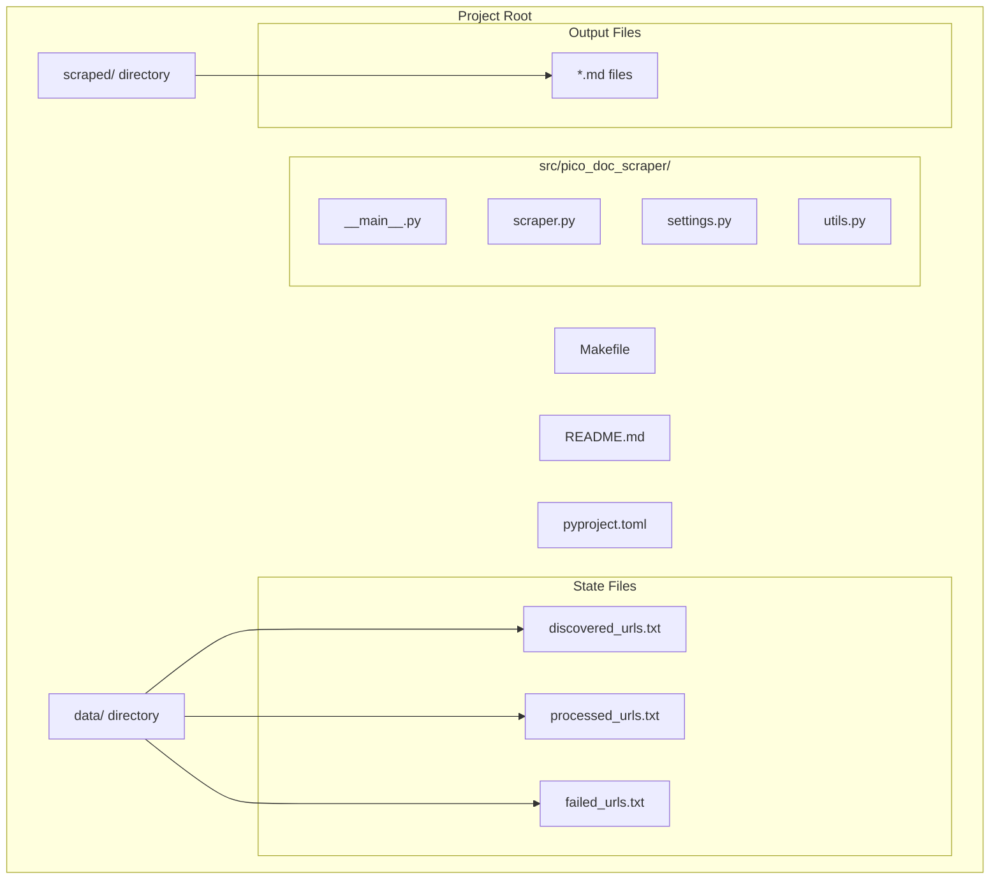
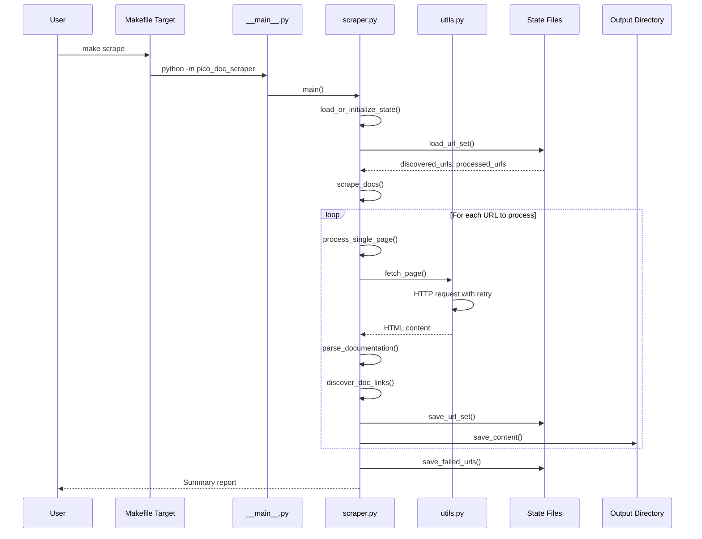
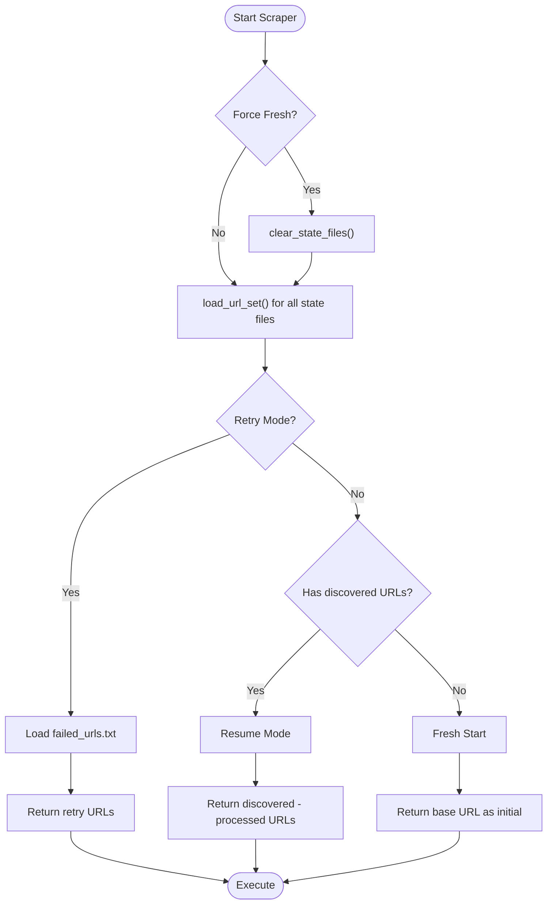
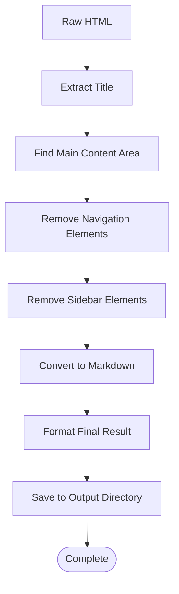
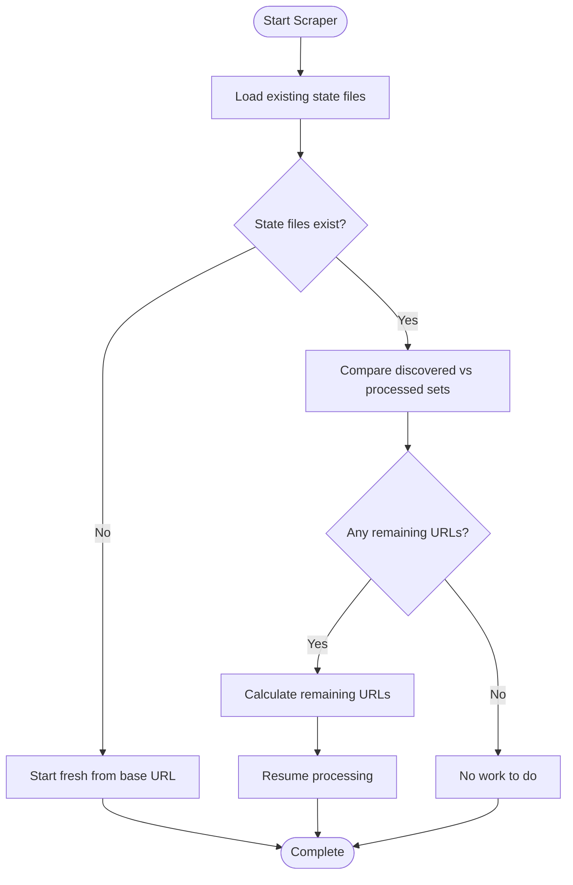
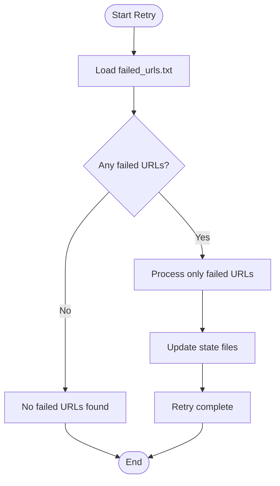
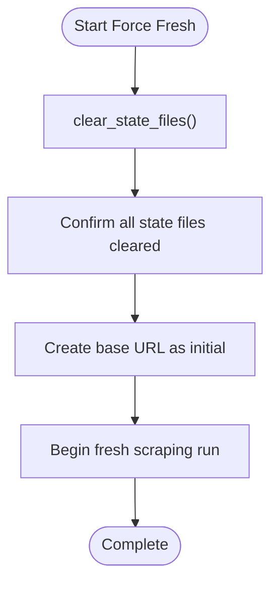

# Basic Scraping Operations

<cite>
**Referenced Files in This Document**
- [Makefile](file://Makefile)
- [README.md](file://README.md)
- [src/pico_doc_scraper/__main__.py](file://src/pico_doc_scraper/__main__.py)
- [src/pico_doc_scraper/scraper.py](file://src/pico_doc_scraper/scraper.py)
- [src/pico_doc_scraper/settings.py](file://src/pico_doc_scraper/settings.py)
- [src/pico_doc_scraper/utils.py](file://src/pico_doc_scraper/utils.py)
- [data/discovered_urls.txt](file://data/discovered_urls.txt)
- [data/processed_urls.txt](file://data/processed_urls.txt)
- [pyproject.toml](file://pyproject.toml)
</cite>

## Table of Contents
1. [Introduction](#introduction)
2. [Project Structure](#project-structure)
3. [Core Components](#core-components)
4. [Architecture Overview](#architecture-overview)
5. [Detailed Component Analysis](#detailed-component-analysis)
6. [State Persistence Mechanism](#state-persistence-mechanism)
7. [First-Time Scraping Workflow](#first-time-scraping-workflow)
8. [Resuming from Previous State](#resuming-from-previous-state)
9. [Retry Failed URLs](#retry-failed-urls)
10. [Fresh Start Option](#fresh-start-option)
11. [Expected Output](#expected-output)
12. [Verification Steps](#verification-steps)
13. [Common Scenarios and Troubleshooting](#common-scenarios-and-troubleshooting)
14. [Performance Considerations](#performance-considerations)
15. [Conclusion](#conclusion)

## Introduction

The Pico CSS Documentation Scraper is a resilient web scraper designed to convert the Pico.css documentation website (https://picocss.com/docs) from HTML to well-formatted Markdown. This documentation focuses specifically on basic scraping operations, covering how to initiate a scraping session from scratch, resume from previous state, and handle various operational scenarios.

Key features include automatic resume functionality, state tracking, retry mechanisms, and domain restriction. The scraper is designed to be robust against interruptions and can continue from where it left off.

## Project Structure

The project follows a clean modular structure with clear separation of concerns:



**Diagram sources**
- [Makefile](file://Makefile#L1-L126)
- [src/pico_doc_scraper/scraper.py](file://src/pico_doc_scraper/scraper.py#L1-L391)
- [src/pico_doc_scraper/settings.py](file://src/pico_doc_scraper/settings.py#L1-L33)

**Section sources**
- [Makefile](file://Makefile#L1-L126)
- [README.md](file://README.md#L1-L134)

## Core Components

The scraper consists of several key components that work together to provide reliable documentation extraction:

### Main Entry Point
The application can be executed through two primary methods:
- Makefile target: `make scrape`
- Direct Python module: `python -m pico_doc_scraper`

### Configuration Management
Settings are centralized in a dedicated configuration module that defines:
- Base URLs and domain restrictions
- Output directories
- HTTP client parameters
- Scraping behavior controls

### State Management
The system maintains three critical state files for tracking scraping progress:
- `discovered_urls.txt`: All URLs found during crawling
- `processed_urls.txt`: Successfully processed URLs  
- `failed_urls.txt`: URLs that failed to scrape

### Utility Functions
Helper functions handle file operations, URL processing, and content formatting.

**Section sources**
- [src/pico_doc_scraper/__main__.py](file://src/pico_doc_scraper/__main__.py#L1-L7)
- [src/pico_doc_scraper/scraper.py](file://src/pico_doc_scraper/scraper.py#L1-L391)
- [src/pico_doc_scraper/settings.py](file://src/pico_doc_scraper/settings.py#L1-L33)
- [src/pico_doc_scraper/utils.py](file://src/pico_doc_scraper/utils.py#L1-L175)

## Architecture Overview

The scraping architecture follows a systematic approach to ensure reliability and resumability:



**Diagram sources**
- [Makefile](file://Makefile#L115-L125)
- [src/pico_doc_scraper/__main__.py](file://src/pico_doc_scraper/__main__.py#L1-L7)
- [src/pico_doc_scraper/scraper.py](file://src/pico_doc_scraper/scraper.py#L287-L387)
- [src/pico_doc_scraper/utils.py](file://src/pico_doc_scraper/utils.py#L130-L175)

## Detailed Component Analysis

### State Loading and Initialization

The state management system provides three distinct modes of operation:



**Diagram sources**
- [src/pico_doc_scraper/scraper.py](file://src/pico_doc_scraper/scraper.py#L231-L284)
- [src/pico_doc_scraper/utils.py](file://src/pico_doc_scraper/utils.py#L161-L175)

### URL Discovery and Processing

The URL discovery mechanism follows strict filtering rules:

```mermaid
flowchart TD
PageFetch[Fetch HTML Content] --> ParseLinks[Parse All <a> Tags]
ParseLinks --> FilterDomain{Same Domain?}
FilterDomain --> |No| SkipDomain[Skip URL]
FilterDomain --> |Yes| CheckPath{Path Starts with "/docs"?}
CheckPath --> |No| SkipPath[Skip URL]
CheckPath --> |Yes| CheckExtension{Not Binary Extension?}
CheckExtension --> |No| SkipBinary[Skip URL]
CheckExtension --> |Yes| CleanURL[Remove Fragment & Query]
CleanURL --> AddToSet[Add to Links Set]
AddToSet --> NewLinks{New Links Found?}
NewLinks --> |Yes| QueueLinks[Queue for Processing]
NewLinks --> |No| Continue[Continue Processing]
QueueLinks --> Continue
Continue --> End([Complete])
```

**Diagram sources**
- [src/pico_doc_scraper/scraper.py](file://src/pico_doc_scraper/scraper.py#L55-L85)

### Content Processing Pipeline

The content processing transforms HTML to Markdown:



**Diagram sources**
- [src/pico_doc_scraper/scraper.py](file://src/pico_doc_scraper/scraper.py#L88-L142)

**Section sources**
- [src/pico_doc_scraper/scraper.py](file://src/pico_doc_scraper/scraper.py#L231-L387)
- [src/pico_doc_scraper/utils.py](file://src/pico_doc_scraper/utils.py#L17-L175)

## State Persistence Mechanism

The scraper implements a sophisticated state persistence system that enables reliable resumable operations:

### State File Structure

| File | Purpose | Format | Example |
|------|---------|--------|---------|
| `discovered_urls.txt` | All URLs found during crawling | One URL per line | `https://picocss.com/docs/button` |
| `processed_urls.txt` | Successfully processed URLs | One URL per line | `https://picocss.com/docs/button` |
| `failed_urls.txt` | URLs that failed to scrape | One URL per line | `https://picocss.com/docs/nonexistent` |

### Incremental State Updates

The system performs incremental updates to minimize data loss risk:

```mermaid
sequenceDiagram
participant Loop as Main Loop
participant State as State Files
participant Disk as File System
Loop->>Loop : Process URL
alt Success
Loop->>State : save_url_set(visited_urls)
State->>Disk : Write processed_urls.txt
Loop->>State : save_url_set(discovered_urls)
State->>Disk : Write discovered_urls.txt
else Failure
Loop->>State : save_failed_urls(failed_urls)
State->>Disk : Write failed_urls.txt
end
```

**Diagram sources**
- [src/pico_doc_scraper/scraper.py](file://src/pico_doc_scraper/scraper.py#L347-L348)
- [src/pico_doc_scraper/utils.py](file://src/pico_doc_scraper/utils.py#L130-L141)

### State Loading Logic

The state loading process prioritizes reliability and user intent:

1. **Force Fresh Mode**: Completely clears all state files
2. **Retry Mode**: Loads only failed URLs from previous run
3. **Resume Mode**: Loads existing state and continues from where left off

**Section sources**
- [src/pico_doc_scraper/scraper.py](file://src/pico_doc_scraper/scraper.py#L231-L284)
- [src/pico_doc_scraper/utils.py](file://src/pico_doc_scraper/utils.py#L112-L158)

## First-Time Scraping Workflow

### Step-by-Step Instructions

Follow these steps to perform your first complete scraping session:

### Prerequisites Setup

1. **Environment Setup**
   ```bash
   make setup
   ```

2. **Install Dependencies**
   ```bash
   make install
   ```

### Initiating the Scraping Session

#### Method 1: Using Makefile Target
```bash
make scrape
```

#### Method 2: Direct Python Module Execution
```bash
python -m pico_doc_scraper
```

### Expected Progress Output

During the scraping process, you'll see detailed progress information:

```
============================================================
Pico.css Documentation Scraper
============================================================

Starting scrape of https://picocss.com/docs
Restricting to domain: picocss.com
Delay between requests: 1.0s

[1] Fetching: https://picocss.com/docs
  ✓ Fetched
  ✓ Parsed: Getting started
  ✓ Saved to index.md
  ✓ Discovered 25 new links

[2] Fetching: https://picocss.com/docs/button
  ✓ Fetched
  ✓ Parsed: Button
  ✓ Saved to button.md
```

### Initial State Creation

On first run, the system creates empty state files:
- `data/discovered_urls.txt` (empty initially)
- `data/processed_urls.txt` (empty initially)  
- `data/failed_urls.txt` (created when needed)

**Section sources**
- [README.md](file://README.md#L23-L53)
- [src/pico_doc_scraper/scraper.py](file://src/pico_doc_scraper/scraper.py#L279-L284)

## Resuming from Previous State

### Automatic Resume Behavior

The scraper automatically detects existing state and resumes from where it left off:



**Diagram sources**
- [src/pico_doc_scraper/scraper.py](file://src/pico_doc_scraper/scraper.py#L264-L277)

### Manual Resume Methods

#### Using Makefile Target
```bash
make scrape
```

#### Direct Python Module
```bash
python -m pico_doc_scraper
```

### State Detection Process

The resume detection follows this logic:

1. **Load discovered URLs**: Check if any URLs were found
2. **Load processed URLs**: Check if any URLs were successfully processed
3. **Calculate remaining**: `remaining = discovered - processed`
4. **Start from remaining**: Begin processing only the unprocessed URLs

**Section sources**
- [src/pico_doc_scraper/scraper.py](file://src/pico_doc_scraper/scraper.py#L264-L277)

## Retry Failed URLs

### Purpose and Benefits

The retry mechanism allows you to specifically target URLs that failed during the previous scraping session:

- **Targeted Recovery**: Focus only on failed URLs
- **Reduced Time**: Skip URLs that already succeeded
- **Improved Efficiency**: Faster completion of partial runs

### Initiating Retry Mode

#### Method 1: Using Makefile Target
```bash
make scrape-retry
```

#### Method 2: Direct Python Module
```bash
python -m pico_doc_scraper --retry
```

### Retry Process Flow



**Diagram sources**
- [src/pico_doc_scraper/scraper.py](file://src/pico_doc_scraper/scraper.py#L254-L262)

### State Management During Retry

- **Load Only Failed URLs**: The system reads from `failed_urls.txt`
- **Skip Successful URLs**: Previously processed URLs are ignored
- **Update on Completion**: Failed URLs are cleared, successful ones are added to processed set

**Section sources**
- [src/pico_doc_scraper/scraper.py](file://src/pico_doc_scraper/scraper.py#L254-L262)

## Fresh Start Option

### When to Use Force Fresh

Use the force fresh option when you need to completely restart the scraping process:

- **Corrupted State**: State files are damaged or inconsistent
- **Different Target**: Change scraping parameters or target domain
- **Complete Rebuild**: Start over with clean state files

### Initiating Force Fresh

#### Method 1: Using Makefile Target
```bash
make scrape-fresh
```

#### Method 2: Direct Python Module
```bash
python -m pico_doc_scraper --force-fresh
```

### Force Fresh Process



**Diagram sources**
- [src/pico_doc_scraper/scraper.py](file://src/pico_doc_scraper/scraper.py#L244-L247)
- [src/pico_doc_scraper/utils.py](file://src/pico_doc_scraper/utils.py#L161-L175)

**Section sources**
- [src/pico_doc_scraper/scraper.py](file://src/pico_doc_scraper/scraper.py#L244-L247)

## Expected Output

### Output Directory Structure

After successful scraping, you'll find the following structure:

```
scraped/
├── index.md                    # Main documentation page
├── button.md                   # Individual component documentation
├── forms.md                    # Forms documentation
├── accordion.md               # Accordion component
├── card.md                    # Card component
├── modal.md                   # Modal component
├── nav.md                     # Navigation documentation
├── table.md                   # Table documentation
├── tooltip.md                 # Tooltip component
├── typography.md             # Typography documentation
├── version-picker.md          # Version picker documentation
├── v1_button.html.md         # Version 1 button (converted)
├── v2_button.md              # Version 2 button (current)
└── ... (all discovered pages)
```

### Output File Formats

The scraper generates content in Markdown format with the following structure:

```markdown
# [Page Title]

[Markdown content extracted from the documentation page]

[Additional content as applicable]
```

### State File Updates

During scraping, the system continuously updates state files:

- **discovered_urls.txt**: Grows as new URLs are found
- **processed_urls.txt**: Grows as URLs are successfully processed  
- **failed_urls.txt**: Populated with URLs that encounter errors

**Section sources**
- [README.md](file://README.md#L77-L79)
- [src/pico_doc_scraper/utils.py](file://src/pico_doc_scraper/utils.py#L17-L48)

## Verification Steps

### Post-Scraping Verification

After completing a scraping session, perform these verification steps:

#### 1. Check State File Consistency
```bash
# Verify discovered URLs match processed URLs
wc -l data/discovered_urls.txt
wc -l data/processed_urls.txt
```

#### 2. Validate Output Directory
```bash
# Count generated Markdown files
find scraped -name "*.md" | wc -l
```

#### 3. Check for Failed URLs
```bash
# Verify failed URLs file exists and is empty
ls -la data/failed_urls.txt
```

#### 4. Review Summary Output
Look for the final summary in the console output:
```
Successfully scraped: [number] pages
Errors encountered: [number]
Output directory: scraped/
```

### Common Verification Commands

```bash
# Check if all discovered URLs were processed
comm -23 <(sort data/discovered_urls.txt) <(sort data/processed_urls.txt)
```

This command will show any URLs that were discovered but not processed.

**Section sources**
- [src/pico_doc_scraper/scraper.py](file://src/pico_doc_scraper/scraper.py#L196-L229)

## Common Scenarios and Troubleshooting

### Scenario 1: Interrupted Scraping Session

**Problem**: Scraping was interrupted mid-process (Ctrl+C)

**Solution**: The scraper automatically handles interruptions:

1. **State Persistence**: All current state is saved to disk
2. **Automatic Resume**: Next run will detect existing state
3. **Continuation**: Scraping resumes from where it left off

**Behavior Details**:
- `processed_urls.txt` contains successfully processed URLs
- `discovered_urls.txt` contains all discovered URLs
- `failed_urls.txt` may contain URLs that were being processed when interrupted

### Scenario 2: Partial Completion

**Problem**: Only some URLs were successfully processed

**Solution**: Use retry mode to process only failed URLs:

```bash
make scrape-retry
# or
python -m pico_doc_scraper --retry
```

### Scenario 3: Corrupted State Files

**Problem**: State files are corrupted or inconsistent

**Solution**: Force fresh start:

```bash
make scrape-fresh
# or
python -m pico_doc_scraper --force-fresh
```

### Scenario 4: Network Issues

**Problem**: Network connectivity issues during scraping

**Solution**: The scraper handles network errors gracefully:

1. **Retry Logic**: Automatic retry for failed HTTP requests
2. **Error Logging**: Failed URLs are recorded in `failed_urls.txt`
3. **Graceful Degradation**: Scraping continues with remaining URLs

### Scenario 5: Domain Restriction Issues

**Problem**: URLs from other domains are being included

**Solution**: The scraper enforces domain restrictions:

- Only URLs from `picocss.com` domain are processed
- URLs outside `/docs` path are filtered out
- Binary file extensions (PDF, ZIP, TAR.GZ) are excluded

**Section sources**
- [src/pico_doc_scraper/scraper.py](file://src/pico_doc_scraper/scraper.py#L350-L358)
- [src/pico_doc_scraper/scraper.py](file://src/pico_doc_scraper/scraper.py#L55-L85)

## Performance Considerations

### Request Rate Limiting

The scraper implements polite scraping behavior:

- **Delay Between Requests**: 1.0 second delay between requests
- **User Agent**: Identifies as educational tool
- **Timeout Settings**: 30-second timeout per request
- **Retry Strategy**: Up to 3 retry attempts with 1-second delay

### Memory Management

- **URL Set Operations**: Uses sets for efficient URL tracking
- **Incremental State Updates**: Writes state files after each URL
- **Progressive Discovery**: Discovers links progressively during scraping

### Scalability Factors

- **Domain Restriction**: Limits scope to `picocss.com/docs`
- **Content Filtering**: Focuses on documentation content only
- **State Persistence**: Enables reliable continuation

**Section sources**
- [src/pico_doc_scraper/settings.py](file://src/pico_doc_scraper/settings.py#L19-L32)
- [src/pico_doc_scraper/scraper.py](file://src/pico_doc_scraper/scraper.py#L38-L52)

## Conclusion

The Pico CSS Documentation Scraper provides a robust foundation for extracting documentation content with automatic resume capabilities and comprehensive state management. The system's design ensures reliability even when interrupted, with clear pathways for manual intervention and recovery.

Key benefits of this scraping approach include:

- **Reliability**: Automatic state persistence prevents data loss
- **Flexibility**: Multiple execution methods (Makefile and direct Python)
- **Control**: Explicit options for retry, fresh start, and resume
- **Transparency**: Clear progress reporting and state file tracking
- **Efficiency**: Polite scraping with configurable delays and retry logic

For most use cases, the default scraping workflow will provide excellent results with minimal intervention. The system's state management ensures that partial runs can be resumed reliably, making it suitable for long-running scraping operations.