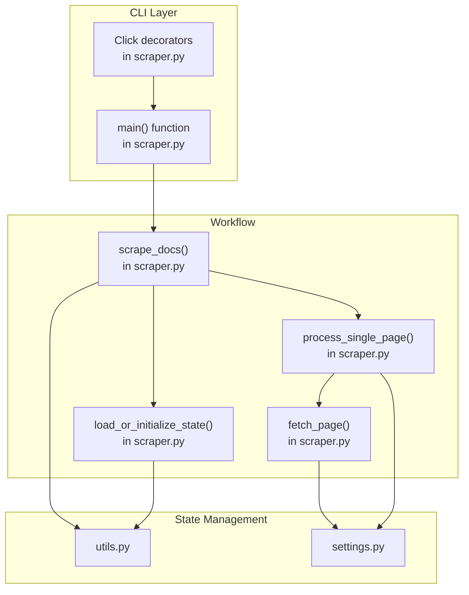
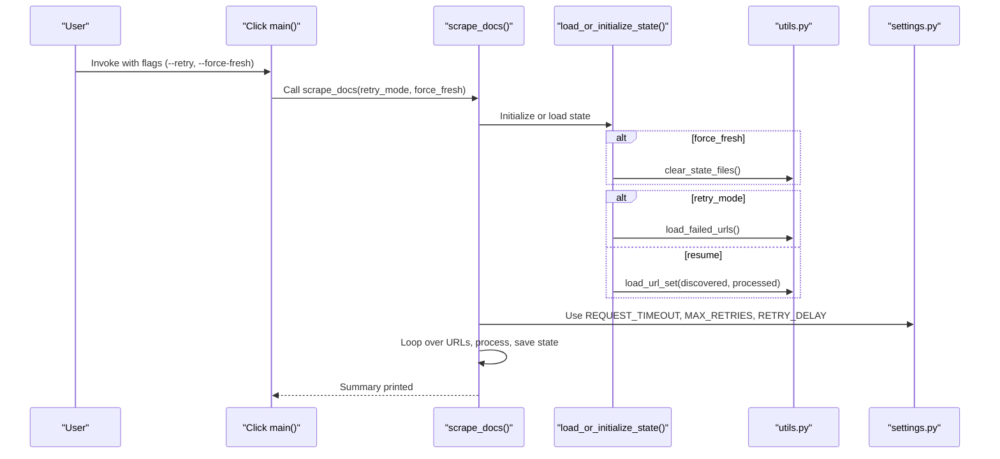
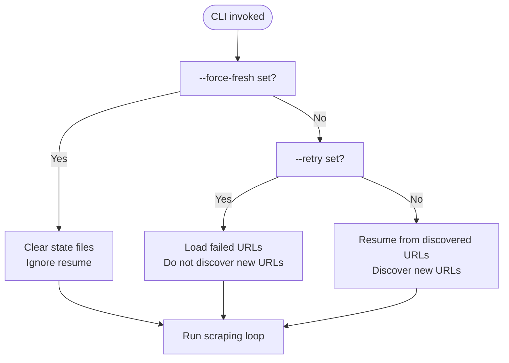
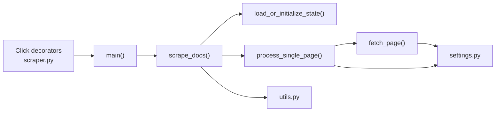

# CLI Options and Parameters

<cite>
**Referenced Files in This Document**
- [README.md](file://README.md)
- [Makefile](file://Makefile)
- [src/pico_doc_scraper/scraper.py](file://src/pico_doc_scraper/scraper.py)
- [src/pico_doc_scraper/settings.py](file://src/pico_doc_scraper/settings.py)
- [src/pico_doc_scraper/utils.py](file://src/pico_doc_scraper/utils.py)
- [.env](file://.env)
- [.envrc](file://.envrc)
- [pyproject.toml](file://pyproject.toml)
</cite>

## Table of Contents
1. [Introduction](#introduction)
2. [Project Structure](#project-structure)
3. [Core Components](#core-components)
4. [Architecture Overview](#architecture-overview)
5. [Detailed Component Analysis](#detailed-component-analysis)
6. [Dependency Analysis](#dependency-analysis)
7. [Performance Considerations](#performance-considerations)
8. [Troubleshooting Guide](#troubleshooting-guide)
9. [Conclusion](#conclusion)
10. [Appendices](#appendices)

## Introduction
This document explains all command-line options and parameters for the Pico CSS Documentation Scraper. It covers the --retry (-r) flag for selective URL retries, the --force-fresh (-f) flag for complete state reset, the --help option, parameter precedence, and interactions between options. It also documents environment variable usage, configuration file integration, advanced tuning for power users, and troubleshooting guidance for common CLI issues.

## Project Structure
The CLI is implemented as a Click-based command-line interface backed by a scraping workflow that manages state across runs.

**Diagram sources**
- [src/pico_doc_scraper/scraper.py](file://src/pico_doc_scraper/scraper.py#L360-L390)
- [src/pico_doc_scraper/utils.py](file://src/pico_doc_scraper/utils.py#L1-L175)
- [src/pico_doc_scraper/settings.py](file://src/pico_doc_scraper/settings.py#L1-L33)

**Section sources**
- [src/pico_doc_scraper/scraper.py](file://src/pico_doc_scraper/scraper.py#L360-L390)
- [src/pico_doc_scraper/utils.py](file://src/pico_doc_scraper/utils.py#L1-L175)
- [src/pico_doc_scraper/settings.py](file://src/pico_doc_scraper/settings.py#L1-L33)

## Core Components
- CLI entrypoint and options:
  - The main CLI is defined with Click decorators and exposes two flags:
    - --retry (-r): Retry only failed URLs from the previous scrape.
    - --force-fresh (-f): Start a fresh scrape and clear all existing state.
  - The CLI prints a header and delegates to the scraping workflow.

- Scraping workflow:
  - scrape_docs handles the main loop, state initialization, and printing summaries.
  - load_or_initialize_state decides whether to resume, retry, or start fresh based on flags and existing state files.

- State persistence:
  - Three state files track discovered URLs, processed URLs, and failed URLs.
  - Utilities manage saving/loading these sets and failed URLs.

- Configuration:
  - HTTP timeouts, retry counts, delays, and output format are configured centrally.

**Section sources**
- [src/pico_doc_scraper/scraper.py](file://src/pico_doc_scraper/scraper.py#L360-L390)
- [src/pico_doc_scraper/scraper.py](file://src/pico_doc_scraper/scraper.py#L287-L359)
- [src/pico_doc_scraper/scraper.py](file://src/pico_doc_scraper/scraper.py#L231-L284)
- [src/pico_doc_scraper/utils.py](file://src/pico_doc_scraper/utils.py#L92-L175)
- [src/pico_doc_scraper/settings.py](file://src/pico_doc_scraper/settings.py#L1-L33)

## Architecture Overview
The CLI orchestrates a state-aware scraping pipeline. Flags influence how state is loaded and whether new URLs are discovered.

**Diagram sources**
- [src/pico_doc_scraper/scraper.py](file://src/pico_doc_scraper/scraper.py#L360-L390)
- [src/pico_doc_scraper/scraper.py](file://src/pico_doc_scraper/scraper.py#L287-L359)
- [src/pico_doc_scraper/scraper.py](file://src/pico_doc_scraper/scraper.py#L231-L284)
- [src/pico_doc_scraper/utils.py](file://src/pico_doc_scraper/utils.py#L92-L175)
- [src/pico_doc_scraper/settings.py](file://src/pico_doc_scraper/settings.py#L19-L32)

## Detailed Component Analysis

### CLI Options Reference
- --retry (-r)
  - Purpose: Retry only URLs that failed in the previous run.
  - Behavior: Loads failed URLs from the failed state file and scrapes only those.
  - Interaction: Takes precedence over resume mode; does not discover new URLs.

- --force-fresh (-f)
  - Purpose: Start a fresh scrape and clear all existing state.
  - Behavior: Deletes discovered, processed, and failed state files before starting.
  - Interaction: Overrides resume mode; ignores previously discovered URLs.

- --help
  - Purpose: Prints CLI help and available options.
  - Behavior: Provided by Click automatically from the decorator’s help text.

- Parameter precedence and interaction
  - --force-fresh takes highest precedence: if set, clears state and ignores resume.
  - --retry is mutually exclusive with resume: if set, only retries failed URLs.
  - If neither flag is set, the scraper resumes from previous state if available.

**Section sources**
- [src/pico_doc_scraper/scraper.py](file://src/pico_doc_scraper/scraper.py#L360-L390)
- [src/pico_doc_scraper/scraper.py](file://src/pico_doc_scraper/scraper.py#L231-L284)
- [README.md](file://README.md#L55-L64)

### Practical Examples and Effects
- python -m pico_doc_scraper
  - Effect: Resumes from previous state if discovered and processed state files exist; otherwise starts from the base URL.
  - Expected outcome: Continues discovery and processing from where it left off.

- python -m pico_doc_scraper --retry
  - Effect: Loads failed URLs and retries them; does not discover new URLs.
  - Expected outcome: Reduces the number of failed URLs by reprocessing them.

- python -m pico_doc_scraper --force-fresh
  - Effect: Clears discovered, processed, and failed state files; starts from the base URL.
  - Expected outcome: Full re-scrape of the documentation site.

- make scrape
  - Effect: Runs the module without flags; equivalent to the Python invocation above.
  - Expected outcome: Same as python -m pico_doc_scraper.

- make scrape-retry
  - Effect: Runs the module with --retry.
  - Expected outcome: Retries only failed URLs.

- make scrape-fresh
  - Effect: Runs the module with --force-fresh.
  - Expected outcome: Starts a fresh scrape after clearing state.

**Section sources**
- [README.md](file://README.md#L23-L59)
- [Makefile](file://Makefile#L115-L126)
- [src/pico_doc_scraper/scraper.py](file://src/pico_doc_scraper/scraper.py#L360-L390)

### Parameter Precedence and Interactions

**Diagram sources**
- [src/pico_doc_scraper/scraper.py](file://src/pico_doc_scraper/scraper.py#L231-L284)
- [src/pico_doc_scraper/scraper.py](file://src/pico_doc_scraper/scraper.py#L287-L359)

### Advanced Parameter Tuning for Power Users
- Timeout adjustments
  - REQUEST_TIMEOUT controls the HTTP client timeout per request.
  - Adjust in settings.py to handle slower networks or larger pages.

- Retry limits
  - MAX_RETRIES controls the number of automatic retry attempts per URL.
  - Increase for flaky connections; decrease to speed up failure feedback.

- Delay configurations
  - RETRY_DELAY controls the sleep between retry attempts.
  - Increase to reduce server pressure; tune alongside DELAY_BETWEEN_REQUESTS for politeness.

- Output format
  - OUTPUT_FORMAT determines the output content type; currently defaults to markdown.
  - Modify in settings.py to change behavior across the pipeline.

- Domain restriction and base URL
  - ALLOWED_DOMAIN restricts scraping to the designated domain.
  - PICO_DOCS_BASE_URL sets the starting URL for the crawl.

Note: These are global configuration values that affect the entire run and are not exposed as CLI flags.

**Section sources**
- [src/pico_doc_scraper/settings.py](file://src/pico_doc_scraper/settings.py#L19-L32)
- [src/pico_doc_scraper/scraper.py](file://src/pico_doc_scraper/scraper.py#L24-L53)
- [src/pico_doc_scraper/scraper.py](file://src/pico_doc_scraper/scraper.py#L322-L324)

### Environment Variables and Configuration Files
- Virtual environment and interpreter
  - VIRTUAL_ENV and UV_PYTHON define the virtual environment and Python interpreter used by the project.
  - .envrc activates the virtual environment and loads environment variables for the shell session.

- Makefile integration
  - The Makefile wraps CLI invocations and provides convenient targets for scraping, retrying, and starting fresh.
  - Targets use uv run to ensure consistent environment execution.

- Configuration file integration
  - The project uses a Python package configuration via pyproject.toml for dependencies and tooling.
  - No separate CLI configuration file is supported; configuration is centralized in settings.py.

**Section sources**
- [.env](file://.env#L1-L3)
- [.envrc](file://.envrc#L1-L2)
- [Makefile](file://Makefile#L115-L126)
- [pyproject.toml](file://pyproject.toml#L1-L75)

## Dependency Analysis
The CLI depends on Click for argument parsing and delegates to the scraping workflow. The workflow depends on state utilities and settings.

**Diagram sources**
- [src/pico_doc_scraper/scraper.py](file://src/pico_doc_scraper/scraper.py#L360-L390)
- [src/pico_doc_scraper/scraper.py](file://src/pico_doc_scraper/scraper.py#L287-L359)
- [src/pico_doc_scraper/scraper.py](file://src/pico_doc_scraper/scraper.py#L231-L284)
- [src/pico_doc_scraper/utils.py](file://src/pico_doc_scraper/utils.py#L1-L175)
- [src/pico_doc_scraper/settings.py](file://src/pico_doc_scraper/settings.py#L1-L33)

**Section sources**
- [src/pico_doc_scraper/scraper.py](file://src/pico_doc_scraper/scraper.py#L360-L390)
- [src/pico_doc_scraper/utils.py](file://src/pico_doc_scraper/utils.py#L1-L175)
- [src/pico_doc_scraper/settings.py](file://src/pico_doc_scraper/settings.py#L1-L33)

## Performance Considerations
- Politeness and rate limiting:
  - A delay is applied between requests to avoid overloading the target server.
  - Tune DELAY_BETWEEN_REQUESTS in settings.py to balance speed and politeness.

- Retry behavior:
  - Requests are retried with a fixed delay between attempts.
  - Adjust MAX_RETRIES and RETRY_DELAY to improve resilience on unstable networks.

- State persistence:
  - Incremental saves of discovered and processed URLs enable quick resumption and reduce wasted work.

[No sources needed since this section provides general guidance]

## Troubleshooting Guide
- No failed URLs to retry
  - Symptom: The retry mode reports no failed URLs and exits early.
  - Cause: failed_urls.txt is empty or missing.
  - Resolution: Run a normal scrape first to populate failed URLs, then retry.

- Nothing to process after resume
  - Symptom: The scraper reports all discovered URLs were processed and exits.
  - Cause: Previous run completed successfully or was interrupted mid-run without new URLs.
  - Resolution: Use --force-fresh to restart from scratch.

- Interrupted mid-run
  - Symptom: Ctrl+C stops the run.
  - Resolution: Re-run the same command; it will resume from the last saved state.

- Unexpected errors during main loop
  - Symptom: An unexpected error message appears before the summary.
  - Resolution: Check network connectivity, increase timeouts, or reduce concurrency by increasing delays.

- Output format mismatch
  - Symptom: Output files are not in expected format.
  - Resolution: Verify OUTPUT_FORMAT in settings.py and filenames; the pipeline writes markdown by default.

**Section sources**
- [src/pico_doc_scraper/scraper.py](file://src/pico_doc_scraper/scraper.py#L254-L262)
- [src/pico_doc_scraper/scraper.py](file://src/pico_doc_scraper/scraper.py#L273-L277)
- [src/pico_doc_scraper/scraper.py](file://src/pico_doc_scraper/scraper.py#L350-L358)
- [src/pico_doc_scraper/scraper.py](file://src/pico_doc_scraper/scraper.py#L196-L229)

## Conclusion
The CLI provides two primary flags for controlling scraping behavior: --retry to focus on failed URLs and --force-fresh to reset state and start over. Without flags, the scraper resumes from previous state. Advanced tuning is available through settings.py for timeouts, retries, and delays. Environment and Makefile support streamline execution and ensure consistent environments.

[No sources needed since this section summarizes without analyzing specific files]

## Appendices

### Quick Reference: CLI Options
- --retry (-r): Retry only failed URLs from the previous scrape.
- --force-fresh (-f): Start a fresh scrape and clear all existing state.
- --help: Print CLI help and available options.

**Section sources**
- [src/pico_doc_scraper/scraper.py](file://src/pico_doc_scraper/scraper.py#L360-L390)
- [README.md](file://README.md#L55-L64)