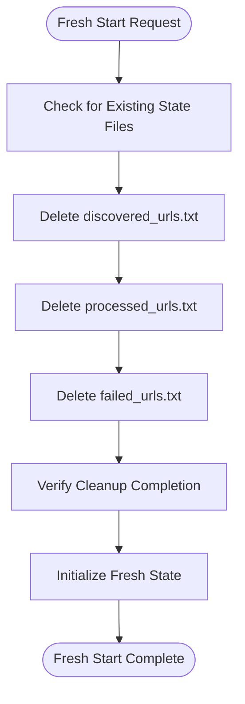

# Fresh Start Procedures

<cite>
**Referenced Files in This Document**
- [scraper.py](file://src/pico_doc_scraper/scraper.py)
- [utils.py](file://src/pico_doc_scraper/utils.py)
- [settings.py](file://src/pico_doc_scraper/settings.py)
- [Makefile](file://Makefile)
- [README.md](file://README.md)
- [__main__.py](file://src/pico_doc_scraper/__main__.py)
</cite>

## Table of Contents
1. [Introduction](#introduction)
2. [Understanding State Management](#understanding-state-management)
3. [Fresh Start Scenarios](#fresh-start-scenarios)
4. [Command-Line Fresh Start](#command-line-fresh-start)
5. [Makefile Fresh Start](#makefile-fresh-start)
6. [State Cleanup Process](#state-cleanup-process)
7. [Verification Steps](#verification-steps)
8. [Data Loss Implications](#data-loss-implications)
9. [Backup Recommendations](#backup-recommendations)
10. [Troubleshooting Common Issues](#troubleshooting-common-issues)
11. [Best Practices](#best-practices)

## Introduction

The Pico CSS Documentation Scraper provides robust state persistence capabilities that automatically resume interrupted scraping sessions. However, there are scenarios where you need to perform a complete fresh start, clearing all existing state and beginning a completely new scraping session. This document provides comprehensive guidance on executing fresh start procedures using both the `--force-fresh` command-line flag and the `make scrape-fresh` command.

## Understanding State Management

The scraper maintains three critical state files in the `data/` directory that enable automatic resumption of scraping sessions:

- **discovered_urls.txt**: Tracks all URLs discovered during crawling
- **processed_urls.txt**: Records successfully processed URLs  
- **failed_urls.txt**: Contains URLs that failed to scrape during the last session

These files are automatically created and managed during scraping operations, allowing the system to resume from the exact point where it left off.

**Section sources**
- [README.md](file://README.md#L69-L75)
- [settings.py](file://src/pico_doc_scraper/settings.py#L14-L17)

## Fresh Start Scenarios

Fresh start procedures become necessary in several critical scenarios:

### Configuration Changes
- Modifying the `PICO_DOCS_BASE_URL` setting
- Updating `ALLOWED_DOMAIN` restrictions
- Changing `REQUEST_TIMEOUT` or `MAX_RETRIES` values
- Adjusting `DELAY_BETWEEN_REQUESTS` parameters

### Domain Restrictions Updates
- When the target domain structure changes
- After domain migration or restructuring
- When implementing new domain filtering requirements

### Corrupted State Files
- When state files contain malformed URLs
- When scraping becomes stuck in an inconsistent state
- When URLs appear duplicated or missing from state tracking

### Complete Re-Scraping Requirements
- When you need to re-scrape with updated parsing logic
- After significant website structure changes
- When testing new scraping configurations

## Command-Line Fresh Start

### Using the --force-fresh Flag

The primary method for initiating a fresh start is through the `--force-fresh` command-line option:

```bash
python -m pico_doc_scraper --force-fresh
```

This command immediately clears all existing state files and begins a completely fresh scraping session.

### Implementation Details

When the `--force-fresh` flag is detected, the scraper executes the following process:

1. **Force Fresh Mode Detection**: The system identifies the `--force-fresh` flag in the CLI arguments
2. **State File Deletion**: All three state files are immediately deleted
3. **Fresh Session Initialization**: New state tracking begins from scratch
4. **Clean Slate Operation**: No existing URLs are considered for processing

**Section sources**
- [scraper.py](file://src/pico_doc_scraper/scraper.py#L369-L373)
- [scraper.py](file://src/pico_doc_scraper/scraper.py#L244-L247)

## Makefile Fresh Start

### Using make scrape-fresh

For convenience, the project provides a dedicated Makefile target for fresh starts:

```bash
make scrape-fresh
```

This target internally executes the same command as the manual approach but provides a standardized interface for developers.

### Makefile Implementation

The `scrape-fresh` target in the Makefile performs the following actions:

1. **Target Definition**: Declares `scrape-fresh` as a phony target
2. **Execution Command**: Runs the Python module with the `--force-fresh` flag
3. **User Feedback**: Provides clear console output indicating the fresh start operation

**Section sources**
- [Makefile](file://Makefile#L123-L125)

## State Cleanup Process

### Complete State File Deletion

The fresh start procedure involves the systematic deletion of all state tracking files:



**Diagram sources**
- [utils.py](file://src/pico_doc_scraper/utils.py#L161-L175)
- [settings.py](file://src/pico_doc_scraper/settings.py#L14-L17)

### File-by-File Cleanup Process

The cleanup process follows a precise sequence:

1. **discovered_urls.txt**: Contains all URLs discovered during crawling
2. **processed_urls.txt**: Contains URLs successfully processed
3. **failed_urls.txt**: Contains URLs that failed to scrape

Each file is checked for existence, and if present, is deleted to ensure a completely clean slate.

**Section sources**
- [utils.py](file://src/pico_doc_scraper/utils.py#L161-L175)

## Verification Steps

### Post-Fresh Start Verification

After executing a fresh start, verify that the system has properly reset:

1. **State File Absence**: Confirm that all three state files are deleted
2. **New Session Indication**: Look for "Starting scrape of [base URL]" message
3. **Domain Restriction Confirmation**: Verify the allowed domain is properly set
4. **Output Directory Readiness**: Ensure the scraped directory is prepared

### Expected Console Output

Upon successful completion, the system displays clear indicators:

- "Force fresh mode: Clearing all existing state"
- "Cleared discovered_urls.txt"
- "Cleared processed_urls.txt" 
- "Cleared failed_urls.txt"
- "Starting scrape of [base URL]"
- "Restricting to domain: [allowed domain]"

**Section sources**
- [scraper.py](file://src/pico_doc_scraper/scraper.py#L244-L247)
- [utils.py](file://src/pico_doc_scraper/utils.py#L161-L175)

## Data Loss Implications

### Complete State Reset

Performing a fresh start results in the permanent deletion of all scraping state:

- **Complete History Lost**: All previously discovered URLs are forgotten
- **Processing Progress Lost**: All successfully processed URLs are cleared
- **Retry Information Lost**: Failed URL history is permanently removed
- **Resume Capability Lost**: The ability to resume from previous sessions is eliminated

### Impact Assessment

Consider these implications before proceeding:

- **Time Investment**: All previously processed content must be re-scraped
- **Resource Usage**: Additional network requests and processing time required
- **Storage Considerations**: Previous scraped content remains but cannot be resumed from
- **Testing Requirements**: New testing cycles required to validate fresh scraping

## Backup Recommendations

### Pre-Fresh Start Backup Strategy

Before executing a fresh start, implement the following backup measures:

#### Manual File Backup
```bash
# Create backup directory
mkdir backup_$(date +%Y%m%d_%H%M%S)

# Copy state files to backup
cp data/discovered_urls.txt backup_$(date +%Y%m%d_%H%M%S)/
cp data/processed_urls.txt backup_$(date +%Y%m%d_%H%M%S)/
cp data/failed_urls.txt backup_$(date +%Y%m%d_%H%M%S)/ 2>/dev/null || true

# Copy scraped content (optional)
cp -r scraped/ backup_$(date +%Y%m%d_%H%M%S)/scraped_backup/
```

#### Automated Backup Script
```bash
#!/bin/bash
# backup_state.sh

TIMESTAMP=$(date +%Y%m%d_%H%M%S)
BACKUP_DIR="state_backup_${TIMESTAMP}"

echo "Creating backup in ${BACKUP_DIR}"
mkdir -p "${BACKUP_DIR}"

# Backup state files
for file in data/*.txt; do
    if [ -f "$file" ]; then
        cp "$file" "${BACKUP_DIR}/"
    fi
done

# Backup scraped content
if [ -d "scraped/" ]; then
    cp -r scraped/ "${BACKUP_DIR}/scraped_backup/"
fi

echo "Backup completed: ${BACKUP_DIR}"
```

### Recovery Options

If you need to restore previous state after a fresh start:

1. **Manual Restoration**: Copy backed-up files back to the data directory
2. **Selective Recovery**: Restore only specific state files as needed
3. **Incremental Recovery**: Gradually reintroduce state information

## Troubleshooting Common Issues

### Fresh Start Not Working

**Issue**: State files remain after fresh start
**Solution**: Manually delete the files or check file permissions

**Issue**: Fresh start appears to have no effect
**Solution**: Verify the `--force-fresh` flag is properly passed and check for typos

**Issue**: Permission errors during cleanup
**Solution**: Run with appropriate file system permissions or as administrator

### State File Corruption

**Issue**: State files contain invalid URLs or formatting errors
**Solution**: Perform fresh start to clear corrupted state, then re-scrape

**Issue**: Scraper gets stuck in infinite loop
**Solution**: Execute fresh start to reset state tracking and allow normal operation

### Resuming vs. Fresh Start Confusion

**Issue**: Unclear difference between resume and fresh start
**Solution**: Remember that resume uses existing state, while fresh start deletes all state

## Best Practices

### When to Choose Fresh Start

- **Configuration Changes**: Always use fresh start after modifying scraping settings
- **Major Website Updates**: Consider fresh start after significant site restructuring
- **Debugging Sessions**: Use fresh start when investigating scraping issues
- **Testing New Features**: Employ fresh start for clean testing environments

### Fresh Start Workflow

1. **Assess Necessity**: Determine if fresh start is truly required
2. **Backup Current State**: Create backup of existing state files
3. **Execute Fresh Start**: Use either `--force-fresh` or `make scrape-fresh`
4. **Monitor Progress**: Verify clean slate operation
5. **Validate Results**: Confirm proper scraping behavior

### Prevention Strategies

- **Gradual Configuration Changes**: Make small incremental changes to settings
- **Regular State Validation**: Periodically check state file health
- **Monitoring**: Watch for unusual state file growth or corruption
- **Documentation**: Keep records of configuration changes and their impacts

### Post-Fresh Start Monitoring

After fresh start, monitor the system for:

- **Normal State File Creation**: Verify new state files are being generated
- **Proper URL Discovery**: Confirm URLs are being added to discovered_urls.txt
- **Successful Processing**: Ensure processed_urls.txt grows appropriately
- **Error Tracking**: Monitor failed_urls.txt for any new failures

**Section sources**
- [README.md](file://README.md#L45-L53)
- [Makefile](file://Makefile#L48-L49)