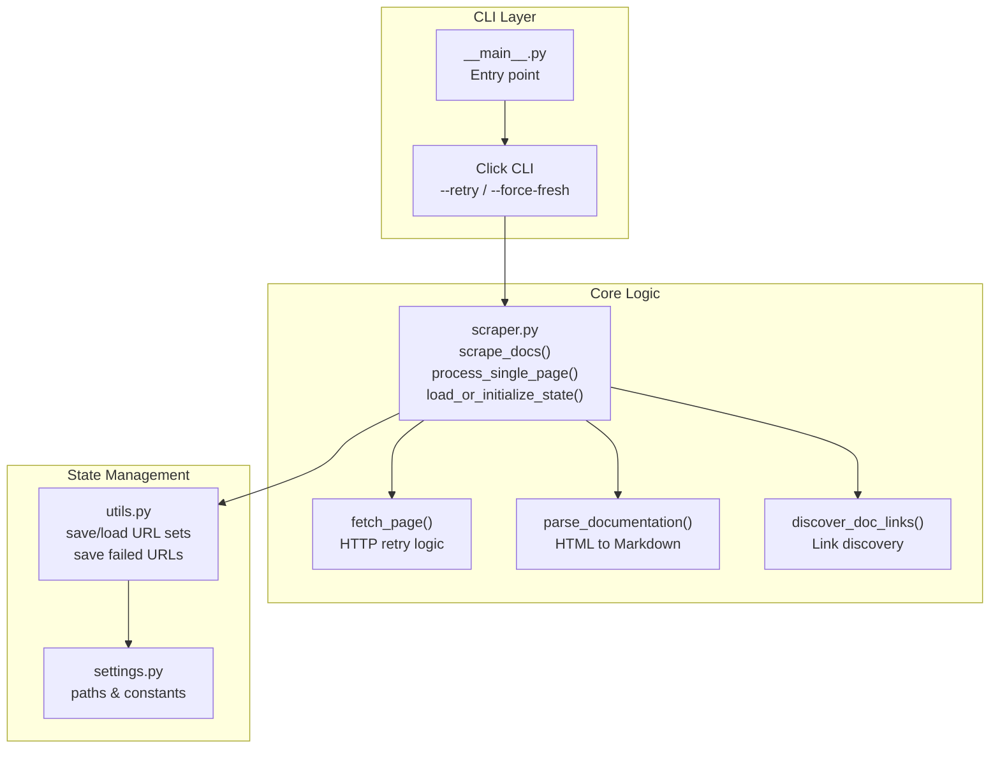
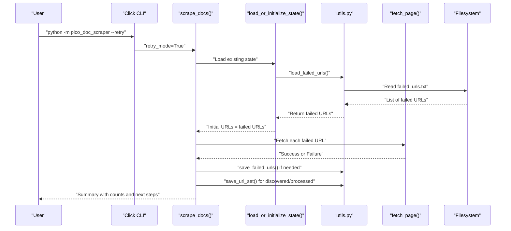
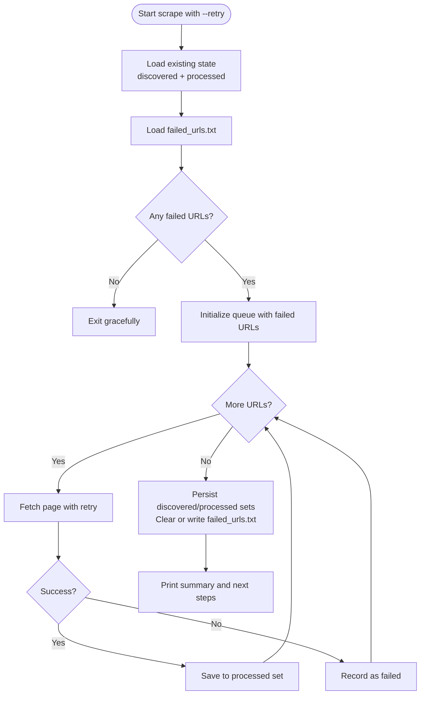
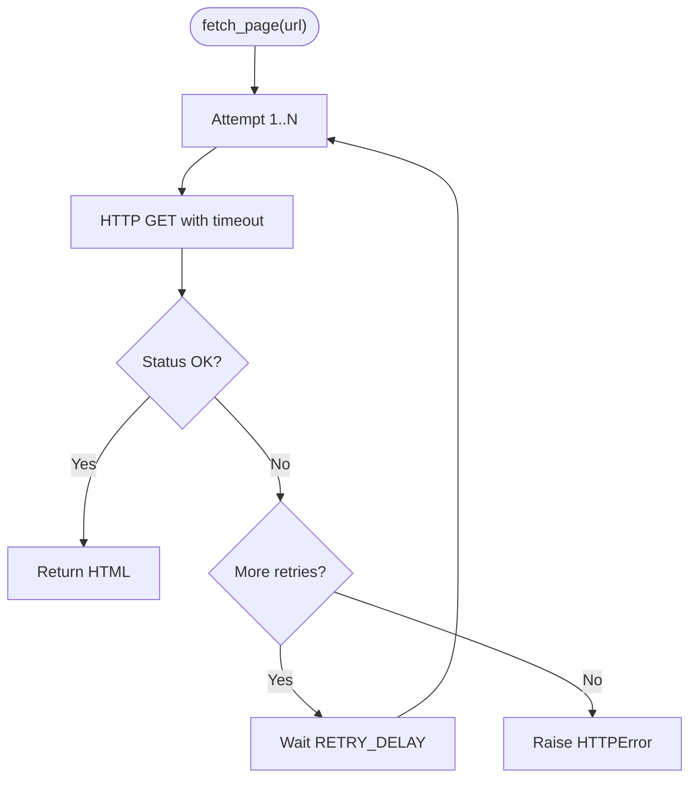
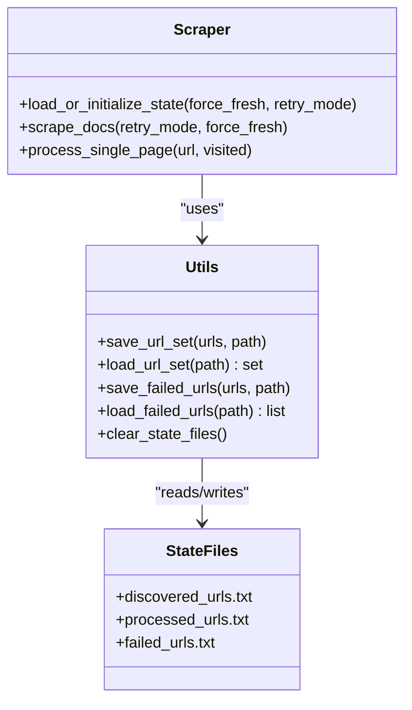
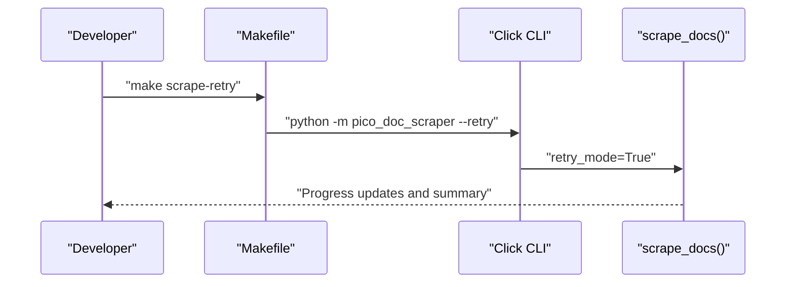
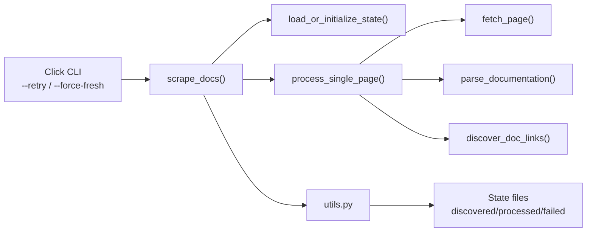

# Retry and Recovery Workflows

<cite>
**Referenced Files in This Document**
- [README.md](file://README.md)
- [Makefile](file://Makefile)
- [src/pico_doc_scraper/scraper.py](file://src/pico_doc_scraper/scraper.py)
- [src/pico_doc_scraper/settings.py](file://src/pico_doc_scraper/settings.py)
- [src/pico_doc_scraper/utils.py](file://src/pico_doc_scraper/utils.py)
- [src/pico_doc_scraper/__main__.py](file://src/pico_doc_scraper/__main__.py)
</cite>

## Table of Contents
1. [Introduction](#introduction)
2. [Project Structure](#project-structure)
3. [Core Components](#core-components)
4. [Architecture Overview](#architecture-overview)
5. [Detailed Component Analysis](#detailed-component-analysis)
6. [Dependency Analysis](#dependency-analysis)
7. [Performance Considerations](#performance-considerations)
8. [Troubleshooting Guide](#troubleshooting-guide)
9. [Conclusion](#conclusion)

## Introduction
This document explains the retry and recovery workflows in the Pico CSS Documentation Scraper. It covers how to retry only failed URLs from previous scraping attempts using the --retry flag or the scrape-retry command, how the state tracking system identifies failed URLs and manages recovery processes, and how incremental state saving enables precise targeting of problematic URLs. Practical examples of common failure scenarios and their corresponding retry strategies are included, along with guidance on monitoring progress during retries and verifying successful recovery. Troubleshooting techniques for persistent failures and escalation criteria are also provided.

## Project Structure
The scraper is organized around a small set of focused modules:
- Entry point and CLI: The main entry point delegates to the scraper module, which exposes a Click-based CLI with --retry and --force-fresh options.
- Core scraping logic: Implements fetching, parsing, saving, and state management.
- Settings: Centralized configuration for URLs, directories, retry parameters, and output behavior.
- Utilities: State persistence helpers for discovered, processed, and failed URLs, plus output formatting.

**Diagram sources**
- [src/pico_doc_scraper/__main__.py](file://src/pico_doc_scraper/__main__.py#L1-L7)
- [src/pico_doc_scraper/scraper.py](file://src/pico_doc_scraper/scraper.py#L361-L391)
- [src/pico_doc_scraper/utils.py](file://src/pico_doc_scraper/utils.py#L92-L175)
- [src/pico_doc_scraper/settings.py](file://src/pico_doc_scraper/settings.py#L1-L33)

**Section sources**
- [README.md](file://README.md#L1-L134)
- [Makefile](file://Makefile#L115-L125)
- [src/pico_doc_scraper/scraper.py](file://src/pico_doc_scraper/scraper.py#L1-L391)
- [src/pico_doc_scraper/settings.py](file://src/pico_doc_scraper/settings.py#L1-L33)
- [src/pico_doc_scraper/utils.py](file://src/pico_doc_scraper/utils.py#L1-L175)

## Core Components
- Retry and resume mechanics:
  - Automatic resume: The scraper loads discovered and processed URL sets to continue from where it left off.
  - Retry-only mode: When --retry is used, only URLs from the failed list are processed.
  - Fresh start: --force-fresh clears all state files and starts over.
- Incremental state saving:
  - After each URL, the scraper saves discovered and processed URL sets to disk.
  - Failed URLs are collected and persisted to a dedicated file for later retry.
- HTTP retry policy:
  - Per-request retry with configurable attempts and delay.
  - Graceful handling of network errors and parsing exceptions.

Key behaviors:
- State files are stored under the data/ directory and include discovered_urls.txt, processed_urls.txt, and failed_urls.txt.
- Output files are saved under scraped/ as Markdown documents.
- The CLI integrates with Makefile targets for convenient operation.

**Section sources**
- [src/pico_doc_scraper/scraper.py](file://src/pico_doc_scraper/scraper.py#L231-L285)
- [src/pico_doc_scraper/scraper.py](file://src/pico_doc_scraper/scraper.py#L287-L359)
- [src/pico_doc_scraper/scraper.py](file://src/pico_doc_scraper/scraper.py#L24-L52)
- [src/pico_doc_scraper/utils.py](file://src/pico_doc_scraper/utils.py#L92-L175)
- [src/pico_doc_scraper/settings.py](file://src/pico_doc_scraper/settings.py#L14-L17)
- [README.md](file://README.md#L65-L80)

## Architecture Overview
The retry and recovery architecture centers on three state files and a controlled execution flow:

**Diagram sources**
- [src/pico_doc_scraper/scraper.py](file://src/pico_doc_scraper/scraper.py#L361-L391)
- [src/pico_doc_scraper/scraper.py](file://src/pico_doc_scraper/scraper.py#L287-L359)
- [src/pico_doc_scraper/scraper.py](file://src/pico_doc_scraper/scraper.py#L231-L285)
- [src/pico_doc_scraper/utils.py](file://src/pico_doc_scraper/utils.py#L92-L175)

## Detailed Component Analysis

### Retry Mode Workflow
Retry mode activates when the --retry flag is provided. The system:
- Clears any existing state if --force-fresh is also set.
- Loads previously discovered and processed URLs to establish context.
- Loads failed URLs from the failed_urls.txt file.
- Treats the failed URLs as the initial queue to process.
- Skips link discovery in retry mode to focus solely on recovering failed pages.
- Saves discovered and processed URLs incrementally during retry.
- Persists failed URLs after completion to prepare for subsequent retry attempts.

**Diagram sources**
- [src/pico_doc_scraper/scraper.py](file://src/pico_doc_scraper/scraper.py#L287-L359)
- [src/pico_doc_scraper/scraper.py](file://src/pico_doc_scraper/scraper.py#L231-L285)
- [src/pico_doc_scraper/utils.py](file://src/pico_doc_scraper/utils.py#L92-L175)

**Section sources**
- [src/pico_doc_scraper/scraper.py](file://src/pico_doc_scraper/scraper.py#L231-L285)
- [src/pico_doc_scraper/scraper.py](file://src/pico_doc_scraper/scraper.py#L287-L359)
- [src/pico_doc_scraper/utils.py](file://src/pico_doc_scraper/utils.py#L92-L175)

### HTTP Retry Policy
Per-request retry logic:
- Attempts are governed by MAX_RETRIES and RETRY_DELAY.
- On each failure, the scraper logs the attempt and waits before retrying.
- After exhausting retries, the exception propagates to the caller, which records the URL as failed.

**Diagram sources**
- [src/pico_doc_scraper/scraper.py](file://src/pico_doc_scraper/scraper.py#L24-L52)
- [src/pico_doc_scraper/settings.py](file://src/pico_doc_scraper/settings.py#L20-L22)

**Section sources**
- [src/pico_doc_scraper/scraper.py](file://src/pico_doc_scraper/scraper.py#L24-L52)
- [src/pico_doc_scraper/settings.py](file://src/pico_doc_scraper/settings.py#L20-L22)

### State Tracking and Incremental Persistence
State files and their roles:
- discovered_urls.txt: All URLs discovered during crawling.
- processed_urls.txt: URLs successfully processed.
- failed_urls.txt: URLs that failed to scrape in the last run.

Incremental persistence:
- After processing each URL, the scraper writes updated discovered and processed sets to disk.
- Failed URLs are appended to failed_urls.txt and summarized at the end of a run.

**Diagram sources**
- [src/pico_doc_scraper/utils.py](file://src/pico_doc_scraper/utils.py#L130-L175)
- [src/pico_doc_scraper/scraper.py](file://src/pico_doc_scraper/scraper.py#L231-L285)
- [src/pico_doc_scraper/scraper.py](file://src/pico_doc_scraper/scraper.py#L287-L359)

**Section sources**
- [src/pico_doc_scraper/utils.py](file://src/pico_doc_scraper/utils.py#L92-L175)
- [src/pico_doc_scraper/scraper.py](file://src/pico_doc_scraper/scraper.py#L231-L285)
- [src/pico_doc_scraper/scraper.py](file://src/pico_doc_scraper/scraper.py#L287-L359)

### CLI Integration and Commands
The CLI supports two primary modes:
- Normal run: Resumes from existing state unless --force-fresh is specified.
- Retry run: Processes only failed URLs from the previous run.

Makefile targets provide convenient wrappers:
- scrape: Runs the scraper normally.
- scrape-retry: Retries failed URLs.
- scrape-fresh: Starts fresh with cleared state.

**Diagram sources**
- [Makefile](file://Makefile#L119-L121)
- [src/pico_doc_scraper/scraper.py](file://src/pico_doc_scraper/scraper.py#L361-L391)

**Section sources**
- [README.md](file://README.md#L35-L53)
- [Makefile](file://Makefile#L115-L125)
- [src/pico_doc_scraper/scraper.py](file://src/pico_doc_scraper/scraper.py#L361-L391)

## Dependency Analysis
The scraper’s retry and recovery rely on a tight coupling between the CLI, core logic, and utilities:

**Diagram sources**
- [src/pico_doc_scraper/scraper.py](file://src/pico_doc_scraper/scraper.py#L361-L391)
- [src/pico_doc_scraper/scraper.py](file://src/pico_doc_scraper/scraper.py#L287-L359)
- [src/pico_doc_scraper/utils.py](file://src/pico_doc_scraper/utils.py#L92-L175)

**Section sources**
- [src/pico_doc_scraper/scraper.py](file://src/pico_doc_scraper/scraper.py#L1-L391)
- [src/pico_doc_scraper/utils.py](file://src/pico_doc_scraper/utils.py#L1-L175)

## Performance Considerations
- Politeness: A delay between requests reduces server load and improves reliability.
- Incremental persistence: Frequent writes to state files reduce risk of data loss but add I/O overhead.
- Retry backoff: Using a fixed delay simplifies logic but may not adapt to varying conditions.
- Link discovery disabled in retry mode: Reduces unnecessary network activity and focuses on recovery.

[No sources needed since this section provides general guidance]

## Troubleshooting Guide

### Common Failure Scenarios and Strategies
- Network timeouts:
  - Symptom: HTTP timeout errors during fetch.
  - Strategy: Increase REQUEST_TIMEOUT and/or MAX_RETRIES; consider adding jitter to RETRY_DELAY.
- Parsing errors:
  - Symptom: Exceptions when parsing HTML or converting to Markdown.
  - Strategy: Inspect the failing page’s structure; adjust content selectors or handle edge cases in parse_documentation().
- Blocked requests:
  - Symptom: 403/429 responses or rate limiting.
  - Strategy: Increase DELAY_BETWEEN_REQUESTS; verify USER_AGENT; consider rotating headers.
- Persistent failures:
  - Symptom: Repeated failures for the same URLs.
  - Strategy: Manually inspect the URLs, update filters, or temporarily skip problematic paths.

### Monitoring Progress During Retries
- Visual indicators:
  - Success/failure markers for each URL.
  - Counts of successes, errors, and remaining URLs.
- State visibility:
  - Resume mode shows discovered, processed, and failed counts.
  - Retry mode prints the number of URLs loaded for retry.

### Verifying Successful Recovery
- Check the summary output for the number of successfully scraped pages.
- Confirm that failed_urls.txt is empty or reduced after a successful retry run.
- Verify that the corresponding Markdown files exist in the scraped/ directory.

### Escalation to Manual Intervention
- If failures persist despite retries:
  - Inspect the failed_urls.txt file and manually test the URLs.
  - Temporarily modify ALLOWED_DOMAIN restrictions or URL filters.
  - Consider adding custom logic to handle specific page structures.

**Section sources**
- [src/pico_doc_scraper/scraper.py](file://src/pico_doc_scraper/scraper.py#L196-L229)
- [src/pico_doc_scraper/scraper.py](file://src/pico_doc_scraper/scraper.py#L231-L285)
- [src/pico_doc_scraper/utils.py](file://src/pico_doc_scraper/utils.py#L92-L175)

## Conclusion
The Pico CSS Documentation Scraper provides robust retry and recovery capabilities through explicit state tracking and incremental persistence. By leveraging --retry or the scrape-retry command, users can efficiently target and recover failed URLs without reprocessing the entire corpus. The combination of per-request retries, polite scraping delays, and clear progress reporting ensures reliable operation even under adverse network conditions. For persistent issues, the modular design and state files enable targeted troubleshooting and manual intervention when needed.