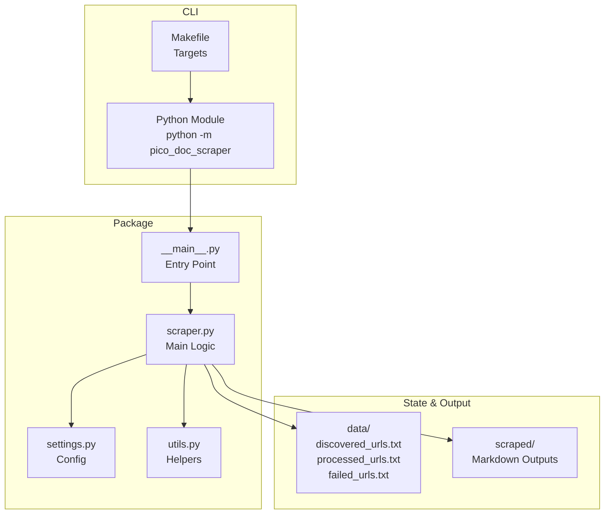
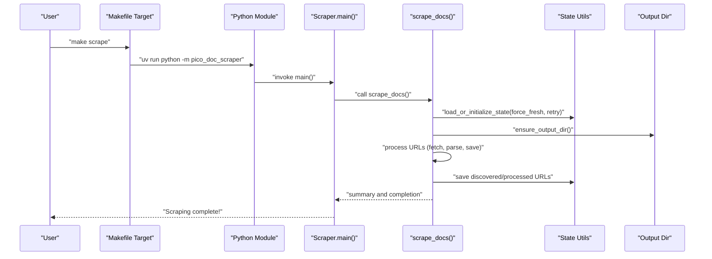
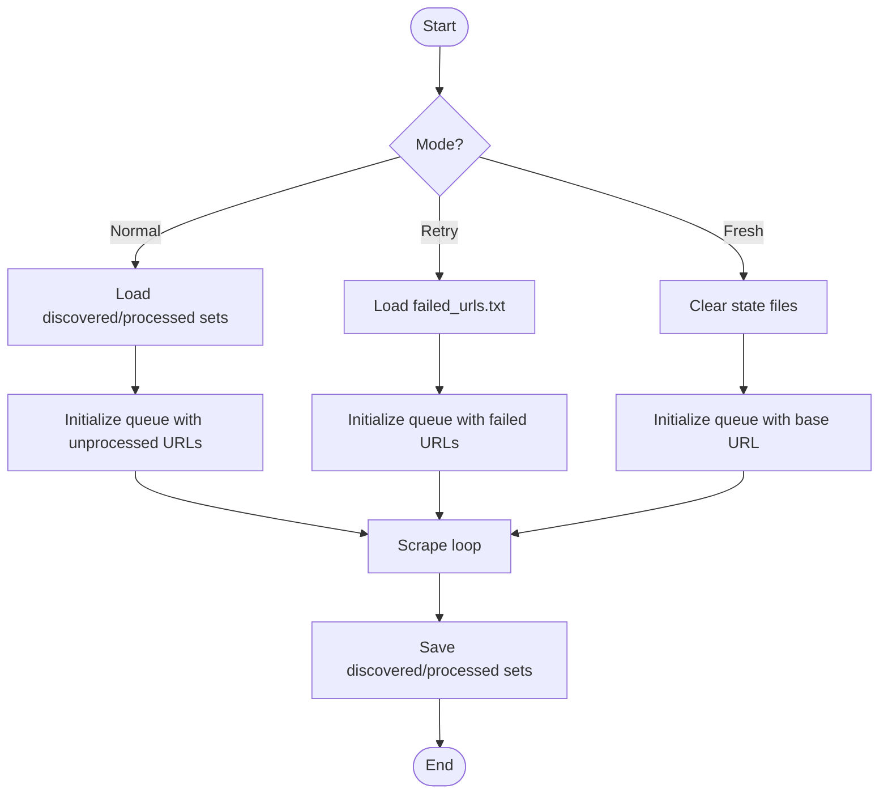
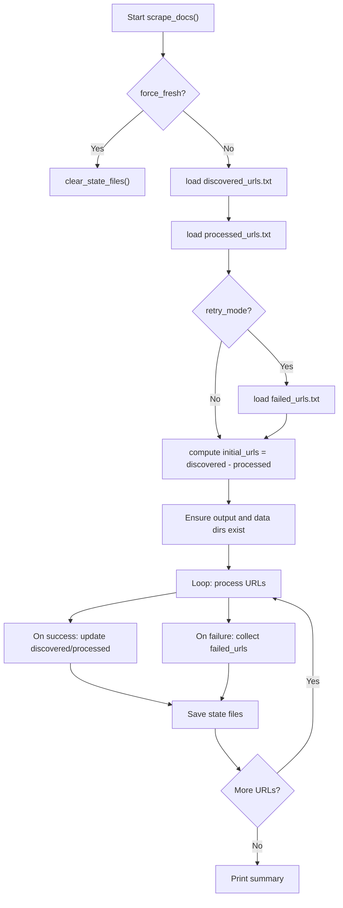
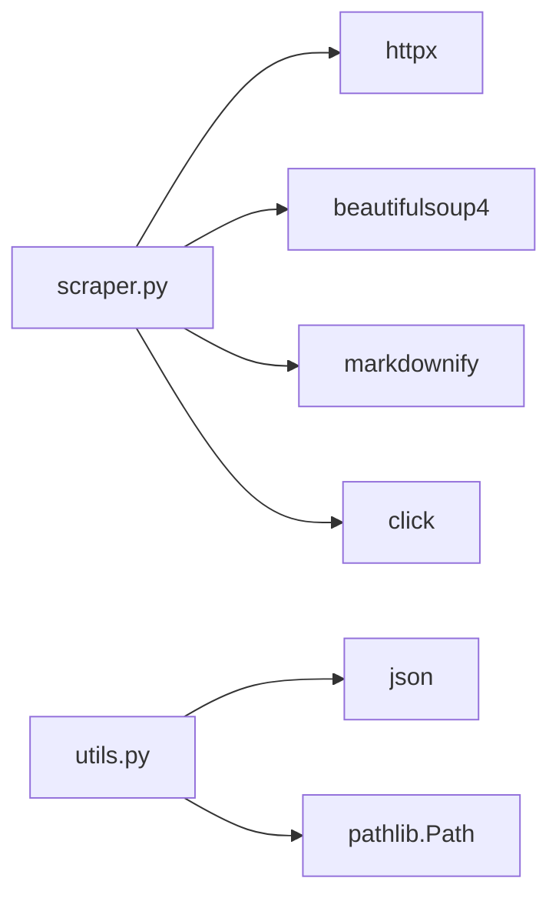

# Usage Guide

<cite>
**Referenced Files in This Document**
- [README.md](file://README.md)
- [Makefile](file://Makefile)
- [pyproject.toml](file://pyproject.toml)
- [src/pico_doc_scraper/__main__.py](file://src/pico_doc_scraper/__main__.py)
- [src/pico_doc_scraper/scraper.py](file://src/pico_doc_scraper/scraper.py)
- [src/pico_doc_scraper/settings.py](file://src/pico_doc_scraper/settings.py)
- [src/pico_doc_scraper/utils.py](file://src/pico_doc_scraper/utils.py)
</cite>

## Table of Contents
1. [Introduction](#introduction)
2. [Project Structure](#project-structure)
3. [Core Components](#core-components)
4. [Architecture Overview](#architecture-overview)
5. [Detailed Component Analysis](#detailed-component-analysis)
6. [Dependency Analysis](#dependency-analysis)
7. [Performance Considerations](#performance-considerations)
8. [Troubleshooting Guide](#troubleshooting-guide)
9. [Conclusion](#conclusion)
10. [Appendices](#appendices)

## Introduction
This guide explains how to use the Pico CSS Documentation Scraper CLI tool. It covers all commands, operational modes, CLI options, state persistence, and best practices. You will learn how to run basic scraping, retry failed URLs, and start a fresh scrape, along with how Makefile targets relate to direct Python module execution.

## Project Structure
The project is organized around a Python package that exposes a CLI entry point. The scraper maintains state in the data/ directory and writes Markdown outputs to the scraped/ directory. Makefile targets wrap Python module execution for convenience.

**Diagram sources**
- [Makefile](file://Makefile#L115-L125)
- [src/pico_doc_scraper/__main__.py](file://src/pico_doc_scraper/__main__.py#L1-L7)
- [src/pico_doc_scraper/scraper.py](file://src/pico_doc_scraper/scraper.py#L1-L391)
- [src/pico_doc_scraper/settings.py](file://src/pico_doc_scraper/settings.py#L1-L33)
- [src/pico_doc_scraper/utils.py](file://src/pico_doc_scraper/utils.py#L1-L175)

**Section sources**
- [README.md](file://README.md#L119-L134)
- [Makefile](file://Makefile#L1-L126)
- [src/pico_doc_scraper/__main__.py](file://src/pico_doc_scraper/__main__.py#L1-L7)
- [src/pico_doc_scraper/scraper.py](file://src/pico_doc_scraper/scraper.py#L1-L391)
- [src/pico_doc_scraper/settings.py](file://src/pico_doc_scraper/settings.py#L1-L33)
- [src/pico_doc_scraper/utils.py](file://src/pico_doc_scraper/utils.py#L1-L175)

## Core Components
- CLI entry point: The module can be executed directly via python -m pico_doc_scraper.
- Main scraping workflow: Orchestrates fetching, parsing, saving, and state tracking.
- Settings: Centralized configuration for URLs, timeouts, retries, delays, and output locations.
- Utilities: Helpers for saving content, sanitizing filenames, managing state files, and ensuring directories exist.
- Makefile targets: Convenience wrappers around the module for common tasks.

Key behaviors:
- Automatic resume: Loads discovered and processed URLs to continue from where it left off.
- Retry failed URLs: Reads failed URLs from a dedicated file and retries only those.
- Force fresh start: Clears all state files and starts over.
- Polite scraping: Respects delays between requests and filters domain and path.

**Section sources**
- [README.md](file://README.md#L23-L64)
- [src/pico_doc_scraper/__main__.py](file://src/pico_doc_scraper/__main__.py#L1-L7)
- [src/pico_doc_scraper/scraper.py](file://src/pico_doc_scraper/scraper.py#L287-L387)
- [src/pico_doc_scraper/settings.py](file://src/pico_doc_scraper/settings.py#L1-L33)
- [src/pico_doc_scraper/utils.py](file://src/pico_doc_scraper/utils.py#L1-L175)
- [Makefile](file://Makefile#L115-L125)

## Architecture Overview
The CLI integrates with Click to define options and delegates to the main scraping function. The scraper manages state files and output directories, and uses HTTP client and HTML parsing libraries to convert pages to Markdown.

**Diagram sources**
- [Makefile](file://Makefile#L115-L125)
- [src/pico_doc_scraper/__main__.py](file://src/pico_doc_scraper/__main__.py#L1-L7)
- [src/pico_doc_scraper/scraper.py](file://src/pico_doc_scraper/scraper.py#L361-L387)
- [src/pico_doc_scraper/scraper.py](file://src/pico_doc_scraper/scraper.py#L287-L359)
- [src/pico_doc_scraper/utils.py](file://src/pico_doc_scraper/utils.py#L130-L158)

## Detailed Component Analysis

### CLI Commands and Modes
There are three primary operational modes:

- Normal scraping (resume): Starts from the last known state and continues with remaining URLs.
- Retry failed URLs: Loads previously failed URLs and retries them.
- Force fresh start: Clears all state files and begins anew.

**Diagram sources**
- [src/pico_doc_scraper/scraper.py](file://src/pico_doc_scraper/scraper.py#L231-L284)
- [src/pico_doc_scraper/scraper.py](file://src/pico_doc_scraper/scraper.py#L287-L359)
- [src/pico_doc_scraper/utils.py](file://src/pico_doc_scraper/utils.py#L161-L175)

**Section sources**
- [README.md](file://README.md#L23-L64)
- [Makefile](file://Makefile#L115-L125)
- [src/pico_doc_scraper/scraper.py](file://src/pico_doc_scraper/scraper.py#L287-L387)

### CLI Options
- --retry, -r: Run only the URLs recorded as failed in the previous run.
- --force-fresh, -f: Clear all state files and start a fresh scrape.

These options are defined with Click and passed to the main scraping workflow.

**Section sources**
- [src/pico_doc_scraper/scraper.py](file://src/pico_doc_scraper/scraper.py#L361-L387)
- [README.md](file://README.md#L55-L64)

### State Persistence Mechanism
The scraper maintains three state files under the data/ directory:
- discovered_urls.txt: All URLs found during crawling.
- processed_urls.txt: URLs successfully processed.
- failed_urls.txt: URLs that failed to scrape.

Behavior:
- Incremental saves: After each URL, discovered and processed sets are saved.
- Resume: On normal runs, the scraper loads discovered and processed sets and continues with remaining URLs.
- Retry: On retry mode, only failed URLs are reprocessed.
- Fresh start: On force-fresh, all state files are removed before starting.

**Diagram sources**
- [src/pico_doc_scraper/scraper.py](file://src/pico_doc_scraper/scraper.py#L231-L284)
- [src/pico_doc_scraper/scraper.py](file://src/pico_doc_scraper/scraper.py#L287-L359)
- [src/pico_doc_scraper/utils.py](file://src/pico_doc_scraper/utils.py#L130-L158)
- [src/pico_doc_scraper/utils.py](file://src/pico_doc_scraper/utils.py#L92-L128)
- [src/pico_doc_scraper/utils.py](file://src/pico_doc_scraper/utils.py#L161-L175)

**Section sources**
- [README.md](file://README.md#L65-L76)
- [src/pico_doc_scraper/scraper.py](file://src/pico_doc_scraper/scraper.py#L231-L284)
- [src/pico_doc_scraper/utils.py](file://src/pico_doc_scraper/utils.py#L92-L158)

### Output and Filenames
- Output directory: scraped/
- Filename generation: Converts URLs to Markdown filenames; special handling for the index page.
- Content format: Markdown with ATX-style headers and sanitized filenames.

**Section sources**
- [README.md](file://README.md#L77-L79)
- [src/pico_doc_scraper/scraper.py](file://src/pico_doc_scraper/scraper.py#L145-L194)
- [src/pico_doc_scraper/utils.py](file://src/pico_doc_scraper/utils.py#L50-L75)

### Relationship Between Makefile Targets and Direct Execution
Makefile targets wrap the Python module execution:
- make scrape: Runs the scraper normally.
- make scrape-retry: Retries only failed URLs.
- make scrape-fresh: Starts a fresh scrape and clears state.

Direct execution equivalents:
- python -m pico_doc_scraper
- python -m pico_doc_scraper --retry
- python -m pico_doc_scraper --force-fresh

**Section sources**
- [Makefile](file://Makefile#L115-L125)
- [README.md](file://README.md#L23-L53)
- [src/pico_doc_scraper/__main__.py](file://src/pico_doc_scraper/__main__.py#L1-L7)

## Dependency Analysis
External dependencies include HTTP client, HTML parsing, Markdown conversion, and CLI framework. These are declared in the project configuration.

**Diagram sources**
- [src/pico_doc_scraper/scraper.py](file://src/pico_doc_scraper/scraper.py#L1-L22)
- [src/pico_doc_scraper/utils.py](file://src/pico_doc_scraper/utils.py#L1-L5)
- [pyproject.toml](file://pyproject.toml#L9-L14)

**Section sources**
- [pyproject.toml](file://pyproject.toml#L9-L24)
- [src/pico_doc_scraper/scraper.py](file://src/pico_doc_scraper/scraper.py#L1-L22)
- [src/pico_doc_scraper/utils.py](file://src/pico_doc_scraper/utils.py#L1-L5)

## Performance Considerations
- Politeness: A configurable delay is applied between requests to avoid overloading the server.
- Retry strategy: Requests are retried with a short delay, up to a configured maximum.
- Incremental state saves: Frequent saves reduce data loss on interruption.
- Domain and path filtering: Limits scope to the documentation domain and path to reduce unnecessary work.

**Section sources**
- [src/pico_doc_scraper/settings.py](file://src/pico_doc_scraper/settings.py#L19-L30)
- [src/pico_doc_scraper/scraper.py](file://src/pico_doc_scraper/scraper.py#L24-L53)
- [src/pico_doc_scraper/scraper.py](file://src/pico_doc_scraper/scraper.py#L322-L324)

## Troubleshooting Guide
Common issues and resolutions:
- No failed URLs to retry: If the failed state file is empty, the retry mode exits early. Use force fresh to restart.
- All URLs processed: If discovered URLs equal processed URLs, the scraper reports completion. Use force fresh to re-scan.
- Interrupted mid-run: The scraper saves state incrementally. Re-run to resume automatically.
- Permission errors on state files: Ensure the data/ directory is writable.
- Network errors: The scraper retries failed HTTP requests according to configuration; increase delays or retries if needed.
- Output directory not created: The scraper ensures directories exist; verify permissions and disk space.

**Section sources**
- [src/pico_doc_scraper/scraper.py](file://src/pico_doc_scraper/scraper.py#L254-L277)
- [src/pico_doc_scraper/scraper.py](file://src/pico_doc_scraper/scraper.py#L350-L356)
- [src/pico_doc_scraper/utils.py](file://src/pico_doc_scraper/utils.py#L7-L14)
- [src/pico_doc_scraper/settings.py](file://src/pico_doc_scraper/settings.py#L19-L30)

## Conclusion
The Pico CSS Documentation Scraper provides a robust, resumable CLI with three operational modes. Use Makefile targets for convenience or Python module execution for flexibility. Leverage state persistence to handle interruptions and retries efficiently, and adjust configuration for your environment.

## Appendices

### Quick Reference: Commands and Options
- Normal scraping:
  - make scrape
  - python -m pico_doc_scraper
- Retry failed URLs:
  - make scrape-retry
  - python -m pico_doc_scraper --retry
- Force fresh start:
  - make scrape-fresh
  - python -m pico_doc_scraper --force-fresh

**Section sources**
- [README.md](file://README.md#L23-L53)
- [Makefile](file://Makefile#L115-L125)

### Configuration Overview
Key settings and their roles:
- Base URLs and domain restrictions
- Output directories for state and scraped content
- HTTP client settings (timeout, retries, delay)
- User agent and politeness behavior
- Output format selection

**Section sources**
- [src/pico_doc_scraper/settings.py](file://src/pico_doc_scraper/settings.py#L1-L33)